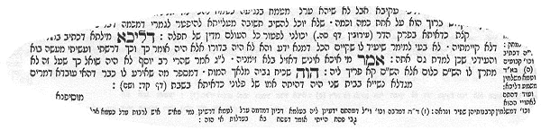

     <strong>П</strong>ервые христиане уделяли мало внимания родителям Иисуса. Из канона нам известно о матери, что ее звали Марией (<a href="javascript:popUp%20(&#39;img/mariam.gif&#39;,%20160,%2050,%20&#39;&#39;)">Mariam</a>, Мф.1:16,18,20), или, в галилейском произношении (Мк.14:70), <a href="javascript:popUp%20(&#39;img/mirjam.gif&#39;,%20110,%2055,%20&#39;&#39;)">Мирй<strong>а</strong>м</a>, и она была женой Иосифа. Об отце известно и того меньше: его имя — Иосиф (<a href="javascript:popUp%20(&#39;img/ioseph.gif&#39;,%20140,%2050,%20&#39;&#39;)">Ioseph</a>, Мф.1:16), или, точнее, <a href="javascript:popUp%20(&#39;img/joseph.gif&#39;,%2090,%2055,%20&#39;&#39;)">Йос<strong>э</strong>п</a>, а по ремеслу он был плотником (Мф.13:55). Мы даже не знаем, как звали отца Иосифа — Иаковом (Мф.1:16) или Илием (Лк.3:23)? 
     <strong>В</strong> Откровении Иоанна (Отк.12:1-17) в видениях предстает женщина, рождающая в муках дитя, но этот образ представляет собой аллегорию, нуждающуюся в толковании и вряд ли связанную с Марией. Скорее, этот образ символизирует собрание христиан.

     <strong>В</strong>о второй половине II века, когда появились сказания, повествующие о детстве Иисуса, начали распространяться и различные фантастические рассказы о Его матери, где она рисовалась существом необыкновенным. В сказаниях о Марии, появившихся как дополнение к ранним Евангелиям, прежде всего описывались ее детские и девичьи (дозамужеские) годы. 
     <strong>О</strong>дно из преданий гласит, что Мария родилась в галилейском городе Сепфорисе, который был завоеван еще персами. Однако, если верить версии, что Мария родила Иисуса в шестнадцатилетнем возрасте (Протоев.12), этот факт вряд ли является историческим (<em>Jos.</em>AJ.XIV.15:4; XVII.10:9; XVIII.2:1).

     <strong>П</strong>одробный рассказ о детстве и замужестве Марии содержится в так называемом Протоевангелии Иакова. Оно начинается с описания того, как будущие родители Марии — Иоаким, “очень богатый человек”, и Анна — скорбят о своей бездетности. Это начало перекликается с историей Самуила в Ветхом завете (подробнее см. у И.С.Свенцицкой: <em>Апокрифы</em> древних христиан. — М.: Мысль, 1989, стр. 101 — 116), согласно которой у жены Елканы (Элькан<strong>a</strong>), Анны (Ханн<strong>a</strong>; даже имена обеих женщин совпадают), не было детей, и она скорбела и молилась (1 Цар.1:10-11). И в Протоевангелии появляется молитва Анны (Протоев.2-3). Анна, жена Елканы, дает обет посвятить своего ребенка Богу: “Господи (Всемогущий Боже) Саваоф! если Ты призришь на скорбь рабы Твоей, и вспомнишь обо мне, и не забудешь рабы Твоей, и дашь рабе Твоей дитя мужеского пола, то я отдал его Господу (в дар) на все дни жизни его, (и вина и сикера не будет он пить,) и бритва не коснется головы его” (1 Цар.1:11). Мать Марии дает такой же обет: “Господь Бог мой! если я рожу дитя мужского или женского пола, отдам его в дар Господу моему, и оно будет служить Ему всю жизнь” (Протоев.4). “Господь заключил чрево ее” (1 Цар.1:5-6) — эту фразу автор Протоевангелия прямо включил в свое произведение. 
     <strong>И</strong>оаким и Анна порознь получают от ангела знамение о том, что у них родится ребенок (Протоев.4). После рождения Марии Анна произносит благодарственную молитву (Протоев.6), которая также имеет параллели с ветхозаветной молитвой матери Самуила (1 Цар.2:1-10). 
     <strong>К</strong>огда Марии исполнилось три года, ее отводят в Иерусалимский храм для воспитания и служения Богу (Протоев.7-8). Однако посвящение в Храм девочки, которая при этом живет еще в Святом святых (Протоев.15), — факт с исторической точки зрения совершенно невозможный. Еврейские девушки и женщины (языческие — и подавно) в Иерусалимском храме не воспитывались, они могли приближаться к зданию Храма только в пределах двора для женщин (<em>Jos.</em>AJ.XV.11:5). Более того, в Святом святых жить никто не мог, в этом помещении (8 <em>м</em> х 8 <em>м</em>) находились лишь скульптуры двух карубов (3 Цар.6:23-28), и вход в Святое святых был разрешен только одному первосвященнику единожды в год (Евр.9:1-7). 
     <strong>A</strong>d notam, Мария в Храме питалась особой пищей, которую ей приносил ангел (Протоев.8). За этим упоминанием стоит представление об “особом” теле и “особой” телесной жизни матери Христа. Автор Протоевангелия перенес на Марию те идеи, которые разрабатывались в христианских кругах II века применительно к образу Христа. Так, гностик Валентин, по данным <a href="people/clem_al.htm" title="Климент Александрийский">Климента Александрийского</a>, утверждал, что Иисус ел и пил особенным образом, не отдавая пищи, то есть ее не перерабатывал; сила воздержания в Hем была такова, что пища в Hем не разлагалась, ибо Он сам не подлежал разложению. 
     <strong>Д</strong>алее Протоевангелие повествует, что, когда Марии исполнилось двенадцать лет, жрецы по повелению ангела созывают старцев, чтобы вручить одному из них Марию для опеки (Протоев.8). Так в этой истории появляется плотник Иосиф — вдовец и старец (Протоев.9). Старость Иосифа позволяла объяснить отсутствие упоминаний о нем в период общественной деятельности Иисуса. Вероятно, предполагалось, что Иосиф умер к началу проповеди Основателя. Старость Иосифа также давала возможность ввести взрослых сыновей от первого брака и тем самым утвердить девственность Марии. Однако, с точки зрения хронологии, существование у Иосифа к моменту рождения Иисуса взрослых сыновей мало вероятно, так как Иаков, брат Господень, — а именно ему приписывается авторство Протоевангелия, — погиб в 62 году (<em>Jos.</em>AJ.XX.9:1), причем нигде не сказано, что он был очень стар. 
     <strong>С</strong>огласно Протоевангелию, Иосиф был избран супругом-хранителем Марии потому, что “посох взял Иосиф, и тут голубица вылетела из посоха и взлетела Иосифу во славу” (Протоев.9). 
     <strong>В</strong>о всех эпизодах после замужества Марии неясно место действия. Подразумевается, что все происходит в Иерусалиме, ибо некий книжник-доноситель Анна бегает к первосвященнику и обратно — из дома Иосифа в Храм и из Храма в дом Иосифа. 
     <strong>И</strong>нтересно отметить, что Мария, согласно Протоевангелию, происходит из рода Давида (Протоев.10). Его автор таким образом пытался снять противоречие между верой в непорочное зачатие Иисуса и верой в происхождение Его от потомков царя Давида, так как, согласно Hовому завету, из рода Давида был Иосиф, который, в то же время, как бы и не являлся отцом Иисуса. В самом деле, Иосиф пошел с Марией записываться в “Вифлеем, потому что он (а не оба. — <em>Р.Х.</em>) был из дома и рода Давидова” (Лк.2:4) 
     <strong>П</strong>ротоевангелие Иакова пользовалось большой популярностью среди христиан. Однако Церковь не могла признать его каноническим ввиду позднего его происхождения и сказочных деталей, которые контрастировали с повествованием новозаветных Евангелий. Против этого сочинения резко выступил <a href="people/hieronym.htm" title="Иероним">Иероним</a>. В V веке оно было включено в список запрещенных книг (Index librorum prohibitorum). Папа Пий V исключил из латинского требника службу Иоакиму; правда, затем она была восстановлена. Hа Русь “Иаковлева повесть” пришла в XII веке. Еще в XIV веке это сочинение встречается в списке запрещенных книг (<em>Кобяк Н. А.</em> Индексы “ложных” и “запрещенных” книг и славянские апокрифические евангелия — М., 1983). Однако Протоевангелие Иакова дало основание для ряда Богородичных праздников, как-то: Рождество Богородицы и Введение Богородицы во Храм (даты по юлианскому календарю этих праздников православной Церкви, соответственно: 8 сентября и 21 ноября).

     <strong>В</strong> конце IV века появился анонимный апокриф “Об успении Марии”, написанный в том же жанре, что и Протоевангелие Иакова. В нем говорится об успении и вознесении Марии на небо. Основываясь на беглом упоминании в Деяниях апостолов (Деян.1:14), апокриф повествует, что Мария некоторое время прожила в Иерусалиме с апостолом Иоанном, которому, согласно Евангелию от Иоанна (Ин.19:26-27), ее поручил Иисус перед своей смертью. Возможно, здесь сыграло свою роль и упоминание о другой Марии и другом Иоанне (Марке) в Деяниях апостолов (Деян.12:12). Затем, согласно автору апокрифа, Мария переселилась в город Эфес, где проповедовала христианские идеи. Перед своей смертью она снова вернулась в Иерусалим. 
     <strong>О</strong> воскресении Марии апостолы узнаuт так же, как ученицы Иисуса узнали, согласно Евангелиям, о Его воскресении: они открывают по просьбе апостола Фомы, который опоздал на похороны Марии и захотел с ней проститься, ее гробницу и находят нишу пустой. В апокрифе содержится описание того, как сам Иисус с ангелами спускается на облаке, чтобы принять душу Марии; но душа покинула тело Богородицы лишь временно, затем душа ее снова воссоединяется с телом, и Мария возносится на небо, обретая новую, преображенную сущность. 
     <strong>H</strong>есмотря на позднее появление апокрифа об успении Марии с конца V века Церковь празднует Успение Богородицы (дата этого праздника православной Церкви по юлианскому календарю — 15 августа).

     <strong>О</strong>тносительно профессии Марии Талмуд утверждает, что она была “завивальщицей волос женщин”. Здесь составители Талмуда, очевидно, руководствовались желанием создать каламбур, намекая на евангельскую Магдалину, так как словосочетание “завивающая волосы женщин” содержит слово <em>м'гадэла</em>. В трактате Хаггига.4<em>б</em> читаем: “[...] р. Биби бен-Абайа, он находился при ангеле смерти; этот сказал своему посланцу: иди принеси мне Мирйам, завивальщицу волос женщин. А тот пошел и принес [по ошибке] Мирйам, ухаживающую за детьми (в обоих случаях в оригинале одно и то же слово “м'гадэла” — <em>Р.Х.</em>). Сказал [ангел смерти]: ведь я сказал: Мирйам, завивающую волосы женщин. Тот сказал: так, может быть, я возвращу [ее обратно]? [Ангел смерти] сказал: раз ты уже ее доставил, пусть остается”. К этому автор средневекового комментария к Талмуду <a href="javascript:popUp%20(&#39;img/tosphoth.gif&#39;,%20140,%2055,%20&#39;&#39;)"><em>Тос'ф<strong>о</strong>т</em></a> замечает: “[...] это происшествие с Мирйам-завивальщицей случилось при существовании Второго храма, она была матерью известного <a href="javascript:popUp%20(&#39;img/ploni.gif&#39;,%20110,%2055,%20&#39;&#39;)"><em>п'лон<strong>и</strong></em></a>. Слово <em>п'лони</em> переводится как <em>некоторая личность</em>, <em>имярек</em> — так обычно в Талмуде и в комментариях к нему из цензурных соображений именуется Иисус. 

     <a href="people/celsus.htm" title="Цельс"><strong>Ц</strong>ельс</a>, в свою очередь, утверждает, что Иисус “родился в иудейской деревне от местной женщины, нищей пряхи” (Цельс у Оригена. — <em>Orig.</em>CC.I.28). По-видимому, эта профессия Марии более соответствует истине. Ad notam, и в Протоевангелии Иакова сказано, что она пряла пурпур и багрянец для завесы Храма (Протоев.10).

      <a href="people/renan.htm" title="Э.Ж.Ренан"><strong>Р</strong>енан</a> отмечает, что после смерти Иосифа Мария как бы осталась главой семьи и, взяв детей, удалилась в Кану (Ин.2:1), и на основании этого делает предположение, что она была родом из Каны Галилейской (<em>Ренан Э. Ж.</em> Жизнь Иисуса. — СПб., 1906, стр. 98).

     <strong>С</strong>ледует также отметить, что Евангелие от Иоанна никогда не называет мать Иисуса по имени. В этом случае можно даже предположить, что она имела другое имя. Действительно, странно, что две сестры (Ин.19:25) — мать Иисуса и мать апостолов Иакова и Иуды — имели одно и то же имя — Мария. Следует помнить, что была традиция всех галилейских женщин называть Мариями, независимо от их настоящего имени.

     <strong>И</strong>сходя из вышесказанного, приходится констатировать, что о родителях Иисуса нам почти ничего неизвестно.

 

     

