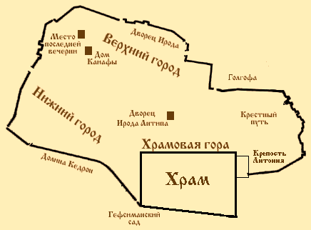

     Мы уже <a href="41.htm#14-15" title="В какой день нисана умер Иисус?">доказали</a>, что так называемая тайная вечеря не была пасхальной, а потому рассказ синоптиков о приготовлении праздничной трапезы-сэдера<a href="#prim1" title="Сэдер">1</a> является простым вымыслом (Мф.26:17-19; Мк.14:12-16; Лк.22:7-13). 
     Вообще, следует отметить, что тайная вечеря могла состояться и не в четверг, а в другой день, а евангелисты просто отнесли это торжественное событие на момент, предшествующий аресту Основателя. Хотя, конечно, нет ничего сверхъестественного и в том, что Иисус устроил вечерю именно в четверг или устраивал ее ежедневно. 
     По всей вероятности, накануне своей казни, в четверг, Иисус, как и всегда, проповедовал в Храме. Однако вечером Он не отправился сразу же в Вифанию, а пошел вместе со своими учениками в один из иерусалимских домов на вечерю. 
     Древнее церковное предание от IV века гласит, что местом последней вечери был дом в юго-западной части Иерусалима. Есть основания полагать, что этот дом принадлежал богатой вдове Марии, матери Иоанна-Марка (Деян.12:12), того самого Марка, которого считают автором второго Евангелия. Действительно, Иисус и Его ученики во время праздников, когда в столице пребывало множество паломников, всегда находят приют: накануне Пасхи — в данном случае; накануне и при наступлении праздника Шабу<strong>о</strong>т (Деян.1:13; 2:1-40) — несколько недель спустя. То, что это один и тот же дом, — вполне вероятно, ибо в праздничные дни весьма трудно было найти свободный от паломников дом или свободное помещение. Ответ на вопрос: кому принадлежит этот дом? — мы находим в двенадцатой главе Деяний апостолов, которая повествует, что опять же в праздничные дни Пасхи Петр каким-то чудом выбрался из темницы, куда был заточен Иродом Агриппой I, и сразу же пришел в дом Марии. Лука не называет мужа Марии, и это является веским поводом считать ее вдовой. Она содержала дом в столице и имела слуг (Деян.12:13), а значит, была богата. 
     Почему же, спрашивается, ее сына считают вторым евангелистом? А потому что только в Евангелии от Марка содержится рассказ о том, что некий “юноша, завернувшись по нагому телу в покрывало”, следовал за арестованным Иисусом; а когда воины схватили его, то “он, оставив покрывало, нагой убежал от них” (Мк.14:51-52). Иисуса арестовали после вечери, и поэтому Марк, сын Марии, действительно мог находиться во время ареста рядом с Основателем. А потому было решено, что если об этом эпизоде знает только второй евангелист, то он и является тем юношей. Однако историчность данного эпизода подвергается большому сомнению, ибо весь этот рассказ о юноше мог быть написан из догматических соображений, чтобы приурочить его к пророчеству Амоса: “И самый отважный из храбрых убежит нагой в тот день” (Ам.2:16). Поэтому утверждать, что <a href="javascript:popUp%20(&#39;img/neanisks.gif&#39;,%20260,%2050,%20&#39;&#39;)"><em>neaniskos tis</em></a> второго Евангелия и Секундус — одно и то же лицо, мы не имеем полного права. 

<h5 id="план-иерусалима-эпохи-христа" data-align="CENTER"></h5>

     Квартус рассказывает, что Иисус на тайной вечере омыл своим ученикам ноги (Ин.13:4-17), но этот рассказ, как показал Д.Ф.Штраус (<em>Штраус Д. Ф.</em> Жизнь Иисуса. — М., 1992, стр. 429 — 433), весьма сомнителен с исторической точки зрения. Синоптики, наоборот, повествуют, что на этой вечере Он учредил евхаристию. Однако мы уже доказали, что Иисус не устанавливал обряда благодарения в качестве некоторого таинства, просто Он, как обычно, благословлял хлеб и вино, называя их своим телом и своей кровью.

     Евангелисты рассказывают, что в эту ночь Иисус предсказал, что ученики оставят Его, а Петр отречется (Мф.26:31-35; Мк.14:27-31; Лк.22:31-34; Ин.13:36-38). Вполне возможно, что Основатель пытался сдерживать чрезмерную самонадеянность, которую Симон Бариона проявлял по различным случаям, но кажется невероятным, чтобы Иисус дал ему предостережение накануне своей смерти и притом в вышеозначенной форме. Это тем более невероятно, что в указании на пение петуха явно сказывается элемент легендарности. Скорее можно предположить, что малодушие учеников Иисуса впоследствии было истолковано как предопределенный Богом факт. Также и все речи Иисуса прощального характера и борение в Гефсиманском саду (Мф.26:29,37-46; Мк.14:25,33-42; Лк.22:15-19,40-46; Ин.13:20)<a href="#prim2" title="Лк.22:43-44">2</a> мы не можем считать историческими событиями накануне смерти Иисуса, ибо Он не мог знать точного времени своего ареста. 
      <a href="/people/celsus.htm" title="Цельс"><strong>Ц</strong>ельс</a> говорит, что перед своим арестом Иисус “скрывался в бегах и был взят позорнейшим образом, преданный теми, кого Он называл Своими учениками. Hе полагалось бы, чтобы Бог убегал и чтобы Его приверженцы, делившие с Hим всю Его личную жизнь, следовавшие Ему как учителю, покинули и предали Того, Кого считали Спасителем, Сыном и Ангелом Величайшего Бога” (Цельс у Оригена. — <em>Orig.</em>CC.II.9).

     Евангелия рассказывают, что после вечери Иисус со своими учениками пришел в Гефсиманский сад (Мф.26:36; Мк.14:32; Ин.18:1; ср. Лк.22:39), и, по единодушному сообщению евангелистов, туда же приходит отряд с целью арестовать Иисуса (Мф.26:47; Мк.14:43; Лк.22:47; Ин.18:3). При этом синоптики говорят, что отряд состоял только из слуг иудейской аристократии, а Квартус утверждает, что вместе с тем пришел отряд римлян (<a href="javascript:popUp%20(&#39;img/he_speir.gif&#39;,%20180,%2050,%20&#39;&#39;)"><em>he speira</em></a>) во главе с военным трибуном (греч. <a href="javascript:popUp%20(&#39;img/chiliarh.gif&#39;,%20200,%2050,%20&#39;&#39;)"><em>chiliarchos</em></a> = лат. <em>tribunus cohortium</em>), то есть начальником когорты (Ин.18:12). Однако, спрашивается, кто послал римский гарнизон в Гефсиманию? Пилат? Hо нам известно, что прокуратор узнаёт об Иисусе лишь поутру. Таким образом, мы можем утверждать, что римляне непричастны к аресту Иисуса. К тому же непонятно, зачем понадобился тысячный отряд римских воинов для ареста небольшой группы Иисуса? Достаточно было стражи Храма, которая состояла из двухсот человек — по двадцать человек на каждые из десяти ворот Храма (<em>Jos.</em>CA.II.9). 
     Евангелисты утверждают, что стражу в Гефсиманию привел Иуда Искариот, но учитывая, что Иуда, вероятно, <a href="44.htm" title="Иуда Искариот - миф">является мифическим персонажем</a>, мы можем предположить, что стража уже поджидала Иисуса в засаде: иудейским старейшинам наверняка было известно, что Иисус уходит на ночлег в Вифанию, и они могли послать свой отряд к подножию Элеонской горы. 
     По сообщениям Евангелий, один из учеников Иисуса (Квартус говорит, что это Петр) попытался оказать вооруженное сопротивление и даже отсек одному из стражников ухо (Мф.26:51-54; Мк.14:47; Лк.22:49-51; Ин.18:10-11). Однако кажется нелепым, что данный ученик после такого деяния не был арестован. Вероятно, сопротивления вообще не было оказано. Достоверно известно, что ученики Основателя, бросив Иисуса, просто-напросто бежали (Мф.26:56; Мк.14:50; <em>Just.</em>Dial.53,106), а Петр, по-видимому, когда появилась угроза его ареста, еще и отрекся от своего Учителя (Мф.26:58,69-75; Мк.14:54,66-72; Лк.22:54-62; Ин.18:15-18,25-27).

     После ареста Иисуса отвели в дом Ханана (Ин.18:12-13). О подробностях беседы вождя священнической партии и Иисуса мы можем лишь догадываться, ибо Квартус передает явно не исторический и ничего не значащий вариант этого предварительного допроса (Ин.18:19-23). Вероятно, Ханан спрашивал Иисуса, запрещал ли Он платить налог Риму, называл ли Он себя царем Израиля, и т.д. (ср. Лк.23:2). 
     После этой беседы Иисус провел в заточении под стражей людей первосвященника остаток ночи (Ин.18:24). Возможно, ночью над Hим издевались (Мф.26:67-68; Мк.14:65; Лк.22:63-65), хотя эти издевательства могли быть приурочены евангелистами к словам Второисаии: “Я предал хребет Мой биющим и ланиты Мои поражающим; лица Моего не закрывал от поруганий и оплевания” (Ис.50:6).

 

     1  <a href="javascript:popUp%20(&#39;img/seder.gif&#39;,%2090,%2060,%20&#39;&#39;)">С<strong>э</strong>дер</a> — <em>порядок</em>, <em>пасхальная трапеза</em>.   <a href="#1" title="Назад, к тексту">К тексту</a> 

     2 Стихи Лк.22:43-44, как мы уже отмечали, отсутствуют в древнейшем папирусе III века (<strong>P</strong>75), в Александрийском, Ватиканском и других кодексах.   <a href="#2" title="Назад, к тексту">К тексту</a> 

 

     

