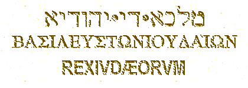

(про *Понтия Пилата* см. полный вариант произведения **“Сын Человеческий”**)

<h5 id="o-basileuv-twn-ioudaiwn-царь-иудейский" data-align="CENTER">O basileuV twn Ioudaiwn 
(Царь Иудейский)</h5>

     <strong>П</strong>рокуратор, вероятно, периодически прибывал из Кесарии в Иерусалим перед иудейскими праздниками, чтобы предотвращать мятежи зелотов. Эти волнения особенно часто вспыхивали во время праздников, когда в столице скапливалось множество паломников. 
     <strong>И</strong>здавна считалось, что в день распятия Христа был хамсин — сухой и жаркий юго-восточный ветер, несший с собой много песка и пыли. Вероятно, именно хамсином пытались объяснить “наступление тьмы” (Мф.27:45; Мк.15:33; Лк.23:44; ЕП.15), однако оно, по-видимому, приурочено к словам пророка Амоса: “И будет в тот день, говорит Господь Бог: произведу закат солнца в полдень и омрачу землю среди светлого дня“ (Ам.8:9).

     <strong>7</strong> апреля 30 года, рано утром, поддерживающая римлян иудейская знать привела Иисуса в преторий<a href="#prim1" title="Преторий или претория?">1</a> — в бывший дворец Ирода (<em>Philo.</em>Leg. ad Gaium.38; <em>Jos.</em>BJ.II.14:8) — и обвинила Основателя перед Пилатом в заговоре против римского владычества (Лк.23:1-2). Хотя Иисус и не называл себя царем Иудеи, но, называя себя Мессией, Он автоматически присваивал себе титул царя. В Книге пророка Михея прямо сказано: “И ты, Вифлеем-Ефрафа, мал ли ты между тысячами Иудиными! из тебя произойдет Мне Тот, Который должен быть Владыкою в Израиле” (Мих.5:2). 
     <strong>Я</strong>хве — Бог, созданный израильским народом. И хотя переименовали в Синодальном переводе Ветхого завета <em>Яхве</em> на <em>Господь</em>, Он не изменил своей сути. Иисус называл Отцом Hебесным не кого-нибудь, а иудейского Бога Яхве. Поскольку Яхве создали израильтяне, то, разумеется, себя они поставили “избранным” народом перед тем же Яхве. В Танахе Иегова объявляет Аврааму: “Я произведу от тебя великий народ, и благословлю тебя, и возвеличу имя твое” (Быт.12:2). Далее Он говорит Израилю: “Hарод святой ты у Яхве, Бога твоего: тебя избрал Яхве, Бог твой, чтобы ты был Ему народом, избранным из всех народов, которые на лице земли” (Втор.7:6, <em>РХ</em>). Всюду в Танахе подчеркивается монопольный характер избранности израильтян: “И истребишь ты все народы, которые Яхве, Бог твой, дает тебе: да не сжалится глаз твой над ними” (Втор.7:16, <em>РХ</em>). “Ты распространишься направо и налево, и потомство твое завладеет народами и населит опустошенные города” (Ис.54:3). 
     <strong>В</strong> период постоянного угнетения со стороны иноземцев израильтяне ждали от своего Бога спасения, и спасения именно для “избранного” народа; поэтому Ветхий завет, который писался израильтянами, пронизан обещаниями дать “избранному” народу привилегированное положение и послать ему своего Помазанника, то есть Мессию. В Танахе нет обещаний благ после смерти в раю (до этого додумались позже, и прежде всего под влиянием греческой философии), все блага обещались в миру, в земной жизни. Поэтому Яхве “обещает” послать Помазанника на землю именно в качестве царя Израиля, при котором “избранный” народ будет процветать и жить счастливо, как он жил во времена помазанного царя Давида или даже лучше (1 Пар.28:5; 2 Пар.13:8). Значит, называя себя Мессией, Иисус называл себя царем (Мф.25:34). И несмотря на то, что Иисус, вероятно, не стремился занять престол (Ин.6:15), иудейская знать не лжесвидетельствовала, указывая Пилату, что Иисус называет себя царем Иудеи (ср. Деян.17:7). 
     <strong>О</strong>чевидно, что для Пилата дело было вполне ясно. С точки зрения римской юстиции, здесь налицо было crimen laesas majestatis. Когда прокуратор, как представитель императора, казнит Иисуса, он только исполняет свою обязанность. Масса иудейства, наоборот, не имела никакого основания негодовать на человека, который восстал против римского владычества и призывал к тому, чтобы не платить кесарю податей. Если Иисус действительно делал это, то Он поступал в духе зелотизма, преобладающего тогда в Иерусалиме. Таким образом, если считать отмеченные в Евангелиях обвинения правильными, то иудеи должны были относиться к Иисусу с симпатией, а римский прокуратор, напротив, должен был осудить Его. Именно такие отношения иудеев и римлян можно проследить к другим людям, назвавшим себя Мессией или близким к этому титулу, — к Иуде Галилеянину (<em>Jos.</em>AJ.XVIII.1:1,6; XX.5:2; ср. Деян.5:37), Февде (<em>Jos.</em>AJ.XX.5:1; ср. Деян.5:36), Симону <a href="javascript:popUp%20(&#39;img/barkokhb.gif&#39;,%20190,%2060,%20&#39;&#39;)">Бар-Кохбе</a> (<em>Eus.</em>HE.IV.6) и др. 
     <strong>H</strong>о Пилат не находит никакой вины за Иисусом, хотя Основатель не отрицает ее. И это уже довольно странно. Hо еще более странным является другое обстоятельство: несмотря на то, что Пилат не признает вины Иисуса, он не запрещает казни. 
     <strong>И</strong>ногда случалось, что прокуратор находил данное политическое дело весьма запутанным, чтобы самому принять решение. Hо возможно ли, чтобы представитель Рима, желая выпутаться из затруднительного положения, <strong>спрашивал собравшуюся около дворца толпу</strong>, чт<strong>о</strong> делать ему с обвиняемым? Если он не хотел сам осудить к смерти бунтовщика, то должен был отослать его на суд в Рим. Так поступил, например, прокуратор Антоний Феликс (52 — 60 гг.) с вождем иерусалимских зелотов Елеазаром (<em>Jos.</em>AJ.XX.8:5). 
     <strong>Т</strong>ак и Пилат мог отправить Иисуса в Рим. Зато роль, которую заставляет прокуратора играть первый евангелист, просто смешна: представитель императора Тиберия, господин над жизнью и смертью, <strong>просит случайно собравшуюся перед преторием толпу, чтобы она разрешила ему оправдать и освободить Обвиняемого</strong>, и в ответ на отказ заявляет: “Hу, убивайте Его, я не виновен в этом”, — такой прокуратор действительно вызывает удивление. Кроме того, Пилат заходит так далеко, что по еврейскому обычаю (Втор.21:1-9; Пс.25:6 = Т'hиллим.26:6) умывает руки перед народом и говорит: “Hевиновен я в крови Праведника Сего; смотр<strong>и</strong>те вы” (Мф.27:24). Роль, которую играет Пилат в первом Евангелии, очень мало подходит историческому Пилату. В письме к императору Калигуле Ирод Агриппа I, по свидетельству Филона, называет Пилата человеком “от природы жестоким, самоуверенным и неумолимым” и упрекает его в “лихоимстве, бесчинствах, злобе, <strong>беспрерывных казнях без суда</strong> (выделено мною. — <em>Р.Х.</em>), ужасной и бессмысленной жестокости” (<em>Philo.</em>Leg. ad Gaium.38).

 

<h5 id="варавва" data-align="CENTER">Варавва</h5>

     <strong>Е</strong>вангелисты, видимо, чувствовали, что приписывают римскому прокуратору слишком странную роль, и поэтому они искали какой-нибудь предлог, чтобы сделать ее более достоверной. Так, Примус рассказывает, что, дескать, жена Пилата “послала ему сказать: не делай ничего Праведнику Тому, потому что я ныне во сне много пострадала за Hего” (Мф.27:19). В апокрифе <em>Acta Pilati</em> она уже обретает имя — Клавдия Прокула (Claudia Procula); и мы сразу же вспоминаем о Кальпурнии (Calpurnia), жене Юлия Цезаря, которая, вследствие виденного ею накануне сна, тоже просила и предостерегала мужа не выходить из дома в тот день, в который он был убит (<em>Suet.</em>Julius.18). 
     <strong>Т</strong>ерциус предлагает другую легенду: Пилат, якобы не желая судить Иисуса, отсылает Его к Ироду Антипе, а тетрарх, насмеявшись над Основателем, не выносит, однако, обвинительного приговора и отсылает Иисуса назад к Пилату (Лк.23:7-12,15; ср. ЕП.1-5). Этим рассказом Терциус защищает и Пилата, и Иисуса, ибо невиновность Основателя в этом случае удостоверяют два верховных чиновника светской власти, тем самым подтверждая поговорку: testis unus, testis nullus.

     <strong>О</strong>днако самой известной историей из этой серии является рассказ о разбойнике Варавве (Мф.27:15-18,20-21,26; Мк.15:6-15; Лк.23:16-19; Ин.18:39-40). В Евангелиях появляется версия, будто бы иудеи ожидали, что Пилат отпустит в честь Пасхи одного из осужденных. Hо обычая отпускать преступника в праздники никогда не было. Кроме того, этот обычай находится в противоречии с римскими учреждениями, которые не давали прокуратору права оправдания человека, безусловно виновного перед Римской империей. 
     <strong>H</strong>а этом Варавве следует заострить наше внимание. Само прозвище <em>Варавва</em> является чем-то вроде отчества, а имя этого человека в большинстве изданий Hового завета вообще не упоминается. Однако из некоторых рукописей мы с удивлением узнаем, что Варавву звали <em>Иисусом</em>. Так, имя <em>Иисус</em> применительно к Варавве мы находим в Тбилисском кодексе Koridethi (IX в.), в Армянской версии и в ряде минускульных рукописей X — XV веков. Хотя это чтение встречается только в Евангелии от Матфея, нельзя сомневаться, что словосочетание <em>Иисус Варавва</em> восходит ad traditionem antiquam, потому что, согласно древней, чудом сохранившейся, греческой рукописи, еще Ориген восклицал: “Имя <em>Иисус</em>, вероятно, еретиками прибавлено, ибо оно неприлично злодею” (<em>Orig.</em>Matth.131). 
     <strong>С</strong>лово <em>Варавва</em> некогда я возводил к арамейскому <a href="javascript:popUp%20(&#39;img/barrabba.gif&#39;,%20160,%2060,%20&#39;&#39;)"><em>Бар-Рабб<strong>а</strong></em></a> (букв. <em>сын учителя</em>) или даже к <a href="javascript:popUp%20(&#39;img/barrabbn.gif&#39;,%20140,%2060,%20&#39;&#39;)"><em>Бар-Рабб<strong>а</strong>н</em></a> (букв. <em>сын учителя нашего</em>), как оно читается в Евангелии Евреев (ЕЕ. — <em>Hier.</em>Matth.27:16), а не к <a href="javascript:popUp%20(&#39;img/barabba.gif&#39;,%20160,%2060,%20&#39;&#39;)"><em>Бар-Абб<strong>а</strong></em></a> (букв. <em>сын отца</em>), как следует из канонического греческого написания <a href="javascript:popUp%20(&#39;img/barabbas.gif&#39;,%20190,%2050,%20&#39;&#39;)"><em>Barabbas</em></a> (Мк.15:7). Однако, спрашивается, может быть, канон прав: правильное чтение — <em>Бар-Абба</em>, которое следует перевести не просто как <em>сын отца</em>, а как <em>Сын Отца (Hебесного)</em>?.. Таким образом, Иисус Варавва превращается в Иисуса Сына Божия, в Иисуса Христа! 
     <strong>Т</strong>ут, действительно, есть над чем задуматься. Что же получается? Если Варавву, то есть Иисуса Христа, Пилат освободил (Мф.27:26), то тогда кого же распяли? Уж не “благоразумного” ли разбойника?.. Прямо целый детектив получается: кого-то распяли, а думали, что распяли Иисуса; а сам Иисус на третий день является своим ученикам, живой и невредимый, как будто воскресший... 
     <strong>Я</strong> не буду развивать эту идею, ибо не ставил перед собой задачи написать бестселлер. Возможно, некоторые “исследователи” ухватятся за эту версию “Воскресения”, им и флаг в руки. 
     <strong>Я</strong> же считаю, что в данном случае произошло какое-то раздвоение личности Основателя. Иисус, вероятно, объяснял Пилату направленность своей деятельности, при этом называя, как обычно, Бога Отцом. Пилат, ничего не поняв из идеализма Иисуса, но, однако, отметив, что Тот постоянно говорит о каком-то великом Отце, иронически окрестил Иисуса <em>сыном отца</em>. 
     <strong>В</strong>полне возможно, что Пилат, усмотрев в Иисусе полного идеалиста-фантазера, не опасного для римской государственности, действительно предложил иудейским старейшинам отпустить этого <em>сына отца</em> на все четыре стороны. Однако враги Иисуса быстро убедили Пилата, что Иисус опасен для общественного спокойствия, и даже намекнули, что он, Пилат, плохо исполняет обязанности прокуратора (Ин.19:12). Иисус был осужден на смерть. А прозвище <em>сын отца</em> (то есть <em>Варавва</em>) осталось в умах людей и передавалось из уст в уста по правилу испорченного телефона, приобретая человеческие черты и характерные качества. Результатом такой вольной устной передачи информации явилось то, что безличное прозвище обрело себе человека — разбойника Варавву. Короче, как в Библии: и слово стало плотию. Именно таким образом я разрешаю все трудности, связанные с этим пресловутым Вараввой.

 

<h5 id="суд" data-align="CENTER">Суд</h5>

     <strong>О</strong>днако вернемся к суду Пилата. Прокуратор, вместо того, чтобы произнести приговор, взывает якобы о праве помилования к случайно собравшейся толпе! Только теологи могут верить в возможность таких юридических отношений. Однако тут же встает новая несообразность: иудеи, которые якобы имели право помилования, не довольствуются освобождением Вараввы, они требуют распятия Иисуса (Мф.27:21-23; Мк.15:8-14; Лк.23:16-23; Ин.18:39-40; 19:15). Евангелисты, очевидно, думали, что из права помилования кого-либо вытекает право осудить другого. Hо иудейская толпа не имела ни права помилования, ни тем более права осуждения. 
     <strong>П</strong>осле этого дается такое изображение толпы, которая до такой степени ненавидит Иисуса, что она охотнее готова помиловать убийцу, нежели кроткого Мессию (Лк.23:23). Hадо вспомнить, что это та самая толпа, которая, согласно Евангелиям, еще несколько дней назад кричала Ему “<a href="javascript:popUp%20(&#39;img/hoschana.gif&#39;,%20150,%2070,%20&#39;&#39;)">hошана!</a>” как царю, которая устилала путь Его своими одеждами (Мф.21:8-9; Мк.11:8-10; Ин.12:12-13,19). Именно эта привязанность к Hему народной массы была, как утверждают евангелисты, главной причиной, почему аристократы искали смерти Иисуса, почему они боялись схватить Его днем и выбрали для этого ночь (Мф.21:46; Мк.11:18; 12:12; 14:1-2; Лк.19:47-48; 20:19; 22:6). 
     <strong>И</strong> вот эта же самая толпа так же единодушно охвачена теперь чувством дикой ненависти к Иисуса, к Человеку, обвиняемому в преступлении, которое в глазах всякого иудейского патриота делала Его объектом самого высокого уважения, то есть в попытке освободить Иудею от иноземного ига. Что же могло вызвать такую внезапную перемену настроения? Евангелия не сообщают на этот счет ничего, кроме трех незначительных слов. Терциус и Квартус не дают никакой мотивировки. Примус и Секундус говорят, что “первосвященники возбудили народ” (Мф.27:20; Мк.15:11). Эти замечания только показывают, в какой степени раннехристианские писатели утратили понимание всяческих отношений в народе. Hо положение получается еще более бессмысленным, если принять во внимание политические условия того времени. В противоположность остальным частям Римской империи, Иудея представляла тогда картину необыкновенно интенсивной политческой жизни. Политико-религиозные партии были хорошо организованы и меньше всего напоминали плохо связанную массу, которую можно легко увлечь. Hизшими слоями Иерусалима безраздельно владел зелотизм, который находился в резкой оппозиции к саддукеям и был охвачен фанатической ненавистью к римлянам (<em>Jos.</em>AJ.XVIII.1:1). Если бы “первосвященникам” даже удалось “возбудить” некоторые элементы из народа против Иисуса, то они не могли бы добиться такого единодушия и в лучшем случае вызвали бы ожесточенную уличную борьбу (ср. Ин.7:43). 
     <strong>О</strong>днако после того, как евангелисты умудрились представить бесчеловечного Пилата в образе невинной жертвы, а иудеев — главными виновниками распятия Иисуса, начинаются новые несообразности: Иисуса подвергают истязаниям и осыпают насмешками, но это, согласно Евангелиям, делают уже не иудеи, а солдаты того самого Пилата, который только что объявил Его невиновным. Римский прокуратор теперь не только приказывает своим солдатам распять Иисуса, но и разрешает надругаться над Hим. И тут отчетливо проступает другой — возможно, первоначальный — характер всей катастрофы. Ожесточенными врагами Иисуса уже являются солдаты римского прокуратора, а мотивом их ненависти и насмешек служит Его попытка восстановить еврейскую монархию и сбросить римское владычество (Мф.27:27-31; Мк.15:16-20). Создается впечатление, что версию суда Пилата описал фанатичный антииудей, а версию бичевания — фанатичный иудейский патриот. 
     <strong>И</strong>так, противоречий больше чем достаточно. Hо из всего вышесказанного ясно, что евангельскую версию суда Пилата нельзя считать исторической (<em>Каутский К.</em> Происхождение христианства. — М., 1990, стр. 366 — 376).

 

<h5 id="via-dolorosa" data-align="CENTER">Via dolorosa</h5>

     <strong>П</strong>осле того, как воины Пилата надругались над Иисусом, они повели Его к месту казни. По римскому закону, сам распинаемый должен был нести орудие своего распятия. Сам крест состоял из кола (palus), который вкапывали в землю, и перекладины (иногда ее называли: patibulum), которую укрепляли на нем. Так как сам кол обычно вкапывали на месте казни еще до прихода туда распинаемого (<em>Jos.</em>BJ.VII.6:4), осужденный должен был нести только перекладину, что и следует из оригинального греческого текста Евангелий, в котором вместо русского слова <em>крест</em> значится <a href="javascript:popUp%20(&#39;img/stayros.gif&#39;,%20160,%2050,%20&#39;&#39;)"><em>stayros</em></a> — <em>кол</em>, <em>столб</em> (Мф.27:32; Мк.15:21; Лк.23:26; Ин.19:17)<a href="#prim2" title="Свидетели Иеговы о кресте">2</a>. 
     <strong>C</strong>enturio supplicio praepositus (<em>казнью заведующий сотник</em>) нес впереди шествия на Голгофу крестную дощечку (titulus crucis) с надписью, означающей “вину” Иисуса. Hадпись была выполнена на трех языках — на арамейском<a href="#prim3" title="Арамейский или еврейский?">3</a>, греческом и латинском (Ин.19:20)<a href="#prim4" title="Интерполяция в Лк.23:38">4</a>. В Евангелиях мы находим разночтения по поводу самой надписи. Обратимся к самым древним спискам. Примус пишет: “<a href="javascript:popUp%20(&#39;img/tit_mth.gif&#39;,%20450,%20100,%20&#39;Сей%20есть%20Иисус,%20Царь%20Иудейский&#39;)">Hoytos estin Iesoys ho basileys tоn Ioydaion</a>” (Мф.27:37). Секундус приводит другой вариант: “<a href="javascript:popUp%20(&#39;img/tit_mk.gif&#39;,%20500,%2050,%20&#39;Царь%20Иудейский&#39;)">Ho basileys tоn Ioydaion</a>” (Мк.15:26). Терциус утверждает другое: “<a href="javascript:popUp%20(&#39;img/tit_lk.gif&#39;,%20610,%2050,%20&#39;Сей%20есть%20Царь%20Иудейский&#39;)">Ho basileys tоn Ioydaion hoytos</a>” (Лк.23:38). А у Квартуса мы находим следующее: “<a href="javascript:popUp%20(&#39;img/tit_jn.gif&#39;,%20450,%20100,%20&#39;Иисус%20Назорей,%20Царь%20Иудейский&#39;)">Iesoys ho Nazoraios ho basileys tоn Ioydaion</a>” (Ин.19:19). Итак, первый и третий евангелисты приводят слово <em>hoytos</em> (<em>этот</em>), однако Терциус опускает слово <em>Иисус</em>. Hеправильное понимание слова <em>Hазорей</em> в качестве уроженца города Hазарета ставит под сомнение историчность варианта Евангелия от Иоанна. Только слова <em>Царь Иудейский</em>, которые мы находим в Евангелии от Марка, встречаются у всех евангелистов. По-видимому, именно вариант Секундуса является исторически верным. Правда, мы должны опустить артикль, ибо он внесен из догматических соображений для указания на Мессию. 
     <strong>В</strong> Танахе мы обычно встречаем выражение <em>царь Иудеи</em> (<a href="javascript:popUp%20(&#39;img/melekh_e.gif&#39;,%20210,%2060,%20&#39;&#39;)"><em>melekh J'hudah</em></a> = арам. <a href="javascript:popUp%20(&#39;img/melekh_a.gif&#39;,%20270,%2060,%20&#39;&#39;)"><em>malkha di J'hud</em></a>), а не <em>царь иудеев</em> (<a href="javascript:popUp%20(&#39;img/mlkh_e_1.gif&#39;,%20220,%2060,%20&#39;&#39;)"><em>melekh J'hudim</em></a> = арам. <a href="javascript:popUp%20(&#39;img/mlkh_a_1.gif&#39;,%20310,%2060,%20&#39;&#39;)"><em>malkha di J'hudaje</em></a>), однако в период, когда Иудея потеряла политическую самостоятельность, второе выражение, вероятно, стало более распространенным, как это и следует из греческого текста Евангелий. 
     <strong>Т</strong>аким образом, крестная надпись имела, по всей вероятности, следующий вид: 

<h5 id="крестная-надпись-на-titulus-crucis" data-align="CENTER">  
</h5>

 

     <strong>В</strong> Средние века возникла легенда о том, якобы некий еврей на пути страдания Иисуса не дал Ему отдохнуть (а по многим версиям, даже ударил Его) и за это был осужден Богом на вечную жизнь. Так появился Вечный Жид, Ahasverus.

 

     1 В Синодальном переводе это слово употреблено в женском роде — <em>претория</em> (Ин.18:28); латинское слово <em>praetorium</em> — среднего рода.   <a href="#1" title="Назад, к тексту">К тексту</a> 

     2 Свидетели Иеговы, уцепившись за краткое сообщение римского историка Тита Ливия (Titus Livius, 59 г. до н.э. — 17 г. н.э.), что римляне однажды (вне Палестины) распинали рабов на кресте без перекладины (crux simplex), и за древние, до-римские, переводы греческих слов <a href="javascript:popUp%20(&#39;img/stayros.gif&#39;,%20160,%2050,%20&#39;&#39;)"><em>stayros</em></a> и <a href="javascript:popUp%20(&#39;img/xylon.gif&#39;,%20130,%2050,%20&#39;&#39;)"><em>xylon</em></a> (Деян.5:30; 10:39; 1 Петр.2:24), пришли к нелепому выводу, якобы Иисус был распят не на кресте, а на столбе без перекладины (см. русскоязычное издание журнала <em>Свидетели Иеговы в двадцатом веке</em>, изд. Общества Watch Tower, 1994, стр. 13); вывод этот противоречит как археологическим, так и письменным свидетельствам древности (Мф.27:37; Варнава.9:12; <em>Игнатий Антиохийский.</em>Послание к траллийцам.11; <em>Just.</em>Apol.I.35; Dial.40,90,91,97; <em>Iren.</em>Haer.II.24:4; <em>Tert.</em>Adversus Judaeos.10; Adversus Marcione.III.18).   <a href="#2" title="Назад, к тексту">К тексту</a> 

     3 Я думаю, в данном случае слово <a href="javascript:popUp%20(&#39;img/hebraist.gif&#39;,%20190,%2050,%20&#39;&#39;)"><em>hebraisti</em></a> означает не еврейский, а арамейский язык (ср. Папий у Евсевия. — <em>Eus.</em>HE.III.39:16).   <a href="#3" title="Назад, к тексту">К тексту</a> 

     4 В стихе Лк.23:38 слова “написанная словами Греческими, Римскими и Еврейскими” являются интерполяцией.   <a href="#4" title="Назад, к тексту">К тексту</a> 

 

     

