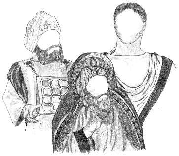

(Краткая биографическая справка)

     Еш<strong>у</strong>а (<a href="javascript:popUp%20(&#39;img/jeschua.gif&#39;,%20100,%2060,%20&#39;&#39;)">Jeschua</a>), известный под именем Иисуса Христа, родился около 5 года до н.э. в Палестине — в области <a href="javascript:popUp%20(&#39;img/galil.gif&#39;,%2090,%2070,%20&#39;&#39;)">Гал<strong>и</strong>ль</a>, в селении <a href="javascript:popUp%20(&#39;img/ntsereth.gif&#39;,%20100,%2070,%20&#39;&#39;)">H'ц<strong>э</strong>рет</a>. Его отец <a href="javascript:popUp%20(&#39;img/joseph.gif&#39;,%2090,%2055,%20&#39;&#39;)">Йос<strong>э</strong>п</a> и мать <a href="javascript:popUp%20(&#39;img/mirjam.gif&#39;,%20110,%2050,%20&#39;&#39;)">Мирй<strong>а</strong>м</a> были людьми простого звания: Йосэп был плотником-<a href="javascript:popUp%20(&#39;img/naggar.gif&#39;,%2070,%2060,%20&#39;&#39;)">нагг<strong>а</strong>ром</a>, а Мирйам, вероятно, пряхой. У Ешуа было как минимум шесть младших сестер и братьев, самым известным из которых был <a href="javascript:popUp%20(&#39;img/jaaqob.gif&#39;,%2090,%2060,%20&#39;&#39;)">Яак<strong>о</strong>б</a>, впоследствии возглавивший христианскую общину в <a href="javascript:popUp%20(&#39;img/jrushalm.gif&#39;,%20150,%2060,%20&#39;&#39;)">Й'рушал<strong>а</strong>йиме</a>. 
     Первые годы своей жизни Ешуа провел в H'цэрете, там же Он получил воспитание и начальное образование и обучился ремеслу наггара (<a href="27.htm">см. # 27</a>). 
     Примерно в тридцатилетнем возрасте Ешуа начал свою общественно-проповедническую деятельность и вскоре принял <a href="javascript:popUp%20(&#39;img/tbilah.gif&#39;,%20130,%2070,%20&#39;&#39;)">обряд омовения</a> от известного в ту пору религиозного деятеля — <a href="javascript:popUp%20(&#39;img/jochanan.gif&#39;,%2090,%2070,%20&#39;&#39;)">Йохан<strong>а</strong>на</a>, прозванного <a href="javascript:popUp%20(&#39;img/hamtabbl.gif&#39;,%20130,%2070,%20&#39;&#39;)">hамтабб<strong>э</strong>лем</a> (см. ## <a href="29.htm">29</a> и <a href="30.htm">30</a>). 
     Деятельность Ешуа в основном проходила в Галиле. Впрочем, Он посещал северные области, но не далее <a href="javascript:popUp%20(&#39;img/tsidon.gif&#39;,%2090,%2060,%20&#39;&#39;)">Цид<strong>о</strong>на</a>. Кроме того, Он проповедовал в <a href="javascript:popUp%20(&#39;img/jhudah.gif&#39;,%20120,%2060,%20&#39;&#39;)">Й'hуд<strong>е</strong></a> и ее окрестностях (см. ## <a href="42.htm">42</a>, <a href="45.htm">45</a> и <a href="46.htm">46</a>). 
     В своей общественной деятельности Ешуа прежде всего обращался к социальным низам. Основное отличие Его учения от учений других ибрейских проповедников заключалось в том, что Он почти не уделял внимания политической и обрядовой сторонам культа Яхве, а основной акцент делал на нравственных проблемах (см. ## <a href="33.htm">33</a> и <a href="34.htm">34</a>). 
     Ешуа образовал вокруг себя группу <a href="javascript:popUp%20(&#39;img/thalmidm.gif&#39;,%20160,%2060,%20&#39;Ученики&#39;)">тальм<strong>и</strong>дов</a>, из которой самыми известными были <a href="javascript:popUp%20(&#39;img/shimon.gif&#39;,%20110,%2060,%20&#39;&#39;)">Шим'<strong>о</strong>н</a>, прозванный <a href="javascript:popUp%20(&#39;img/kejpha.gif&#39;,%20100,%2060,%20&#39;&#39;)">Кеп<strong>о</strong>й</a>, и сыновья <a href="javascript:popUp%20(&#39;img/zabdi.gif&#39;,%2090,%2060,%20&#39;&#39;)">Забд<strong>и</strong></a> — Яак<strong>о</strong>б и Йохан<strong>а</strong>н (<a href="43.htm">см. # 43</a>). 
     Свою общественную деятельность Ешуа начинал в качестве <a href="javascript:popUp%20(&#39;img/nabi.gif&#39;,%20100,%2060,%20&#39;Пророк&#39;)">наб<strong>и</strong></a>, но около 29 года Он объявил себя <a href="javascript:popUp%20(&#39;img/mashiach.gif&#39;,%20110,%2060,%20&#39;Мессия&#39;)">Маш<strong>и</strong>ахом</a> (см. # <a href="33.htm">33</a> и <a href="36.htm">36</a>). 
      Весной 30 года Ешуа присутствовал в Й'рушалайиме в честь наступления праздника Пасхи. Социально-религиозные верхи Й'hуды, во главе которых стоял бывший алабарх <a href="javascript:popUp%20(&#39;img/chanan.gif&#39;,%2070,%2060,%20&#39;&#39;)">Хан<strong>а</strong>н</a>, видя проповеднические успехи Ешуа и опасаясь, как бы в столице не произошли народные волнения, случайно вызванные этими проповедями, и, вследствие этого, не последовали бы репрессивные меры со стороны романских властей, грозящие благополучию исраэльской аристократии, арестовали и выдали Ешуа романскому прокуратору Й'hуды, обвинив Арестованного в заговоре против владычества Ромы. 
     Прокуратор Понтиус Пилатус (Pontius Pilatus) осудил Обвиняемого, и 7 апреля 30 года Ешуа был распят на холме <a href="javascript:popUp%20(&#39;img/golgolth.gif&#39;,%20140,%2060,%20&#39;&#39;)">Гольгольт<strong>а</strong></a> вблизи Й'рушалайима (см. ## <a href="41.htm">41</a>, <a href="48.htm">48</a>, <a href="50.htm">50</a>, <a href="53.htm">53</a>, а также <a href="11.htm#testimon">Testimonium Flavianum, ex Agape</a>). 
     Однако ближайшие тальмиды Ешуа не смирились с мыслью о смерти их <a href="javascript:popUp%20(&#39;img/rabba.gif&#39;,%2090,%2060,%20&#39;Учитель&#39;)">Рабб<strong>ы</strong></a> и уверовали в то, что Яхве воскресил своего Машиаха. Вскоре они выступили с этой вестью в Й'рушалайиме, где и основали первую общину уверовавших в Машиаха Ешуа (см. ## <a href="55.htm">55 — 58</a>; <a href="11.htm#testimon">Testimonium Flavianum, ex Agape</a>).

 

     

