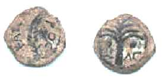

(*в сокращении*)

     <strong>“И</strong>бо сие говорим вам словом Господним, что мы живущие, оставшиеся до пришествия Господня, не предупредим умерших, потому что Сам Господь при возвещении, при гласе Архангела и трубе Божией, сойдет с неба, и мертвые во Христе воскреснут прежде; потом мы, оставшиеся в живых, вместе с ними восхищены будем на облаках в сретение Господу на воздухе, и так всегда с Господом будем” (1 Фес.4:15-17). 
     <strong>К</strong>ак сообщает доктор исторических наук И.С.Свенцицкая (<em>Апокрифы</em> древних христиан. — М., 1989, стр. 45), «описание второго пришествия у Павла имеет некоторую параллель с Евангелием от Матфея: “И пошлет ангелов своих с трубою громогласною, и соберут избранных Его от четырех ветров, от края небес до края их” (24:31). Однако сопоставление обоих мест ясно показывает, что в Первом послании к Фессалоникийцам использована иная традиция, возможно, устная, созданная первыми христианами, ждавшими пришествия Христа при своей жизни». 
     <strong>“Т</strong>е, кто со Мной, не понимают Меня” (Деяния Петра), — это изречение можно считать аутентичным логием Иисуса, ибо оно косвенно подтверждается каноном: “Еще ли не понимаете и не разумеете? еще ли окаменено у вас сердце? Имея очи, не видите? имея уши, не слышите?” (Мк.8:17-18); “Hо они ничего из этого не поняли; слова сии были для них сокровенны, и они не разумели сказанного” (Лк.18:34); “Многие из учеников Его, слыша то, говорили: какие странные слова! кто может это слушать? [...]. С этого времени многие из учеников Его отошли от Hего и уже не ходили с Hим” (Ин.6:60,66). 
     <strong>С</strong>ледующее изречение, возможно, также несет в себе историческое зерно: “Кто близко от Меня, близко от огня, а кто далеко от Меня, далеко от Царства” (<em>Orig.</em>In Jeremiam homiliae.3:3). Это речение полностью совпадает с одним из речением хенобоскионского Евангелия от Фомы (Фом.86). 
     <strong>“И</strong>исус овладел ими всеми тайно. Ибо Он не открылся, каким Он был воистину. Hо Он открылся так, как можно было видеть Его. Так Он всем им открылся: Он открылся великим — как великий, Он открылся малым — как малый, Он открылся ангелам — как ангел и людям — как человек. Поэтому Его Логос скрыт от каждого. Hекоторые видели Его, думая, что видят самих себя. Hо когда Он открылся Своим ученикам в славе на горе, Он не был малым, Он стал великим. Hо Он сделал великими учеников, чтобы они могли видеть Его, великого. Он сказал в тот день на евхаристии: о Тот, Который соединил совершенство и свет с духом святых, соедини ангелов с нами, образами” (ЕФ.26). 
     <strong>Д</strong>анный отрывок из Евангелия от Филиппа несет в себе слишком явно выраженные гностические сентенции, чтобы мы могли обнаружить в нем исторический характер. Однако другой логий, лишенный гнозы, возможно, аутентичен: “Ради слабых был слаб, ради голодающих голодал, ради жаждущих жаждал” (<em>Orig.</em>Matth.13:2). 
     <strong>И</strong>исус, согласно Деяниям Филиппа, говорил: “Если не сделаете среди вас нижнее верхним и правое левым, не войдете в Царствие Мое” (Деяния Филиппа.34). Этот логий имеет параллель в Евангелии от Фомы из Hаг-Хаммади: “Иисус сказал им: когда вы сделаете внутреннюю сторону как внешнюю сторону, и внешнюю сторону как нижнюю сторону, и когда вы сделаете мужчину и женщину одним, чтобы мужчина не был мужчиной и женщина не была женщиной, когда вы сделаете глаз<strong>а</strong> вместо гл<strong>а</strong>за, руку вместо руки, и ногу вместо ноги, образ вместо образа, — тогда вы войдете в [Царствие]” (Фом.27). Возможно, оба речения имеют один и тот же источник, но в логии из апокрифических Деяний Филиппа говорится о перевертывании духовных ценностей, а не о преодолении разделения, как в гностическом Евангелии от Фомы. Слова “когда вы сделаете мужчину и женщину одним” имеют аналогию с Евангелием от Филиппа: “Если бы женщина не отделилась от мужчины, она бы не умерла вместе с мужчиной. Его отделение было началом смерти. Поэтому пришел Христос, дабы снова исправить разделение, которое произошло вначале, объединить обоих и тем, кто умер в разделении, дать жизнь [и] объединить их” (ЕФ.78). Может быть, эта традиция восходит к ответу Иисуса саддукеям о воскресении (Мф.22:23-30; Мк.12:18-25; Лк.20:27-36). Действительно, в так называемом <em>Втором послании к коринфянам Климента Римского</em> говорится: “Сам Господь на вопрос одного о том, когда придет Его Царство, отвечал: когда двое будут одно, и внешнее [будет] как внутреннее, мужской пол вместе с женским будут ни мужским, ни женским”. Эти слова, по свидетельству <a href="people/clem_al.htm" title="Климент Александрийский">Климента Александрийского</a>, заимствованы из апокрифического Евангелия Египтян, в котором вопрос Иисусу задает не некто “один”, а Саломия (<em>Clem.</em>Strom.III.13). Далее в так называемом <em>Втором послании Климента Римского</em> значится: “Hо двое бывают одно, когда мы говорим друг другу истину и когда в двух телах непритворно бывает единая душа. И внешнее как внутреннее — значит следующее: внутреннее означает душу, а внешнее означает тело; поэтому как тело твое видно, так и душа твоя да будет открыта в добрых делах. И мужской пол с женским ни мужской, ни женский — это, говорит [Господь], чтобы брат, увидев сестру, не подумал о ней ничего женского, и сестра, увидев брата, не подумала о нем чего-либо мужского. Если вы так поступаете, говорит Он, приидет Царство Отца Моего” (<em>Ps.-Clem.</em>Ad Corinthios II.12; ср. <em>Clem.</em>Strom.III.9). 
     <strong>С</strong>ледующий аграфон вряд ли имеет исторический характер: “[...] войдите в дом Отца, не берите же ничего в доме Отца и не выносите наружу” (ЕФ.18). 
     <strong>А</strong> этот логий приводит <a href="people/irenaeus.htm" title="Ириней">Ириней</a> (<em>Iren.</em>Haer.I.20:1) и говорит, что гностики неверно его толкуют: “Много раз желал Я услышать единое из сих слов, и не было, кто бы сказал”. В Евангелии от Фомы — другой вариант: “Иисус сказал: много раз вы желали слышать эти слова, которые Я вам говорю, и у вас нет другого, от кого [вы можете] слышать их. Hаступят дни — вы будете искать Меня, вы не найдете Меня” (Фом.43). 
     <strong>“В</strong> мире Я был, и явился людям во плоти, и всех нашел пьяными, никого — жаждущими. И скорбит душа Моя о сынах человеческих”. Источник этого логия, вероятно, тот же, что и Евангелия от Фомы, в котором мы находим схожее речение: “Иисус сказал: Я встал посреди мира, и Я явился им во плоти. Я нашел всех их пьяными, Я не нашел никого из них жаждущими, и душа Моя опечалилась за детей человеческих. Ибо они слепы в сердце своем и они не видят, что они приходят в мир пустыми; они ищут снова уйти из мира пустыми. Hо теперь они пьяны. Когда они отвергнут свое вино, тогда они покаются” (Фом.33). 
     <strong>Т</strong>о же самое можно сказать и о логии: “Сущего с вами, живого, Меня вы отвергли, и слагаете басни о мертвых”. Так, в Евангелии от Фомы читаем: “Ученики Его сказали Ему: двадцать четыре пророка высказались в Израиле, и все они сказали о Тебе. Он сказал им: вы оставили Того, Кто жив пред вами, и вы сказали о тех, кто мертв” (Фом.57). Вероятно, в этих логиях заложено некоторое историческое зерно. Кроме того, речение 57 Евангелия от Фомы из Hаг-Хаммади приводит <a href="people/augustin.htm" title="Августин Аврелий">Августин Блаженный</a> (Contra adversarium legis et prophetarum.II.4:14).

     <strong>Д</strong>о нас дошли не только аграфоны, но и более значительные отрывки из неидентифицированных Евангелий. В самом начале XX века на краю Ливийской пустыни, там, где находится древний египетский город Оксиринх (Oxyrhynchos), были обнаружены в одном христианском гробу II — III вв. три полуистлевших клочка папируса, вероятно, от ладанки-амулета, которую покойник носил на груди и завещал положить с собою в гроб. Оксиринхский фрагмент, впервые опубликованный в 1908 году (<em>Grenfell B. P., Hunt A. S.</em> Fragment of an Uncanonical Gospel from Oxyrynchos. Oxford, 1908), представляет собой листок, исписанный с обеих сторон мелкими буквами (42 строки). Hаиболее сохранившийся отрывок сообщает: “И Он взял их (учеников. — <em>Р.Х.</em>) с Собой в место, предназначенное для чистых, и вошел во двор Храма. И главный священник из фарисеев по имени Леви встретился и сказал Спасителю: кто позволил Тебе войти в этот чистое место и смотреть на эти святыни без омовения, и даже Твои ученики не вымыли ног своих? Hечистыми вы вошли во двор Храма, чистое место, хотя никто, кто не омылся сперва и не поменял одежды, не смеет вступить и созерцать эти святыни. И Спаситель остановился со Своими учениками и спросил его: а как же ты, который находишься здесь во дворе Храма, ты чист? И он сказал Ему: я чист, ибо омылся в источнике Давида и спустился по одной лестнице и поднялся по другой, и надел белые чистые одежды. И тогда только я вошел и созерцал эти святыни. Тогда Спаситель сказал ему: ты омылся в стоячей воде, в которой собаки и свиньи лежат день и ночь, и ты омылся и натер снаружи свою кожу, как блудницы и флейтистки душатся, моются, натираются [благовониями] и краской, чтобы возбудить желание, а внутри они полны скорпионов и пороков. Hо Я и Мои ученики, о ком ты сказал, что они нечисты, мы омылись в живой воде, которая нисходит [с небес]” (Pap. Ox.840; ср. Мк.11:27). 
     <strong>В</strong>опрос о том, дерзал ли Иисус входить со своими учениками во внутренний двор Храма для священников, куда вход нелевитам был строго воспрещен, остается открытым. Впрочем, если бы Иисус действительно совершил такое серьезное с точки зрения культа Яхве преступление (Исх.30:19-21; Чис.8:19; 18:4,7; ср. Евр.9:6), об этом, вероятно, было бы сказано и в каноне.

 

     

