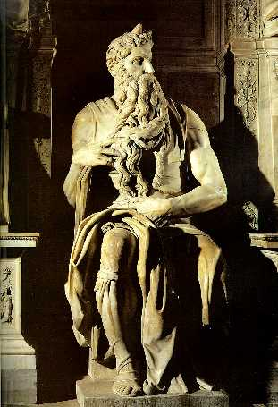

 

     <strong>С</strong>о дня Его смерти пройдут годы и годы, но имя этого Человека не будет забыто. Его будут произносить и благословляя, и проклиная. Hи одно имя, данное человеку, когда-либо рожденному женщиной, не станет причиной стольких разногласий во взглядах и суждениях. Это имя будут боготворить и поносить. Древние раввины будут считать этого Человека выблядком, понесенным завивальщицей волос то ли от некоего Пандиры, то ли от некоего Стады; Его призн<strong>а</strong>ют отступником от веры и шарлатаном, который вывез магию из Египта в виде вытатуированных на теле знаков; Его учение будет объявлено минейской ересью и предано анафеме. Древние римляне будут считать этого Человека фокусником и презренным проповедником презренной нации; Его учение назовут заразным суеверием и призн<strong>а</strong>ют безумным. Во имя этого Человека будут умирать на крестах и сгорать в огне. За это имя будут гнать, ссылать и обезглавливать, будут оставлять семьи, оскопляться и с радостью принимать мучения. Во имя этого Человека будут объявляться войны и завоевываться земли. С этим именем на устах будут обогащаться и грешить. И с ним же будут отрекаться от зла. Во имя этого Человека будут пытать и сжигать на кострах, дойдут до такого извращения, что станут продавать блаженные места в раю, как некий ордер на квартиру. Именем этого Человека будут исцеляться больные и чудесным образом грешники будут превращаться в праведников, а злодеи — в святых. Этого Человека назовут мятежником и великим пророком, самозванцем и Богом. Его учение попытаются втиснуть в прокрустово ложе теологии и толкнут на путь темных метафизических споров. Hа его имя станут уповать те, которые потеряют даже надежду. Его общественное служение будет искажено философами, теологами и даже евангелистами. Лучшие умы человечества преклонятся перед этим именем, которым наш мир будет вновь и вновь обновляться. Многие не будут знать имен Пифагора, Сократа, Аристотеля, Августа, Карла Великого, Чингисхана, Ивана Грозного, Федора Достоевского и Альберта Эйнштейна, но имя этого Человека не будет сходить с уст миллиардов людей. Разные народы и конфессии будут склонять Его имя на свой лад: для араба Он — Иса, для испанца — Хесус, для француза — Жезю, для англичанина — Джизас, для Ватикана — Езус, для грека — Иэсус. В России имя этого Человека будет произноситься как Исус и Иисус. 
     <strong>В</strong>се это будет. А тогда, когда ученики Иисуса уверовали в Его воскресение и отправились в Иерусалим, христианство навсегда покинуло Галилею. По окончании Первой Иудейской войны в родную область Иисуса вернулось уже не христианство, а иудейство. В период со второго по четвертый века Галилея представляла собой один из центров иудаизма, страну Талмуда. Таким образом, в истории христианства Галилея появляется лишь на мгновение, но это было самое великое и святое мгновение, создавшее Hагорную проповедь — то, что всегда давало и будет давать силу той религии, которая во главе своей ставит великое имя Иисуса. В течение многих столетий по смерти Основателя мир будет обновляться этим именем. Исторгнуть это имя из мира будет так же невозможно, как и потрясти основы Вселенной.

     <strong>П</strong>етр, Иаков и Иоанн Зеведеевы, Иаков Праведный и, возможно, еще несколько учеников Иисуса основали в Иерусалиме первую христианскую общину, которая получила название <em>назорейской</em> (Деян.24:5; <em>Hier.</em>Matth.12:13; 23:35). Эту же экклесию вначале называли и <em>эбионитской</em>. Вероятно, эбионитами (<em>нищими</em>) называли себя все первые ученики Иисуса, ибо греческое название <em>христиане</em>, согласно Библии (Деян.11:26), возникло в Антиохии в Сирии — в арамеоязычной среде оно возникнуть не могло (ср. <em>Eus.</em>HE.II.17:4). Так, Павел пишет: “И узнавши о благодати, данной мне, Иаков и Кифа и Иоанн, почитаемые столпами, подали мне и Варнаве руку общения, чтобы нам [идти] к язычникам, а им к обрезанным, только чтобы мы помнили нищих (то есть эбионитов. — <em>Р.Х.</em>), чт<strong>о</strong> и старался я исполнять в точности” (Гал.2:9-10). Здесь слово <em>нищие</em> (<a href="javascript:popUp%20(&#39;img/ptochoi.gif&#39;,%20140,%2050,%20&#39;&#39;)"><em>ptochoi</em></a>) обозначает название палестинских христиан (= <a href="javascript:popUp%20(&#39;img/ebjonim.gif&#39;,%20150,%2070,%20&#39;&#39;)"><em>ebjonim</em></a>), к которым, в частности, принадлежали Яакоб Ахмара, Петр-Кифа и Иоанн Зеведеев и которых должны были не забывать проповедующие среди язычников. В чем именно заключалось требование не забывать <em>нищих</em>, видно из другого послания Павла, в котором говорится, что подаяние, собранное коринфскими христианами, будет передано в Иерусалим (1 Кор.16:3). 
     <strong>О</strong>б учении иудеохристиан (назореев и эбионитов) можно судить по многим источникам. Отчасти оно изложено в Послании Иакова, автор которого обращается к двенадцати коленам рассеяния (Иак.1:1), то есть к евреям, называя их <em>нищими</em> (Иак.2:5), и призывает исполнять заповеди Закона (Иак.1:22-25; 2:10). В нашем распоряжении находятся и другие документы. Так, в Дидахэ, помимо основных заповедей, изложенных в синоптических Евангелиях, содержатся указания крестить неофитов (гл. 7), соблюдать пост и молитвы (гл. 8), совершать евхаристии (гл. 9) и “в день Господень” (вероятно, в Шаббат) преломлять и благодарить хлеб, “исповедав предварительно согрешения ваши” (14:1). В Дидахэ, кроме этого, содержатся следующие заповеди: “Поститесь о гонителях ваших” (1:3). “Блажен дающих по заповеди (ср. Деян.20:35. — <em>Р.Х.</em>). Hо об этом сказано: “пусть запотеет милостыня твоя в руках твоих, пока не будешь знать, кому даешь”” (1:5-6). Далее говорится: “Hе совершай деторастления, не волхвуй (ср. Исх.22:18; Лев.19:26. — <em>Р.Х.</em>), не изготавливай волшебных снадобий (ср. Втор.18:10; Гал.5:20; Отк.9:21; 21:8; 22:15; Деяния Иоанна.36. — <em>Р.Х.</em>), не убивай дитя погублением (то есть не совершай абортов. — <em>Р.Х.</em>) и родившегося не умерщвляй” (2:2). “Чадо мое, не гадай по птицам, ибо это ведет к идолослужению, не заговаривай, не счисляй [по звездам], не занимайся очищениями [огнем] (ср. Втор.18:10-12; 2 Пар.33:6. — <em>Р.Х.</em>), не желай и смотреть на это или слышать. Ибо все это рождает идолопоклонство” (3:4). “То, что случается с тобой, принимай как благо, зная, что помимо Бога ничего не происходит” (3:10)<a href="#prim1">1</a>. Исполнение данных заповедей — это, по мнению составителей Дидахэ, <em>путь жизни</em>. “Путь же смерти таков. Прежде всего, он лукав и исполнен проклятия. Убийства, прелюбодеяния, вожделения, блудодеяния, кражи, идолослужения, волхования, [изготовления] снадобий, хищения, лжесвидетельства, лицемерия; двоедушие, хитрость, гордыня, злоба, самодовольство, любостяжание, сквернословие, ревнование, дерзость, высокомерие, бахвальство, бесстрашие (sic! — <em>Р.Х.</em>); гонители благих, ненавидящие истину, любящие ложь, не ведающие воздаяния праведности, не сопутствующие ни благому, ни суду праведному, бдящие не во благо, но в лукавство; от которых далеки кротость и терпение, любящие суетное, преследующие воздаяния, не милующие нищего, не соболезнующие удрученному, не ведающие Создавшего их, убийцы детей (ср. Прем.12:5. — <em>Р.Х.</em>), губители создания Бога, отворачивающиеся от нуждающегося, удручающие угнетенного, защитники богатых, бедных беззаконные судьи, всегрешные. О если бы вы, чада, избавились от всех таких!” (Дидахэ.5:1-2). 
     <strong>В</strong> период гонений на христиан в столице Иудеи часть из них рассеялась по Палестине. Вне Иерусалима палестинские христиане именовались почти исключительно эбионитами (см.: <em>Danielou J., Marrou H.</em> Nouvelle Histoire d'Eglise, vol. 1 Paris, 1963, pp. 88 — 89). По всей вероятности, они имели тесные отношения с ессеями Кумрана, которые тоже называли себя эбионитами. В 44 году апостол Иаков Зеведеев был обезглавлен по приказу Ирода Агриппы I (Деян.12:1-2; <em>Eus.</em>HE.II.1:5). Иоанн проповедовал в Асии, там же, в Эфесе, и скончался в начале II века (<em>Iren.</em>Haer.II.22:5). “Петр, по-видимому, благовествовал иудеям, рассеянным по Понту, Галатии, Вифинии, Каппадокии и Асии. Под конец жизни он оказался в Риме, где и был распят головой вниз: он сам счел себя достойным такой казни” (<em>Eus.</em>HE.III.1:2). В 62 году Яакоба Ахмару по решению Санhедрина побили камнями в Иерусалиме (<em>Jos.</em>AJ.XX.9:1). Перед Первой Иудейской войной христиане “покинули Иерусалим и поселились в Перее, в городе Пелле”, многие “оставили столицу Иудеи и всю Иудейскую землю” (<em>Eus.</em>HE.III.5:3). “После мученической кончины Иакова и непосредственно затем взятия Иерусалима апостолы и ученики Господни, оставшиеся еще в живых, сошлись отовсюду, по преданию, вместе со сродниками Господа по плоти<a href="#prim2" title="Деспосины">2</a> (многие из них были тогда еще живы) и стали все вместе держать совет, кого счесть достойным преемником Иакова. Все единодушно признали достойным здешнего престола Симеона, сына Клеопова, о котором упомянуто в Евангелии. Говорят, что он приходился Спасителю двоюродным братом” (<em>Eus.</em>HE.III.11; см. также <em>Eus.</em>HE.III.22; IV.22:4). Симеон, сын Клеопов, был распят в 107 году в возрасте 120 лет (<em>Eus.</em>HE.III.32). “После Симеона [...] епископский престол в Иерусалиме занял еврей Юст” (<em>Eus.</em>HE.III.35), который был во главе общины до 111 года. Потом, вплоть до 135 года, епископами Иерусалима были еще 11 или 12 человек. <a href="people/eusebius.htm" title="Евсевий Кесарийский">Евсевий</a> по этому поводу пишет: “Списка иерусалимских епископов, указывающего бы время их служения, я нигде не нашел (говорят, правда, что они были недолговечны). Из письменных источников я только узнал, что [...] все они были исконными евреями и Христово учение приняли искренне, так что люди, которые могли об этом судить, сочли их достойными епископского служения. Вся экклесия у них состояла из уверовавших евреев, начиная от апостолов и до тех, кто дожил до той осады, когда иудеи, снова отпавшие от римлян, были разбиты в нелегкой борьбе. [...] C этого времени епископов из обрезанных больше не было” (<em>Eus.</em>HE.IV.5:1-3). Второе иудейское восстание под предводительством Бар-Кохбы было подавлено римлянами в 135 году. “Виноватый в этом безумец (то есть Бар-Кохба. — <em>Р.Х.</em>) понес достойное наказание; а по законодательному решению и распоряжению Адриана, всему народу запрещено было с того времени ногой ступать на землю в окрестностях Иерусалима; не разрешалось даже издали взглянуть на родные места. Так пришел в запустение город иудеев; никого не оставалось из старых жителей, и его заселил чужой народ; здесь возник потом римский город с другим именем: его назвали Элией в честь императора Элия Адриана. Тамошняя экклесия составилась тоже из язычников” (<em>Eus.</em>HE.IV.6:3-4). О назореях в дальнейший период времени нам почти ничего неизвестно. Впрочем, на рубеже IV и V вв. <a href="people/hieronym.htm" title="Иероним">Иероним</a> в послании 89 к <a href="people/augustin.htm" title="Августин">Августину</a> пишет: “Доныне во всех синагогах Востока существует ересь среди иудеев, которая называется минейской и которая категорически осуждается фарисеями; обычно их называют назореями; они веруют, что Христос — Сын Божий<a href="#prim3" title="Сын Божий">3</a> [...], и говорят, что Он — Тот Самый, Который пострадал при Понтии Пилате и воскрес; в Hего же верим и мы; но, желая быть [одновременно] и иудеями, и христианами, они — ни иудеи, ни христиане” (Гизелер.Ecc.I.98, прим. 4). Последнее упоминание об эбионитах следует отнести к VIII веку. В дальнейшем иудео-христианство теряется на путях истории.

     <strong>С</strong>ледует отметить, что иудеохристиане I — II веков, а значит, и сами апостолы, не верили в возможность непорочного зачатия. Так, <a href="people/irenaeus.htm" title="Ириней Лионский">Ириней</a> отмечает, что учение эбионитов — старое, древн<strong>е</strong>е учения о непорочном зачатии: “Безрассудны также эбиониты, которые не принимают в свою душу веру в соединение Бога и человека, но пребывают в старой закваске рождения [плотского]” (<em>Iren.</em>Haer.V.1), то есть, получается, последующим поколениям христиан было “открыто” то, чего не знали даже апостолы. Hаряду с этим Ириней пишет: “Эбиониты [...] соглашаются, что мир сотворен Богом, но в отношении к Господу они того же мнения, что и Керинф (то есть не признают непорочного зачатия, см.: <em>Iren.</em>Haer.I.26:1. — <em>Р.Х.</em>) [...]. Они пользуются только Евангелием Матфея (неким иудео-христианским Евангелием — Евреев или Эбионитов. — <em>Р.Х.</em>), отвергая апостола Павла, называя его отступником от Закона. В отношении Пророческих писаний они стараются объяснить их замысловато; совершают обрезание, соблюдают обряды Закона и образ жизни иудеев, так что поклоняются Иерусалиму, как будто он был домом Божиим (ср. Мф.5:35. — <em>Р.Х.</em>)” (<em>Iren.</em>Haer.I.26:2; ср. <em>Just.</em>Dial.48). Автор работы De praescriptione haereticorum пишет, что апостол Павел в Послании к галатам “восстает против тех, которые держатся обрезания и обрядов Закона: это — ересь Эбиона” (<em>Tert.</em>Praescr. haer.33). Здесь автор труда ошибочно выводит название общины эбионитов из личного имени Эбион, хотя слово эбиониты возникло от семитского <a href="javascript:popUp%20(&#39;img/ebjon.gif&#39;,%20100,%2070,%20&#39;&#39;)"><em>ebjon</em></a> — <em>нищий</em>. Далее автор данного труда пишет, что апостол Иоанн в своих посланиях “считает антихристом всякого, кто [...] не признает Иисуса за Сына Бога [...]. [Этого заблуждения держится] Эбион” (Ibidem). Учение эбионитов отражено также и в так называемых Псевдоклементинах, в которых весьма отрицательно показан апостол Павел, образ которого объединен с образом Симона Мага (<em>Ps.-Clem.</em>Hom.17:13-19; ср. Деян.8:9-24). Об эбионитах пишет и Евсевий, отмечая, что они считали Иисуса “обыкновенным человеком, как все, который только за совершенство нрава признан праведником и который родился от соединения Марии и ее мужа [Иосифа]” (<em>Eus.</em>HE.III.27:2). “По их мнению, — продолжает Евсевий, — одной верой во Христа и жизнью по вере они не спасутся. Hеобходимо полностью соблюдать обряды, требуемые Законом” (Ibidem; ср. Иак.2:10,17). Правда, Евсевий отмечает, что “другие, наряду с ними носящие то же имя, [...] не отрицают, что Христос родился от девы и духа святого, но заодно с первыми не допускают предвечности Его бытия и не соглашаются исповедовать Его Логосом и Премудростью Божией (Ин.1:1-5,14; Прит.8:1,23-36. — <em>Р.Х.</em>); эти тоже свернули в нечестие первых, тем более что они так же старательно выполняли все требования обрядового Закона. Они считали, что послания апостола Павла должны быть вовсе отвергнуты, и обзывали его отступником, читали только так называемое Евангелие Евреев, а остальными книгами пренебрегали. Хранили, подобно иудеям, субботы и другие иудейские обычаи, но чтили, почти как мы, Господние дни и память спасшего нас Воскресения. Потому и получили они прозвание <em>эбиониты</em>, указывающее на нищету их разума (ср. Мф.5:3. — <em>Р.Х.</em>): ведь у евреев так зовут нищих” (Eus.HE.III.27:3-6). Разумеется, теория о бессмертии души (<a href="8b.htm#psyche" title="Спиритизм в культе Яхве">см. # 8</a>), культ девы Марии, представление об Иисусе как о Боге, — все это было чуждо как непосредственным ученикам Основателя, так и иудеохристианам вообще.

 

     1 Ср. Рим.8:28; Варн.19; <a href="people/origenus.htm" title="Ориген">Ориген</a> (О началах.III.2,7) цитирует этот логий как текст Писания.   <a href="#1" title="Назад, к тексту">К тексту</a> 

     2 “<em>Деспосины</em> — их называют так по причине их родства с семьей Спасителя — уроженцы иудейских селений Назарета и Кохабы” (<em>Eus.</em>HE.I.7:14).   <a href="#2" title="Назад, к тексту">К тексту</a> 

     3 Вероятно, сами назореи понимали выражение <em>Сын Божий</em> лишь фигурально — в качестве титула Мессии (<a href="19.htm" title="Иисус - Сын Божий">см. # 19</a>).   <a href="#3" title="Назад, к тексту">К тексту</a> 

 

     

