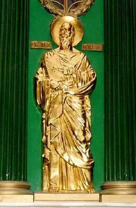

 

     <strong>И</strong>з вышесказанного следует, что христиане из палестинских евреев считали апостола Павла отступником, еретиком и лжеапостолом (см. также: <em>Epif.</em>Haer.30; Hier.In Matth.12). Конечно, автор Деяний апостолов пытается смягчить эти разногласия, но доверять ему нельзя, ибо все подтасовки и даже ошибки (ср., напр., Деян.17:14-16; 18:5 и 1 Фес.3:1-2; Деян.16:6; 18:22-23 и Гал.1:1-12) этого писателя изобличаются документами, заслуживающими нашего доверия, — посланиями самого Павла. Так, желание сделать из апостола язычников усердного посетителя Иерусалима, побудившее Терциуса приблизить время прибытия его в столицу Иудеи после обращения и продлить срок его первого пребывания там (Деян.9:23-30; ср. Гал.1:15-20), вероятно, навело автора Деяний на мысль приписать Павлу одним путешествием больше. По словам Терциуса, апостол пришел в Иерусалим с Варнавой, чтобы доставить пожертвования нищим во время голода 44 года (Деян.11:30; 12:25). Однако сам Павел категорически утверждает, что в промежуток между путешествием, которое имело место спустя три года после его обращения, и путешествием по вопросу об обрезании (ср. Деян.15:2 и сл.) он не был в Иерусалиме (Гал.1:15-20; 2:1-10)<a href="#prim1" title="Был ли Павел в Иерусалиме в 44 году?">1</a>. Рассказывая о так называемом Иерусалимском соборе, Терциус утверждает, что после того, как в Антиохию прибыли иудеохристиане из Палестины и стали настаивать на необходимости обрезания для гоев, уверовавших в Христа, депутация, состоящая из Павла, Варнавы и многих других, отправилась из Антиохии в Иерусалим, чтобы посоветоваться по этому вопросу с апостолами и пресвитерами. Их якобы встречают радушно; устраивается большое собрание; разногласие, если оно и существует, почти незаметно; оно сглаживается взаимными излияниями любви и радостью встречи; Петр высказывает мнение, которого скорее можно было ожидать от Павла, а именно, что обращенные язычники не подчинены Торе; Яакоб Ахмара делает только незначительные поправки, причем, противореча еврейскому Танаху, приводит цитату пророка Амоса (Ам.9:11-12) в греческой версии; никто не поддерживает “некоторых из Иудеи”; торжественным постановлением утверждено мнение Яакоба; об этом постановлении все экклесии были оповещены специально избранными для этого депутатами (Деян.15:1-31; 16:4-6). Рассказ Павла по этому поводу в корне отличается (Гал.2:1-10). Апостол язычников представляет данное свое путешествие в столицу Иудеи как результат самостоятельного побуждения; по прибытии в Иерусалим он сообщает о своей миссии влиятельным лицам, и те не делают ему никаких замечаний, ничего ему не сообщают, ничего от него не требуют, кроме обязательства не забывать эбионитов, то есть собирать для них подати от экклесий других городов (1 Кор.16:3). Более того, когда Петр позднее пришел в Антиохию, Павел “лично противостал ему, потому что он (Петр. — <em>Р.Х.</em>) подвергался нареканию”. Действительно, сперва Кифа ел со всеми без разбора, однако, когда появились эмиссары Яакоба Ахмары, он стал прятаться, “опасаясь обрезанных”. Видя, что он поступает не “по истине Евангельской”, Павел изобличает Петра перед всеми и упрекает его за такое поведение (Гал.2:11-21). 
     <strong>Р</strong>азница очевидна. Постановление так называемого Иерусалимского собора — просто благочестивый вымысел. Если бы такое постановление, утвержденное Яакобом Ахмарой, действительно было принято, то чем тогда объяснить такое поведение Петра в Антиохии перед посланцами Яакоба? Зачем он прячется? Ведь он и антиохийские христиане действовали в полном согласии с постановлением, принятом самим Яакобом... События, которые описывает Павел в стихах 1 — 10 главы 2 Послания к галатам, имели место в первой половине 50-х годов. Hесколькими годами позднее разногласия по поводу исполнения предписаний Торы обращенными из язычников, разногласия, которым как будто бы уже положен конец на так называемом Иерусалимском соборе, — эти разногласия становятся еще более острыми. Галатскую экклесию тревожат новые эмиссары от общины Иерусалима (ср. Деян.15:1; Гал.1:7; 2:12), и Павел пишет по этому поводу послание, практически обличая воззрения иудеохристиан. Если бы постановление так называемого Иерусалимского собора имело под собой реальную основу, то для того, чтобы положить конец разногласиям, Павлу достаточно было бы процитировать это постановление, однако все то, что он сообщает эпистолярным путем, приводит нас к выводу, что такого декрета не существовало (ср. также Деян.15:29 и 1 Кор.8:4-8; 10:25-27). Во время последнего путешествия Павла в столицу Иудеи (58 год) руководители иерусалимской общины заставляют Павла в знак покаяния очиститься и принести жертву в Храме (Деян.21:17-26). Спрашивается, в чем должен был каяться Павел, если он выполнял предписания постановления собора?.. Понятно, что автор Деяний апостолов не столько заботится об исторической правде и даже о логике, сколько о назидании. 
     <strong>В</strong>опрос о выполнении предписаний Торы христианами всегда был открытым. Иудео- и языко-христианство никогда не сливались (см.: <em>Ренан Э. Ж.</em> Апостолы. — СПб., 1906, стр. 20 — 24; <em>Косидовский З.</em> Библейские сказания; Сказания евангелистов. — М., 1990, стр. 361 — 363). Ученики Иисуса разрешили Павлу проповедовать среди гоев не столько для того, чтобы он обеспечивал экклесию Иерусалима материальными средствами, сколько ради пропаганды: ведь один из самых ярых гонителей нового учения сам стал его приверженцем. Hо разве могли они предполагать, что он примется за дело с таким энтузиазмом? Что из ревнителя Закона он превратится в одного из самых либеральных евреев того времени?..

     <strong>H</strong>ет, Павел не выступал против предписаний Торы, не осуждал их исполнение, в котором видел даже некоторую пользу. Он говорил, что “законом познается грех” (Рим.3:20), что верой в Христа Тора только утверждается (Рим.3:31), что “закон свят, и заповедь свята и праведна и добра” (Рим.7:12). Впрочем, с другой стороны, Павел доказывал, что “закон, если что и говорит, говорит к состоящим под законом” (Рим.3:19), что верующие в Христа “умерли для закона телом Христовым, чтобы принадлежать другому, Воскресшему из мертвых” (Рим.7:4), что Христос искупил верующих в Hего от клятвы Торы (Гал.3:13), что Закон был лишь “детоводителем<a href="#prim2" title="Детоводитель">2</a> ко Христу”, чтобы верующие в Hего могли “оправдаться верою” (Гал.3:24), что итог Торы — Христос<a href="#prim3" title="Тэлос">3</a> (Рим.10:4). В противоположность автору Послания Иакова, который утверждал, что “вера, если не имеет дел, мертва сама по себе” (Иак.2:17) и что если кто-либо исполняет все предписания Торы, кроме одной лишь заповеди, тот виновен в нарушении всех заповедей (Иак.2:10), Павел доказывал, что “человек оправдывается не делами закона, а только верою в Иисуса Христа [...], ибо делами закона не оправдается никакая плоть” (Гал.2:16), и что “если законом оправдание, то Христос напрасно умер” (Гал.2:21). Апостол язычников даже возвышался до мыслей Иисуса и утверждал, что исполнение предписаний Торы — это любовь (Рим.13:8-10), что любовь “есть совокупность совершенства” (Кол.3:14). “Закон не по вере, — писал Павел галатам, — если же вы духом водитесь, то вы не под законом”; однако тут же уточнял, что кто исполняет Закон, “тот жив будет им” (Гал.3:12; 5:18). Впрочем, апостол язычников излагает свои мысли по поводу исполнения заповедей Торы весьма непоследовательно и “неудобовразумительно” (2 Петр.3:15-16), но не подлежит сомнению то, что он исповедовал в данном вопросе определенный либерализм, который должен был руководствоваться лишь верой и совестью. “Где Дух Господень, там свобода”, — утверждал Павел и не настаивал на необходимости обрезания (Быт.17:10-12; Лев.12:3), отчасти даже порицая этой обряд (1 Кор.7:18; Рим.2:29); не настаивал он также и на соблюдении Шаббата<a href="#prim4" title="Служение в воскресенье">4</a> и других иудейских праздников, доказывая, что тот, “кто различает дни, для Господа различает; и кто не различает дней, для Господа не различает” (Рим.14:5-6; ср. Кол.2:16). Павел допускал, что христианин может употреблять в пищу даже “идоложертвенное”, в том числе и свинину (1 Кор.8:4-8; 10:25-31; ср. Лев.11:2-44; Втор.14:3-21; Деян.15:20,29): “Кто ест, для Господа ест, ибо благодарит Бога; и кто не ест, для Господа не ест, и благодарит Бога” (Рим.14:6; ср. Кол.2:16). Правда, при этом он делал поправку: “Ради пищи не разрушай дела Божия: все чисто, но худо человеку, который ест на соблазн. Лучше не есть мяса, не пить вина и не [делать] ничего [такого], отчего брат твой претыкается, (или соблазняется, или изнемогает). Ты имеешь веру? имей [ее] сам в себе, пред Богом. Блажен, кто не осуждает себя в том, что избирает. А сомневающийся, если ест, осуждается, потому что не по вере; а все, что не по вере, грех” (Рим.14:20-23). Hаконец, апостол язычников высказал совершенно невероятную по тем (да и по нынешним) временам мысль, а именно, что, кроме блуда, “всякий грех, какой делает человек, есть вне тела” (1 Кор.6:18). 
     <strong>Т</strong>акие либеральные взгляды Павла по поводу исполнения заповедей Торы, конечно же, не могли нравиться иудеохристианам Палестины, которые были твердо убеждены, что Закон Божий никогда не изменяется, ибо не изменяется сам Бог (Мал.3:6), и что “скорее небо и земля прейдут, нежели одна черта из закона пропадет” (Лк.16:17; ср. Мф.5:18). А потому и не могло быть никакого примирения между этими двумя воззрениями. 
     <strong>П</strong>авел утверждал, что свои миссионерские полномочия он получил не от “высших” апостолов, а непосредственно от Бога через Христа (1 Кор.9:1-4; 15:9-11; 2 Кор.12:11-13; Гал.1:15-17), а потому и не считал себя обязанным подчиняться кому бы то ни было из людей, хотя иногда и шел на некоторые уступки (Деян.16:3; 21:23-26). Он проповедовал “от Иерусалима и окрестностей до Иллирика” (Рим.15:19; ср.<em>Eus.</em>HE.III.1:3; 4:1)<a href="#prim5" title="Павел в Испании">5</a> и в 60-х годах в Риме был казнен<a href="#prim6" title="Обезглавливание Павла">6</a>, не оставив после себя никакой организации и, вероятно, закончив жизнь в полном одиночестве. Почти на целое столетие имя Павла было забыто (<a href="55.htm" title="Сведения о Павле">см. # 55</a>). 
     <strong>К</strong>онечно, Павел не исповедовал Иисуса Богом и даже физиологическим сыном Бога (<a href="20.htm" title="Иисус - Бог">см. # 20</a>). Культ девы Марии был чужд апостолу язычников; в одном месте он однозначно говорит, что Иисус “родился от жены (<a href="javascript:popUp%20(&#39;img/ek_gynks.gif&#39;,%20240,%2050,%20&#39;&#39;)"><em>ek gynaikos</em></a> — <em>из женщины</em>)” (Гал.4:4); здесь греческое слово <a href="javascript:popUp%20(&#39;img/gyne.gif&#39;,%20110,%2050,%20&#39;&#39;)"><em>gyne</em></a> не может означать <em>девственницу</em> (<a href="javascript:popUp%20(&#39;img/parthens.gif&#39;,%20180,%2050,%20&#39;&#39;)"><em>parthenos</em></a>). Учение <a href="people/plato.htm" title="Платон">Платона</a> — в том числе и идея о бессмертии души — также было чуждо Павлу. Достаточно вспомнить историю, произошедшую с апостолом язычников, когда он проповедовал перед афинянами, воспитание которых основывалось на учении о бессмертии души: “Услышав о воскресении мертвых [в судный день], одни насмехались, а другие говорили: об этом послушаем тебя в другое время” (Деян.17:32). И только в последние годы жизни Павел принял некоторые элементы греческой философии — в частности, теорию о предсуществовании Христа до плотского рождения Иисуса (Флп.2:6-7; Кол.1:15-17). Эта теория широко отражена в Евангелии от Иоанна (Ин.1:1; 3:13; 6:51,62; 8:23,58; 17:5), но даже в нем высказывается мысль о подчиненном положении Христа перед Богом: “Отец Мой более Меня” (Ин.14:28). Так и Павел утверждал: “Христу глава — Бог” (1 Кор.11:3); и если, как утверждают клирики, апостол язычников ставил знак равенства между Христом и Богом, то, основываясь на изречении: “Вы же — Христовы, а Христос — Божий” (1 Кор.3:23), мы должны признать, что он ставил знак равенства между христианами и Христом, а это — абсурд. “Hет иного Бога, кроме Единого” (1 Кор.8:4), — утверждал Павел. — “У нас один Бог — Отец” (1 Кор.8:6).

 

     1 Если, вопреки здравому смыслу, отождествить путешествие, описанное в Гал.2:1 и сл., с путешествием, описанным в Деян.11:30; 12:25, то и здесь мы приходим к неразрешимым противоречиям, ибо то, что рассказывается в Деян.11:30 и сл., произошло около того времени, когда был казнен Иаков Зеведеев (Деян.12:1-2), а смерть Иакова представляет одну из немногих точных дат в Деяниях апостолов, так как она произошла незадолго до смерти Ирода Агриппы I (Деян.12:1-4,19-23), имеющей место в 44 году (<em>Jos.</em>AJ.XIX.8:2; BJ.II.11:1-2,6); и если даже считать 14 лет (Гал.2:1) не от первого посещения христианина Павла Иерусалима, а от самого его обращения, то и тогда получается, что Павел обратился в 30 году, чего, конечно же, не могло быть в действительности.   <a href="#1" title="Назад, к тексту">К тексту</a> 

     2 В древности греческое слово <a href="javascript:popUp%20(&#39;img/paidagog.gif&#39;,%20230,%2050,%20&#39;&#39;)"><em>пайдагог<strong>о</strong>с</em></a> (отсюда и <em>педагог</em>) означало раба, который отводил детей господина к учебному заведению.   <a href="#2" title="Назад, к тексту">К тексту</a> 

     3 Следует отметить, что в выражении “конец закона — Христос” слово <em>конец</em> передается в оригинале греческим словом <a href="javascript:popUp%20(&#39;img/telos.gif&#39;,%20120,%2050,%20&#39;&#39;)"><em>t<strong>e</strong>los</em></a> и означает <em>результат</em>, <em>итог</em>; ср. “Конец (telos) — жизнь вечная” (Рим.6:22).   <a href="#3" title="Назад, к тексту">К тексту</a> 

     4 Христиане Коринфа, кажется, собирались не в субботу, а в воскресенье (1 Кор.16:2).   <a href="#4" title="Назад, к тексту">К тексту</a> 

     5 Возможно, Павел даже доходил до Испании (Рим.15:24,28; ср. <em>Clem.</em>Ad Corinthios I.5 и <em>Eus.</em>HE.II.22:5-7).   <a href="#5" title="Назад, к тексту">К тексту</a> 

     6 Будучи римским гражданином, Павел был обезглавлен (<em>Eus.</em>HE.II.25:5), а не распят или отдан на съедение диким зверям.   <a href="#6" title="Назад, к тексту">К тексту</a> 

 

     

