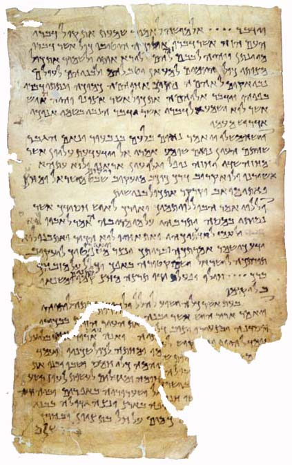
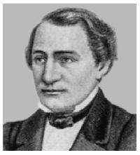

<title>Руслан Хазарзар. Сын Человеческий. Глава первая</title>

<h1>I. Критический анализ 
канонических Евангелий</h1>

<h2>1. Общие положения</h2>

Слово <i>евангелие</i> возникло от греческого слова &#949;&#8016;&#945;&#947;&#947;&#941;&#955;&#953;&#959;&#957;
[эў-ан-гэ-ли-он]<a href="#_ftn1" name="_ftnref1">[1]</a> — <i>радостная
весть</i>.

Первые три Евангелия — от Матфея, от Марка и от
Луки — излагают историю жизни и учение Иисуса близко друг к другу, поэтому их
принято называть <i>синоптическими</i> (от греч. &#963;&#965;&#957;&#959;&#960;&#964;&#953;&#954;&#972;&#962; —
<i>способный обозреть все вместе</i>). Евангелие от Иоанна стоит особняком.

Вопрос об источниках новозаветных Евангелий очень сложен. Евангелие от Марка
легло в основу Евангелий от Матфея и от Луки; то, что выходит за рамки
содержания второго Евангелия, взято, вероятно, из какого-то до нас не дошедшего
источника — <b>Q</b> (от нем. quelle — <i>источник</i>).

Сначала преобладало мнение, что источником <b>Q</b> было некое праевангелие,
впоследствии пропавшее; однако вскоре ученые решили, что этим источником
являлись записи речений (logia) на темы морали и религии. В посланиях Павла
неоднократно встречаются ссылки на слова, произнесенные Иисусом, и ныне
исследователи склоняются к тому мнению, что именно речения Иисуса стали первой
записью устной традиции и что многие логии в изложении первых христианских
общин просто принимали вид притчи или какой-нибудь истории, якобы случившейся с
Иисусом в Его земной жизни.

Однако, я думаю, существовали некие устные, а может, даже письменные,
праевангелия (не путать с <b>Q</b>-logia), из которых черпал сведения автор
Евангелия от Марка, а возможно, и авторы Евангелий Евреев и Эбионитов<a
href="#_ftn2" name="_ftnref2">[2]</a>. В начале второго века уже существовало
множество жизнеописаний, а не только логиев, Иисуса (Лк.1:1-2;
<i>Orig.</i>Homiliae in Lucam.I; <i>Eus</i>.HE.III.39:15; <i>Hier.</i>Matth.,
пролог), опираясь на которые, Папий<a href="#_ftn3" name="_ftnref3">[3]</a>
высказывал мнение, что Марк записал «не по порядку» свое Евангелие
(по-видимому, имеется в виду некоторое неканоническое «Евангелие от Марка»). То
есть во втором веке уже существовал определенный <i>порядок</i>, была
установлена некоторая хронология событий из жизни Иисуса. Вряд ли такой
<i>порядок</i> мог быть установлен исходя только из поучительных историй,
возникших из логиев.

В науке существует также точка зрения — правда, необщепринятая, — что
первыми записями, сделанными христианами, были сборники цитат из Танаха, где
речь шла об ожидаемом Мессии: так называемые <i>тестимонии</i> (от лат.
testimonium — <i>свидетельство</i>).

&nbsp;

<table width="100%" border=0>
<tr>
<td valign=middle>

4Q&nbsp;Testimonia (4Q&nbsp;175)

Так называемый <i><a href="../books/4q_test" target="_blank"
title="4Q 175">Мессианский сборник</a></i>
 из Четвертой кумранской пещеры

</td>
<td valign=middle>

</td>
</tr>
</table>

&nbsp;

Ученые также пришли к мнению, что авторы первого
и третьего Евангелий черпали сведения не только из Евангелия от Марка и из
<b>Q</b>-logia, но у каждого из них были, кроме того, свои сведения об Иисусе.
В конце концов, была принята на вооружение так называемая <i>гипотеза многих
источников</i>, именуемая также <i>теорией фрагментов</i>.

Нет сомнений в том, что первоначально каждое из Евангелий было
самодостаточно: иудеохристиане пользовались неким «Евангелием от Матфея»,
христиане из язычников пользовались Евангелиями от Марка и от Луки, в Египте
почиталось Евангелие от Иоанна. Самодостаточными Евангелия считали и их авторы.
Итак, что же могла узнать христианская община, которая имела в своих руках лишь
одно Евангелие?

Прочитав Евангелие от Матфея, община узнавала, что родители Иисуса
изначально жили в Вифлееме (а не в Назарете), отца Иосифова звали
Иаковом&nbsp;(1:16), Иисус был зачат непорочно и родился в Вифлееме, спустя
десятилетия Его крестил Иоанн, потом Иисус проповедовал около одного года и был
распят 15&nbsp;нисана.

Прочитав Евангелие от Марка, община узнавала, что Иисус, вероятно, был зачат
естественным способом и родился в Назарете&nbsp;(6:1), был крещен Иоанном,
проповедовал около одного года и был распят 15&nbsp;нисана.

Прочитав Евангелие от Луки, община узнавала, что родители Иисуса изначально
жили в Назарете, отца Иосифова звали Илием&nbsp;(3:23), Иисус был зачат
непорочно и родился в Вифлееме, спустя три десятилетия Он крестился, потом
проповедовал около одного года и был распят 15&nbsp;нисана.

Прочитав Евангелие от Иоанна, община узнавала, что Иисус был зачат
естественным способом и родился в Назарете (1:45-46; cp.&nbsp;7:41-42), спустя
какое-то время путем некоторой эманации произошло слияние сущностей
божественного Логоса и человека Иисуса, потом Иисус Христос-Логос проповедовал
более трех лет и был распят 14&nbsp;нисана (а не 15-го, как утверждают
остальные Евангелия).

Христианская община, которая почитала Евангелие
от Матфея, прочитав первые главы Евангелия от Луки, вероятно, решила бы, что
речь здесь идет о разных Иисусах. То же самое решила бы и община, почитавшая
Евангелие от Луки, при прочтении первых глав Евангелия от Матфея. Ну а община,
почитавшая одно из первых трех Евангелий, прочитав Евангелие от Иоанна, не
признала бы его богодухновенности, что в действительности и наблюдалось на
протяжении более 70&nbsp;лет после его написания.

Многие исследователи полагают, что речения Иисуса не имеют никакой
исторической ценности: «Нет никакой возможности сохранить содержание речи,
которая не была сейчас же записана и передавалась путем устного предания в
течение пятидесяти лет»<a href="#_ftn4" name="_ftnref4">[4]</a>, — пишет о
речениях Иисуса Каутский<a href="#_ftn5" name="_ftnref5">[5]</a>.

Доля правды здесь есть; но только — доля. Речи
Иисуса, конечно, искажены (потому и существуют разночтения), некоторые фразы
Ему просто приписаны, но чувствуется за логиями в Евангелиях один великий
проповедник, один поэт и философ (Ин.7:46)<a href="#_ftn6"
name="_ftnref6">[6]</a>. Мнение, что данные речения являются сборником
иудейского фольклора, не выдерживает критики (<i>Д.&nbsp;С. Мережковский</i>).
Иначе почему, спрашивается, мы не видим такой красоты в проповедях,
приписываемых другим проповедникам Нового завета и Талмуда? Даже такой
талантливый писатель, как автор Евангелия от Луки, сразу же блекнет в своем
втором труде, в книге Деяний апостолов, в которой нет проповедей Иисуса. Кроме
того, следует помнить, что у евреев было принято, чтобы ученик запоминал слова
учителя наизусть: хороший ученик был подобен «обмазанному известью водоему
(&#1489;&#1468;&#1493;&#1465;&#1512;&nbsp;&#1505;&#1493;&#1468;&#1491;)</span, не теряющему ни капли»
(Мишна. Абот.2:11[8]).

Вопрос об абсолютной хронологии Евангелий до конца не решен. Поскольку в них
содержатся пророчества о страшной гибели Иерусалимского храма и об осаде
столицы Иудеи, можно предположить, что написаны они были после падения
Иерусалима в&nbsp;1-ой&nbsp;Иудейской войне, то есть после 70&nbsp;года.

<table width="205" align="right" border="0">
<tr><td width="5">&nbsp;</td>
<td>
<table width="200" align="right" border="0">
<tr height="221" valign="middle">
<td></td></tr>
<tr valign="middle">
<td>
Эрнест Жозеф Ренан
</td></tr></table>
</td></tr></table>

В относительной хронологии синоптических
Евангелий вопрос также до конца не ясен. Штраус<a href="#_ftn7"
name="_ftnref7">[7]</a> так распределял последовательность возникновения этих
произведений: самое ранее из них Матфеево Евангелие, затем появилось Евангелие
от Луки, а последним — от Марка. Каутский иначе расставлял Евангелия: Марк,
Лука, Матфей. Я в относительной хронологии синоптических Евангелий
придерживаюсь мнения Ренана<a href="#_ftn8" name="_ftnref8">[8]</a>, который
называл самым ранним Марково Евангелие, затем — Матфеево, а самым поздним —
Евангелие от Луки.

Открытым остается вопрос и об авторстве
Евангелий. Новозаветные Евангелия в греческих рукописях называются «по (&#954;&#945;&#964;&#8048;) Матфею» (в значении — согласно
Матфею), «по Марку» и т.&nbsp;д. Эти заголовки в новозаветных рукописях
появились не ранее II&nbsp;века. А в XX&nbsp;веке участники
II&nbsp;Ватиканского собора большинством голосов отвергли пункт о
безоговорочном авторстве Матфея, Марка, Луки и Иоанна канонических
Евангелий.

В конце второго века Церковь признавала те же четыре Евангелия, которыми она
пользуется и теперь. Трое выдающихся деятелей Церкви — Ириней в Галлии, Климент
в Александрии и Тертуллиан в Карфагене — неоднократно цитировали их в качестве
книг, написанных теми апостолами и учениками апостольскими, именами которых они
помечены и сегодня. Ириней доказывает: четыре есть Евангелия, не больше и не
меньше, и только пустые, неученые и наглые люди, извращая форму благовестия,
вводят их больше или меньше (<i>Iren.</i>III.11:12[11:9])<a href="#_ftn9"
name="_ftnref9">[9]</a>.

&nbsp;

<a href="#_ftnref1" name="_ftn1">[1]</a> См.
<b><a href="74.pdf">Приложение 1</a></b>.

<a href="#_ftnref2" name="_ftn2">[2]</a> См. <i>Внебиблейские
источники</i> в <b><a href="75#vneb">Приложении&nbsp;2</a></b>.

<a href="#_ftnref3" name="_ftn3">[3]</a> См. <i>Внебиблейские
источники</i> в <b><a href="75#vneb">Приложении&nbsp;2</a></b>.

<a href="#_ftnref4" name="_ftn4">[4]</a> Kautsky Karl. <i>Der
Ursprung des Christentums: eine historische Untersuchung</i>. Stuttgart: Dietz,
1908. S.&nbsp;16.

<a href="#_ftnref5" name="_ftn5">[5]</a> Каутский (Kautsky) Карл
(1854–1938) — немецкий теоретик, член 2-го Интернационала.

<a href="#_ftnref6" name="_ftn6">[6]</a> Иисус в своих проповедях
широко использовал аллегорию, метафору, синекдоху, гиперболу, амплификацию и
другие стилистические фигуры и тропы.

<a href="#_ftnref7" name="_ftn7">[7]</a> Штраус Давид Фридрих
(1808–1874) — немецкий философ и религиовед; его книга «<a
href="../books/shtraus.zip">Жизнь Иисуса</a>», вышедшая в свет в 1835–1836 годах,
оказала огромное влияние на общественное сознание, фактически положив начало
научной христологии.

<a href="#_ftnref8" name="_ftn8">[8]</a> Ренан Эрнест Жозеф
(1823–1892) — французский религиовед и семитолог; автор исследования «История
происхождения христианства» (Т.&nbsp;1–8, 1863–1883), первая книга которого —
«<a href="../books/renan/01/index.html" target="_blank">Жизнь Иисуса</a>» —
обрела характер самостоятельного сочинения и завоевала огромную
популярность.

<a href="#_ftnref9" name="_ftn9">[9]</a> Перед этим Ириней пишет:
«Невозможно, чтобы Евангелий было числом больше или меньше, чем их есть. Ибо
так как четыре стороны света, в котором мы живем, и четыре главных ветра и так
как экклесия рассеяна по всей земле, а столп и утверждение экклесии есть
благовестие и дух жизни, то надлежит ей иметь четыре столпа, отовсюду веющих
нетлением и оживляющих людей» (<i>Iren.</i>Haer.III.11:11[11:8]).

<a href="index">Оглавление</a> <a href="02">Далее</a>

