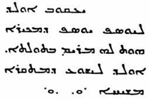

<title>Руслан Хазарзар. Сын Человеческий. Глава вторая</title>

<h2>2. Евангелие от Матфея</h2>

Относительно Евангелия от Матфея следует отметить, что Евсевий Кесарийский<a
href="#_ftn1" name="_ftnref1">[1]</a> воспроизводит следующее свидетельство
Папия (&#928;&#945;&#960;&#943;&#945;&#962;)
Гиерапольского, ревностно собиравшего в первой половине второго века изустные
сказания церковных старейшин об апостолах и Иисусе: «Матфей на еврейском
диалекте (&#956;&#8050;&#957; &#959;&#8022;&#957;
&#7961;&#946;&#961;&#945;&#8147;&#948;&#953;
&#948;&#953;&#945;&#955;&#941;&#954;&#964;&#8179;)<a href="#_ftn2"
name="_ftnref2">[2]</a> изречения [Господни] записал, переводил (&#7969;&#961;&#956;&#942;&#957;&#949;&#965;&#963;&#949;&#957;)
же их кто как мог» (<i>Eus.</i>HE.III.39:16). То, что Матфей написал Евангелие
«на еврейском диалекте», т.&nbsp;е., по всей вероятности, на тогдашнем
арамейском языке, подтверждают и позднейшие учителя Церкви
(<i>Iren.</i>Haer.III.1:2[1:1]), поясняя, что он это сделал в интересах
палестинских христиан; а Евсевий добавляет, что Матфей сделал это тогда, когда
собирался уходить от евреев к другим народам (<i>Eus.</i>HE.III.24:6): «Матфей
первоначально проповедовал евреям; собравшись же и к другим народам, вручил им
свое Евангелие; отзываемый от них, он оставил им взамен себя свое Писание». По
этому поводу Иероним отмечает (<i>Hier.</i>Matth.12:13), что неведомо, кем это
«еврейское» Евангелие было переведено на греческий язык<a href="#_ftn3"
name="_ftnref3">[3]</a>; т.&nbsp;е. под сочинением, которое Папий приписывал
Матфею, все разумели оригинал ныне известного Евангелия от Матфея и считали,
что это есть греческий перевод, неизвестно кем сделанный.

Странным представляется здесь то, что Папий в цитированной фразе упоминает
лишь об «изречениях» (логиях), записанных апостолом Матфеем<a href="#_ftn4"
name="_ftnref4">[4]</a>, и ничего не говорит о жизнеописании Иисуса. Именно это
мешает мне отождествлять «еврейское» Евангелие от Матфея с Евангелием Евреев
или с Евангелием Эбионитов<a href="#_ftn5" name="_ftnref5">[5]</a>. Папий также
удостоверяет только о том, что апостол написал «еврейское» Евангелие, и ничего
не говорит о том, что известное ныне греческое Евангелие от Матфея есть перевод
«еврейского» Евангелия; заявление Папия, что это, «еврейское», Евангелие всякий
переводил (толковал), «кто как мог», вероятно, означает, что эти переводы
отличались друг от друга. И поэтому мы имеем полное основание признаться, что
вообще никто не знает, представляет ли наше Евангелие от Матфея перевод с
арамейского. С другой стороны, филологический анализ современного Евангелия от
Матфея с помощью новейших методов показывает, что первоначально оно было
написано на койнэ<a href="#_ftn6" name="_ftnref6">[6]</a>, а не является
переводом.

Доказательством неапостольского происхождения первого Евангелия является
также и свойственное ему изобилие длинных бесед: Иисус в нем говорит за один
присест все то, что Он, вероятно, высказывал в разное время и по разным
поводам, о чем и свидетельствуют некоторые фрагменты из Евангелий от Луки и от
Марка. Очевидно, Нагорная проповедь (Мф.5–7), напутственное слово (Мф.10),
антифарисейская речь (Мф.23) содержат в себе элементы, которые первоначально не
были высказаны в данной связи и которые отнесены сюда евангелистом ввиду их
родственного содержания. Также и семь притч (Мф.13), вероятно, были им
соединены вместе как таковые, а не были рассказаны Иисусом сразу. Мало того,
автор первого Евангелия удвоил число действующих лиц и происшествий. Например,
он говорит о двух слепых (Мф.9:27-31; 20:30-34), тогда как остальные синоптики
говорят лишь об одном (Мк.10:46-52; Лк.18:35-43). При сравнении новозаветных
произведений нетрудно найти и другие примеры. По-видимому, автор первого
Евангелия принимал в двух лежавших перед ним источниках один и тот же эпизод,
рассказанный по-разному, за различные события и в таком виде включал их в свое
сочинение. Так, разумеется, мог ошибаться лишь человек, не бывший очевидцем
сообщаемых им фактов. Первый евангелист, кроме того, утрированно понял слова из
Книги пророка Захарии (Зах.9:9) и рассказывает (Мф.21:7), что Иисус въезжал в
Иерусалим на двух животных — ослице и осленке — одновременно.

Трудно представить, что такие ошибки мог
допустить апостол из числа Двенадцати, и, видимо, следует согласиться с тем,
что происхождение первого канонического Евангелия — неапостольское. Поэтому,
чтобы различать апостола Матфея и автора одноименного Евангелия, последнего я
буду именовать <i>Примусом</i> (от лат. primus — <i>первый</i>).

Что касается писательской деятельности Матфея, то его Евангелие не
сохранилось (входило ли в это Благовествование жизнеописание Иисуса? — вопрос
отдельный). Во всяком случае, Матфеева арамейская запись изречений Иисуса до
нас, к сожалению, не дошла. Быть может, последняя работа над редакцией логиев
состоялась в одной из областей северо-восточной Палестины (Гавлонитида, Хоран,
Батанея), куда в эпоху римских войн бежало множество христиан и где, согласно
традиции (<i>Eus.</i>HE.I.7:14), во втором веке еще можно было найти
родственников Иисуса<a href="#_ftn7" name="_ftnref7">[7]</a>, а потом логии
были переведены на греческий. Во всяком случае, есть веские причины полагать,
что основная часть Нагорной проповеди восходит непосредственно к арамейским
логиям, т.&nbsp;е. Примус при составлении своего Евангелия имел перед собой
<b>Q</b>-logia.

Примус, вероятно, был евреем диаспоры<a href="#_ftn8"
name="_ftnref8">[8]</a>, для которого Танах оставался альфой и омегой любой
истины. Евангелие от Матфея явственно несет в себе иудейско-национальную
печать: Примус считает Иерусалим «святым городом» (Мф.4:5), а Храм —
«священным» местом (Мф.23:17); никто точнее Примуса не указывает, как относился
Иисус к Торе (Мф.5:18), к иудейским обрядам и сектам; ни в каком другом
Евангелии Иисус не именуется так часто Сыном Давидовым, как в Евангелии от
Матфея; нигде родословие (Мф.1:1-17), свидетельствующее о происхождении Иисуса
от Давида и Авраама, не выдвигается в такой высокой степени на первый план, как
у Примуса; нигде Иисус так сильно не подчеркивает то, что Он пришел не для
нарушения, а для исполнения Закона (Мф.5:17); в напутственном слове, сказанном
при первом отправлении Двенадцати, Иисус запрещает им обращаться к язычникам и
самаритянам (Мф.10:5); в Нагорной проповеди Он наказывает ученикам не давать
святыни собакам и не метать бисер перед свиньями (Мф.7:6, церк.-слав. текст),
обещает вернуться вторично, прежде чем они успеют обойти все города израильские
(Мф.10:23).

Впрочем, в других местах текста того же Евангелия Иисус грозится наказанием
иудеев за их неверие и призванием язычников в места их жительства (Мф.8:11;
21:43); заявляет, что придет вторично тогда, когда благая весть успеет обойти
все народы ойкумены (Мф.24:14), и наказывает апостолам принимать в свою общину
путем простого крещения (Мф.28:19). Такое же противоречие можно обнаружить и в
других рассказах — о капернаумском сотнике (Мф.8:5-10) и о женщине-ханаанеянке
(Мф.15:21-28): в первом случае Иисус дарует помощь язычнику сразу же, а в
другом — долго отказывается помочь язычнице, утверждая, что Он «послан только к
погибшим овцам дома Израилева», и наконец нисходит к ее просьбе в виде
исключения. В данном случае явственно различаются следы двух последовательных
этапов в стадии развития христианства: изречения и рассказы одной категории
были записаны в ту эпоху, когда в общине еще противились привлечению язычников,
а изречения и рассказы другой категории записаны были позднее, когда идея и
деятельность апостола Павла — паулизм — уже начали оказывать влияние и
посвящение язычников в христианство признавалось делом, соответствующим планам
и намерениям Иисуса.

То, что последняя переработка Евангелия от
Матфея совершилась в сравнительно позднюю эпоху и в неиудейских кругах,
убеждает наказ о крещении (Мф.28:19), в котором полная формула крещения во имя
Отца, Сына и святого духа является прообразом константинопольского догмата о
Триединстве Бога, тогда как в Деяниях апостолов указано крестить просто лишь во
имя Иисуса (Деян.2:38)<a href="#_ftn9" name="_ftnref9">[9]</a>. Сомнительные
рассказы о самоубийстве Иуды (Мф.27:3-10; ср. Деян.1:16-19), о жене Пилата
(Мф.27:19), о землетрясении и воскресении «святых» (Мф.27:51-53), о страже у
могилы Иисуса (Мф.27:62-66; 28:11-15) и легенды в главах&nbsp;1&nbsp;и&nbsp;2,
неисторичность которых мы впоследствии покажем, говорят о благочестивой
интерполяции христиан последующих поколений.

Кроме того, в древней Синайско-сирийской рукописи (Sinaitic Syriac)<a
href="#_ftn10" name="_ftnref10">[10]</a> принципиально отличное чтение
стиха&nbsp;16 главы&nbsp;1 Евангелия от Матфея. В каноне: «Иаков родил Иосифа,
мужа Марии, от которой родился Иисус». А в Сирийской версии:

«Иаков родил Иосифа; Иосиф, которому
обручена была дева Мария, родил Иисуса, называемого Мессией»<a href="#_ftn11"
name="_ftnref11">[11]</a>. Вероятно, здесь сохранился древний вариант,
относящийся к началу II&nbsp;века, когда еще не установился догмат о непорочном
зачатии. Первым христианским общинам — иудеохристианам — было чуждо такое
языческое представление о взаимоотношениях Бога с женщиной.

Относительно места создания Евангелия от Матфея нет единой точки зрения.
Чаще всего в качестве таковых называют Антиохию, Эдессу, Апомею и даже
Александрию.

Исключая интерполяции, Евангелие от Матфея, по-видимому, было создано в
период между 81 и 94 годами. Ввиду того, что в Евангелии есть намек о гонениях
на христиан (Мф.10:18), время его написания можно отнести к периоду правления
императора Домициана (81–96)<a href="#_ftn12" name="_ftnref12">[12]</a>. Так,
Дион Кассий пишет: «Домициан убил в числе многих других консула Флавия
Клемента, хотя Клемент был его собственным двоюродным братом и был женат на
Флавии Домитилле, тоже его родственнице. Против них обоих было выдвинуто
обвинение в безбожии (&#7956;&#947;&#954;&#955;&#951;&#956;&#945;
&#7936;&#952;&#949;&#972;&#964;&#951;&#964;&#959;&#962;), по которому
были осуждены многие другие, склонявшиеся к иудейским обрядам (&#7940;&#955;&#955;&#959;&#953; &#7952;&#962; &#964;&#8048;
&#964;&#8182;&#957; &#7992;&#959;&#965;&#948;&#945;&#943;&#969;&#957;
&#7972;&#952;&#951; &#7952;&#958;&#959;&#954;&#941;&#955;&#955;&#959;&#957;&#964;&#949;&#962;
&#960;&#959;&#955;&#955;&#959;&#943;)» (<i>Dio Cass.</i>LXVII.14)<a
href="#_ftn13" name="_ftnref13">[13]</a>. Под иудейскими обрядами здесь,
вероятно, подразумевается христианство, ибо в глазах языческого историка оно
было всего лишь иудейской сектой<a href="#_ftn14" name="_ftnref14">[14]</a>.
Кроме того, Тертуллиан по этому поводу сообщает, что Домициан «восставал против
христиан, но [...] вскоре остановился и вернул даже из заточения тех, которых
прежде изгнал» (<i>Tert.</i>Apol.5:4)<a href="#_ftn15"
name="_ftnref15">[15]</a>. Наконец, кладбище на Ардеатинской дороге, получившее
название по имени жены Клемента — Флавии Домитиллы, — расположено рядом с
древним христианским кладбищем<a href="#_ftn16" name="_ftnref16">[16]</a>.
Евангелие от Матфея, по всей вероятности, возникло раньше, нежели Евангелие от
Луки<a href="#_ftn17" name="_ftnref17">[17]</a>, и поэтому было написано
до&nbsp;95&nbsp;года.

&nbsp;

<a href="#_ftnref1" name="_ftn1">[1]</a> См. <b><a
href="75">Приложении&nbsp;2</a></b>.

<a href="#_ftnref2" name="_ftn2">[2]</a> Ср.: &#924;&#945;&#964;&#952;&#945;&#8150;&#959;&#962;
&#7961;&#946;&#961;&#945;&#970;&#954;&#959;&#8150;&#962;
&#947;&#961;&#940;&#956;&#956;&#945;&#963;&#953;
&#947;&#961;&#940;&#966;&#949;&#953; &#964;&#8056;
&#949;&#8016;&#945;&#947;&#947;&#941;&#955;&#953;&#959;&#957;
(<i>Epiph.</i>Haer.LI.5).

<a href="#_ftnref3" name="_ftn3">[3]</a> «Matthaeus qui et Levi, ex
publicano apostolus, primus in Judaea, propter eos qui ex circumcisione
crediderunt, Evangelium Christi Hebraeis litteris verbisque composuit; quod
quis postea in Greacum transtulerit, non satis certem est» (<i>Hier.</i>De
viris ill.3).

<a href="#_ftnref4" name="_ftn4">[4]</a> Возможно, «еврейское»
Евангелие от Матфея и является тем источником <b>Q</b>-logia, о котором шла
речь в <a href="01">§&nbsp;1</a>.

<a href="#_ftnref5" name="_ftn5">[5]</a> «In Evangelio, quo utuntur
Nazaraeni et Ebionitae, quod nuper in Graecum de Hebraeo sermone transtulimus,
et quod vocatur a plerisque Matthaei authenticum&nbsp;[...]». — «В Евангелии,
которым пользуются назареяне и эбиониты, которое мы недавно перевели с
еврейского на греческий и которое многими называется подлинным [Евангелием]
Матфея&nbsp;[...]» (<i>Hier.</i>Matth.12:13).

<a href="#_ftnref6" name="_ftn6">[6]</a> См. <b><a
href="74.pdf">Приложение&nbsp;1</a></b>.

<a href="#_ftnref7" name="_ftn7">[7]</a> Родственников Иисуса
именовали греческим словом &#948;&#949;&#963;&#960;&#972;&#963;&#965;&#957;&#959;&#953; —
<i>принадлежащие господину</i> (<i>Eus.</i>HE.I.7:14).

<a href="#_ftnref8" name="_ftn8">[8]</a> &#916;&#953;&#945;&#963;&#960;&#959;&#961;&#940; —
<i>рассеяние</i>, поселение евреев вне Палестины; от &#948;&#953;&#945;&#963;&#960;&#949;&#943;&#961;&#969; —
<i>рассеиваю</i>, <i>распространяю</i>.

<a href="#_ftnref9" name="_ftn9">[9]</a> Эти две формулы крещения —
тринитарную (&#949;&#7984;&#962; &#964;&#8056;
&#8004;&#957;&#959;&#956;&#945; &#964;&#959;&#8166;
&#960;&#945;&#964;&#961;&#8056;&#962; &#954;&#945;&#8054; &#964;&#959;&#8166;
&#965;&#7985;&#959;&#8166; &#954;&#945;&#8054; &#964;&#959;&#8166;
&#7937;&#947;&#943;&#959;&#965;
&#960;&#957;&#949;&#973;&#956;&#945;&#964;&#959;&#962;) и одиночную
(&#7952;&#960;&#8054; &#964;&#8183;
&#8000;&#957;&#972;&#956;&#945;&#964;&#953; &#7992;&#951;&#963;&#959;&#8166;
&#935;&#961;&#953;&#963;&#964;&#959;&#8166;) — знает последний
компилятор Дидахэ&nbsp;(7:1). В языко-христианских общинах крестили, пользуясь
тринитарной формулой (Мф.28:19), в иудео-христианских — только во имя Иисуса
Христа (Дидахэ.9:5; ср.&nbsp;<i>Just.</i>Apol.I.61; Dial.39;
<i>Tert.</i>Bapt.13:3; Adversus Praxean.26:9). Евсевий знает другой вариант
логия Мф.28:19: &#960;&#959;&#961;&#949;&#965;&#952;&#941;&#957;&#964;&#949;&#962;
&#956;&#945;&#952;&#951;&#964;&#949;&#973;&#963;&#945;&#964;&#949;
&#960;&#940;&#957;&#964;&#945; &#964;&#8048; &#7956;&#952;&#957;&#951;
&#7952;&#957; &#964;&#8183; &#8000;&#957;&#972;&#956;&#945;&#964;&#943;
&#956;&#959;&#965;. — «Идите, научите все народы во имя Мое»
(<i>Eus.</i>HE.III.5:2).

<a href="#_ftnref10" name="_ftn10">[10]</a> <i>The Old Syriac
Gospels, or, Evangelion da-Mepharresh&ecirc;</i>: being the text of the Sinai
or Syro-Antiochene Palimpsest, including the latest additions and emendations,
with the variants of the Curetonian text, corroborations from many other MSS,
and a list of quotations from ancient authors, ed. A.&nbsp;S.&nbsp;Lewis.
London: Williams and Norgate, 1910. P.&nbsp;2 (в этом же издании представлена
<a href="../books/sys_mt" target=_blank>фотокопия fol.&nbsp;82b</a>);
<i>Evangelion da-Mepharresh&ecirc;. The Curetonian Version of the Four Gospels,
with the Readings of the Sinai Palimpsest and the early Syrian Patristic
Evidence</i>. Ed. F.&nbsp;C.&nbsp;Burkitt, vol.&nbsp;1. Cambridge: Cambridge
University Press, 1904. P.&nbsp;4–5. Рукопись датируется IV веком, но сам текст
восходит ко&nbsp;II&nbsp;веку.

<a href="#_ftnref11" name="_ftn11">[11]</a> Близкое, хотя и не такое
конкретное чтение мы находим и в других версия: в Сирийской Curetonian
(<i>Evangelion da-Mepharresh&ecirc;. The Curetonian Version of the Four
Gospels, with the Readings of the Sinai Palimpsest and the early Syrian
Patristic Evidence</i>. Ed. F.&nbsp;C.&nbsp;Burkitt. 2&nbsp;vols. Cambridge:
Cambridge University Press, 1904. See vol.&nbsp;1, p.&nbsp;4) и в Коптских
Middle Egyptian (<i>Das Matth&auml;us-Evangelium im muttel&auml;gyptischen
Dialekt des Koptischen (Codex Scheide)</i>. Hrsg. H.-M. Schenke. Berlin:
Akademie-Verlag, 1981) и Bohairic (<i>The Coptic Version of the New Testament
in the Northern Dialect otherwise called Memphitic and Bohairic</i>. Ed.
G.&nbsp;Horner. 4&nbsp;vols. Oxford: Clarendon Press, 1898–1905. See
vol.&nbsp;1, p.&nbsp;5).

<a href="#_ftnref12" name="_ftn12">[12]</a> У высших должностных лиц
указываются не даты рождения и смерти, а даты, в период которых они занимали
данную должность.

<a href="#_ftnref13" name="_ftn13">[13]</a> См. также у Светония:
«Denique Flavium Clementem patruelem suum contemptissimae inertiae, cuius
filios etiam tum parvulos successores palam destinaverat abolito[que] priore
nomine alterum Vespasianum appellari, alterum Domitianum, repente ex tenuissima
suspicione tantum non in ipso eius consulatu interemit»
(<i>Suet.</i>Domitianus.15).

<a href="#_ftnref14" name="_ftn14">[14]</a> Iudaicam viverent vitam
(<i>Suet.</i>Domitianus.12); &#7992;&#959;&#965;&#948;&#945;&#970;&#954;&#8056;&#962;
&#946;&#943;&#959;&#962; (<i>Dio Cass.</i>LXVIII.1).

<a href="#_ftnref15" name="_ftn15">[15]</a> Гонения Домициана на
христиан подтверждают Мелитон (<i>Eus.</i>HE.IV.26:9), Гегезипп
(<i>Eus.</i>HE.III.20:7) и Евсевий (<i>Eus.</i>HE.III.17–20). Можно не
сомневаться, что слова Климента Римского: «&#916;&#953;&#8048; &#964;&#8048;&#962;
&#945;&#7984;&#966;&#957;&#953;&#948;&#943;&#959;&#965;&#962;
&#954;&#945;&#8054; &#7952;&#960;&#945;&#955;&#955;&#942;&#955;&#959;&#965;&#962;
&#947;&#949;&#957;&#959;&#956;&#941;&#957;&#945;&#962; &#7969;&#956;&#8150;&#957;
&#963;&#965;&#956;&#966;&#959;&#961;&#8048;&#962; &#954;&#945;&#8054;
&#960;&#949;&#961;&#953;&#960;&#964;&#974;&#963;&#949;&#953;&#962;»
(<i>Clem.</i>Ad Corinthios&nbsp;I.1), — относятся именно к Домициановым
гонениям (ср.&nbsp;<i>Herm.</i>Vis.2:3; 4:3).

<a href="#_ftnref16" name="_ftn16">[16]</a> Renan&nbsp;E.
<i>Histoire des Origines du Christianisme</i>. Livre cinqui&egrave;me: <i>Les
&Eacute;vangiles et la seconde g&eacute;n&eacute;ration chr&eacute;tienne</i>.
Paris: Calmann L&eacute;vy, 1877. P.&nbsp;342–343.

<a href="#_ftnref17" name="_ftn17">[17]</a> См. <a
href="04">§&nbsp;4</a>.

<a href="index">Оглавление</a> <a href="03">Далее</a>

