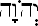

<title>Руслан Хазарзар. Сын Человеческий. Глава восьмая</title>

<h2>8. Культ Яхве</h2>

Согласно Библии, израильтянами называются потомки Иакова (Быт.32:28).
Именами его сыновей (Быт.35:23-26; 49:2-28) названы двенадцать колен
Израиля.

В период с 1500 по 1200 гг. до н.&nbsp;э. в странах Западной Азии широко
проявлялись монотеистические тенденции. Израильтяне в Египте поклонялись
египетским богам (Нав.24:14), а корни монотеизма у них могли возникнуть под
влиянием реформ фараона Аменхотепа&nbsp;IV (Эхнатона) (ок.&nbsp;1419 –
ок.&nbsp;1400&nbsp;гг. до н.&nbsp;э.), предвестника монотеизма и создателя
религии бога Атона<a href="#_ftn1" name="_ftnref1">[1]</a>.

Многие ученые предполагают, что Яхве (Иегова) был богом войны у мадианитян
(Исх.2:15 и&nbsp;след.). Кроме того, религиозный культ израильтян впитал в себя
элементы египетского культа змея (4&nbsp;Цар.18:4; ср.&nbsp;Чис.21:8-9).

Известно, что левиты играли исключительную роль в жизни израильтян. Хотя при
разделе Палестины (Втор.3:12 и&nbsp;след.) Левиево колено не получило земли
(двенадцатая часть земли Палестины была отдана Махиру, сыну Манассии и внуку
Иосифа), но зато оно было освобождено от материальных забот, ибо собирало
десятину на свое содержание (Чис.18:21-32).

Имя <i>Левий</i>, или, точнее, <i>Лев&uacute;</i> (&nbsp;&#1500;&#1461;&#1493;&#1460;&#1497;&nbsp;),
произошло, быть может, от древнееврейского слова, обозначающего <i>змей</i>.
Левиты, по-видимому, в Египте были почитателями бога змея и неохотно
расставались со своим культом<a href="#_ftn2" name="_ftnref2">[2]</a>.
Впоследствии в культ Яхве были вплетены доктрины месопотамских<a href="#_ftn3"
name="_ftnref3">[3]</a> и ханаанских культов.

&nbsp;

&nbsp;

Ковчег завета (реконструкция)

&nbsp;

Святилища евреев в первое время носили характер фетишизма. Например, ковчег
(кивот) завета — <i>ар&oacute;н hаб-р&uacute;т</i> (&#1488;&#1458;&#1512;&#1493;&#1465;&#1503;&#1470;&#1492;&#1463;&#1489;&#1468;&#1456;&#1512;&#1460;&#1497;&#1514;) — являлся местом пребывания Яхве,
приносящего победу и богатство (Исх.25:10-22; 37:1-9; Чис.10:33-36; Иер.3:16).
Этот небольшой ящик (1&nbsp;<i>м</i>&nbsp;х&nbsp;0,6&nbsp;<i>м</i>&nbsp;х&nbsp;0,6&nbsp;<i>м</i>)
из дерева <i>шитт&uacute;м</i> (&#1513;&#1473;&#1460;&#1496;&#1468;&#1460;&#1497;&#1501;) был внутри и снаружи обложен
золотом. На золотой крышке — <i>капп&oacute;рет</i>
(&#1511;&#1463;&#1508;&#1468;&#1512;&#1462;&#1514;) — находились два <i>каруба</i><a
href="#_ftn4" name="_ftnref4">[4]</a> со склоненными друг к другу лицами
и соприкасающимися крыльями (Исх.25:34; 30:6; 31:7; 35:4-12). Эти карубы были
похожи на вавилонских <i>карибу</i> — духов-хранителей храмов и дворцов,
изображавшихся в виде полулюдей-полуживотных. Также, согласно библейским
описаниям и восточной иконописи, карубы были подобны крылатым сфинксам.
Переносной ковчег завета, снабженный с обеих сторон ушками, чтобы пропускать
через них жерди, обнимал весь религиозный инвентарь израильтян; в нем были
собраны все предметы, священные для евреев, их святыни и, наконец, скрижали
завета<a href="#_ftn5" name="_ftnref5">[5]</a>, а впоследствии —
<i>Книга</i> (1&nbsp;Цар.10:25) — всегда открытый журнал племени (Исх.25:16;
40:20; Чис.3:30-31; 4:4-6,15; 17:10; Втор.10:5,8; 31:26). Ныне местонахождение
ковчега завета представляет великую тайну и настоящий кладезь для ученых и
любителей.

В тот период еврейской истории боги отдельных
местностей были мало индивидуализированы и часто носили общее название. Так, у
израильтян и финикиян многие боги назывались <i>Эль</i> (&nbsp;&#1488;&#1461;&#1500;&nbsp;) (Быт.17:1),
<i>Эл&oacute;аh</i> (&nbsp;&#1488;&#1457;&#1500;&#64331;&#1492;&#1468;&#1463;&nbsp;) (Иов.3:4), <i>Элаh&aacute;</i> (&nbsp;&#1488;&#1457;&#1500;&#1464;&#1492;&#1464;&#1488;&nbsp;) (1&nbsp;Езд.4:24)<a href="#_ftn6" name="_ftnref6">[6]</a>,
а другие назывались <i>Б&aacute;аль</i>
(&nbsp;&#1489;&#1468;&#1463;&#1506;&#1463;&#1500;&nbsp;)<a href="#_ftn7" name="_ftnref7">[7]</a>
(3&nbsp;Цар.19:18). Однако, несмотря на общие названия, все эти Эли и Баали
были вполне различными единицами. Для их отличия часто ограничивались
прибавлением названия места, где оказывалось почитание соответствующему богу
(Исх.14:2). Бог колена Иуды именовался Яхве (Иегова).

В еврейском тексте Танаха личное имя Бога встречается свыше 6800&nbsp;раз.
Согласно Библии, когда Бог говорил с Моисеем и поручил ему вывести народ
Израиля из Египта, Моисей задал логичный вопрос: «Вот, я приду к сынам
Израилевым и скажу им: “Бог отцов ваших послал меня к вам”. А они скажут: “как
Ему имя?” Что сказать мне им?» (Исх.3:13). Бог тогда ответил Моисею: «Так скажи
сынам Израилевым: Господь (&nbsp;&#1497;&#1492;&#1493;&#1492;&nbsp;)&nbsp;[...].
Вот имя Мое на веки&nbsp;[...]» (Исх.3:15). Личное имя Бога, состоящее из
четырех еврейских букв (Тетраграмматон), передано в Синодальном переводе
титулом <i>Господь</i>. Однако в переводе архимандрита Макария пятнадцатый стих
третьей главы книги Исход записан иначе: «Так скажи сынам Израилевым:
Иегова&nbsp;[...]. Вот имя Мое на веки&nbsp;[...]». В данном случае Макарий
передает Тетраграмматон так же, как его огласовали в Средние века масореты:
через <i>ш’ва</i>, <i>холам</i> и <i>камац гадоль</i> — по аналогии с еврейским
словом <i>Адо-н&aacute;й</i> (&nbsp;&#1488;&#1458;&#1491;&#1504;&#1464;&#1497;&nbsp;) — <i>Господь мой</i>&nbsp;), в котором
<i>&aacute;леп</i> огласуется не через
<i>ш’ва</i>, а через <i>хатап паттах</i>, ибо этот согласный — гортанный.

С одной стороны, из третьей заповеди Декалога (Исх.20:7; Втор.5:11) вроде бы
вытекает запрещение произносить имя Бога: «Не произноси имени Иеговы, Бога
твоего, напрасно» (перевод архимандрита Макария). С другой стороны, в
библейские времена, по-видимому, не считалось предосудительным произносить это
имя в обиходной речи. Обыкновение у евреев прибавлять <i>йа</i>[<i>h</i>] и
<i>й&aacute;hу</i> к личным именам даже
после вавилонского плена указывает на то, что произношение Тетраграмматона не
было запрещено. Действительно, в VIII&nbsp;веке до&nbsp;н.&nbsp;э. пророк
Й’ша<b>йаhу</b> (Исаия) писал: «Славьте Господа (&nbsp;&#1497;&#1492;&#1493;&#1492;&nbsp;),
призывайте имя Его» (Ис.12:4). Составители Торы в&nbsp;VII&nbsp;веке
до&nbsp;н.&nbsp;э. тоже не видели ничего предосудительного в том, что патриарх
называет «неизреченное Имя» (Быт.12:8). То же самое мы наблюдаем в период между
VI&nbsp;и&nbsp;IV&nbsp;веками до&nbsp;н.&nbsp;э. (Соф.3:9; Руф.2:4; Пс.78:6;
104:1). Однако в ранний период раввинов произношение Тетраграмматона
допускалось только при служении в Храме: «В святилище Имя произносилось так,
как пишется; но вне святилища заменяли другим» (Мишна. Сота.7:6;
ср.&nbsp;Мишна. Йома.6:2). По всей вероятности, произношение имени Бога было
запрещено и в Кумранской общине, как о том говорится в Уставе общины
(1Q&nbsp;S.VI.27 et sqq.). Относительно дальнейшего развития в тот период
следует отметить, что во время служения в синагогах вместо Тетраграмматона
произносили титул <i>Адонай</i>. Впрочем, раввины время от времени — один-два
раза в каждые семь лет — передавали своим ученикам первоначальное произношение
Божиего имени (Вав Талм.Киддушин.71<i>а</i>; ср.&nbsp;Ин.17:6), но со временем
и этот обычай утратился. В результате было решено, что «кто отчетливо
произносит Имя, тот повинен в смертельном грехе» (Песикта.148<i>а</i>;
см.&nbsp;также Вав Талм.Абода Зара.17<i>б</i>-18<i>а</i>). Именно потому, что,
согласно Талмуду, в наступающий райский мир не будет принят тот, «кто
произносит Имя соответственно его буквам (&#1492;&#1492;&#1493;&#1490;&#1492;&nbsp;&#1488;&#1514;&nbsp;&#1492;&#1513;&#1501;&nbsp;&#1489;&#1488;&#1493;&#1514;&#1493;&#1514;&#1497;&#1493;)» (Мишна. Санhедрин.10:1), евреи в поздний
период не только заменяли произношение Имени на титул(ы), но и зачастую в
постбиблейской литературе избегали написания самого Тетраграмматона.

В Средние века масореты на Тетраграмматон перенесли диакритические знаки
слова <i>Адонай</i> &#151; , в результате чего получилось никогда не
существовавшее в действительности слово <i>Й’hо-в&aacute;</i><a href="#_ftn8"
name="_ftnref8">[8]</a> (<i>Иег&oacute;ва</i> в традиционной русском написании и
произношении). Действительно, поскольку согласный звук <i>вав</i> после гласных
<i>холам</i> и <i>шурук</i> обычно не произносится (как это видно из личного
имени Основателя: &#1497;&#1461;&#1513;&#1473;&#1493;&#1468;&#1506;&#1463; — <i>Йэ-ш&yacute;а</i>),
произношение <i>Й’hова</i> является ошибочным. За этим переносом диакритических
знаков стоит особая раввинистическая традиция «Qere et Ketib», означающая, что
вместо формы в тексте — Ketib (&#1499;&#1468;&#1456;&#1514;&#1460;&#1497;&#1489; — <i>написание</i>) — следует читать
другое слово или слова — Qere (&#1511;&#1456;&#1512;&#1461;&#1497;, или &#1511;&#1456;&#1512;&#1460;&#1497; — <i>произношение</i>). В данном случае мы имеем дело с
т.&nbsp;н. Qere perpetuum (постоянное чтение), когда написанное слово (Ketib)
вокализируется огласовками того слова, которое следует читать (Qere), а именно
диакритическими знаками слова <i>Адонай</i>, которое и следует читать. В том
случае, когда в написании Тетраграмматон следует за словом <i>Адонай</i>, он
огласуется как &#1497;&#1457;&#1492;&#1493;&#1465;&#1460;&#1492; — в соответствии с диакритическими знаками
слова <i>Элоhим</i>, которое и следует читать. Вполне возможно, что двоеточие
перед Тетраграмматоном в кумранской рукописи 4Q&nbsp;364
(4Q&nbsp;RPb) — это форма Qere, показывающая, что Тетраграмматон
следует читать иначе или вовсе не читать.

Остается вопрос, почему при переносе диакритических знаков со слова
<i>Адонай</i> на Тетраграмматон первый согласный &#151; <i>ш&#146;ва</i>, а не
<i>хатап паттах</i>? Дело в том, что написание 
могло вызвать негативные помыслы, ибо побуквенное прочтение этого слова &#151;
Y&#462;h&#333;v&#257;h &#151; напоминает еврейское выражение  (Y&#257;h h&#333;v&#257;h), буквально означающее
&#171;О! беда&#187; (Ис.47:11; Иез.7:26), или, что еще кощунственнее,
&#171;Яh[ве] беда&#187;. Вот поэтому Тетраграмматон на письме и огласуется как
&nbsp;, а не как &nbsp;.

Впрочем, согласно Biblia Hebraica Stuttgartensia (BHS), в тексте встречаются
разные виды Qere et Ketib в отношении Тетраграмматона (я указал только самые
распространенные). Так, в BHS в 3&nbsp;Цар.2:26 (Regum&nbsp;I.2:26) рядом со
словом <i>Адонай</i> стоит слово &nbsp;, которое
следует читать как <i>Элоhим</i>. И здесь под <i>йодом</i> стоит
<i>ш&#146;ва</i>, а не <i>хатап</i>. И наоборот, в T&#601;hill&icirc;m.144:15 =
Пс.143:15 значится слово &nbsp;, которое следует
читать как <i>Адонай</i>. И здесь под <i>йодом</i> стоит <i>хатап</i>, а не
<i>ш&#146;ва</i>.

Таким образом, неизвестно, как именно произносился в древности
Тетраграмматон, однако в русскоязычной научной литературе укоренилось написание
<i>Яхве</i>, которому буду следовать и я.

Впрочем, я думаю, и с произношением Тетраграмматона как <i>Яхве</i> есть
проблемы. С одной стороны, корень &#1497;&#1492;&#1493; нам неизвестен, а
значит, имя Бога строится от глагольного корня &#1492;&#1493;&#1492; (<i>быть</i>), а
префикс &#1497; указывает на
глагольную форму будущего времени третьего лица. Современное построение &#1497;&#1462;&#1492;&#1456;&#1493;&#1462;&#1492; (<i>он&nbsp;будет</i>) связано с известными трудностями: мало
вероятно, что в древности второй согласный — <i>гортанный</i> &#1492; — был способен закрывать безударный
слог с кратким гласным (этот согласный требовал <i>хатап паттах</i>, а не
<i>ш’ва</i>). То же самое можно сказать про формы &#1497;&#1463;&#1492;&#1456;&#1493;&#1460;&#1492; (<i>Йаh-в&uacute;</i>) и
&#1497;&#1463;&#1492;&#1456;&#1493;&#1461;&#1492; (<i>Йаh-в<b>э</b></i>). С другой стороны, по греческим
транскрипциям еврейских имен, в которых участвовали буквы Тетраграмматона
(например, <b>Й’hо</b>шуа, <b>Й’hо</b>ханан, Элий<b>йаhу</b>,
Маттит<b>йаhу</b>), мы устанавливаем, что первый гласный в имени Бога — [a];
причем, ввиду того, что в трехсложных и более словах этот гласный в начале
слова редуцируется в <i>ш’ва</i>, мы узнаем, что этот гласный — долгий, то есть
<i>камац гадоль</i>. Если первый слог закрывается буквой &#1492;, то он при долгом гласном требует
ударения, а это означает, что второй <i>безударный</i> слог, во-первых, требует
краткого гласного, а во-вторых, требует <i>произношения</i> четвертой согласной
буквы (&nbsp;&#1492;&nbsp;):
<i>Й&aacute;h-вэh</i> (&nbsp;&#1497;&#1464;&#1492;&#1456;&#1493;&#1462;&#1492;&nbsp;). Вообще, из транскрипций еврейских имен, в которых
участвовали буквы &#1497;&#1492;&#1493;, мы узнаем, что эти буквы читались как <i>йаhу</i> или
<i>йаhо</i>. При присоединении к этим трем буквам четвертой &#1492; первый слог не обязательно должен
закрываться и <i>шурук</i> или <i>холам</i> переходить в <i>вав</i>; вполне
можно предположить, что первый слог в данном случае остается открытым.
Действительно, еще Ириней записывал имя Бога как &#921;&#913;&#937;
(<i>Иао</i>) (<i>Iren.</i>Haer.I.1:7[4:1]; 1:14[21:3])<a href="#_ftn9"
name="_ftnref9">[9]</a>, что могло соответствовать еврейскому &#1497;&#1464;&#1492;&#1493;&#1465;&#1492;&#1463; (гортанные в греческом написании, как правило, опускались, и
опускался обязательный краткий <i>паттах</i> после долгих гласных &#64309;,
&#59393; и перед гортанными &#1492;, &#1495;, &#1506; в конце слова, как это видно из
греческой транскрипции семитского имени <i>Йэшуа</i>: &#1497;&#1461;&#1513;&#1473;&#1493;&#1468;&#1506;&#1463;&nbsp;®&nbsp;&#7992;&#951;&#963;&#959;&#8166;&#962;); впрочем,
&#921;&#913;&#937; в написании Иринея могло означать аббревиатуру: «Иегова =
&#913; (Альфа) и &#937; (Омега)», то есть «Первый и Последний». Как бы то ни
было, если мы откажемся от построения по глагольным шаблонам, а обратимся к
греческим транскрипциям и фонетическим основам еврейского языка, то в древности
чтение Тетраграмматона как &#1497;&#1464;&#1492;&#1493;&#1468;&#1492;&#1463; (<i>Йа-h&yacute;аh</i>)
или &#1497;&#1464;&#1492;&#1493;&#1465;&#1492;&#1463; (<i>Йа-h&oacute;аh</i>)
вполне могло иметь место. Единственное, что здесь может смущать, это отсутствие
т.&nbsp;н. «матерей чтения» в палеоеврейском письме (см., напр., <i>Календарь
из Гэзера</i>, X&nbsp;век до&nbsp;н.&nbsp;э.).

Вопреки утверждению некоторых христианских конфессий (например, Свидетелей
Иеговы<a href="#_ftn10" name="_ftnref10">[10]</a>), у нас нет ни одного
доказательства, что Иисус произносил Тетраграмматон в обиходной речи и при
служении в синагогах (см., напр., Лк.4:16-19), а не заменял его
общеупотребительной в те времена формой <i>Адонай</i> (в греческих рукописях
Нового завета имя Бога везде, даже в речах Основателя, передается титулом &#954;&#973;&#961;&#953;&#959;&#962;). Во всяком случае, среди
множества обвинений в адрес Иисуса со стороны фарисеев мы не находим обвинения
в кощунственном отношении к имени Бога (Вав Талм. Санhедрин.56<i>а</i> и
т.&nbsp;д.), а значит, Основатель не произносил Тетраграмматон, заменяя титулом
<i>Адонай</i> или, по своему обыкновению, арамейским словом &#1488;&#1463;&#1489;&#1468;&#1464;&#1488; — <i>Абб&aacute;</i> (<i>Отец</i>) (Мк.14:36; Мф.6:9; 11:25-26;
26:39,42; Лк.10:21; 11:2; 22:42; etc.).

Что касается третьей заповеди Декалога: «Не произноси имени Господа
(&nbsp;&#1497;&#1492;&#1493;&#1492;&nbsp;), Бога твоего, напрасно (&nbsp;&#1500;&#1463;&#1513;&#1468;&#1473;&#1464;&#1493;&#1456;&#1488;&nbsp;)», то наречие &#1500;&#1463;&#1513;&#1468;&#1473;&#1464;&#1493;&#1456;&#1488; (<i>лаш-ш&aacute;в</i>)
может быть переведено как <i>тщетно</i>, <i>всуе</i>, <i>напрасно</i>,
<i>ложно</i>, <i>фальшиво</i>. Прежде всего эта заповедь относилась, по всей
вероятности, к клятвопреступлению (Лев.6:2-5; 19:12; Ис.48:1; Иер.5:2; 7:9;
Ос.10:4; Зах.5:4; 8:17; Мал.3:5; Мф.5:33), и ее поддерживал Иисус в первом
воззвании молитвы «Отче наш»<a href="#_ftn11" name="_ftnref11">[11]</a> и в
запрещении приносить клятвы (Мф.5:34-37).

В древних рукописях греческого перевода Танаха Тетраграмматон, вероятно, не
переводился, а вставлялся в греческий текст или палеоеврейскими буквами, или
греческими литерами &#928;&#921;&#928;&#921;<a
href="#_ftn12" name="_ftnref12">[12]</a>, которые внешне напоминают
Тетраграмматон в квадратном письме — &#1497;&#1492;&#1493;&#1492;, — как это мы можем наблюдать в рукописях 8HevXIIgr и Papyrus
Fouad&nbsp;266<a href="#_ftn13" name="_ftnref13">[13]</a>. Однако в более
поздних списках он передавался греческим титулом &#954;&#973;&#961;&#953;&#959;&#962;<a href="#_ftn14"
name="_ftnref14">[14]</a>. В Вульгате личное имя Бога также заменено титулом
dominus<a href="#_ftn15" name="_ftnref15">[15]</a>. То же самое мы наблюдаем в
Библиях — Славянской () и
Синодальной (Господь).

&nbsp;

&nbsp;

&nbsp;

Теперь вспомним о традиции Qere perpetuum. По-моему, переход от
Тетраграмматона к титулу &#171;Господь&#187; стал возможен <i>из-за
продолжительности устной традиции</i> новозаветного учения. Ученики Иисуса
изначально не списывали один свиток с другого и не записывали сразу слова и
деяния Иисуса, ибо ждали скорого Второго пришествия. И только спустя
десятилетия по одной стали появляться книги, составившие Новый завет. Причем
многие из них писались для не-евреев, которые мало что понимали в этих
&#171;премудростях&#187; о произношении-непроизношении-перепроизношении
Тетраграмматона. Как уже было сказано, у евреев было принято, чтобы подопечный
запоминал слова учителя наизусть (Mi&#353;n&#257;h.
&#702;&#461;&#7687;&ocirc;&#7791;.2:11[8]), а само заучивание и чтение
библейских книг осуществлялось вслух &#151; даже в том случае, когда рядом с
читающим никого не было (Деян.8:30). Поэтому ученики Иисуса вместо
Тетраграмматона, который уже не произносился, держали в памяти слово
<i>Адон&aacute;й</i>, т.&nbsp;е. &#171;Господь&#187;, а не &#171;Яхве&#187;.
Так в Новом завете и было записано!

И, вероятно, именно христиане, а не иудаисты, ввели т.&nbsp;н. nomina sacra
(как в Новом завете, так и в Септуагинте), ибо с какой стати последним было
как-то отмечать на письме такие слова, как <i>Христос</i>, а тем более
<i>Иисус</i>?..

Другие имена Бога, как-то: 1)&nbsp;<i>Эль</i> (&nbsp;&#1488;&#1461;&#1500;&nbsp;);
2)&nbsp;<i>Шад-д&aacute;й</i> (&nbsp;&#1513;&#1473;&#1463;&#1491;&#1468;&#1464;&#1497;&nbsp;); 3)&nbsp;<i>Эль-й&oacute;н</i> (&nbsp;&#1506;&#1462;&#1500;&#1456;&#1497;&#1493;&#1465;&#1503;&nbsp;); 4)&nbsp;<i>О-л&aacute;м</i> (&nbsp;&#1506;&#1493;&#1465;&#1500;&#1464;&#1501;&nbsp;); 5)&nbsp;<i>Ц’ба-&oacute;т</i> (&nbsp;&#1510;&#1456;&#1489;&#1464;&#1488;&#1493;&#1465;&#1514;, то есть <i>войск&aacute;</i>, <i>воинства</i>&nbsp;), — были в
Синодальном переводе изменены, соответственно: 1)&nbsp;<i>Бог</i> (Нав.3:10),
или <i>Владыка</i> (Быт.15:2); 2)&nbsp;<i>Всемогущий</i> (Быт.17:1);
3)&nbsp;<i>Всевышний</i> (Чис.24:16); 4)&nbsp;<i>Вечный</i> (Ис.40:28);
5)&nbsp;<i>Саваоф</i> (1&nbsp;Цар.1:3). Существуют и другие древние
прономинации Бога, например: &#1489;&#1468;&#1493;&#1465;&#1512;&#1461;&#1488; — <i>Творящий</i> (Ис.40:28);  &#1488;&#1457;&#59396;&#1492;&#1461;&#1497;&nbsp;&#1488;&#1458;&#1489;&#1493;&#1465;&#1514;&#1461;&#1497;&#1504;&#1493;&#1468; — <i>Владыка (Бог) отцов наших</i>
(1&nbsp;Езд.7:27); &#1502;&#1462;&#1500;&#1462;&#59394;&nbsp;&#1492;&#1463;&#1499;&#1468;&#1464;&#1489;&#1493;&#1465;&#1491; — <i>Царь Славы</i> (Т’hиллим.24:8,10 =
Пс.23:8,10); &#1506;&#1494;&#1468;&#1493;&#1468;&#1494; — <i>Сильный</i>, &#1490;&#1468;&#1460;&#1489;&#1468;&#1493;&#1465;&#1512; — <i>Герой</i> (Т’hиллим.24:8 = Пс.23:8); &#1488;&#1457;&#59396;&#1492;&#1461;&#1497;&nbsp;&#1506;&#1460;&#1489;&#1456;&#1512;&#1460;&#1497;&#1468;&#1460;&#1497;&#1501; — <i>Владыка</i> (<i>Бог</i>)
<i>евреев</i> (Исх.3:18); &#1488;&#1457;&#59396;&#1492;&#1461;&#1497;&nbsp;&#1497;&#1460;&#1513;&#1474;&#1456;&#1512;&#1464;&#1488;&#1461;&#1500; — <i>Владыка</i> (<i>Бог</i>)
<i>Израиля</i> (Исх.24:10); &#1488;&#1457;&#59396;&#1492;&#1461;&#1497;&nbsp;&#1492;&#1463;&#1513;&#1468;&#1473;&#1464;&#1502;&#1463;&#1497;&#1460;&#1501; — <i>Владыка</i> (<i>Бог</i>)
<i>небес</i> (Быт.24:7); &#1488;&#1461;&#1500;&nbsp;&#1495;&#1463;&#1497; — <i>Владыка</i> (<i>Бог</i>)
<i>Живой</i> (Нав.3:10); &#1488;&#1462;&#1492;&#1456;&#1497;&#1462;&#1492;<a href="#_ftn16" name="_ftnref16">[16]</a> — <i>Я&nbsp;буду</i>
(<i>Я&nbsp;есть</i>) (Исх.3:14); &#1513;&#1473;&#1464;&#1502;&#1463;&#1497;&#1460;&#1501; — <i>Небеса</i> (ср.&nbsp;Дан.4:22-23; Лк.15:18,21); &#1492;&#1464;&#1488;&#1462;&#1495;&#1464;&#1491; — <i>Один</i> (ср.&nbsp;Ин.5:44); и&nbsp;др. И более поздние
прономинации, известные нам из Талмуда: &#1492;&#1463;&#1511;&#1468;&#1464;&#1491;&#1493;&#1465;&#1513;&#1473;&#1470;&#1489;&#1468;&#1464;&#1512;&#1493;&#1468;&#59394;&#1470;&#1492;&#1493;&#1468;&#1488; — <i>Святой, благословен Он</i>; &#1492;&#1463;&#1513;&#1468;&#1473;&#1461;&#1501; — <i>Имя</i>; и&nbsp;др.

Следует сказать несколько слов и о самом распространенном титуле Яхве в
Танахе — <i>Элоh&uacute;м</i> (&nbsp;&#1488;&#1457;&#59396;&#1492;&#1460;&#1497;&#1501; [эло-h<b>и</b>м]). Многие
исследователи утверждают, что эта форма — множественного числа (окончание &#1470;&#1497;&#1501;, или, без учета
«матерей чтения», &#1470;&#1501;, в
еврейском языке обычно указывает на множественное число мужского или смешанных
родов), а стало быть, слово <i>Элоhим</i> следует переводить не как <i>Бог</i>,
а как <i>боги</i>. В связи с этим интересно проследить за ходом рассуждения
доктора философских наук Иосифа Ароновича Крывелева. В своей книге «Библия:
историко-критический анализ» он пишет: «В древнееврейском подлиннике Библии
говорится не об эле или элоха (или элоах) (единственное число), а об элохим
(множественное число). Придуманы всевозможные объяснения этого факта<a
href="#_ftn17" name="_ftnref17">[17]</a>, но все они неубедительны. Чаще всего
здесь прибегают к такому объяснению: множественное число «элохим» является
формой pluralis majestatis (величального множественного)». И здесь И.&nbsp;А.
Крывелев дает опровержение цитатой из Словаря библейского богословия<a
href="#_ftn18" name="_ftnref18">[18]</a>, то есть из клерикального источника:
«Элохим — множественное число. Оно не является формой величания — такой формы
еврейский язык не знает». Далее, ссылаясь на работу академика Н.&nbsp;М.
Никольского<a href="#_ftn19" name="_ftnref19">[19]</a>, Крывелев утверждает:
«Мы имеем здесь дело с особой разновидностью политеизма, получившей в
литературе название генотеизма, или, в более точном написании и произношении,
энотеизма. Суть его заключается в том, что хотя признается реальное
существование многих богов, но данная этническая группа, объединение племен или
государство поклоняется одному из них. С этой точки зрения у каждого племени
или народа существует свой бог, с которым его связывают отношения договора,
союза, «завета». Именно в этом смысле в Ветхом завете говорится о боге Авраама
и боге Нахора, боге отца их (Быт.31:53). В отношении избранного им бога данное
племя или народ брали на себя определенные обязательства: поклоняться и служить
только ему, отказывая в этом всем другим богам, хотя они и существуют («Да не
будет у тебя других богов пред лицом моим... не поклоняйся им и не служи им»
(Исход,&nbsp;20:3,5). Энотеизм представляет собой, таким образом, не монотеизм,
а монолатрию, то есть единопоклонение&nbsp;[...]. Энотеизм имел не только
этнический, но и территориальный характер: считалось, что на определенной
территории хозяином является такой-то бог, а на других — другие боги, так что
известны случаи, когда та или иная этническая группа, поселившись на новом для
нее месте, порывала договорную связь со своим старым богом и принимала
соответствующее обязательство перед богом, владеющим новой для нее землей. Так
было, например, с жителями Ассирии, переселенными на землю покоренного ею
Израиля: они вскоре приняли религию Яхве, а потом и ее основной документ —
Пятикнижие<a href="#_ftn20" name="_ftnref20">[20]</a>. Элоха, которого выбрали
для себя из многих известных тогда богов израильтяне, носил имя Яхве. Одно лишь
то обстоятельство, что бог носит собственное имя, показывает, что он не
считается единственным, — он не просто бог, не безымянный элоха, он один из
богов, определенный индивидуум, которому дается имя специально для того, чтобы
отличать его от других элохим»<a href="#_ftn21" name="_ftnref21">[21]</a>.

Я не буду в данной работе останавливаться на том, какое влияние имел
энотеизм на образование формы <i>Элоhим</i>, но отмечу мнение еще одного
ученого — И.&nbsp;Ш. Шифмана. Он считает, что окончание <i>-м</i> в слове
<i>Элоhим</i> — это так называемая <i>мимация.</i> Оно пережиточно сохранилось
со&nbsp;II&nbsp;тысячелетия до&nbsp;н.&nbsp;э., когда играло роль определенного
артикля, ставившегося в конце слова<a href="#_ftn22"
name="_ftnref22">[22]</a>. Так было, в частности, в угаритском языке, где
засвидетельствована и форма <i>Илум</i>, соответствующая еврейской
<i>Элоhим</i>. В&nbsp;I&nbsp;тысячелетии до&nbsp;н.&nbsp;э. мимация исчезла,
однако обозначение Бога с <i>-м</i> сохранилось<a href="#_ftn23"
name="_ftnref23">[23]</a>. Таким образом, Шифман считает, что форма
<i>Элоhим</i> не множественного, а единственного числа. Однако нельзя отрицать
того факта, что в некоторых случаях в связи со словом <i>Элоhим</i>
употребляются слова, указывающие на множественное число. Например, в первой
фразе Библии: «В начале сотворил Бог (Элоhим) небо и землю» (Быт.1:1), — глагол
<i>бар&aacute;</i> (&#1489;&#1468;&#1464;&#1512;&#1464;&#1488;
— <i>сотворил</i>) — единственного числа, однако во фразе: «Когда Бог (Элоhим)
повел меня странствовать из дома отца моего» (Быт.20:13), — глагол <i>hит-&yacute;</i> (&#1492;&#1460;&#1514;&#1456;&#1506;&#1493;&#1468; — <i>повели странствовать</i>) — множественного числа. Иногда
Элоhим, говоря о себе, использует местоимение множественного числа (Быт.1:26;
3:22). Имеются и другие примеры использования множественного числа при описании
Бога, которые не всегда очевидны в Синодальном издании<a href="#_ftn24"
name="_ftnref24">[24]</a>.

Таким образом, нельзя объяснить все одной лишь
мимацией, хотя она, по всей вероятности, имела место. Образование формы
<i>Элоhим</i> — один из сложнейших процессов оформления библейских текстов, и в
данной работе мы не будем более на нем останавливаться.

После плена иудеи уже окончательно уверовали в то, что Яхве не есть только
бог одного Израиля, но единый Бог Вселенной; правда, при этом была введена
поправка, что евреи — единственный народ, который Он избрал, которому Он
открылся, тогда как язычников оставил во мраке, и которому Он явит свое
величие. А величие для евреев представлялось им в виде великой еврейской
монархии и ее Великого Царя. Но только сверхъестественная, божественная сила,
посланный Богом Спаситель — <i>Мессия</i> — мог еще избавить и спасти Иудею и
сделать ее в заключение господином над всеми народами, которые теперь
подвергали ее мукам. И именно поэтому Мессия представлялся не как Бог, а как
Богом посланный человек, второй царь Давид. Ведь Он, Мессия, должен был
основать земное царство; не царство на небе (иудейское мышление не было еще
настолько абстрактным), а еврейское государство. А потому и Иисуса, который
объявил себя Мессией, осудили на смерть именно как царя Иудеи. В самом деле,
уже Кир, отпустивший иудеев из Вавилонии, назывался «помазанником» Яхве,
Мессией<a href="#_ftn25" name="_ftnref25">[25]</a>.

После плена Иудея была как бы теократическим государством, и священные лица
играли в ней главенствующую роль. Они являлись избранниками из колена Левия и
разделялись на три разряда — левитов, священников и первосвященника.
<i>Левиты</i> были простыми богослужителями, назначенными для исправления
низших обязанностей при Храме (Чис.1:47-53; 8:23-26; Нав.3:3; 2&nbsp;Пар.11:14;
29:34; 1&nbsp;Езд.6:18). <i>Священники</i><a href="#_ftn26"
name="_ftnref26">[26]</a> являлись, по традиции, потомками Аарона, и на них
лежала обязанность приносить в определенное время жертвы во дворе Храма и
курить в святилище (Исх.27:21; 28:43; 29:44; Чис.3:10; 1&nbsp;Пар.23:13;
1&nbsp;Езд.7:24). Во главе священных лиц стоял <i>первосвященник</i>
(Исх.30:7-8,10; Лев.16:1-34; 21:10-15; Чис.3:32; 4&nbsp;Цар.12:10; 22:4),
именуемый иногда араба[р]хом (<i>Jos.</i>AJ.III.7:1), или алабархом<a
href="#_ftn27" name="_ftnref27">[27]</a> (<i>Jos.</i>AJ.XVIII.6:3; 8:1;
XIX.5:1; <i>Eus.</i>HE.II.5:4).

Кроме священных лиц по должности, были еще священные лица по обету — так
называемые <i>назореи</i> (Чис.6:1-21; Суд.13:5; Ам.2:11-12), или, по-еврейски,
<i>назиры</i> (&#1504;&#1464;&#1494;&#1460;&#1497;&#1512;
— <i>наз&uacute;р</i>). Они были обязаны
воздерживаться от вина и виноградного сока, от стрижки волос и от всякого
осквернения. Обет назорейства давался или на всю жизнь, или только на
определенный срок (<i>Jos.</i>AJ.XIX.6:1).

С культом Яхве неразрывно были связаны священнодействия, состоящие почти
исключительно из приношений жертв (Лев.1-9).

Для «поддержания святости» культ устанавливал и так называемые нравственные
законы. В частности, сюда относились: 1)&nbsp;закон обрезания (Быт.17:10-14;
Исх.12:48; Лев.12:3); 2)&nbsp;законы о посвящении первородных мужского пола
(Исх.13:2,12,15); 3)&nbsp;о&nbsp;хранении личной чистоты (Лев.11-15; Чис.6:11);
4)&nbsp;о&nbsp;разделении животных на чистых и нечистых (Лев.11;
Втор.14:3-21).

Следует также отметить закон деверства —
левират<a href="#_ftn28" name="_ftnref28">[28]</a>, в силу которого по смерти
мужа его бездетную вдову должен был брать себе в жены брат покойного, а
сын-первенец, родившийся от такого брака, должен был записываться в родословие
брата-покойника (Втор.25:5-6).

Культ Яхве нельзя понять без иудейских праздников, а для того, чтобы
ознакомиться с ними, необходимо вспомнить еврейский лунно-солнечный календарь и
времяисчисление иудеев.

Иудеи считали день (сутки) от одного захода солнца до другого, то есть сутки
начинались около 6 наших часов вечера (Лев.23:32). Разделение на часы древние
евреи не знали, и само слово <i>час</i> впервые встречается в Книге Даниила
(Дан.5:5), причем оно обозначает определенный момент времени, а не его
исчисление<a href="#_ftn29" name="_ftnref29">[29]</a>. Только
в&nbsp;I&nbsp;веке н.&nbsp;э. у иудеев вошло в употребление разделение дня на
двенадцать часов, считавшихся от восхода солнца до заката, но и это разделение
не имело точности, ибо протяженность часа изменялась с изменением протяженности
дня в летние и зимние месяцы года. Ночь евреи первоначально делили на три
<i>стражи</i>, что примерно соответствовало 6–10, 10–2, 2–6 нашим часам
(Исх.14:24), но после завоевания Палестины римлянами у иудеев вошел в
употребление римский обычай деления ночи на четыре стражи (6–9, 9–12, 12–3,
3–6). День у евреев был разделен на утро, полдень и вечер. Как отметил
М.&nbsp;Лалош<a href="#_ftn30" name="_ftnref30">[30]</a>, встречаемое во многих
местах Библии понятие <i>вечером</i> соответствует нашему пополудни: по
преданию раввинов, первый вечер начинался сразу же после полудня, второй же
вечер — в момент захода солнца. Это подтверждает Иосиф Флавий
(<i>Jos.</i>BJ.VI.9:3), отмечая, что евреи закалывали пасхального агнца между
9-м и 11-м часами, то есть между 3-м и 5-м нашими часами пополудни
(ср.&nbsp;Исх.29:41; Лев.13:5).

Семь дней или суток составляли неделю (Быт.29:27-28). Седьмой день,
Шабб&aacute;т (&nbsp;&#1513;&#1473;&#1463;&#1489;&#1468;&#1464;&#1514;&nbsp;)&nbsp;<a href="#_ftn31" name="_ftnref31">[31]</a>,
посвящался евреями Богу — в память покоя Яхве по окончании творения мира
(Быт.2:2; Исх.20:11). Отдельные дни не имели особых названий, а обозначались
порядковыми числительными: первый, второй день и так далее, отсчитывая от
Шаббата — субботы (Мк.16:2; Лк.24:1; Ин.20:1).

Как закатом и восходом солнца определялись дни, так движением луны
определялись месяцы (Сир.43:6-8). О первоначальном еврейском календаре известно
немногое. В тексте Танаха, написанном до вавилонского плена, упоминаются четыре
месяца: <i>ав&uacute;в</i>, или, точнее,
<i>аб&uacute;б</i> (&nbsp;&#1488;&#1464;&#1489;&#1460;&#1497;&#1489;&nbsp;), — <i>колосья</i> (Исх.13:4); <i>зиф</i>, или, точнее,
<i>зив</i> (&nbsp;&#1494;&#1460;&#1493;&nbsp;), — <i>расцвет</i>, <i>блеск</i> (3&nbsp;Цар.6:1);
<i>бул</i>, или <i>буль</i> (&nbsp;&#1489;&#1468;&#1493;&#1468;&#1500;&nbsp;), — <i>произрастание</i> (3&nbsp;Цар.6:38);
<i>афаним</i>, или <i>этан&uacute;м</i>
(&nbsp;&#1488;&#1461;&#1514;&#1464;&#1504;&#1460;&#1497;&#1501;&nbsp;) — <i>бурные ветры</i>.

В Ветхом завете упоминаются также месяцы без особых названий, а с
порядковыми обозначениями (Быт.7:11; 8:4-5; Лев.23:5-6,24). Кроме того, в
Библии упоминаются месяца <i>пахон</i> и <i>епиф</i> древнеегипетского
календаря (3&nbsp;Макк.6:35) и два месяца македонского календаря —
<i>диоскоринфий</i> и <i>ксанфик</i> (2&nbsp;Макк.11:21,30,33,38). Некоторые
названия месяцев иудеи заимствовали у вавилонян, находясь в плену.

Год еврейского календаря состоял из следующих месяцев:

1)&nbsp;<i>нис&aacute;н</i> (&nbsp;&#1504;&#1460;&#1497;&#1505;&#1464;&#1503;&nbsp;) (Неем.2:1), древний <i>абиб</i>, — март – апрель;

2)&nbsp;<i>зив</i>, современный <i>ийяр</i>, — апрель – май;

3)&nbsp;<i>сив&aacute;н</i> (&nbsp;&#1505;&#1460;&#1497;&#1493;&#1464;&#1503;&nbsp;) (Есф.8:9), — май – июнь;

4)&nbsp;<i>тамм&yacute;з</i>
(&nbsp;&#1514;&#1468;&#1463;&#1502;&#1468;&#1493;&#1468;&#1494;&nbsp;), — июнь – июль;

5)&nbsp;<i>ав</i>, или, точнее, <i>аб</i> (&nbsp;&#1488;&#1464;&#1489;&nbsp;), — июль – август;

6)&nbsp;<i>эл&yacute;л</i>, или
<i>эл&yacute;ль</i> (&nbsp;&#1488;&#1457;&#1500;&#1493;&#1468;&#1500;&nbsp;) (Неем.6:15), — август – сентябрь;

7)&nbsp;<i>тишр&uacute;</i> (&nbsp;&#1514;&#1468;&#1460;&#1513;&#1473;&#1456;&#1512;&#1460;&#1497;&nbsp;), древний <i>этаним</i>, — сентябрь – октябрь;

8)&nbsp;<i>буль</i>, или <i>мархешв&aacute;н</i> (&nbsp;&#1502;&#1463;&#1512;&#1456;&#1495;&#1462;&#1513;&#1473;&#1456;&#1493;&#1464;&#1503;&nbsp;), современный <i>хешван</i>, — октябрь – ноябрь;

9)&nbsp;<i>хаслев</i> (Зах.7:1), или, точнее, <i>кисл&eacute;в</i> (&nbsp;&#1499;&#1468;&#1460;&#1505;&#1456;&#1500;&#1461;&#1489;&nbsp;) (Н’хемйа.1:2 = Неем.1:1), — ноябрь – декабрь;

10)&nbsp;<i>тебеф</i>, или, точнее, <i>тэб<b>э</b>т</i> (&nbsp;&#1496;&#1461;&#1489;&#1461;&#1514;&nbsp;) (Есф.2:16), — декабрь – январь;

11)&nbsp;<i>шеват</i>, или, точнее, <i>ш’бат</i> (&nbsp;&#1513;&#1473;&#1456;&#1489;&#1464;&#1496;&nbsp;) (Зах.1:7), — январь – февраль;

12)&nbsp;<i>ад&aacute;р</i> (&nbsp;&#1488;&#1458;&#1491;&#1464;&#1512;&nbsp;)
(Есф.3:7; 1 Езд.6:15), — февраль – март.

Число месяцев в году было обычно двенадцать (3&nbsp;Цар.4:7;
1&nbsp;Пар.27:1-15). Однако, ввиду того что лунный год короче солнечного, для
их уравнения производилась вставка тринадцатого месяца — &#1488;&#1491;&#1512;&nbsp;&#1489;, то есть
<i>адар&nbsp;2</i>. Вставка эта производилась иудеями сообразно исключительно с
состоянием хлебов, чтобы день Пасхи был приурочен к началу полевых работ
(Лев.23:10; Втор.16:9). Вот что писал, например, ставший в&nbsp;70-х&nbsp;гг.
н.&nbsp;э. главой религиозной общины Гамлиэль&nbsp;II евреям, находившимся в
Вавилонии, Мидии и других диаспорах Израиля: «Птенцы еще нежны и агнцы слабы, а
[значит,] время абиба еще не наступило (&#1493;&#1494;&#1497;&#1502;&#1504;&#1497;&#1492;
&#1491;&#1488;&#1489;&#1497;&#1489;&#1488; &#1500;&#1488;
&#1502;&#1496;&#1488;), и я
вместе с товарищами моими за благо признал и прибавил к этому году тридцать
дней» (Тосефта.2:6; ср. Вав Талм. Санhедрин.12<i>а</i>). Месяц адар&nbsp;2
располагался между адаром и нисаном, и все праздники месяца адара в
эмболимическом (то есть тринадцатимесячном) году переходили на адар&nbsp;2.

Отметим, что обычай вставки тринадцатого месяца существовал и на Руси, и в
создании негативного отношения к числу&nbsp;13, вероятно, существенную роль
сыграла путаница, связанная со вставкой этого дополнительного месяца. Живущие
по лунному (не путать с лунно-солнечным) календарю мусульмане не производят
вставки 13-го месяца (Коран.9:36-37).

За начало месяца в еврейском календаре принималась <i>неомения</i> — момент
первого появления луны на вечернем небе. Уже в&nbsp;I&nbsp;веке н.&nbsp;э. при
Санhедрине<a href="#_ftn32" name="_ftnref32">[32]</a> существовала коллегия,
которая 29-го числа каждого месяца высылала свидетелей за город, чтобы они
следили за появлением серпа новой луны. Выслушав очевидцев первого появления
луны, комиссия принимала решение считать наступающий 30-й день текущего месяца
1-м днем нового месяца. В противном случае, а также при облачной погоде,
таковым объявлялся лишь следующий день. Новый месяц провозглашали словом
«Освящен!» (&#1502;&#1511;&#1493;&#1491;&#1513;), и об этом событии население окрестностей
оповещалось с помощью огней, зажигавшихся на холмах (Мишна.
Рош-hашшана.2:2-4,8[7]; Тосефта.2:2).

Приблизительно до конца III века до н.&nbsp;э.
новый год календаря начинался месяцем нисаном, затем начало года было
перенесено на месяц тишри (Мишна. Рош-hашшана.1:1; Мекильта Бо к Ш’мот.12:2
(параша&nbsp;1); ср.&nbsp;Тосефта. Рош-hашшана.1:3).

Основным иудейским праздником являлся Шаббат. В этот день был предписан
отдых, не принято было также зажигать огонь, готовить пищу и&nbsp;т.&nbsp;д.
Праздник начинался с вечера пятницы (раввины установили более точное время —
за&nbsp;18&nbsp;минут до захода солнца) и заканчивался с заходом солнца в
субботу (через&nbsp;40&nbsp;минут). В этот вечер обязательно должны были быть
хлеб и соль. Перед едой глава дома благословлял Шаббат чашей вина. Утром было
принято идти в Храм или синагогу. В Шаббат было запрещено скорбеть и поститься,
даже траур прерывался на время праздника. В этот день возобновлялся хлеб
предложения — <i>л&eacute;хэм пан&uacute;м</i> (&nbsp;&#1500;&#1462;&#1495;&#1462;&#1501;&#1470;&#1508;&#1464;&#1504;&#1460;&#1497;&#1501;&nbsp;) — в Храме.

Праздник Шаббат послужил для основания других торжественных юбилеев, как-то:
<i>субботний год</i> (Исх.21:2; 23:10-11; Лев.25:1-55; Втор.15:1-18; Иер.34:14)
и <i>год юбилейный</i> (Лев.25:8-54).

Кроме круга субботних праздников было три особых праздника, в которые весь
израильский народ мужского пола должен был принести жертву в Иерусалимском
храме. Первый из них — <i>Мацц&oacute;т</i>
(Опресники), второй — <i>Шабу&oacute;т</i>
(Пятидесятница), третий — <i>Сукк&oacute;т</i> (Кущи) (Втор.16:16).

Со временем праздник Маццот слился с праздником <i>П<b>э</b>сах</i> (&#1508;&#1468;&#1462;&#1505;&#1463;&#1495;)<a href="#_ftn33" name="_ftnref33">[33]</a>
(Исх.12:8-11; Мф.26:17), который праздновался 15&nbsp;нисана. Перед
наступлением Пэсаха исполняли заповеди Маццот, т.&nbsp;е. избавлялись
от квасного, <i>хамеца</i> (&#1495;&#1464;&#1502;&#1462;&#1509;), а до захода солнца, приносили в жертву
пасхального агнца (Мишна. Песахим, полностью). В дни праздника ели особый
пресный хлеб, <i>маццу</i> (&#1502;&#1463;&#1510;&#1468;&#1464;&#1492;), и горькую зелень, <i>марор</i> (&#1502;&#1464;&#1512;&#1493;&#1465;&#1512;). Праздник продолжался семь дней, из них не
полагалось работать в первый и седьмой, а остальные являлись <i>праздничными
буднями</i>. В период между праздниками Пэсах и Шабуот раввины запрещали
устраивать свадьбы. Единственным днем, когда отменялось это запрещение, был
18-й день месяца зив (Исх.12:1-27,43-49; Лев.23:4-8; Чис.9:2-14;
Втор.16:1-8,16; ср.&nbsp;2&nbsp;Пар.30:13,15).

На пятидесятый день от второго дня праздника Пэсах, то есть 6&nbsp;сивана,
наступал праздник Шабуот (&nbsp;&#1513;&#1473;&#1464;&#1489;&#1467;&#1506;&#1493;&#1465;&#1514; — <i>седмицы</i>&nbsp;). В древности он был связан с
земледелием (Лев.23:15-21; Чис.28:26-30; Втор.16:9-12,16), а религиозное
значение — праздник дарования Торы на горе Синай — приобрел позднее: впервые
подобное толкование мы находим в Талмуде (Вав Талм.Песахим.68<i>б</i>).

Праздник Суккот (&nbsp;&#1505;&#1467;&#1499;&#1468;&#1493;&#1465;&#1514; — <i>кущи</i>, <i>шалаши</i>&nbsp;) начинал недельное
празднество 15&nbsp;или&nbsp;16&nbsp;тишри. Поздно вечером, после завершения
праздника Йом Киппур<a href="#_ftn34" name="_ftnref34">[34]</a>, строили шалаш,
сквозь крышу которого должны были быть видны звезды. В этой куще жили все семь
дней праздника (ср.&nbsp;Мф.17:4; Мк.9:5; Лк.9:33). Восьмой день праздника
(22&nbsp;тишри) назвался <i>Симх&aacute;т
Тор&aacute;</i><a href="#_ftn35"
name="_ftnref35">[35]</a>. В этот день заканчивался годичный цикл публичного
чтения Торы в Храме и синагогах. Если 22&nbsp;число приходилось на Шаббат, то
праздник Симхат Тора переносился на&nbsp;23-е (Лев.23:33-36,39-43;
Чис.29:12-38; Втор.16:13-16; Неем.8:13-18).

Праздник <i>Йом Т’ру&aacute;</i>
(&nbsp;&#1497;&#1493;&#1465;&#1501;&#1470;&#1514;&#1468;&#1456;&#1512;&#1493;&#1468;&#1506;&#1464;&#1492; — <i>День трубного звука</i>&nbsp;), совершавшийся
1&nbsp;тишри, приблизительно с&nbsp;III&nbsp;века до&nbsp;н.&nbsp;э. стал Новым
годом (гражданским) — <i>Рош hашшан&aacute;</i> (&nbsp;&#1512;&#1488;&#64298;&#1470;&#1492;&#1463;&#1513;&#1468;&#1473;&#1464;&#1504;&#1464;&#1492; — <i>Глава года</i>&nbsp;). В этот день трубили в <i>шоп&aacute;р</i> (&nbsp;&#1513;&#1473;&#1493;&#1465;&#1508;&#1464;&#1512; — <i>бараний рог</i>&nbsp;), а сам праздник продолжался
два дня. Праздник Рош hашшана открывал десятидневный пост (Лев.23:24-25;
Чис.10:10; 29:1-6).

Праздник <i>Йом Кипп&yacute;р</i>
(&nbsp;&#1497;&#1493;&#1465;&#1501;&#1470;&#1499;&#1468;&#1460;&#1508;&#1468;&#1467;&#1512; — <i>День искупления</i>, или <i>День очищения</i>&nbsp;)
начинался 10&nbsp;тишри. Накануне этого дня совершали обряд <i>каппар&oacute;т</i> (&nbsp;&#1499;&#1468;&#1463;&#1508;&#1468;&#1464;&#1512;&#1493;&#1465;&#1514; — <i>искупления</i>, <i>прощения</i>&nbsp;) — прощали грехи и
жертвовали деньги. В Йом Киппур соблюдали пост — единственный, который мог
совпадать с Шаббатом (все другие посты переносились на следующий день). Конец
10&nbsp;тишри являлся завершением десятидневного поста (Лев.16:29-34; 23:26-32;
Чис.29:7-11).

Праздник <i>Ханукк&aacute;</i><a
href="#_ftn36" name="_ftnref36">[36]</a>, посвященный победе Маккавеев и
наступавший 25&nbsp;кислева, продолжался восемь дней (1&nbsp;Макк.4:52;
2&nbsp;Макк.1:18; Ин.10:22; ср.&nbsp;1&nbsp;Макк.4:59). Он не заповедан в
Танахе, однако празднуется иудаистами и поныне. Все дни праздника в домах
евреев горели девятисвечные лампады-хануккии (<i>Jos.</i>AJ.XII.7:6-7), поэтому
этот праздник назывался еще <i>Хаг hаур&uacute;м</i> (&nbsp;&#1495;&#1463;&#1490;&#1470;&#1492;&#1464;&#1488;&#1493;&#1468;&#1512;&#1460;&#1497;&#1501; — <i>Праздник света</i>&nbsp;).

Праздник <i>Пур&uacute;м</i> (&nbsp;&#1508;&#1468;&#1493;&#1468;&#1512;&#1460;&#1497;&#1501; — <i>жребии</i>&nbsp;) праздновался в честь избавления евреев
от истребления в царствование Артаксеркса<a href="#_ftn37"
name="_ftnref37">[37]</a>. Праздник начинался 14&nbsp;адара (в эмболимическом
году переходил на адар&nbsp;2) и продолжался два дня. Его предпразднество —
13&nbsp;адара — выражалось строгим постом (Есф.9:17-32).

В праздники евреи обычно собирались в Храме или в синагогах. Последние
представляли собой как бы отдельные мирки, в которых расходовался огромный
запас энергии. Здесь, кроме молитв, читали Тору и Н’биим. Так как вне
Иерусалима духовенства почти не было, каждый из присутствующих мог читать
полагающееся на тот день чтение, которое называлось <i>параш&aacute;</i> (&nbsp;&#1508;&#1468;&#1464;&#1512;&#1464;&#1513;&#1473;&#1464;&#1492; — <i>раздел</i>, <i>глава</i>&nbsp;), и прилагать к этому
собственное толкование (<i>Philo.</i>Quod prob. liber.12). Каждый имел право
возражать или задавать вопросы чтецу, и поэтому синагога представляла собой
место очень оживленных прений (ср.&nbsp;Лк.4:16-28). Споры о первенстве были
весьма горячими. Иметь почетное место в первом ряду было наградой за
благочестие или привилегией богатства (Вав Талм. Сукка.51<i>б</i>).

Отметим, что слова <i>синагога</i> (&#7969;&nbsp;&#963;&#965;&#957;&#945;&#947;&#969;&#947;&#942;)
и <i>церковь</i> (&#7969;&nbsp;&#7952;&#954;&#954;&#955;&#951;&#963;&#943;&#945;)
в греческом языке, где они возникли, имеют тождественное значение —
<i>собрание.</i> Евреи Палестины, в большинстве своем, не знали греческого
языка, и поэтому они называли синагогу или по-еврейски — <i>к’н<b>э</b>сэт</i>
(&#1499;&#1468;&#1456;&#1504;&#1462;&#1505;&#1462;&#1514;); или по-арамейски &#151;
<i>к'ништ&aacute;</i> (&#1499;&#1468;&#1456;&#1504;&#1460;&#1497;&#1513;&#1473;&#1456;&#1514;&#1468;&#1464;&#1488;), <i>к'ниш&aacute;</i> (&#1499;&#1468;&#1456;&#1504;&#1460;&#1497;&#1513;&#1473;&#1464;&#1488;)<a href="#_ftn38"
name="_ftnref38">[38]</a>.

&nbsp;

&nbsp;

Синагога

&nbsp;

К’ништы появились в период между VI&nbsp;и&nbsp;III&nbsp;вв.
до&nbsp;н.&nbsp;э. Обычно синагога представляла собой небольшую прямоугольную
комнату с портиком, украшенным в греческом стиле. Евреи, не имея своей
собственной архитектуры, мало заботились о придании своим постройкам
оригинального стиля. Так, остатки античной синагоги в Тибериаде показывают,
насколько греческая культура влияла на иудаизм: пол этой синагоги украшен
изображением знаков Зодиака с их обозначениями на еврейском языке и образом
бога солнца Гелиоса (&#7981;&#955;&#953;&#959;&#962;).

Внутри синагоги были расположены скамьи, кафедра и шкаф для хранения
священных свитков (Вав Талм. Сукка.51<i>б</i>).

Синагога имела своего председателя (&#7936;&#961;&#967;&#953;&#963;&#965;&#957;&#940;&#947;&#969;&#947;&#959;&#962;)<a
href="#_ftn39" name="_ftnref39">[39]</a>, старейшин (&#960;&#961;&#949;&#963;&#946;&#973;&#964;&#949;&#961;&#959;&#953;)<a
href="#_ftn40" name="_ftnref40">[40]</a>, хазз&aacute;на (&#1495;&#1463;&#1494;&#1468;&#1464;&#1503;)<a href="#_ftn41"
name="_ftnref41">[41]</a> &#151; приспешника (&#8017;&#960;&#951;&#961;&#941;&#964;&#951;&#962;), и вестников
(&#7936;&#960;&#972;&#963;&#964;&#959;&#955;&#959;&#953;,
&#1513;&#1473;&#1456;&#1500;&#1460;&#1497;&#1495;&#1460;&#1497;&#1503;) или секретарей, поддерживающих отношения
между синагогами (Мишна. Йома.7:1; Шаббат.1:3; Рош hашшана.4:9;
<i>Epiph</i>.Haer.XXX.11).

Короче говоря, к’ништы представляли собой
настоящие автокефальные организации, которые могли издавать почетные
постановления, принимать решения, имеющие силу закона для общины, и налагать
телесные наказания, исполнителем которых обычно был хаззан (Мишна. Маккот.3:12;
Вав Талм. Мегилла.7<i>б</i>).

Греческая культура влияла не только на архитектуру и язык евреев. Под
влиянием эллинизма в иудейскую религию проникло учение о бессмертии души.

Еврейское слово <i>нэпеш</i><a href="#_ftn42" name="_ftnref42">[42]</a>,
которое в Синодальном издании обычно переводится словом <i>душа</i>,
встречается в Ветхом завете 754&nbsp;раза<a href="#_ftn43"
name="_ftnref43">[43]</a>. Под этим словом, как правило, подразумевалось живое
существо в целом, вся личность. Например, в Библии говорится: «И создал Господь
Бог человека из праха земного, и вдунул в лице его дыхание жизни, и стал
человек душею (нэпеш) живою» (Быт.2:7). Следует заметить, что Адам не
<i>имел</i> душу — он <i>был</i> душой, то есть слово <i>нэпеш</i> указывало на
всю личность. Эта <i>душа</i>, согласно Библии, могла согрешить (Лев.4:2),
«делать какое-нибудь дело», ее можно было истребить (Лев.23:30), и, наконец,
она сама могла умереть (Чис.23:10). Если мы обратимся к еврейскому тексту
Ветхого завета, то узнаем, что пророки Илия и Иона просили смерти не
<i>себе</i>, а <i>душе своей</i> — &#1504;&#1463;&#1508;&#1456;&#1513;&#1473;&#1493;&#1465; (3&nbsp;Цар.19:4; Ион.4:8). Разумеется, они, согласно Библии,
не желали, чтобы их душа была ввергнута в «геенну», они хотели телесной
человеческой смерти, а значит, согласно Писанию, душа (нэпеш) умирает вместе с
плотью. Кроме того, из еврейского текста мы узнаем, что в Ветхом завете
<i>душой мертвой</i> назван труп: назореям было запрещено подходить «к
душе мертвой (&nbsp;&#1506;&#1463;&#1500;&nbsp;&#1504;&#1462;&#1508;&#1462;&#1513;&#1473;&nbsp;&#1502;&#1461;&#1514;&nbsp;)» (Чис.6:6).

Одним из синонимов слова <i>нэпеш</i> является еврейское слово <i>н’шам&aacute;</i> (&nbsp;&#1504;&#1456;&#1513;&#1473;&#1464;&#1502;&#1464;&#1492;&nbsp;), которое не имеет точного аналога в русском языке
(обычно его переводят как <i>дыхание</i>), но и <i>н’шама</i> не имеет,
согласно Библии, бессмертия, ибо ее можно убить: «Не оставляй в живых ни одной
души (н’шама)» (Втор.20:16).

Еврейскому слову <i>нэпеш</i> соответствует греческое <i>псюх<b>э</b></i>
(&#968;&#965;&#967;&#942;), которое в Новом завете
является синонимом <i>живого существа</i>, или самой <i>жизни</i>:
<i>псюхэ</i> могла быть покорной властям (Рим.13:1), могла возмущаться
(Ин.12:27), бояться (Деян.2:43), погибнуть или спастись в морских водах
(Деян.27:22; 1&nbsp;Петр.3:20), ее можно было погубить или потерять (Мф.10:28;
16:26). Таким образом, ввиду того, что люди и животные умирают, умирает и их
душа, ибо, как следует из Библии, душа и есть они сами. В Откровении Иоанна
сказано: «Всякая душа живая (&#960;&#8118;&#963;&#945;
&#968;&#965;&#967;&#8052; &#950;&#969;&#8134;&#962;) умерла в море»
(Отк.16:3,&nbsp;<i>РХ</i>). <i>Нигде в Библии не говорится, что душа бессмертна
или что она не может умереть</i>. Слово <i>бессмертие</i> нигде в Писании не
стоит в сочетании со словом <i>душа</i>. Наоборот, пророк Иезекииль конкретно
сказал: «Душа (нэпеш) согрешающая, та умрет» (Иез.18:4,20).

Евреи в древности никогда не думали, что умерший человек или его душа могут
страдать в огне или вообще что-либо чувствовать. В Библии говорится конкретно:
«Живые знают, что умрут, а мертвые ничего не знают, и уже нет им
воздаяния&nbsp;[...], потому что в могиле, куда ты пойдешь, нет ни работы, ни
размышления, ни знания, ни мудрости» (Екк.9:5,10; ср.&nbsp;Пс. 145:4 =
Т’hиллим.146:4; см., впрочем, Тосефта. Санhедрин.13:3-4).

Но если, согласно Библии, душа не продолжает жить в другой сфере бытия после
физической смерти человека, то какая же есть надежда для умерших? Оказывается,
с приходом Мессии и установлением Царства Небесного все умершие воскреснут,
воскреснут во плоти и в мире (Дан.12:2). «А я знаю, — читаем мы в Библии
(Иов.19:25-26), — Искупитель мой жив, и Он в последний день восставит из праха
распадающуюся кожу мою сию; и я во плоти моей узрю Бога».

Древнее слово <i>парадис</i> (<i>рай</i>), которое еврейский язык
заимствовал у персов и которое обозначало вначале сады царей Ахеменидов, — это
слово выражала общую грезу: очаровательный сад, где жизнь продолжалась бы
вечно. <i>Царство Небесное</i><a href="#_ftn44" name="_ftnref44">[44]</a>,
упоминаемое почти на каждой странице синоптических Евангелий, прежде всего
имеет отношение к земле, а не к небу, ибо еврейское слово &#1513;&#1473;&#1464;&#1502;&#1463;&#1497;&#1460;&#1501;, как и арамейское &#1513;&#1473;&#1456;&#1502;&#1463;&#1497;&#1468;&#1464;&#1488;, — <i>небеса</i> — на языке еврейских законоучителей того
времени было синонимом слова <i>Бог</i>, которое избегали произносить
(Дан.4:22-23). Царство Небесное предполагалось не на небе, а в Иерусалиме
(Ис.2:1-4; 4:3; Мих.4:1; 5:3; Liber Enoch.25:5; Мф.5:35; и&nbsp;др.).
<i>Рай</i> в понимании фарисеев (и Иисуса) должен представлять из себя
блаженную жизнь воскресших «святых» в Иерусалиме (Мф.5:35) во времена вечного
царствования Мессии.

Везде в Библии указывается: пока Мессия не придет, смерть человека — это
временное бессознательное состояние, наподобие сна. Говоря о смерти Давида,
Соломона и других царей Израиля и Иуды, Танах сообщает, что они <i>почивают</i>
(&nbsp;еврейский корень &#1513;&#1473;&#1499;&#1489;&nbsp;), то есть спят с отцами своими (3&nbsp;Цар.2:10; 11:43;
14:20,31; 15:8; 2&nbsp;Пар.21:1; 26:23 и&nbsp;др.). Смерть названа сном в
Псалтири, в книгах Иова, Иеремии и Даниила (Пс.12:4 = Т’hиллим.13:4;
Иов.14:10-12; Иер.51:39,57; Дан.12:2). В Новом завете о смерти также говорится
как о сне (Мф.9:24; 27:52; Мк.5:39; Ин.11:11-14; Деян.7:60). Апостол Павел и
автор Второго послания Петра тоже употребляют в отношении мертвых слово
<i>усопший</i> (<i>почивший</i>) — греческий корень &#954;&#959;&#953;&#956; (1&nbsp;Кор.15:51-52;
1&nbsp;Фес.4:13-17; 2&nbsp;Петр.3:4).

Место, в которое попадает умерший человек, в Ветхом завете обозначается
еврейским словом <i>ше&oacute;ль</i>
(&nbsp;&#1513;&#1473;&#1456;&#1488;&#1493;&#1465;&#1500;&nbsp;) [ш’оль]) (2&nbsp;Цар.22:6; 3&nbsp;Цар.2:6,9 и&nbsp;др.),
или <i>шеол<b>я</b></i> (&nbsp;&#1513;&#1473;&#1456;&#1488;&#1493;&#1465;&#1500;&#1464;&#1492;&nbsp;) (Быт.37:35; Чис.16:30 и&nbsp;др.); в Новом завете это
место обозначается словом <i>h&aacute;дэс</i>
(&#7941;&#948;&#951;&#962;, отсюда и русское слово
<i>ад</i>). Сравнивая Пс.15:10 (Т’hиллим.16:10) и Деян.2:27, мы узнаем, что
слова <i>шеоль</i> и <i>hадэс</i> — равнозначны.

В Синодальном издании Ветхого завета одно и то же слово <i>шеоль</i>
переведено 43&nbsp;раза словом <i>преисподняя</i>, 15&nbsp;раз словом
<i>ад</i>, 4&nbsp;раза словом <i>гроб</i> и 3&nbsp;раза словом <i>могила</i>. В
Синодальном издании Нового завета слово <i>hадэс</i> переведено словом
<i>ад</i> во всех десяти местах, где оно встречается (Мф.11:23; 16:18;
Лк.10:15; 16:23; Деян.2:27,31; Отк.1:18; 6:8; 20:13-14).

В шеоль (hадэс), согласно Библии, попадают все умершие — праведные и
неправедные (Пс.88:49 = Т’hиллим.89:49). Праведный Иосиф и нечестивый Корей,
согласно иудейскому мировоззрению, после смерти попадают в одно и то же место —
в шеоль (Быт.37:35; Чис.16:30). Короче говоря, всех людей, умерших до
пришествия Мессии и установления Царства Небесного, ожидает шеоль; даже Иисус,
согласно Библии, был там (Деян.2:31)<a href="#_ftn45"
name="_ftnref45">[45]</a>. Таким образом, в понимании любого еврея библейской
эпохи, <i>шеоль</i> (<i>hадэс</i>) — это синоним слова <i>могила</i>, и он не
означал какого-то места мучения, ибо смерть до наступления «кончины века»
(Мф.24:3) — это сон, бессознательное состояние в могиле вплоть до воскресения,
когда hадэс (ад) отдаст своих мертвецов (Отк.20:13; ср.&nbsp;Ин.5:28-29).

Еврейское слово <i>р&yacute;ах</i>
(&nbsp;&#1512;&#1493;&#1468;&#1495;&#1463;&nbsp;) и его греческий аналог <i>пн<b>э</b>ўма</i> (&#960;&#957;&#949;&#8166;&#956;&#945;), переводимые в
Синодальном издании как <i>дух</i>, не обозначали некую разумную сущность,
живущую после физической смерти человека. В Библии <i>дух</i> (руах) по своему
значению близок к <i>дыханию</i> (н’шама) — той жизненной силе, которую Бог
дает живущему на земле (Иов.27:3; 32:8; 33:4)<a href="#_ftn46"
name="_ftnref46">[46]</a>. Когда же Господь забирает эту жизненную силу —
<i>руах</i> или <i>н’шама</i> — человек умирает и его тело возвращается в прах
(Иов.34:13-15; Екк.12:7). К Богу, по Библии, возвращается то жизненное начало,
которое получил Адам и которое названо <i>дыханием жизни</i> (&nbsp;&#1504;&#1460;&#1513;&#1473;&#1456;&#1502;&#1463;&#1514;&nbsp;&#1495;&#1463;&#1497;&#1468;&#1460;&#1497;&#1501;&nbsp;). Понятно, что, когда Адам еще не
получил <i>дыхания</i>, он не существовал как мыслящая единица, а значит, когда
<i>дыхание</i> возвратилось к Богу, Адам уже перестал существовать как мыслящее
существо, то есть умер (Екк.9:5,10; 12:7).

&nbsp;

&nbsp;

Геенна &#151; долина Енномова сегодня

&nbsp;

<i>Геенна</i> существенно отличается от hадэса. Если в hадэс до «кончины
века» попадают все умершие — как праведные, так и неправедные, — то в геенну,
по воззрениям фарисеев, а позднее — ессеев и христиан, после пришествия Мессии
попадут только грешники. Слово <i>геенна</i> (&#947;&#941;&#949;&#957;&#957;&#945;) происходит от еврейского
<i>гэ hинн&oacute;м</i> (&nbsp;&#1490;&#1468;&#1461;&#1497;&#1470;&#1492;&#1460;&#1504;&#1468;&#1493;&#1465;&#1501;&nbsp;) — <i>долина Енномова</i>. Эта долина находилась к югу от
Иерусалима, где в древности израильтяне совершали языческий обряд сожжения
детей в жертву Молоху (2&nbsp;Пар.28:3; 33:1,6). Впоследствии царь Иосия сделал
эту долину непригодной для такого ужасного обычая (4&nbsp;Цар.23:10). <i>Гэ
hинном</i> был превращен в место для свалки мусора, в котором путем прибавления
серы поддерживался огонь (Иер.19:2-7,11-13); и в&nbsp;I&nbsp;веке н.&nbsp;э.
<i>геенна</i>, в понятии любого еврея, была символом полного и позорного
уничтожения, погибели; поэтому у того, кто будет ввержен в геенну, будет,
согласно Библии, уничтожены как тело, так и душа: «Бойтесь более того, кто
может и душу и тело погубить в геенне» (Мф.10:28)<a href="#_ftn47"
name="_ftnref47">[47]</a>.

Вместе с установлением Царства Небесного предполагалось воскресение мертвых.
Праведные, по преданию, воскреснут во плоти и в мире (Иов.19:25-26), увидят
торжество своих убеждений и унижение врагов. У Израиля можно найти лишь очень
неопределенные статьи этого основного догмата. Не веровавшие в воскресение
саддукеи (Деян.23:8) были, в сущности, верны старому иудейскому учению — Торе;
новаторами были фарисеи — сторонники учения о воскресении; позже догмат о
воскресении приняли ессеи и христиане<a href="#_ftn48"
name="_ftnref48">[48]</a>. Вследствие отсутствия догматической точности, могли
приниматься совместно воззрения, противоречащие друг другу: то воскресение
предполагалось для всех (Дан.12:2; Ис.26:19; Liber Enoch.51:1-2;
Testamenta xii patriarcharum. Iudas.24), то исключительно для праведных
(2&nbsp;Макк.7:9,14; 12:43-44; Psalmi Salomonis.3:12; 13:11; 14:10). Однако
прежде всего поддерживался догмат о всеобщем воскресении, при котором только
праведники войдут в Царство Небесное. Как почти все эсхатологические сентенции,
понятие <i>Царства Небесного</i> вышло из Книги Даниила. По мнению автора этой
книги, за четырьмя языческими царствами, обреченными на разрушение, последует
пятое, которое и будет Царством «святых», и оно будет вечно (Дан.2:44;
7:13-14,22,27; см. также: Liber Enoch.90:1-16; 91:12-17; Мишна.
Беракот.2:1,3[5,7]; Тосефта.13:1-4; Вав Талм. Беракот.15<i>а</i>;
Сифра.170<i>б</i>). Монархом в этом Царстве должен быть Мессия (Дан.7:13-14;
Иер.23:5; Мих.5:2; Зах.9:9; Testamenta xii patriarcharum. Symeon.7:1; Isachar.5:7; Iudas.21:2-4; Oracula
Sibyllina.III.619-622,652-660,702-731; Psalmi Salomonis.17&#150;18; Мф.25:34),
который, по преданию, произойдет из колена Иуды (Быт.49:10), будет потомком
Давида (Пс.131:17 = Т’hиллим.132:17; Иер.23:5; Иез.34:23; Мих.4:7; Вав Талм.
Санhедрин.97<i>а</i>) и родится в Вифлееме Иудейском (Мих.5:1-3). По
воскресении умерших предполагался Суд в долине Иосафата — <i><b>Э</b>мэк
Й’hошап&aacute;т</i> (&#1506;&#1461;&#1502;&#1462;&#1511;&#1470;&#1497;&#1456;&#1492;&#1493;&#1465;&#1513;&#1473;&#1464;&#1508;&#1464;&#1496;)&nbsp; (Иоил.3:2,12 = Йоэль.4:2,12) —
вблизи Иерусалима, а после Суда праведники пойдут в Святой град, в Царство
Мессии, а посрамленные неправедники — долину Енномову, то есть будут
истреблены. Согласно Библии, нечестивцы в <i>грядущем веке</i> не будут жить
(страдать, гореть в огне), а погибнут (Пс.36:20; 67:3); они будут сожжены
(Мал.4:1; ср.&nbsp;Мф.13:30,40; 2&nbsp;Петр.3:10); будут истреблены
(Пс.36:9,34; 144:20; ср.&nbsp;2&nbsp;Фес.1:9; Евр.2:14); они исчезнут
(Пс.103:35).

Конечно, учение о бессмертии души было известно задолго до рождения Иисуса.
В Вавилоне, Египте, Индии и Греции многие философы исповедовали это учение, но
израильтянам оно было чуждо. Впрочем, с проникновением эллинизма в Палестину
после завоевательных походов Александра Македонского происходило смешение двух
культур — греческой и еврейской. И тогда фарисеи и зелоты стали отчасти
перенимать идеи о бессмертии души<a href="#_ftn49" name="_ftnref49">[49]</a>; и
шеоль, в их представлении, стал представлять собой некоторое подземное царство,
где души праведников ожидали воскресения при «кончине века» в несколько
привилегированном положении в сравнении с душами неправедников.

Вот, в принципе, все эсхатологические воззрения
евреев древности<a href="#_ftn50" name="_ftnref50">[50]</a>. Иудаистский и
христианский мессианизмы<a href="#_ftn51" name="_ftnref51">[51]</a>, в
сущности, ничем не отличаются, кроме основного догмата: христиане ждут Второго
пришествия Мессии Иисуса; иудаисты — первого (и последнего) пришествия Мессии<a
href="#_ftn52" name="_ftnref52">[52]</a>, но не Иисуса, так как Он, согласно
Талмуду, Мессией не является.

Однако переплетение эллинистического спиритизма и иудейского монотеизма
совершилось позднее. И далеко не последнюю роль в этом сыграло учение Филона
Александрийского, который смотрел на Танах сквозь линзу греческой аллегории. Но
ошибочно было бы думать, что только иудейство подвергалось эллинизации.
Наоборот, в неменьшей степени именно язычество претерпевало на себе тенденции
иудейского монотеизма. Тот же Филон заметил, что «всех людей покоряет себе
иудейство, всех зовет оно к добродетели — варваров, эллинов, жителей континента
и островов, народы Востока и Запада, европейцев, азиатов, — все народы земли»
(<i>Philo.</i>De vita Mosis.II.IV&nbsp;=&nbsp;II.20). Он ожидал, что культ Яхве
станет мировой религией. Впрочем, данное мнение было уже не ново, еще автор
Книги Товита предрекал: «И все народы обратятся и будут истинно благоговеть
пред Господом Богом, и ниспровергнут идолов своих; и все народы будут
благословлять Господа. И Его народ будет прославлять Бога, и Господь вознесет
народ Свой; и все, истинно и праведно любящие Господа Бога, будут радоваться,
оказывая милость братьям нашим» (Тов.14:6-7).

До вавилонского пленения еврейский народ размножался не быстрее, чем все
другие народы, но после плена он начал расти необычайно быстро. Только после
возвращения иудеев, казалось, начало исполняться обещание Яхве, данное еще
Аврааму: «Я благословляя благословлю тебя и умножая умножу семя твое, как
звезды небесные и как песок на берегу моря; и овладеет семя твое городами
врагов своих; и благословятся в семени твоем все народы земли за то, что ты
послушался гласа Моего» (Быт.22:17-18).

Евреи снова почувствовали твердую почву под ногами и уже стали в различных
странах приобретать богатство и власть. Из всего этого иудейский народ черпал
гордую уверенность в том, что он действительно является избранным и призван
стать когда-нибудь господином над всеми народами. Страбон, упоминая об иудеях,
замечает,что они «проникли уже во все города, и нелегко найти какое-либо место
в ойкумене, где не нашлось бы этого племени и которое не было бы подвластно им
(&#8003;&#962; &#959;&#8016;
&#960;&#945;&#961;&#945;&#948;&#941;&#948;&#949;&#954;&#964;&#945;&#953;
&#964;&#959;&#8166;&#964;&#959; &#964;&#8056; &#966;&#8166;&#955;&#959;&#957;
&#956;&#951;&#948;&#8125; &#7952;&#960;&#953;&#954;&#961;&#945;&#964;&#949;&#8150;&#964;&#945;&#953;
&#8017;&#960;&#8125; &#945;&#8016;&#964;&#959;&#8166;)» (Страбон у
Иосифа Флавия. — <i>Jos.</i>AJ.XIV.7:2)<a href="#_ftn53"
name="_ftnref53">[53]</a>. К этому Филон как бы добавляет, что еврейский народ,
не в пример другим народам, запертым в границах своей страны, «рассыпан по всем
материкам и островам (&#954;&#941;&#967;&#965;&#964;&#945;&#953;
&#947;&#8048;&#961; &#7936;&#957;&#940; &#964;&#949; &#964;&#8048;&#962;
&#7968;&#960;&#949;&#943;&#961;&#959;&#965;&#962; &#954;&#945;&#8054;
&#957;&#942;&#963;&#959;&#965;&#962; &#7937;&#960;&#940;&#963;&#945;&#962;)»
(<i>Philo.</i>Led. ad Gaium.31).

Но как бы ни была высока естественная плодовитость иудейства, ею одной
нельзя объяснить быстрый рост численности этого народа. Дело в значительной
степени заключается в распространении идей культа Яхве. «То обстоятельство, что
нация может размножаться путем религиозной пропаганды, представляет такое же
экстраординарное явление, как и все историческое положение иудейства», —
отмечает Карл Каутский<a href="#_ftn54" name="_ftnref54">[54]</a>.

По мнению евреев, они отличались от других народов тем, что познали Единого
Бога Вселенной, тогда как другие находились в ослеплении. Именно это признание
Единого Бога являлось теперь признаком иудейства; кто признавал Единого Бога и
следовал Его заповедям, тот принадлежал к избранным, тот был иудеем. «Еврейская
кровь — это религия», — такая формулировка нередко звучит и в наше время.

Кроме того, иудейство, стремясь к своему распространению, прибегало к пути
насильственного обращения. Евреи, если им удавалось покорить какой-либо народ,
старались навязать побежденным свою религию. Так, например, во второй половине
II&nbsp;века до&nbsp;н.&nbsp;э. была завоевана и обращена в иудейство Галилея,
которая до этого долгое время не была иудаистской страной<a href="#_ftn55"
name="_ftnref55">[55]</a>.

После завоевания Иудеи Римом (63&nbsp;г. до&nbsp;н.&nbsp;э.), она уже не
могла идти по пути насильственного обращения, но тем ревностнее принялись тогда
евреи за мирное распространение идей культа Яхве. Подтверждение тому можно
найти и в Новом завете: «Горе вам, книжники и фарисеи, лицемеры, что обходите
море и сушу, дабы обратить хотя одного» (Мф.23:15)<a href="#_ftn56"
name="_ftnref56">[56]</a>.

Иосиф Флавий, упоминая о мужчинах города Дамаска, которые в начале
Иудейского восстания (ок.&nbsp;66&nbsp;г. н.&nbsp;э.) решили убить всех евреев,
пишет, что «они только боялись своих жен, которые, за немногими исключениями,
все преданы были иудейской религии (&#7952;&#948;&#949;&#948;&#959;&#943;&#954;&#949;&#953;&#963;&#945;&#957;
&#948;&#8050; &#964;&#8048;&#962; &#7953;&#945;&#965;&#964;&#8182;&#957;
&#947;&#965;&#947;&#945;&#8150;&#954;&#945;&#962;
&#7937;&#960;&#940;&#963;&#945;&#962; &#960;&#955;&#8052;&#957;
&#8000;&#955;&#943;&#947;&#969;&#957;
&#8017;&#960;&#951;&#947;&#956;&#941;&#957;&#945;&#962; &#964;&#8135;
&#7992;&#959;&#965;&#948;&#945;&#8145;&#954;&#8135;
&#952;&#961;&#951;&#963;&#954;&#949;&#943;&#8115;)»
(<i>Jos.</i>BJ.II.20:2).

О том, каким образом иудейство влияло на другие народы, пишет Корнелий
Тацит: «Моисей [...] ввел новые религиозные обычаи (ritus), противоположные
[обычаям] других смертных (contrariosque ceteris mortalibus indidit). Все, что
для нас священно, для них богомерзко (profana), и, наоборот, у них дозволено
все, что для нас противно». В качестве примера Тацит перечисляет воздержание от
употребления свинины, посты, субботу. Далее он пишет, что иудейские
«учреждения, превратно гнусные (sinistra foeda), держатся на
нечестии&nbsp;[...]. Они и обрезание ввели, чтобы отличать своих от всех
прочих. Принявшие их веру также сразу начинают презирать богов, отказываются от
отечества, перестают чтить родителей&nbsp;[...]. Тела умерших они не сжигают, а
подобно египтянам зарывают в землю&nbsp;[...]. Иудеи почитают единое
божественное начало, постигаемое только разумом». Далее Тацит заключает: «Нрав
иудеев абсурден и презрен (Iudaeorum mos absurdus sordidusque)»
(<i>Tac.</i>H.V.4-5).

Показательны в этом плане и стихи Ювенала<a href="#_ftn57"
name="_ftnref57">[57]</a>:

&nbsp;

Quidam sortiti metuentem sabbata patrem

nil praeter nubes et caeli numen adorant,

nec distare putant humana carne suillam,

qua pater abstinuit, mox et praeputia ponunt;

Romanas autem soliti contemnere leges

Iudaicum ediscunt et seruant ac metuunt ius,

tradidit arcano quodcumque volumine Moyses:

non monstrare vias eadem nisi sacra colenti,

quaesitum ad fontem solos deducere verpos.

sed pater in causa, cui septima quaeque fuit lux

ignaua et partem vitae non attigit ullam<a href="#_ftn58"
name="_ftnref58">[58]</a>.

&nbsp;&nbsp;&nbsp;&nbsp;&nbsp;&nbsp;&nbsp;(<i>Juvenalis.</i>
Saturae. XIV. 96-106).

&nbsp;

Презрение ученых мужей античности к иудейству перешло и на христианство
(<i>Celsus.</i> Alethes logos, полностью), которое, в глазах язычников,
являлось одной из сект культа Яхве (<i>Tac.</i>Ann.XV.44;
<i>Suet.</i>Claudius.25). Смутно слышав что-то о таинстве причастия вином и
хлебом, многие обвиняли христиан в пьянстве. Так, Апулей (ок.&nbsp;124&nbsp;г.
н.&nbsp;э. – ?) в произведении «Метаморфозы», упоминая о жене мельника,
по-видимому, имел в виду именно христианские обычаи: «Презирая и попирая
священные законы небожителей, исполняя вместо этого пустые и нелепые обряды
какой-то ложной и святотатственной религии и утверждая, что чтит единого бога,
всех людей и несчастного мужа своего вводила она в обман, сама с утра
предаваясь пьянству и постоянным блудом оскверняя свое тело (decipiens matutino
mero et continuo stupro corpus manciparat)» (<i>Apuleius.</i>
Metamorphoses.IX.14).

Отзвуки этой же традиции можно обнаружить и у М.&nbsp;Минуция Феликса
(кон.&nbsp;II&nbsp;вв. н.&nbsp;э.) в «Октавии»: «Так как нечестие разливается
скорее при помощи все более усиливающегося с каждым днем развращения нравов, то
ужасные святилища этого нечестивого общества умножаются и наполняются по всему
миру. Надо его совсем искоренить, уничтожить. Эти люди узнают друг друга по
особенным тайным знакам и питают друг к другу любовь, не будучи даже между
собою знакомы; везде между ними образуется какая-то как бы любовная связь, они
называют друг друга без разбора братьями и сестрами для того, чтоб обыкновенное
любодеяние чрез посредство священного имени (intercessione sacri nominis)
сделать кровосмешением (fiat incestum)&nbsp;[...]. Слыхано, что они, не знаю по
какому нелепому убеждению, почитают голову самого низкого животного, голову
осла<a href="#_ftn59" name="_ftnref59">[59]</a>&nbsp;[...]. Другие говорят, что
эти люди почитают половые органы своего предстоятеля и священника (ferunt
ipsius antistitis ae saserdotis colere genitalia)&nbsp;[...]. Говорят также,
что они почитают человека, наказанного за злодеяние страшным наказанием, и
пагубное древо креста (crucis ligna feralia)&nbsp;[...]. Говорят, что
посвящаемому в их общество предлагается младенец, который, чтобы обмануть
неосторожных, покрыт мук&oacute;й, и тот,
обманутый видом муки, получив предложение сделать невинные будто удары, наносит
глубокие раны, которые умерщвляют младенца, и тогда — о нечестие! —
присутствующие с жадностью пьют его кровь и разделяют между собой его члены»
(<i>M.&nbsp;Minucius Felix.</i> Octavius.9)<a href="#_ftn60"
name="_ftnref60">[60]</a>.

Уже тогда, не говоря о дне сегодняшнем, любая община нетрадиционного
вероисповедания считалась опасной для общества. Именно поэтому Тиберий и
Клавдий достаточно жестоко пресекали любые попытки распространения иудейской
религии (<i>Tac.</i>Ann.II.85; <i>Suet.</i>Claudius.25). Неприязнь к иудеям и к
их обычаям наблюдается у многих светских писателей языческого мира той эпохи.
Так, Марк Туллий Цицерон (106 – 43&nbsp;гг. до н.&nbsp;э.) считал иудеев и
сирийцев «нациями, рожденными для рабства (nationibus natis servituti)»
(<i>Cicero.</i>De provinciis consularibus.10).

Иудаизм и зарождающееся христианство в&nbsp;I&nbsp;веке н.&nbsp;э. были за
пределами Палестины религиями евреев и низших классов населения; исключения
были единичными — например, случаи обращения в иудейство царской семьи Адиабены
(<i>Jos.</i>AJ.XX.2-4; Тосефта. Пеа.4:18; см. также <i>Jos.</i>AJ.XX.8:11).

Евреи диаспоры, когда они были свободны, часто находились на
привилегированном положении, ибо умели пользоваться выгодами данного
общественного строя, не неся его тягот (<i>Jos.</i>AJ.XIX.5:7; 10:6; 16:6;
XX.8:7; <i>Philo.</i>In Flacc., полностью; Leg. ad Gaium, полностью). Однако, в
основе своей, иудеи составляли самые несостоятельные слои населения. Природный
нищий, нищий еще во чреве матери, представлялся писателям той эпохи всегда в
образе еврея. Будучи одним из самых низших классов общества, иудеи не слишком
заботились о том, чтобы казаться аристократами. В городах они занимались самой
нестоящей работой или нищенством.

Местное население относилось к евреям диаспоры весьма различно. С одной
стороны, к ним рождалось чувство отвращения, вызванное их странным образом
жизни, злопамятным характером, отсутствием чистоплотности и хорошего
воспитания, религиозной мелочностью и резко выраженной необщительностью
(<i>Jos.</i>CA.II.13; <i>Philo.</i>In Flacc.5; Leg. ad Gaium.26-28;
<i>Tac.</i>H.V.4-5,8-9; <i>Suet.</i>Augustus.76). Резкие и полушуточные
памфлеты, из которых светские писатели часто черпали сведения об иудеях
(<i>Jos.</i>CA, полностью), были распространены и часто возбуждали язычников
против них.

С другой стороны, у евреев было столько же друзей, сколько и врагов. Могучий
водоворот кипел вокруг этого странного народа в целях утолить жажду в познании
Единого Бога. Больше всех этими миссионерами в лохмотьях увлекались женщины
(<i>Jos.</i>AJ.XVIII.3:5; XX.2:4; BJ.II.20:2; Деян.13:50; 16:14). Покоренные
римлянами громадные толпы народов, которым греческая мудрость и римский дух
были чужды и непонятны, стекались к обществу евреев, где находили трогательные
примеры единодушия, милосердия, взаимной поддержки, любви к труду
(<i>Jos.</i>CA.II.39) и гордой бедности.

Множество иудеев было переселено в Рим Помпеем в качестве пленных, и по их
освобождении они жили в особом еврейском квартале, отведенном им за Тибром. При
императоре Августе их численность приближалась к 8000 человек. Евреи в столице
Империи представляли собой силу, с которой нельзя было не считаться
(<i>Jos.</i>AJ.XIV.10:8; XVII.11:1; <i>Philo.</i>Leg. ad Gaium.23;
<i>Suet.</i>Tiberius.36); даже попытку сопротивляться ей Цицерон назвал актом
мужества (<i>Cicero.</i>Pro Flacco.28). Цезарь покровительствовал евреям
(<i>Jos.</i>AJ.XIV.10; <i>Suet.</i>Julius.84), но уже Тиберий начал гонения на
иудеев, ибо один из них при помощи товарищей обманом выманил у знатной матроны
Фульвии подарок из пурпура и золота, предназначавшийся для Иерусалимского храма
(<i>Jos.</i>AJ.XVIII.3:5).

Сведения светских писателей о неприязни к евреям встречаются наряду с
известиями, свидетельствующими о силе иудейского прозелитизма
(<i>Jos.</i>AJ.XX.2:4; BJ.II.17:10; VII.3:3; Vita.23; <i>Tac.</i>Ann.II.85).
Правда, следует отметить, что эти обращенные (прозелиты) не всегда были в таком
почете, как «кровные» иудеи (Psalmi Salomonis.17:28; Мишна.Шебиит.10:9; Вав
Талм. Нидда.13<i>б</i>; Йебамот.47<i>б</i>; Киддушин.70<i>б</i>); но уже была
обоснована идея исключительной религии, идея, что есть на свете что-то выше
родины, выше кровной связи, выше законов.

&nbsp;

<a href="#_ftnref1" name="_ftn1">[1]</a> Всемирная история: Т. 1. —
М., 1956, стр.&nbsp;348.

<a href="#_ftnref2" name="_ftn2">[2]</a> <i>Косидовский З.</i>
Библейские сказания; Сказания евангелистов. — М.:&nbsp;Политиздат, 1990,
стр.&nbsp;112–114.

<a href="#_ftnref3" name="_ftn3">[3]</a> См., например, параллели
между кодексом царя Вавилонии Хаммурапи (ок.&nbsp;1792 – ок.&nbsp;1750&nbsp;гг.
до&nbsp;н.&nbsp;э.) и законами, приведенными в главах 20–23 книги Исход,
указанные в кн.: <i>Волков&nbsp;И.&nbsp;М.</i> Законы вавилонского царя
Хаммураби. — М., 1914, стр.&nbsp;70 и&nbsp;след.

<a href="#_ftnref4" name="_ftn4">[4]</a> Евр.: &#1499;&#1468;&#1464;&#1512;&#1493;&#1468;&#1489; — ка-р&yacute;б;
двойственное число: &#1499;&#1468;&#1456;&#1512;&#1493;&#1468;&#1489;&#1460;&#1497;&#1501; — <i>к’ру-б&uacute;м</i>;
отсюда и слово <i>херувим</i>.

<a href="#_ftnref5" name="_ftn5">[5]</a> По-еврейски: <i>э-д&yacute;т</i>, или, с определенным артиклем,
<i>hа-э-д&yacute;т</i> (&nbsp;&#1492;&#1464;&#1506;&#1461;&#1491;&#1467;&#1514;&nbsp;), — <i>свидетельство</i> [<i>союза</i>], то есть каменные
скрижали с десятью заповедями (Декалог), ибо Десятисловие являлось
свидетельством заключения союза-завета.

<a href="#_ftnref6" name="_ftn6">[6]</a> Последние две формы —
арамейские; в Синодальном издании <i>Эль</i>, <i>Элоаh</i> и <i>Элаhа</i>
переведены словом <i>Бог</i>.

<a href="#_ftnref7" name="_ftn7">[7]</a> То есть <i>хозяин</i>; в
Синодальном переводе — <i>Ваал</i>; отсюда и <i>Б&aacute;-аль З’б&yacute;б</i> (&nbsp;&#1489;&#1468;&#1463;&#1506;&#1463;&#1500;&nbsp;&#1494;&#1456;&#1489;&#1493;&#1468;&#1489;&nbsp;) (4&nbsp;Цар.1:2), то есть
<i>хозяин мушиный</i>; в греческом написании — <i>Бээльзэб&yacute;л</i> (&#914;&#949;&#949;&#955;&#950;&#949;&#946;&#959;&#973;&#955;)
(Мф.10:25); в русском — <i>веельзевул</i> (<i>вельзевул</i>).

<a href="#_ftnref8" name="_ftn8">[8]</a> Гортанный звук <i>hэ</i>
(&nbsp;&#1492;&nbsp;) после долгого
гласного <i>камац гадоль</i>, как правило, не произносится.

<a href="#_ftnref9" name="_ftn9">[9]</a> Ориген передает
Тетраграмматон как &#921;&#945; и &#921;&#945;&#969; (<i>Orig</i>.CC.VI.32). Климент
Александрийский знает форму &#921;&#945;&#959;&#965;&#949;
(<i>Clem</i>.Strom.V.6:34). Епифаний — &#921;&#945; и
&#921;&#945;&#946;&#949; (<i>Epiph</i>.Haer.XL.5).
Тертуллиан передает Тетраграмматон как Iao (<i>Tertullian</i>. Adversus
Valentinianos.14). Феодорит знает формы &#921;&#945; и
&#921;&#945;&#969; (<i>Theodoretus</i>.Interpretatio in
Psalmos.LXXX.1776; Quaestiones in libros Regnorum et Paralipomenon.LXXX.805).
Также обратите внимание на один фрагмент у Порфирия (<i>Porphyrius</i>. Contra
Christianos. fr.&nbsp;41), где говорится о боге по имени &#921;&#949;&#965;&#969; (в&nbsp;передаче Евсевия. —
<i>Eusebius</i>. Praeparatio evangelica. I.9:21; X.9:12) или &#921;&#945;&#969; (в&nbsp;передаче Феодорита. —
<i>Theodoretus</i>. Graecarum affectionum curatio.II.44).

<a href="#_ftnref10" name="_ftn10">[10]</a> Журнал <i>Божье имя
пребудет вовеки</i>. — Изд. Watch Tower, 1994, стр.&nbsp;15.

<a href="#_ftnref11" name="_ftn11">[11]</a> «Да святится имя Твое»
(Мф.6:9); греческое слово &#7937;&#947;&#953;&#945;&#963;&#952;&#942;&#964;&#969;
(&nbsp;Иисус, вероятно, употреблял здесь арамейское слово &#1497;&#1460;&#1514;&#1456;&#1511;&#1463;&#1491;&#1468;&#1463;&#1513;&#1473;&nbsp;) может быть переведено как «да очистится!».

<a href="#_ftnref12" name="_ftn12">[12]</a> Иероним указывает:
«Nonum &#964;&#949;&#964;&#961;&#940;&#947;&#961;&#945;&#956;&#956;&#959;&#957;,
quod &#7936;&#957;&#949;&#954;&#966;&#974;&#957;&#951;&#964;&#959;&#957;
id est, ineffabile putaverunt, quod his litteris scribitur, JOD, HE, VAV, HE.
Quod quidam non intelligentes propter elementorum similitudinem, cum in Graecis
libris repererint &#928;&#921;&#928;&#921;, legere
consueverunt» (<i>Hier</i>.Epist.25[136]).

<a href="#_ftnref13" name="_ftn13">[13]</a> <i>Discoveries in the
Judaean Desert&nbsp;VIII: The Greek Minor Prophets Scroll from Nah&#803;al
H&#803;ever (8HevXIIgr)</i>. Edited by E.&nbsp;Tov. Oxford: Clarendon Press,
1990; Waddell&nbsp;W.&nbsp;G. <i>The Tetragrammaton in the&nbsp;LXX</i>. //
Journal of Theological Studies&nbsp;45. Oxford, 1944. P.&nbsp;158–161. О
Тетраграмматоне см. также: Driver&nbsp;S.&nbsp;R. <i>Recent Theories on the
Origin and Nature of the Tetragrammaton</i>. // Studia Biblica. Vol.&nbsp;1.
Oxford: Clarendon Press, 1885. P.&nbsp;1–20; Spoer&nbsp;H.&nbsp;H. <i>The
Origin and Interpretation of the Tetragrammaton</i>. Chicago: Chicago
University Press, 1901; <i>Архимандрит Феофан</i>. Тетраграмма, или
Ветхозаветное Божественное Имя YHWH. — СПб., 1905. В последней книге вы также
найдете обширную библиографию по данному вопросу.

<a href="#_ftnref14" name="_ftn14">[14]</a> В переводе на русский
язык греческое слово <i>к<b>ю</b>риос</i> означает <i>имеющий силу</i>
(<i>имеющий власть</i>), <i>господин</i> (<i>господь</i>), <i>хозяин</i>.

<a href="#_ftnref15" name="_ftn15">[15]</a> Латинское слово
<i>д&oacute;минус</i> означает
<i>господин</i> (<i>господь</i>), <i>хозяин</i>, <i>обладатель</i>,
<i>властелин</i>, <i>повелитель</i>.

<a href="#_ftnref16" name="_ftn16">[16]</a> В Септуагинте: &#8001;&nbsp;&#8036;&#957; — <i>Сущий</i>, <i>Всамделишный</i>,
<i>Действительный</i>, <i>Кто есть</i>.

<a href="#_ftnref17" name="_ftn17">[17]</a> Христиане, например,
объясняют: <i>Элоhим</i> — форма множественного числа потому, что Бог Триедин,
в Нем не одна, а три ипостаси.

<a href="#_ftnref18" name="_ftn18">[18]</a> Словарь библейского
богословия. — Брюссель, 1974, стр.&nbsp;78.

<a href="#_ftnref19" name="_ftn19">[19]</a> <i>Никольский Н. М.</i>
Избранные произведения по истории религии. — М.,&nbsp;1974.

<a href="#_ftnref20" name="_ftn20">[20]</a> Здесь Крывелев, по всей
вероятности, имеет в виду самаритян.

<a href="#_ftnref21" name="_ftn21">[21]</a> <i>Крывелев И. А.</i>
Библия: историко-критический анализ. — М.: Политиздат, 1982,
стр.&nbsp;64–66.

<a href="#_ftnref22" name="_ftn22">[22]</a> В библейском еврейском
языке и в современном иврите определенный артикль &#1492;&#1470; (&nbsp;а не &#1470;&#1501;&nbsp;) ставится в начале
слова.

<a href="#_ftnref23" name="_ftn23">[23]</a> <i>Шифман И. Ш.</i>
Ветхий завет и его мир. — М., 1987, стр.&nbsp;30.

<a href="#_ftnref24" name="_ftn24">[24]</a> Например: «Ибо твой
Творец есть супруг твой (&nbsp;&#1489;&#1506;&#1458;&#1500;&#1463;&#1497;&#1460;&#59394;&nbsp;&#1506;&#1513;&#1474;&#1463;&#1497;&#1460;&#59394; — <i>супруги</i> (<i>хозяева</i>)
<i>твои создатели твои</i>&nbsp;); Господь Саваоф (Яхве Ц’баот) — имя Его»
(Ис.54:5); «Итак, есть Бог (Элоhим), судящий (&nbsp;&#1513;&#1473;&#1508;&#1460;&#1497;&#1501; — <i>судящие</i>, <i>судьи</i>&nbsp;) на
земле!» (Пс.57:12 = Т’hиллим.58:12); «Помни Создателя твоего (&nbsp;&#1489;&#1468;&#1493;&#1465;&#1512;&#1456;&#1488;&#1462;&#1497;&#59395; — <i>творцов твоих</i>&nbsp;)» (Екк.12:1);
и&nbsp;др.

<a href="#_ftnref25" name="_ftn25">[25]</a> «[...] &#1499;&#1468;&#1492;&#1470;&#1488;&#1464;&#1502;&#1463;&#1512;&nbsp;&#1497;&#1492;&#1493;&#1492;&nbsp;&#1500;&#1460;&#1502;&#1456;&#1513;&#1473;&#1460;&#1497;&#1495;&#1493;&#1465;» (Ис.45:1).

<a href="#_ftnref26" name="_ftn26">[26]</a> &#1499;&#1468;&#1492;&#1461;&#1503;
(<i>ко-h<b>э</b>н</i>) — священник (<i>евр.</i>); арамейский аналог — &#1499;&#1468;&#1464;&#1492;&#1458;&#1504;&#1464;&#1488;; отсюда и еврейская фамилия <i>Коган</i>.

<a href="#_ftnref27" name="_ftn27">[27]</a> Этимология слова &#7936;&#955;&#945;&#946;&#940;&#961;&#967;&#951;&#962; не
совсем ясна. Обычно это слово соотносят с греческими словами &#7941;&#955;&#962; (<i>море</i>) и &#7936;&#961;&#967;&#942; (<i>начало</i>), и, таким образом,
слово <i>алабарх</i> буквально означает <i>морского начальника</i>. Однако нам
известно, что иногда это слово записывалось как &#7936;&#961;&#945;&#946;&#940;&#961;&#967;&#951;&#962;
(&#7936;&#961;&#945;&#946;&#940;&#967;&#951;&#962;); и это
дает право полагать, что слово &#7936;&#961;&#945;&#946;&#940;&#961;&#967;&#951;&#962;
(&#7936;&#955;&#945;&#946;&#940;&#961;&#967;&#951;&#962;)
восходит к слову &#7944;&#961;&#945;&#946;&#943;&#945; и
должно быть переведено как <i>начальник Аравии</i>. (Напомним, что в древности
Аравией называли часть Египта к востоку от Нила.) Но все-таки оба варианта не
вполне убедительны, и, должно быть, имеет смысл выводить слово &#7936;&#955;&#945;&#946;&#940;&#961;&#967;&#951;&#962; от
греческого слова &#7940;&#955;&#945;&#946;&#945;
(<i>тушь</i>, <i>чернила</i>). То есть слово &#7936;&#955;&#945;&#946;&#940;&#961;&#967;&#951;&#962; означает
заведующего налогами (vectigal), человека, который составляет письменные отчеты
(scriptura), — короче говоря, народного откупщика. Несмотря на заявление Иосифа
Флавия (<i>Jos.</i>AJ.III.7:1), сомнительно, что словом <i>алабарх</i>
именовался иудейский первосвященник. По всей вероятности, этим словом
обозначалось должностное лицо, стоящее в эпоху эллинизма во главе еврейской
общины Александрии. Впрочем, Страбон, цитируемый Иосифом
(<i>Jos.</i>AJ.XIV.7:2), говорит, что во главе египетской еврейской общины
стоял этнарх (&#7952;&#952;&#957;&#940;&#961;&#967;&#951;&#962;), который
управлял народом, разбирал его тяжбы и скреплял сделки — совершенно на правах
представителя самостоятельного народа (&#8033;&#962;
&#7938;&#957; &#960;&#959;&#955;&#953;&#964;&#949;&#8055;&#945;&#962;
&#7940;&#961;&#967;&#969;&#957;
&#945;&#8016;&#964;&#959;&#964;&#949;&#955;&#959;&#8166;&#962;). Здесь
можно предположить, что язычникам глава египетской еврейской общины был
известен как этнарх, тогда как евреи именовали его алабархом. С другой стороны,
можно предположить, что алабарх был в подчинении у этнарха. Не исключено, что
алабархами именовались потомки Онии&nbsp;IV, основавшего храм в Леонтополисе
(<i>Jos.</i>AJ.XIII.3:3; 10:4; BJ.VII.10:3; CA.II.5).

<a href="#_ftnref28" name="_ftn28">[28]</a> От латинского слова
levir — <i>деверь</i>, <i>брат мужа.</i>

<a href="#_ftnref29" name="_ftn29">[29]</a> Слово &#1513;&#1473;&#1463;&#1506;&#1458;&#1514;&#1464;&#1492; нужно, скорее, было перевести как <i>время</i>, а не
<i>час</i>.

<a href="#_ftnref30" name="_ftn30">[30]</a> <i>Лалош М.</i>
Сравнительный календарь древних и новых народов. — СПб., 1869,
стр.&nbsp;49.

<a href="#_ftnref31" name="_ftn31">[31]</a> Отсюда греческое &#963;&#940;&#946;&#946;&#945;&#964;&#959;&#957; и, в
результате, русское слово <i>суббота</i>.

<a href="#_ftnref32" name="_ftn32">[32]</a> &#1505;&#1463;&#1504;&#1456;&#1492;&#1462;&#1491;&#1456;&#1512;&#1460;&#1497;&#1503; [сан-hэд-р<b>и</b>н] — это семитское искажение греческого слова
&#963;&#965;&#957;&#941;&#948;&#961;&#953;&#959;&#957;
[сюн<b>э</b>дрион] — <i>совет</i> или само <i>место заседания совета</i>.

<a href="#_ftnref33" name="_ftn33">[33]</a> От еврейского глагола
&#1508;&#1505;&#1495; —
<i>миновать</i>; по-арамейски этот праздник называется <i>Пасх&aacute;</i> (&nbsp;&#1508;&#1468;&#1463;&#1505;&#1456;&#1495;&#1464;&#1488;&nbsp;), или, в традиционном русском произношении, — <i>П&aacute;сха</i>.

<a href="#_ftnref34" name="_ftn34">[34]</a> См. ниже.

<a href="#_ftnref35" name="_ftn35">[35]</a> &#1513;&#1474;&#1460;&#1502;&#1456;&#1495;&#1463;&#1514;&#1470;&#1514;&#1468;&#1493;&#1465;&#1512;&#1464;&#1492; — <i>Радость о Торе</i>; в&nbsp;I&nbsp;веке н.&nbsp;э.,
по-видимому, еще не имел этого названия.

<a href="#_ftnref36" name="_ftn36">[36]</a> &#1495;&#1458;&#1504;&#1467;&#1499;&#1468;&#1464;&#1492; [ханук-к&aacute;], или &#1495;&#1463;&#1504;&#1468;&#1467;&#1499;&#1468;&#1492; [хан-нук-к&aacute;] —
<i>обновление</i>.

<a href="#_ftnref37" name="_ftn37">[37]</a> В еврейском Танахе —
<i>Ахаш-вэ-р&oacute;ш</i> (&nbsp;&#1488;&#1458;&#1495;&#1463;&#1513;&#1473;&#1456;&#1493;&#1461;&#1512;&#1493;&#1465;&#1513;&#1473;&nbsp;); однако в греческой Септуагинте —
<i>Артакс<b>э</b>рксэс</i> (&#7944;&#961;&#964;&#945;&#958;&#941;&#961;&#958;&#951;&#962;).

<a href="#_ftnref38" name="_ftn38">[38]</a> См. подробнее: <i>A
Dictionary of the Targumim, the Talmud Babli and Yerushalmi, and the Midrashic
Literature</i>. Compiled by Marcus Jastrow. Vol.&nbsp;1. London: Luzac and
Co – New York: Putnam’s Sons, 1903. P.&nbsp;649.

<a href="#_ftnref39" name="_ftn39">[39]</a> Или: &#7940;&#961;&#967;&#969;&#957; &#964;&#8134;&#962;
&#963;&#965;&#957;&#945;&#947;&#969;&#947;&#8134;&#962;; по-еврейски:
&#1512;&#1488;&#1513;&#1473;
&#1492;&#1463;&#1511;&#1468;&#1464;&#1492;&#1464;&#1500; (<i>глава собрания</i>). Вместе с
архисинагогом, или главой кагала, синагогой руководили т.&nbsp;н.
<i>парнас&uacute;н</i> (&#1508;&#1468;&#1463;&#1512;&#1456;&#1504;&#1464;&#1505;&#1460;&#1497;&#1503;) &#151; <i>пастыри</i>.

<a href="#_ftnref40" name="_ftn40">[40]</a> См. в сирийских
переводах Деян.13:15 слово &#1511;&#1463;&#1513;&#1473;&#1468;&#1460;&#1497;&#1513;&#1473;&#1460;&#1497;&#1503; &#151; <i>кашшиш&uacute;н</i>
(<i>старейшины</i>).

<a href="#_ftnref41" name="_ftn41">[41]</a> Вообще, слово
<i>хаззан</i> означало лицо, исполняющее какие бы то ни было второстепенные
служебные обязанности. Епифаний ошибочно отожествляет хаззанов с дьяконами
(<i>Epiph</i>.Haer.XXX.11).

<a href="#_ftnref42" name="_ftn42">[42]</a> &#1504;&#1462;&#1508;&#1462;&#1513;&#1473; [н<b>э</b>-пэш], или, в современном произношении,
[н<b>э</b>-фэш]; это слово в глубокой древности означало <i>горло</i>,
<i>гортань</i>, <i>орган дыхания</i>.

<a href="#_ftnref43" name="_ftn43">[43]</a> Подсчет масоретов.

<a href="#_ftnref44" name="_ftn44">[44]</a> По-еврейски:
<i>Маль-к&yacute;т Ша-м&aacute;-йим</i> (&nbsp;&#1502;&#1463;&#1500;&#1456;&#1499;&#1493;&#1468;&#1514;&#1470;&#1513;&#1473;&#1464;&#1502;&#1463;&#1497;&#1460;&#1501;&nbsp;); по-арамейски: <i>Маль-ку-т&aacute; Ш’май-й&aacute;</i> (&nbsp;&#1502;&#1463;&#1500;&#1456;&#1499;&#1493;&#1468;&#1514;&#1464;&#1488;&#1470;&#1513;&#1473;&#1456;&#1502;&#1463;&#1497;&#1468;&#1464;&#1488;&nbsp;).

<a href="#_ftnref45" name="_ftn45">[45]</a> Сразу же отметим, что
<i>шеоль</i> (<i>hадэс</i>) и <i>геенна</i> — совершенно отличные друг от друга
понятия.

<a href="#_ftnref46" name="_ftn46">[46]</a> Хотя эти слова близки по
смыслу, они имеют различия: прежде всего этимологические, а также в системе
мистических заклинаний и имен — например: «Пятью именами называют ее:
<i>Нэпеш</i> (&nbsp;&#1504;&#1462;&#1508;&#1462;&#1513;&#1473;&nbsp;), <i>Руах</i> (&nbsp;&#1512;&#1493;&#1468;&#1495;&#1463;&nbsp;), <i>Н’шама</i> (&nbsp;&#1504;&#1456;&#1513;&#1473;&#1464;&#1502;&#1464;&#1492;&nbsp;), <i>Й’хид&aacute;</i> (&nbsp;&#1497;&#1456;&#1495;&#1460;&#1497;&#1491;&#1464;&#1492; — <i>единственная</i>&nbsp;), <i>Хайй&aacute;</i> (&nbsp;&#1495;&#1463;&#1497;&#1468;&#1464;&#1492; — <i>живая</i>)» (Б’решит Рабба.14:11).

<a href="#_ftnref47" name="_ftn47">[47]</a> Первые упоминания о
посмертных наказаниях грешников, не считая Книги Еноха, мы находим в притче о
богаче и Лазаре (Лк.16:19-31), а также в апокрифических Деяниях Фомы
(52&nbsp;и&nbsp;сл.) и в Апокалипсисе Петра, но везде они имеют не
спиритическую, а <i>плотскую</i> трактовку. Лазарь, например, в hадэсе
«поднимает <i>глаза</i>», хочет «омочить конец <i>перста</i> своего в воде и
прохладить <i>язык</i>» (Лк.16:23-24). В Апокалипсисе Петра тоже говорится не о
душевном, а о <i>телесном</i> наказании: некоторые грешники «привешены за
<i>язык</i>&nbsp;[...]. К ним были приставлены ангелы-мучители&nbsp;[...]. Были
еще и женщины, подвешенные за <i>волосы</i>&nbsp;[...]. Там были еще мужчины и
женщины до <i>середины тел</i> в огне&nbsp;[...], черви неустанно пожирали их
<i>внутренности</i>&nbsp;[...]. Рядом [...] были женщины и мужчины, <i>кусавшие
губы</i>&nbsp;[...]. А напротив них были снова другие мужчины и женщины, они
<i>откусывали</i> себе <i>язык</i>, и <i>рот</i> у них был наполнен огнем»
(Apocalypsis Petri.6:22-24,27-29). См.: <i>M&eacute;moires publi&eacute;s par les membres de la mission arch&eacute;ologique fran&ccedil;aise au Caire</i>, vol.&nbsp;9.
Paris,&nbsp;1892.

<a href="#_ftnref48" name="_ftn48">[48]</a> Одиннадцатый член
Символа Веры Православной Церкви гласит: «Чаю воскресения мертвых».

<a href="#_ftnref49" name="_ftn49">[49]</a> О мировоззрениях
иудейских сект мы будем говорить отдельно.

<a href="#_ftnref50" name="_ftn50">[50]</a> См. <a
href="37">§ 37</a>.

<a href="#_ftnref51" name="_ftn51">[51]</a> Несмотря на тавтологию
(<i>Христос</i> — греческий перевод семитского слова <i>Мессия</i>), выражение
<i>христианский мессианизм</i> прочно вошло в науку: <i>христианский</i> —
в значении религии; <i>мессианизм</i> — в эсхатологическом аспекте.

<a href="#_ftnref52" name="_ftn52">[52]</a> Мессия (Машиах), по
иудаистскому преданию, родится 9&nbsp;аба.

<a href="#_ftnref53" name="_ftn53">[53]</a> Это высказывание
Страбона разбирает Соломон Лурье в своей работе «Антисемитизм в Древнем
мире, попытки объяснения его в науке и его причины».
См.:&nbsp;<i>Лурье&nbsp;С.</i> Антисемитизм в Древнем мире. —
Пг.,&nbsp;1922.

<a href="#_ftnref54" name="_ftn54">[54]</a> Kautsky Karl. <i>Der
Ursprung des Christentums: eine historische Untersuchung</i>. Stuttgart: Dietz,
1908. S.&nbsp;264.

<a href="#_ftnref55" name="_ftn55">[55]</a> Sch&uuml;rer&nbsp;E.
<i>A History of the Jewish People in the Time of Jesus Christ</i>.
Vol.&nbsp;1.1. New York: Charles Scribner’s Sons, 1891.
P.&nbsp;191&nbsp;sqq.

<a href="#_ftnref56" name="_ftn56">[56]</a> При сравнении этого
изречения с фактом, приведенным Тацитом в «Анналах» (<i>Tac.</i>Ann.II.85),
можно усомниться в его аутентичности.

<a href="#_ftnref57" name="_ftn57">[57]</a> Децим Юний Ювенал
(Decimus Junius Juvenalis, ок.&nbsp;60 – ок.&nbsp;127) — римский поэт-сатирик;
известен как классик «суровой сатиры»; написал шестнадцать сатир в пяти книгах
(последняя не закончена). Для его стиля характерны повороты и перебои
повествования, сжатые и броские сентенции («хлеба и зрелищ»).

<a href="#_ftnref58" name="_ftn58">[58]</a> «Тот, кому судьба дана
отцом, соблюдающим субботу, не довольствуется поклонением небесному божеству и
приравниванием мяса свиньи к мясу человека, — он спешит еще избавиться от
крайней плоти. Привыкший презирать римские законы, он изучает и со страхом
исполняет иудейские законы, написанные Моисеем в таинственном свитке. Там он
научился указывать дорогу только своим единоверцам: если его спросят, где
фонтан, он туда приведет только обрезанного. Виноват в этом его отец,
признавший отдых в седьмой день и решивший в этот день прекращать все житейские
дела».

<a href="#_ftnref59" name="_ftn59">[59]</a> Ср.
<i>Tac.</i>H.V.4.

<a href="#_ftnref60" name="_ftn60">[60]</a> Спустя 200 лет примерно
то же самое напишет саламинский епископ Епифаний (307–403), но уже по отношению
гностиков, которых обличитель ересей называет борборитами (&#914;&#959;&#961;&#946;&#959;&#961;&#8150;&#964;&#945;&#953;,
от греч. &#946;&#972;&#961;&#946;&#959;&#961;&#959;&#962; —
<i>болото</i>, <i>грязь</i>, <i>нечистота</i>, <i>навоз</i>)
(<i>Epiph.</i>Haer.XXVI.4-11).

<a href="index">Оглавление</a> <a href="09">Далее</a>

