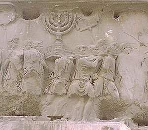
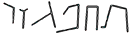

<title>Руслан Хазарзар. Сын Человеческий. Глава десятая</title>

<h2>10. Иудейские секты</h2>

<h3>Ессеи</h3>

В Новом завете нет ни единого упоминания о ессеях, но мы достаточно знаем об
этом ордене благодаря записям Филона Александрийского и Иосифа Флавия, а также
Кумранским рукописям, обнаруженным после 1947&nbsp;года в пещерах-хранилищах
вблизи Мертвого моря.

Орден ессеев (&#7960;&#963;&#963;&#945;&#8150;&#959;&#953;), или ессенов
(ессениан, &#7960;&#963;&#963;&#951;&#957;&#959;&#943;),
возник около 150&nbsp;года до н.&nbsp;э. (<i>Jos.</i>AJ.XIII.5:9). Филон
именует представителей этого ордена &#7960;&#963;&#963;&#945;&#8150;&#959;&#953; (<i>Philo</i>. Quod
prob. liber.12,&nbsp;13 [75,&nbsp;91]), а иногда — &#8013;&#963;&#953;&#959;&#953; (<i>святые</i>,
<i>благочестивые</i>) (<i>Philo</i>. Quod prob. liber.13&nbsp;[91]; Филон у
Евсевия. — <i>Eusebius.</i> Praeperatio evangelica.VII.11); при этом он
утверждает этимологическую связь этих слов, признавая, впрочем, в данном случае
нарушение правил греческое языка: &#955;&#941;&#947;&#959;&#957;&#964;&#945;&#943;
&#964;&#953;&#957;&#949;&#962; &#960;&#945;&#961;’
&#945;&#8016;&#964;&#959;&#8150;&#962; &#8004;&#957;&#959;&#956;&#945;
&#7960;&#963;&#963;&#945;&#8150;&#959;&#953;... &#954;&#945;&#964;’
&#7952;&#956;&#8052;&#957; &#948;&#972;&#958;&#945;&#957;, &#959;&#8016;&#954;
&#7936;&#954;&#961;&#953;&#946;&#949;&#8150; &#964;&#973;&#960;&#8179;
&#948;&#953;&#945;&#955;&#941;&#954;&#964;&#959;&#965;
&#7961;&#955;&#955;&#951;&#957;&#953;&#954;&#8134;&#962;,
&#960;&#945;&#961;&#974;&#957;&#965;&#956;&#959;&#953;
&#8001;&#963;&#953;&#972;&#964;&#951;&#964;&#959;&#962; (<i>Philo</i>.
Quod prob. liber.12&nbsp;[75])<a href="#_ftn1" name="_ftnref1">[1]</a>. Иосиф
Флавий употребляет обе формы — &#7960;&#963;&#963;&#945;&#8150;&#959;&#953;
(<i>Jos.</i>AJ.XV.10:4) и &#7960;&#963;&#963;&#951;&#957;&#959;&#943;
(<i>Jos.</i>AJ.XIII.5:9; XVIII.1:2,5; BJ.II.8:2), отдавая, впрочем,
предпочтение последней. Гегезипп (в передаче Евсевия) именует их &#7960;&#963;&#963;&#945;&#8150;&#959;&#953;
(<i>Eus.</i>HE.IV.22:7). Ипполит и Епифаний согласны с формой &#7960;&#963;&#963;&#951;&#957;&#959;&#943;
(<i>Hippol.</i>Philosoph.IX.18; <i>Epiph.</i>Haer.X.1; XII.1; XX.3)<a
href="#_ftn2" name="_ftnref2">[2]</a>.

С одной стороны, название <i>ессей</i> (<i>ессен</i>) может вести свое
начало от семитского слова <i>хас&uacute;д</i> (&#1495;&#1464;&#1505;&#1460;&#1497;&#1491;) — <i>благочестивый</i>, <i>набожный</i>.
Однако, по всей вероятности, наименование <i>ессеи</i> происходит от
арамейского слова <i>ас-сай-й&aacute;</i>
(&#1488;&#1463;&#1505;&#1468;&#1463;&#1497;&#1468;&#1464;&#1488;)<a href="#_ftn3" name="_ftnref3">[3]</a> —
<i>врачи</i>, <i>лекари</i>. И в этом случае слово <i>терапевт</i><a
href="#_ftn4" name="_ftnref4">[4]</a> является греческим переводом
вышеприведенного слова.

Ессеи жили обособленно — в селениях или в пустынях (<i>Jos.</i>BJ.II.8:4).
Обвиняя ортодоксальные секты в апостасии<a href="#_ftn5"
name="_ftnref5">[5]</a>, они продолжали исповедовать иудейскую религию, но —
по-своему, отлично от других школ.

Ессеи называли себя <i>нищими</i>, <i>сынами света</i>, а также
<i>простецами</i> и <i>немудреными</i> — в противоположность <i>таннаям</i>,
которые толковали законы.

Иосиф о ессеях пишет: «Имущество у них общее, и богач пользуется у них не
б&oacute;льшим, чем ничего не имеющий
бедняк&nbsp;[...]. Живя сами по себе, они услуживают друг другу. Для
заведования доходами и произведениями почвы они с помощью голосования избирают
наиболее достойных лиц из священнического сословия; последние и должны
заботиться о доставлении хлеба и прочих съестных припасов»
(<i>Jos.</i>AJ.XVIII.1:5). «Те, кто получают плату, отдают ее одному казначею,
избранному поднятием рук, — уточняет Филон Александрийский. — Казначей же, взяв
деньги, сразу же покупает съестные припасы и дает изобильную пищу и все другое,
необходимое для существования человека» (Филон Александрийский у Евсевия. —
<i>Eusebius</i>. Praeparatio evangelica.VIII.11:10).

Несмотря на иерархию, коммунизм был доведен в общине до крайности. Так,
Иосиф Флавий сообщает: «Они презирают богатство, и достойна удивления у них
общность имущества, ибо среди них нет ни одного, который был бы богаче другого.
По существующему у них правилу, всякий, присоединяющийся к секте, должен
уступить свое состояние общине; а потому у них нигде нельзя видеть ни крайней
нужды, ни блестящего богатства — все как братья владеют одним общим состоянием,
образующимся от соединения в одно целое отдельных имуществ каждого из них.
Употребление масла они считают недостойным, и если кто из них помимо своей воли
бывает помазан, то он утирает свое тело, потому что в жесткой коже они
усматривают честь, точно так же и в постоянном ношении белой одежды. Они
выбирают лиц для заведования делами общины, и каждый без различия обязан
посвятить себя служению всех» (<i>Jos.</i>BJ.II.8:3). «Все действия совершаются
ими не иначе как по указаниям лиц, стоящих во главе их; только в двух случаях
они пользуются полной свободой: в оказании помощи и в делах милосердия. Каждому
предоставляется помогать людям, заслуживающим помощи, во всех их нуждах и
раздавать хлеб неимущим. Но родственникам ничто не может быть подарено без
разрешения предстоятелей&nbsp;[...]. Всякое произнесенное ими слово имеет
больше веса, чем клятва, которая ими вовсе не употребляется, так как само
произнесение ее они порицают больше, чем ее нарушение. Они считают потерянным
человека того, которому верят только тогда, когда он призывает имя Бога
(ср.&nbsp;Мф.5:34-37. — <i>Р.Х.</i>). Преимущественно они посвящают себя
изучению древней письменности, изучая главным образом то, что целебно для тела
и души; по тем же источникам они знакомятся с кореньями, годными для исцеления
недугов, и изучают свойства минералов» (<i>Jos.</i>BJ.II.8:6).

Ессеи, сообщает Иосиф, «рожденные иудеи, но еще больше, чем другие, связаны
между собой любовью. Чувственных наслаждений они избегают как греха и почитают
величайшей добродетелью умеренность и поборение страстей. Супружество они
презирают, зато они принимают к себе чужих детей в нежном возрасте, когда они
еще восприимчивы к учению, обходятся с ними, как со своими собственными, и
внушают им свои нравы. Этим, впрочем, они отнюдь не хотят положить конец браку
и продолжению рода человеческого, а желают только оградить себя от распутства
женщин, полагая, что ни одна из них не сохраняет верность к одному только мужу
своему» (<i>Jos.</i>BJ.II.8:2). «Они не имеют ни жен, ни рабов, полагая, что
женщины ведут лишь к несправедливостям, а вторые подают повод к недоразумениям»
(<i>Jos.</i>AJ.XVIII.1:5). Филон по этому поводу уточняет: «Отлично видя, что
брак — единственное, что может в большей мере разрушить их общность, они
отказались от него и вместе с тем прекрасно соблюдают воздержание. Никто из
ессеев не берет себе жены, ибо самолюбивы женщины, и не в меру ревнивы, и
искусно влияют на образ мыслей мужчины, завлекая постоянными чарами» (Филон
Александрийский у Евсевия. — <i>Eusebius</i>. Praeparatio
evangelica.VIII.11:14).

Однако сам же Иосиф различает ессеев, отрицавших брак, и ессеев, живших в
браке. Последние брали женщину «на пробу» — с условием, что она забеременеет в
течение трех месяцев<a href="#_ftn6" name="_ftnref6">[6]</a>, и тогда лишь
женились на ней. Во время беременности жена была неприкасаема, ибо ессеи видели
в сексе акт продолжения рода, но не процесс ублажения плоти
(<i>Jos.</i>BJ.II.8:13).

Кроме того, как гласит <i>Дамасский документ</i>&nbsp;(CD), две рукописи
которого (CD-A и CD-B) обнаружены в Каирской генизе<a href="#_ftn7"
name="_ftnref7">[7]</a>, некоторые секты ессейского толка имели и рабов: «Пусть
никто не принуждает раба своего, и рабыню свою, и наемника своего работать в
Шаббат» (CD-B.XI.12).

«Своеобразен также у них обряд богослужения, — сообщает Иосиф Флавий
(<i>Jos.</i>BJ.II.8:5). — До восхода солнца они воздерживались от всякой
обыкновенной речи; они обращаются тогда к солнцу с известными древними по
происхождению молитвами, как будто испрашивают его восхождения». Об аналогичном
ритуале у терапевтов сообщает и Филон Александрийский: утром «они встают,
повернувшись и обратив взгляды к востоку, и, как только увидят восходящее
солнце, простирают руки к небу и молят о благоденствии, истине и прозорливости»
(<i>Philo.</i> De vita cont.11&nbsp;[89]). В кумранских текстах нет такого
отношения к солнцу, однако календарь кумранитов был солнечным в противовес
лунно-солнечному календарю ортодоксальных евреев. Христиане начала второго века
также «имели обычай в определенный день собираться на рассвете и читать,
чередуясь между собой, гимн Христу как богу» (<i>Plinius Secundus.</i>
Epist.X.96:7).

После утренней молитвы ессеи приступали к работе. Члены кумранской общины, в
частности, занимались земледелием, животноводством, ремеслом: добывали соль и
асфальт в Мертвом море, выделывали кожу, производили шерстяные ткани.
Проработав напряженно «до пятого часа», говорит Иосиф Флавий, т.&nbsp;е. до 11
наших часов, они снова собирались в определенном месте, опоясывались холщовым
платком и умывали себе тело холодной водой. По окончании очищения они
отправлялись в свое собственное жилище, куда лица, не принадлежавшие к секте,
не допускались, и, очищенные, словно в святилище, вступали в столовую. Здесь
они в строжайшей тишине усаживались вокруг стола, после чего пекарь раздавал
всем по порядку хлеб, а повар ставил каждому посуду с одним-единственным
блюдом. Священник открывал трапезу молитвой, до которой никто не должен был
дотронуться к пище; после трапезы он снова читал молитву. Как до, так и после
еды они славили Бога как дарителя пищи. Затем, сложив с себя свои одеяния, как
священные, они снова отправлялись на работу, где оставались до сумерек. Ужин
они съедали в том же порядке, как и обед (<i>Jos.</i>BJ.II.8:5). «Треть ночи»
кумраниты отдавали изучению Торы и Н’биим. Следует отметить, что ессеи
допускали к трапезе и гостей — при условии, что они хотя и из других
местностей, но члены ордена (<i>Jos.</i>BJ.II.8:4).

Плиний Старший о ессеях (Esseni) сообщает: «С каждым днем их число
увеличивается из-за появления множества уставших от жизни пришельцев, которых
ведет рука судьбы к [ессейским] обычаям» (<i>Plin.</i>NH.V.73&nbsp;[17])<a
href="#_ftn8" name="_ftnref8">[8]</a>.

Однако вступить в общину было нелегко, ибо желающие это сделать проходили
испытательный срок в течение двух (согласно <i>Уставу</i> Кумранской общины —
1Q&nbsp;S.IX.2) или трех (согласно сообщению Иосифа. — <i>Jos.</i>BJ.II.8:7)
лет. По истечении этого срока общее собрание выносило решение о принятии
кандидата в общину, и новый ее член передавал общине «все знание, труд и
имущество» (1Q&nbsp;S.I.11-12). У Иосифа Флавия мы находим еще одну
подробность: «Желающий присоединиться к этой секте (&#945;&#7989;&#961;&#949;&#963;&#953;&#962;) не так скоро
получает доступ туда&nbsp;[...]. Прежде чем он начинает участвовать в общих
трапезах, он дает своим собратьям страшную клятву в том, что он будет почитать
Бога, исполнять свои обязанности по отношению к людям, никому ни по
собственному побуждению, ни по приказанию не причинит зла, будет ненавидеть
всегда несправедливых и защищать правых; затем, что он должен хранить верность
к каждому человеку, и в особенности к правительству, так как всякая власть
исходит от Бога (ср.&nbsp;Рим.13:1-7. — <i>Р.Х.</i>). Дальше он должен
клясться, что если он сам будет пользоваться властью, то никогда не будет
превышать ее, не будет стремиться затмевать своих подчиненных ни одеждой, ни
блеском украшений. Дальше он вменяет себе в обязанность говорить всегда правду,
разоблачать лжецов, содержать в чистоте руки от воровства и совесть от
нечестной наживы, ничего не скрывать перед сочленами; другим же, напротив,
ничего не открывать, даже если пришлось бы умереть за это под пыткой. Наконец,
догматы братства никому не представлять в другом виде, чем он их сам изучил,
удержаться от разбоя и одинаково хранить и чтить книги секты и имена ангелов<a
href="#_ftn9" name="_ftnref9">[9]</a>» (<i>Jos.</i>BJ.II.8:7).

«По времени вступления в братство, — продолжает Иосиф
(<i>Jos.</i>BJ.8:10), — они делятся на четыре класса; причем младшие члены
так далеко отстоят от старших, что последние, при прикосновении к ним первых,
умывают свое тело, точно их осквернил чужеземец». Полноправные же члены
кумранской общины делились на два иерархических класса: священники (&#1488;&#1492;&#1512;&#1503; — <i>Аарон</i>) и остальные верующие (&#1497;&#1513;&#1512;&#1488;&#1500; — <i>Израиль</i>) (1Q&nbsp;S.V.6,21,22; IX.11). В совет
кумранской общины входили три священника и двенадцать рядовых верующих
(1Q&nbsp;S.VIII.1).

В своем произведении <i>О созерцательной жизни</i> Филон рассказывает о
терапевтах, что они, подражая мудрецам, отказывались от своего имущества,
которое раздавали родственникам и друзьям, покидали детей, жен, родителей,
братьев, друзей, родной город и находили себе новую родину в общении с
единомышленниками. Такие общины находились во многих местах Египта, в
особенности в окрестностях Александрии. Там каждый жил в отдельной келье,
вблизи друг от друга, и проводил свое время в благочестивых размышлениях. Пища
терапевтов была очень проста: хлеб, соль и вода. Шаббат они праздновали все
вместе в одной общей праздничной комнате, однако женщины были отделены от
мужчин стеной. При этом они произносили проповеди и пели псалмы и молитвы.
Терапевты не употребляли ни мяса, ни вина и отрицали рабство<a href="#_ftn10"
name="_ftnref10">[10]</a>.

Быть может, палестинские евреи принесли с собой в Египет воззрения ессеев и,
стало быть, повлияли на орден терапевтов. Однако последние, вероятно,
отличались от первых: терапевты жили в «созерцательном» бездействии, чужим
трудом; ессеи же трудились настолько усердно и зарабатывали так много, что
могли обеспечивать не только себя, но и выделять из своего избытка
нуждающимся.

Ессеи кумранской общины почитали некоего <i>Учителя Праведности</i> (&#1502;&#1493;&#1512;&#1492;&nbsp;&#1492;&#1510;&#1491;&#1511;). Из Кумранских рукописей нам известно,
что этот Учитель Праведности был священником и толкователем Торы; орден,
возглавляемый им, управлялся духовенством. Выпады сектантов против
царя-первосвященника из рода Хашмонаев привели около 150&nbsp;года до
н.&nbsp;э. к конфликту. Учителя бросили в темницу, а затем он был отправлен в
ссылку. Но и там <i>Нечестивый Священник</i> (&#1492;&#1499;&#1493;&#1492;&#1503;&nbsp;&#1492;&#1512;&#1513;&#1506;) не оставлял его в покое. Когда <i>сыны
света</i> справляли праздник Йом Киппур, на них напали люди, посланные царем.
Но это не привело к распаду секты. Около 140&nbsp;года Учитель увел своих
приверженцев к берегам Мертвого моря, где и был основан первый кумранский
поселок. Умер Учитель около 110&nbsp;года до н.&nbsp;э.; о его кончине в
текстах говорится в спокойных эпических тонах<a href="#_ftn11"
name="_ftnref11">[11]</a>.

В ессейских общинах существовали свои Уставы<a href="#_ftn12"
name="_ftnref12">[12]</a>. За любое нарушение его правил виновник нес
наказание: непочетное место во время трапезы, сокращение пищевого пайка, запрет
членам общины с ним общаться, изгнание из общины. Впрочем, обычно
раскаивавшийся виновник, «дух которого дрогнул», после некоторого
испытательного срока мог снова стать полноправным членом общины.

О мировоззрениях ессеев Иосиф Флавий пишет: «Они именно твердо веруют, что,
хотя тело тленно и материя невечна, душа же всегда остается бессмертной; что,
происходя из тончайшего эфира и вовлеченная какой-то природной пленительной
силой в тело, душа находится в нем как бы в заключении, но, как только телесные
узы спадают, она, как бы освобожденная от долгого рабства, весело уносится в
вышину&nbsp;[...]. Они думают, что добрые, в надежде на славную посмертную
жизнь, сделаются еще лучшими; злые же будут стараться обуздать себя из страха
перед тем, что если даже их грехи останутся скрытыми при жизни, то, по уходе в
другой мир, они должны будут терпеть вечные муки» (<i>Jos.</i>BJ.II.8:11).
Ессеи верили в предопределение судьбы (<i>Jos.</i>AJ.XIII.5:9), но в эту
доктрину, как следует из вышесказанного, вплетались тенденции о свободе воли у
человека.

Я.&nbsp;Л. Черток, переводчик <i>Иудейской войны</i> Иосифа Флавия на
русский язык, в примечании к восьмой главе второй книги данного произведения
пишет следующее: «Несмотря на это сравнительное богатство материала и
многочисленные исследования, посвященные европейскими учеными этому предмету,
вопрос о происхождении ессеев еще остается не вполне разъясненным. Даже
этимология и значение имени ессеев еще не окончательно установлены. Нет
сомнения, что ессеизм получил свое начало в Палестине и вырос на почве
иудаизма. Основные части его учения имеют свои корни в самом еврействе, и можно
поэтому с большой вероятностью допустить, что ессейский орден образовался из
cреды тех «хасидеев»<a href="#_ftn13" name="_ftnref13">[13]</a>, которые во
время борьбы против эллинизма проявили такую замечательную энергию и такое
редкое самоотвержение в деле защиты веры отцов. Нельзя, однако, не заметить в
ессеизме и некоторых посторонних элементов, чуждых еврейству и привившихся ему
как будто извне. В особенности поражает обычай их обращаться утром с молитвой к
солнцу. Отвержение брака и весь аскетический характер ордена также не совсем
согласуется с воззрениями чистого иудаизма. Не без основания поэтому полагали,
что ессеизм не чужд и некоторому внешнему влиянию. Сам Иосиф Флавий, как мы
видели, проводит параллель между учением ессеев о бессмертии души и воззрениями
греков на этот предмет<a href="#_ftn14" name="_ftnref14">[14]</a>; в другом же
месте он прямо сопоставляет ессеизм с пифагореизмом<a href="#_ftn15"
name="_ftnref15">[15]</a>. В действительности нельзя не заметить много сходного
между обоими этими учениями. На это в особенности обратил внимание известный
знаток греческой философии Эдуард Целлер. Но Целлер заходит слишком далеко,
если он почти весь ессеизм хочет вывести из пифагореизма»<a href="#_ftn16"
name="_ftnref16">[16]</a>.

Сам Иосиф, когда жил в Риме, подвергся влиянию греческой философии. Уже о
сотворении человека он, отступая от библейского первоисточника, пишет, что Бог
взял прах от земли и соединил с ним «дух и душу»<a href="#_ftn17"
name="_ftnref17">[17]</a>. Я думаю, в самой Палестине евреи не были настолько
эллинизированы, как о том сообщает Иосиф Флавий, ибо палестинские источники
того времени о бессмертии души практически не упоминают. Вероятно, сам Иосиф
под влиянием греческой философии приписал ессеям (а также фарисеям и зелотам)
излишнюю эллинизацию.

При всем сходстве ессейского ордена, который к началу нашего летоисчисления
насчитывал около четырех тысяч человек (<i>Philo</i>. Quod prob.
liber.12&nbsp;[75]; <i>Jos.</i>AJ.XVIII.1:5), и первых христианских общин, они
имеют существенные различия.

С одной стороны, и те и другие относились к ортодоксальным сектам с
антагонизмом и, по-видимому, не принимали участия в антиримских волнениях.
Христиане, как и ессеи, отрицали богатство (Мф.19:23; Лк.6:20, ex fontibus;
Лк.6:24) и жили по коммунистическим законам (Ин.12:6; Деян.5:1-11). И те и
другие даже имели общие наименования — <i>эбиониты</i> и <i>сыны света</i>
(Мф.5:14). Ессеи, как отметил И.&nbsp;Д. Амусин<a href="#_ftn18"
name="_ftnref18">[18]</a>, сыграли как бы посредническую роль между
ортодоксальным иудаизмом и христианством. И ессеи, и первые христиане были
набожными евреями и называли свою эпоху «концом времен». И те и другие
именовали Бога своим Царем и отвергали некоторые моменты храмового культа.
Причем нельзя отрицать той возможности, что ессеи могли оказать некоторое
влияние на первых христиан.

Прежде всего обращает на себя концепция <i>Нового завета</i>. Как в
рукописях Мертвого моря (CD-A.VI.19; VIII.21; CD-B.XIX.33-34; XX.12), так и в
Евангелиях (Мф.26:28; Мк.14:24; Лк.22:20) и посланиях Павла (1&nbsp;Кор.11:25;
2&nbsp;Кор.3:6) говорится о Новом завете<a href="#_ftn19"
name="_ftnref19">[19]</a>.

Кроме того, необходимо отметить, что в <i>Храмовом свитке</i>
(11Q&nbsp;Temple), по сути, запрещается не только многоженство, но и развод.
Автор этого кумранского документа приводит закон, согласно которому царь не
может брать себе «другую жену» к той, на которой он женился, и «она одна должна
быть с ним во все дни жизни ее» (11Q&nbsp;Temple.LVII.15-19)<a href="#_ftn20"
name="_ftnref20">[20]</a>. Таким образом, царь не мог развестись со своей
женой. Но то, что относится к царю, в равной, если не в большей, степени
относится и к его подданным. Как тут не вспомнить о запрете на развод, данном
Иисусом (Мк.10:4-12), — запрете, который казался столь революционным на фоне
иудаизма.

Возможно, следует прислушаться к мнению известного востоковеда Уильяма
Фоксвелла Олбрайта, который еще в&nbsp;1956&nbsp;году на специальном
симпозиуме, посвященном кумранским проблемам, в своем выступлении сказал: «Мы
вынуждены сейчас признать в качестве исторического факта, что многое из
религиозной практики первых христиан новозаветного века было заимствовано из
соответствующей практики ессеев. В особенности это верно относительно
организации раннехристианских общин с тенденцией к общинной собственности со
следами управления двенадцати избранных»<a href="#_ftn21"
name="_ftnref21">[21]</a>.

С другой стороны, у нас, однако, нет никаких серьезных оснований
отождествлять ессеев и христиан, как, например, это делает Тейчер<a
href="#_ftn22" name="_ftnref22">[22]</a>. Христиане не в такой степени чтили
Шаббат (Мф.12:1-8) и пост (Мф.9:14) и стремились к распространению своей веры
путем миссионерских путешествий, тогда как ессеи не выходили за пределы своей
общины. У кумранитов, в частности, обрядов и правил было не меньше, нежели у
фарисеев. Кумраниты строго хранили Шаббат<a href="#_ftn23"
name="_ftnref23">[23]</a> и, в отличие от Иисуса, думали, что в этот день даже
вытащить скотину из ямы — великий грех (CD-B.XI.13-14). Иисус шел ко всем
обездоленным и презираемым, а Устав общины учил о «вечной ненависти к людям
погибели», как называли практически всех, кто не принадлежал к секте
(1Q&nbsp;S.IX.21-22)<a href="#_ftn24" name="_ftnref24">[24]</a>. В нее,
согласно уставу <i>Две колонки</i>, не допускали лиц с телесными недостатками
(1Q&nbsp;Sa.II.4-9). Строгая иерархическая дисциплина, изоляционизм,
постоянное изучение Торы, — вот чем характеризовалась жизнь в Кумране.
«Избранники» были убеждены, что при наступлении Суда Божия спасутся только они.
Более того, они надеялись принять участие в войне против «сынов тьмы» и заранее
планировали свои действия в день эсхатологической битвы.

&nbsp;

<h3>Саддукеи</h3>

Саддукеи (&#931;&#945;&#948;&#948;&#959;&#965;&#954;&#945;&#8150;&#959;&#953;)
получили свое наименование во второй половине II&nbsp;века до н.&nbsp;э.;
по-видимому, слово <i>саддукей</i>, или, точнее, <i>ц’дук&uacute;</i> (&#1510;&#1456;&#1491;&#1493;&#1468;&#1511;&#1460;&#1497;)<a href="#_ftn25"
name="_ftnref25">[25]</a>, ведет свое начало от первосвященника Садока
(<i>Epiph.</i>Haer.XIV.2)<a href="#_ftn26" name="_ftnref26">[26]</a>.

Саддукеи (&#1510;&#1456;&#1491;&#1493;&#1468;&#1511;&#1460;&#1497;&#1501;, или &#1510;&#1456;&#1491;&#1493;&#1468;&#1511;&#1460;&#1497;&#1503;) являлись представителями духовной
аристократии, захватившей власть в Иудее и пользовавшейся ею сначала под
верховенством Персии, а затем и под верховенством преемников Александра
Македонского. Будучи полновластными хозяевами в Иерусалимском храме
(<i>Jos.</i>AJ.XX.9:1,3; <i>Epiph.</i>Haer.XIV.2), они господствовали в
Иерусалиме, а через посредство столицы — и над всем иудейством. В руки
духовенства попадали все отчисления, поступающие в Храм.

Саддукеи были представителями исключительно колена Левия
(<i>Jos.</i>CA.I.7). Это подтверждается тем, что их численность была ограничена
из-за наследственной передачи высших должностей (Исх.29:9). Современник
Александра Великого Гекатей Абдерский утверждает, что «первосвященников
иудейских, которые получают десятину от доходов и управляют общественными
делами, общим числом у евреев более тысячи пятисот» (Гекатей у Иосифа Флавия. —
<i>Jos.</i>CA.I.22, источник сомнительный).

Евреи во все времена заботились о чистоте и несмешанности священнического
рода (Лев.21:7-9,13-15). Уже при Ездре и Неемии (1&nbsp;Езд.2:61-63;
Неем.7:63-65) все священники, которые не могли доказать своей родословной на
основании записей, не допускались к жертвоприношениям. То, что эти правила
соблюдались священниками в Египте и Вавилоне, сообщается также и в Талмуде (Вав
Талм. Кетубот.25<i>а</i>). Кроме того, священники всегда принадлежали к роду
Аарона: потомственными жрецами были Хашмонаи (1&nbsp;Макк.2:1-5;
<i>Jos.</i>AJ.XII.6:1), и даже Ирод Великий и его сын Архелай, сместив с
первосвященнической должности род Хашмонаев, передавали этот почетный сан хотя
и ничем не выдающимся, но все же потомственным священникам
(<i>Jos.</i>AJ.XX.10:1).

Саддукеи признавали только постановления Торы, не придавая никакого значения
«устному учению» (<i>Jos.</i>AJ.XIII.10:6; XVIII.1:4). Они отрицали
божественное предопределение и утверждали, что Яхве не виновен, делает ли
кто-либо добро или делает зло, т.&nbsp;е. это зависит от свободной воли
человека. Саддукеи отрицали бессмертие души и посмертное воздаяние за поступки,
совершенные при жизни, а также они отрицали существование ангелов и возможность
воскресения мертвых при «кончине века» (Деян.23:8; <i>Jos.</i>AJ.XIII.5:9;
XVIII.1:4; BJ.II.8:14; <i>Epiph.</i>Haer.XIV.2).

Саддукеи, занимавшие высшие посты в Иудее, не участвовали в волнениях против
иноземного владычества и отчасти перенимали греко-римскую культуру. Это течение
возглавляло Синедрион (Деян.5:17), и должность первосвященника была в руках
саддукеев (<i>Jos.</i>AJ.XX.9:1).

В период, предшествующий Иудейской войне, гордость, разврат и роскошь
саддукеев достигли пределов (Вав Талм. Йома.9<i>а</i>, 35<i>б</i>).
Первосвященнический сан стал покупаем (Мишна. Йебамот.6:4; Вав Талм.
Йебамот.61<i>а</i>; Йома.18<i>а</i>; ср.&nbsp;<i>Jos.</i>AJ.XX.9:4,7), а потому
совершенно уронил свое значение в глазах народа (Вав Талм. Песахим.57<i>а</i>;
Керитут.28<i>а</i>). Мало того, в Талмуде мы находим прямые проклятия в адрес
первосвященников и их семей (Тосефта. Менахот.13:21-22; Вав Талм.
Песахим.57<i>а</i>).

&nbsp;

<h3>Фарисеи</h3>

При восстании Маккавеев росло возмущение иудейских патриотов, нашедших свой
центр в организации хасидеев. Через несколько десятилетий, при Иоанне Гиркане
(134–104 гг. до н.&nbsp;э.), представители этого же течения выступили под новым
именем — фарисеи (&#934;&#945;&#961;&#953;&#963;&#945;&#8150;&#959;&#953;), —
точно так же, как в то время враждебная им партия получила название
саддукеев.

Слово <i>фарисей</i>, или, точнее, <i>пар&yacute;ш</i> (&#1508;&#1468;&#1464;&#1512;&#1493;&#1468;&#1513;&#1473;)<a href="#_ftn27"
name="_ftnref27">[27]</a>, означает <i>отделенный</i>, <i>обособленный</i>,
<i>отличный</i><a href="#_ftn28" name="_ftnref28">[28]</a>. Фарисеи (&#1508;&#1468;&#1456;&#1512;&#1493;&#1468;&#1513;&#1473;&#1460;&#1497;&#1501;, или &#1508;&#1468;&#1456;&#1512;&#1493;&#1468;&#1513;&#1473;&#1460;&#1497;&#1503;) обращались друг к другу словом
<i>хабэр</i> (&#1495;&#1464;&#1489;&#1461;&#1512;), т.&nbsp;е. <i>товарищ</i>,
<i>союзник</i> (Мишна. Демай.2:3; Тосефта. Демай.2:2 и&nbsp;сл.).

Уже о периоде около 100 года до н.&nbsp;э. Иосиф Флавий пишет: «На стороне
саддукеев стоял лишь зажиточный класс, а не простой народ, тогда как на стороне
фарисеев была чернь» (<i>Jos.</i>AJ.XIII.10:6). А об эпохе царя Ирода он
сообщает следующее: «Учение [саддукеев] распространено среди немногих лиц,
притом принадлежащих к особенно знатным родам&nbsp;[...]. Когда они занимают
правительственные должности&nbsp;[...], то саддукеи примыкают к фарисеям, ибо
иначе они не были бы терпимы простонародьем» (<i>Jos.</i>AJ.XVIII.1:4).
«Фарисеи сильно преданы друг другу и, действуя соединенными силами, стремятся к
общему благу. Отношения же саддукеев между собой суровые и грубые; и даже со
своими единомышленниками они общаются, как с чужими»
(<i>Jos.</i>BJ.II.8:14).

Фарисеи были духовными вождями народной массы. Всех почитаемых людей —
например, Гамлиэля Старца (Деян.5:34) — причисляли к этой школе. Среди фарисеев
доминировали излагатели<a href="#_ftn29" name="_ftnref29">[29]</a>, которых
часто называли книжниками<a href="#_ftn30" name="_ftnref30">[30]</a> или
законниками<a href="#_ftn31" name="_ftnref31">[31]</a>. Именно фарисеев чаще
всего величали титулами <i>рабб&aacute;</i>, <i>рабб&uacute;</i>, <i>рабб&aacute;н&aacute;</i><a href="#_ftn32"
name="_ftnref32">[32]</a>.

О времени царствования Ирода Великого Иосиф Флавий пишет: «Среди иудеев
существовала партия, которая кичилась своим точным соблюдением предписаний
закона и имела притязание на особое благоволение Всевышнего. В полном
подчинении у этой секты были женщины. Партия эта именуется фарисеями. Они могли
в сильной степени оказывать противодействие царям, будучи в одинаковой мере
хитры и готовы открыто воевать с ними и подрывать их авторитет. Когда все иудеи
клятвенно подтвердили свою верность кесарю [Августу] и повиновение
постановлениям царя [Ирода Великого], эти лица в числе более шести тысяч
человек отказались от присяги» (<i>Jos.</i>AJ.XVII.2:4).

Шесть тысяч человек — эта цифра для такой небольшой страны, как Иудея,
говорит о том, что партия фарисеев представляла собой очень сильную
политическую организацию.

Саддукеи понимали, что с римлянами невозможно справиться; напротив, фарисеи
стремились к насильственному свержению иноземного владычества, доводя народ до
исступления. Лишь со временем их пыл стал охладевать — после неудачи фарисея
Садока во время восстания Иуды Галилеянина<a href="#_ftn33"
name="_ftnref33">[33]</a>; но тогда уже существовала более ревностная
организация — ультралевая партия зелотов, о которой речь пойдет ниже.

Опыт неудачных попыток установить еврейскую монархию подсказывал фарисеям,
что без помощи Богом посланного Мессии им не свергнуть иноземного ига. Чем
отчаяннее становилось положение в Иудее, тем более страстно культивировались в
фарисейских кругах мессианские чаяния.

Смерть правоверных евреев, погибших за дело независимости Иудеи, не могла
оставлять равнодушными ревнителей культа Яхве. Они не могли смириться с тем,
что подвиг героев останется без вознаграждения. И поэтому те, которые верили,
что у Мессии достаточно сил для того, чтобы справиться с иноземным игом, могли,
конечно, верить в то, что Он справится и со смертью. Так приходили к выводу,
что передовые борцы, павшие за свободу Иудеи, по приходе Мессии воскреснут для
новой жизни, полной радости и наслаждений. Именно к таким воззрениям пришли
фарисеи, отчасти уверовавшие также и в бессмертие души.

По поводу предопределения судьбы Иосиф Флавий пишет, что, по мнению
фарисеев, «все совершающееся происходит под влиянием судьбы. Впрочем, они
нисколько не отнимают у человека свободы его воли, но признают, что по
предначертанию Божию происходит смешение Его желания с желанием человека, идти
ли ему по пути добродетели или злобы» (<i>Jos.</i>AJ.XVIII.1:3). «Фарисеи
утверждают, что кое-что, хотя далеко и не всё, совершается по предопределению,
иное же само по себе может случаться» (<i>Jos.</i>AJ.XIII.5:9). «Они ставят все
в зависимость от Бога и судьбы и учат, что хотя человеку предоставлена свобода
выбора между честными и бесчестными поступками, но что и в этом участвует
предопределение судьбы. Души, по их мнению, все бессмертны; но только души
добрых переселяются после их смерти в другие тела (sic! — <i>Р.Х.</i>)<a
href="#_ftn34" name="_ftnref34">[34]</a>, а души злых обречены на вечные муки»
(<i>Jos.</i>BJ.II.8:14).

Фарисеи приспосабливали Закон Моисеев к новым историческим потребностям
путем толкования (интерпретации) заповедей и пророчеств Торы и Н’биим. На
основании этого нового, «устного закона» можно было доказать все что угодно,
необходимо только было обладать достаточным остроумием и памятью, чтобы знать
наизусть заповеди и уметь их цитировать.

Фарисеи соблюдали все те предания, которые с течением времени образовывались
вокруг Торы в качестве дополнений и разъяснений к ней. Ввиду того что эти
предания почти исключительно касались внешней, обрядовой стороны Закона, то
она-то по преимуществу и сделалась предметом главного внимания фарисеев. Сюда
относились постановления о строгом различении чистой<a href="#_ftn35"
name="_ftnref35">[35]</a> и нечистой<a href="#_ftn36" name="_ftnref36">[36]</a>
пищи, о брачных постах и обрядах, об умовении рук, чаш и скамей (Мк.7:3-4), о
форме одежды на тот или иной случай и прочие неудобоносимые ритуалы, включая
правило о строго определенном расстоянии, на которое можно было удаляться в
Шаббат<a href="#_ftn37" name="_ftnref37">[37]</a> (Деян.1:12;
<i>Jos.</i>AJ.XIII.10:5; XVII.2:4; XVIII.1:3; Vita.38; <i>Epiph</i>.Haer.XVI.1).

Вообще, многие фарисеи отличались узким кругозором, они придавали слишком
большое значение внешности и гордились своей показной набожностью
(ср.&nbsp;Мф.6:2,5,16; 23:1-32). Они, самодовольные и самоуверенные, тем не
менее своими смешными повадками вызывали насмешку даже у тех, кто их почитал.
Это доказывают прозвища, которыми наделял их народ и которые отзываются
карикатурой: например, <i>пар&yacute;ш-шикм&uacute;</i> (&#1508;&#1468;&#1464;&#1512;&#1493;&#1468;&#1513;&#1473;&nbsp;&#1513;&#1473;&#1460;&#1499;&#1456;&#1502;&#1460;&#1497;) — <i>фарисей сутулый</i>, т.&nbsp;е.
ходящий с согнутой спиной (&#1513;&#1473;&#1460;&#1499;&#1456;&#1502;&#1460;&#1497; — от &#1513;&#1473;&#1456;&#1499;&#1462;&#1501;), как бы принимая на свои плечи всю
тяжесть Торы. Или: <i>пар&yacute;ш-никп&uacute;</i> (&#1508;&#1468;&#1464;&#1512;&#1493;&#1468;&#1513;&#1473;&nbsp;&#1504;&#1460;&#1511;&#1456;&#1508;&#1468;&#1460;&#1497;, или &#1508;&#1512;&#1493;&#1513;&nbsp;&#1504;&#1499;&#1508;&#1488;&#1497;) — <i>фарисей-стукалка</i>, т.&nbsp;е.
спотыкающийся и стучащийся в двери и о камни<a href="#_ftn38"
name="_ftnref38">[38]</a>; <i>пар&yacute;ш-кизз&aacute;й</i> (&#1508;&#1468;&#1464;&#1512;&#1493;&#1468;&#1513;&#1473;&nbsp;&#1511;&#1460;&#1494;&#1468;&#1463;&#1488;&#1497;) — <i>фарисей кровоточащий</i><a
href="#_ftn39" name="_ftnref39">[39]</a>, т.&nbsp;е. ходящий с закрытыми
глазами, чтобы не видеть женщин, и ударяющийся о стены, отчего лоб у него
всегда окровавлен. Далее: <i>пар&yacute;ш-м’докй&aacute;</i> (&#1508;&#1468;&#1464;&#1512;&#1493;&#1468;&#1513;&#1473;&nbsp;&#1502;&#1456;&#1491;&#1493;&#1465;&#1499;&#1456;&#1497;&#1464;&#1488;) — <i>фарисей-пестик</i>, т.&nbsp;е.
согнувшийся пополам, как ручка пестика; <i>фарисей, который крашеный</i> —
человек, вся наружная набожность которого была лишь покровом лицемерия<a
href="#_ftn40" name="_ftnref40">[40]</a>.

Впрочем, не все фарисеи отличались такой религиозной мелочностью. Даже
Талмуд в некоторых местах порицает такое узкое, чисто обрядовое, истолкование
заповедей Торы (Мишна. Абот.1:15; Иер Талм. Пеа.1:1; Песахим.6:1; Вав Талм.
Сота.22<i>б</i>; Йома.35<i>б</i>; Шаббат.31<i>а</i>;
Песахим.31<i>а</i>,&nbsp;66<i>а</i>).

&nbsp;

<h3>Зелоты</h3>

Иосиф Флавий сообщает (<i>Jos.</i>AJ.XIII.5:9; BJ.II.8:2), что среди иудеев
существует три религиозных течения: ессеи, саддукеи и фарисеи; но позднее он
называет (<i>Jos.</i>AJ.XVIII.1:6) и четвертое, созданное Иудой Галилеянином,
течение зелотов.

Слово <i>зелот</i> возникло от греческого <i>дзэлот<b>э</b>с</i> (&#950;&#951;&#955;&#969;&#964;&#942;&#962;), которое является
переводом семитского <i>канн&aacute;й</i> (&#1511;&#1463;&#1504;&#1468;&#1463;&#1488;&#1497;)<a href="#_ftn41"
name="_ftnref41">[41]</a> — <i>ревнитель</i>.

В I веке н.&nbsp;э. не было ни одного большого города, в котором не были бы
собраны многочисленные деклассированные слои населения (lumpen-proletarii) —
бродяги, нищие и всякого рода бандиты и разбойники. Наряду с Римом,
Александрией и Антиохией Сирийской, огромное множество таких уголовников в
лохмотьях вмещал Иерусалим.

Если фарисеи с 6 года н.&nbsp;э. выражали интересы по преимуществу средних
слоев населения, то зелоты были представителями самых низших, неимущих классов,
черни. В отличие от зажиточных и образованных слоев населения, выходцами из
которых были фарисеи, эти деклассированные элементы высказывали готовность к
борьбе совершенно другого масштаба, ибо жили по принципу ego nihil timeo, quia
nihil habeo. Наоборот, когда конфликт между Римом и Иерусалимом обострялся,
когда все ближе и ближе подступал решительный день восстания, фарисеи
становились все более осторожными и медлительными.

Сильную поддержку люмпен-пролетариат встречал со стороны крестьянского
населения Галилеи (<i>Jos.</i>XVII.10:5; Vita.11), ибо эти земледельцы и
скотоводы были до крайней степени истощены податями и ростовщичеством и часто,
разорившись, пополняли ряды бродяг. Галилейские разбойники и иерусалимские
люмпены находились в постоянных сношениях и, наконец, составили в
противоположность фарисеям особую партию, партию зелотов.

Вот что пишет об этом течении Иосиф Флавий: «Родоначальником четвертой
философской школы стал галилеянин Иуда (&#8001;&nbsp;&#915;&#945;&#955;&#953;&#955;&#945;&#8150;&#959;&#962;
&#7992;&#959;&#973;&#948;&#945;&#962;). Приверженцы этой секты во всем
прочем вполне примыкают к учению фарисеев. Зато у них замечается ничем не
сдерживаемая любовь к свободе. Единственным руководителем и владыкой своим они
считают Господа Бога. Идти на смерть они считают за ничто, равно как презирают
смерть друзей и родственников, лишь бы не признавать над собой главенства
человека. Так как в этом лично может убедиться всякий желающий, то я не считаю
нужным особенно распространяться о них. Мне ведь нечего бояться, что моим
словам о них не будет придано веры; напротив, мои слова далеко не исчерпывают
всего их великодушия и готовности их подвергаться страданиям. Народ стал
страдать от безумного увлечения ими при Гессии Флоре (64–66&nbsp;гг. —
<i>Р.Х.</i>), который был наместником и довел иудеев злоупотреблением своей
власти до восстания против римлян» (<i>Jos.</i>AJ.XVIII.1:6).

Однако в начале этой главы (Ibid.1:1) Иосиф отзывается о зелотах далеко не с
таким уважением: «Некий Иуда Гавланит, происходивший из города Гамалы, вместе с
фарисеем Са(д)доком стал побуждать народ к оказанию сопротивления (&#7992;&#959;&#8059;&#948;&#945;&#962;
&#948;&#8050; &#915;&#945;&#965;&#955;&#945;&#957;&#8055;&#964;&#951;&#962;
&#7936;&#957;&#8052;&#961; &#7952;&#954; &#960;&#8057;&#955;&#949;&#969;&#962;
&#8004;&#957;&#959;&#956;&#945; &#915;&#8049;&#956;&#945;&#955;&#945;
&#931;&#8049;&#948;&#948;&#969;&#954;&#959;&#957;
&#934;&#945;&#961;&#953;&#963;&#945;&#8150;&#959;&#957;
&#960;&#961;&#959;&#963;&#955;&#945;&#946;&#8057;&#956;&#949;&#957;&#959;&#962;
&#7968;&#960;&#949;&#8055;&#947;&#949;&#964;&#959; &#7952;&#960;&#8054;
&#7936;&#960;&#959;&#963;&#964;&#8049;&#963;&#949;&#953;), говоря, что
допущение переписи поведет лишь к рабству. Они побуждали народ отстаивать свою
свободу. Их не может постигнуть неудача, говорили они, потому что налицо самые
благоприятные условия; даже если народ ошибется в своих расчетах, он создаст
себе вечный почет и славу своим великодушным порывом; Предвечный лишь в том
случае окажет иудеям поддержку, если они приведут в исполнение свои намерения,
особенно же, если они, добиваясь великого, не отступят перед осуществлением
своих планов.

Народ с восторгом внимал этим речам, и, таким образом, предприятие получило
еще более рискованный характер. Не было большего бедствия для нашего
простонародья, как то, какое уготовили ему вышеназванные люди&nbsp;[...].
Происходили постоянные разбойничьи набеги и умерщвления наиболее именитых
граждан под предлогом преследования общего блага, на самом же деле для того,
чтобы палачи могли пользоваться имуществом умерщвленных. Отсюда возникли
всевозможные возмущения, происходил ряд политических убийств, отчасти
вследствие кровопролитной междуусобной борьбы, так как люди, озверев, кидались
друг на друга и в своем увлечении не желали оставлять в живых никого из своих
противников, отчасти же вследствие избиения врагов. Наконец наступил голод,
доводящий людей до крайнего бесстыдства; города брались насильно и разрушались,
пока наконец эта смута не довела до того, что храм Божий стал жертвой пламени,
брошенного врагами».

&nbsp;

<table align="center" width="620" border="0">
<tr>
<td width="310" valign="middle" align="center">

Арка Тита (Рим, ок.&nbsp;80&nbsp;г. н.&nbsp;э.).

Римляне возвращаются с Менорой — 
священным семисвечником Храма

</td>
<td width="310" valign="middle" align="center">

</td>
</tr>
</table>

&nbsp;

Зелоты и выделившиеся из этой партии сикарии возглавили восставших в
Иудейской войне 66–73 годов (<i>Jos.</i>AJ.XX.8:5-6; BJ.II.8:1; VII.8:1;
Мишна. Санhедрин.9:6).

&nbsp;

<a href="#_ftnref1" name="_ftn1">[1]</a> Согласно древнему
армянскому словарю еврейских понятий у Филона, слово «ессены» объясняется как
«в&nbsp;тишине» (<i>Philo about the Contemplative Life</i>. Ed. F.&nbsp;C.
Conybeare. Oxford: Clarendon Press, 1895. P.&nbsp;247).

<a href="#_ftnref2" name="_ftn2">[2]</a> Кроме того, Епифаний знает
оссенов (&#8008;&#963;&#963;&#951;&#957;&#959;&#943;)
(<i>Epiph.</i>Haer.XIX.1-6; XXX.3; сравн. с &#7976;&#955;&#967;&#945;&#963;&#945;&#943; в Философумене. —
<i>Hippol.</i>Philosoph.IX.13), причем сближает оссенов с назареями (&#925;&#945;&#963;&#945;&#961;&#945;&#8150;&#959;&#953;)
(<i>Epiph.</i>Haer.XIX.1), а также знает секту иессеев (&#7992;&#949;&#963;&#963;&#945;&#8150;&#959;&#953;)
(<i>Epiph.</i>Haer.XXIX.1-9), которых прямо отождествляет с назореями (&#925;&#945;&#950;&#969;&#961;&#945;&#8150;&#959;&#953;) и, как
следует из текста (Ibid.5), с терапевтами Филона. В другом месте (Ibid.XXX.1-2)
Епифаний отождествляет назореев с эбионитами, хотя потом этого не признает.
Говоря о Епифании, еще Ренан отметил (Renan&nbsp;E. <i>Histoire des Origines du
Christianisme</i>. Livre cinqui&egrave;me: <i>Les &Eacute;vangiles et la
seconde g&eacute;n&eacute;ration chr&eacute;tienne</i>. Paris: Calmann
L&eacute;vy, 1877. P.&nbsp;48): «Rien de plus confus que le syst&egrave;me de
ce P&egrave;re, &eacute;gar&eacute; par son fanatisme orthodoxe». — «Нет ничего
более спутанного, нежели система этого отца церкви, сбиваемого с пути своим
ортодоксальным фанатизмом».

<a href="#_ftnref3" name="_ftn3">[3]</a> <i>Мн. ч.</i> от &#1488;&#1464;&#1505;&#1463;&#1497;, &#1488;&#1464;&#1505;&#1456;&#1497;&#1464;&#1488;, &#1488;&#1463;&#1505;&#1456;&#1497;&#1464;&#1488;. См.: <i>A Dictionary of the Targumim, the
Talmud Babli and Yerushalmi, and the Midrashic Literature</i>, compiled by
Marcus Jastrow. Vol.&nbsp;1. London &#150; New York, 1903. P.&nbsp;93.

<a href="#_ftnref4" name="_ftn4">[4]</a> От греч. &#952;&#949;&#961;&#945;&#960;&#949;&#973;&#969; — <i>служу</i>,
<i>опекаю</i>, <i>лечу</i>, <i>исцеляю</i>. Филон (<i>Philo.</i> De vita
cont.1&nbsp;[2]) дает два написания — &#952;&#949;&#961;&#945;&#960;&#949;&#965;&#964;&#945;&#943; и
&#952;&#949;&#961;&#945;&#960;&#949;&#965;&#964;&#961;&#943;&#948;&#949;&#962;.

<a href="#_ftnref5" name="_ftn5">[5]</a> Отступление от Бога; от
греч. &#7936;&#960;&#959;&#963;&#964;&#945;&#963;&#943;&#945; —
<i>отпадение от кого-</i> или <i>чего-либо</i>.

<a href="#_ftnref6" name="_ftn6">[6]</a> В рукописи значится «лет»,
но, как следует из контекста, речь все же идет о трех месяцах, а не о трех
годах: «Они испытывают своих невест в течение трех&nbsp;[...], и, если после
трехкратного очищения убеждаются в их плодородности, они женятся на них»;
понятно, что в данном месте, где оригинал текста как раз испорчен, речь идет о
трех менструальных циклах женщин, отсутствие которых указывало на их
беременность.

<a href="#_ftnref7" name="_ftn7">[7]</a> <i>Гениза</i>, или, точнее,
<i>г’низ&aacute;</i> (&#1490;&#1468;&#1456;&#1504;&#1460;&#1497;&#1494;&#1464;&#1492;) — <i>хранилище</i>, в котором
содержатся документы и тексты, имеющие религиозную значимость, но поврежденные
или вышедшие из употребления. В конце XIX&nbsp;века в генизе синагоги Фостата,
«Старого Каира», были обнаружены свыше 200&nbsp;000 фрагментов рукописей,
восходящих к периоду начиная с&nbsp;IX&nbsp;века. Отрывки <i>Дамасского
документа</i> обнаружены также в кумранских пещерах — 4Q&nbsp;D, 5Q&nbsp;12,
6Q&nbsp;15 и&nbsp;т.&nbsp;д.

<a href="#_ftnref8" name="_ftn8">[8]</a> Показательно, что Плиний
указывает местоположение ессеев (и это дает нам право отождествлять их с
кумранитами) — к западу от Мертвого моря и к северу от Engada, т.&nbsp;е. от
Эн-Гэди (<i>Plin.</i>NH.V.73&nbsp;[17]).

<a href="#_ftnref9" name="_ftn9">[9]</a> &#960;&#961;&#8056;&#962; &#964;&#959;&#8059;&#964;&#959;&#953;&#962;
&#8004;&#956;&#957;&#965;&#963;&#953;&#957;
&#956;&#951;&#948;&#949;&#957;&#8054; &#956;&#8050;&#957;
&#956;&#949;&#964;&#945;&#948;&#959;&#8166;&#957;&#945;&#953;
&#964;&#8182;&#957; &#948;&#959;&#947;&#956;&#8049;&#964;&#969;&#957;
&#7953;&#964;&#8051;&#961;&#969;&#962; &#7970; &#8033;&#962;
&#945;&#8016;&#964;&#8056;&#962;
&#956;&#949;&#964;&#8051;&#955;&#945;&#946;&#949;&#957;,
&#7936;&#966;&#8051;&#958;&#949;&#963;&#952;&#945;&#953; &#948;&#8050;
&#955;&#8131;&#963;&#964;&#949;&#8055;&#945;&#962; &#954;&#945;&#8054;
&#963;&#965;&#957;&#964;&#951;&#961;&#8053;&#963;&#949;&#953;&#957;
&#8001;&#956;&#959;&#8055;&#969;&#962; &#964;&#8049; &#964;&#949;
&#964;&#8134;&#962; &#945;&#7985;&#961;&#8051;&#963;&#949;&#969;&#962;
&#945;&#8016;&#964;&#8182;&#957; &#946;&#953;&#946;&#955;&#8055;&#945;
&#954;&#945;&#8054; &#964;&#8048; &#964;&#8182;&#957;
&#7936;&#947;&#947;&#8051;&#955;&#969;&#957;
&#8000;&#957;&#8057;&#956;&#945;&#964;&#945;.

<a href="#_ftnref10" name="_ftn10">[10]</a> Евсевий, цитируя данное
произведение Филона, необоснованно полагает, что терапевты были христианами
(<i>Eus</i>.HE.II.17:2 и&nbsp;сл.).

<a href="#_ftnref11" name="_ftn11">[11]</a>
<i>Амусин&nbsp;И.&nbsp;Д.</i> «Учитель Праведности» кумранской общины. —
Ежегодник Музея истории религии и атеизма: Т.&nbsp;7. — Л.,&nbsp;1964,
стр.&nbsp;255 и&nbsp;след.; <i>Старкова&nbsp;К.&nbsp;Б.</i> Литературные
памятники Кумранской общины. — Л.,&nbsp;1975, стр.&nbsp;43 и&nbsp;след.;
Carmignac&nbsp;J. <i>Christ and the Teacher of Righteousness</i>.
Baltimore,&nbsp;1962.

<a href="#_ftnref12" name="_ftn12">[12]</a> Среди рукописей Мертвого
моря есть, например, <i><a href="../books/ustav" target="_blank"
title="1Q S">Устав общины</a></i> (1Q&nbsp;S), к которому добавлены
антологии мессианских и эсхатологических текстов об Израиле при «кончине
века».

<a href="#_ftnref13" name="_ftn13">[13]</a> Иосиф Флавий считает,
что родоначальниками ессеев были фарисеи (<i>Jos.</i>BJ.II.8:14), но точнее
было бы сказать, что и те и другие вышли из организации хасидеев.

<a href="#_ftnref14" name="_ftn14">[14]</a> «Подобно эллинам, они
(ессеи. — <i>Р.Х.</i>) учат, что добродетельным назначена жизнь по ту сторону
океана — в местности, где нет ни дождя, ни снега, ни зноя, а вечный, тихо
приносящийся с океана нежный и приятный зефир. Злым же, напротив, они отводят
мрачную и холодную пещеру, полную беспрестанных мук. Эта самая мысль, как мне
кажется, высказывается также эллинами, которые своим богатырям, называемым ими
героями и полубогами, представляют острова блаженных (острова блаженных в
греческой мифологии представляли собой особое место для праведников в подземном
царстве Аида. — <i>Р.Х.</i>), а душам злых людей — место в преисподней, жилище
людей безбожных, где предание знает даже по имени некоторых таких наказанных,
как Сизиф и Тантал, Иксион и Титий» (<i>Jos.</i>BJ.II.8:11).

<a href="#_ftnref15" name="_ftn15">[15]</a> Образ жизни секты ессеев
был, по словам Иосифа, «устроен по образу школы греческого мудреца Пифагора»
(<i>Jos.</i>AJ.XV.10:4).

<a href="#_ftnref16" name="_ftn16">[16]</a> <i>Иосиф Флавий</i>.
Иудейская война: Пер. с нем. Я.&nbsp;Л. Чертка. — СПб., 1900,
стр.&nbsp;175–176 (прим.).

<a href="#_ftnref17" name="_ftn17">[17]</a> &#7956;&#960;&#955;&#945;&#963;&#949;&#957; &#8001;
&#952;&#949;&#8056;&#962; &#964;&#8056;&#957;
&#7940;&#957;&#952;&#961;&#969;&#960;&#959;&#957; &#967;&#959;&#8166;&#957;
&#7936;&#960;&#8056; &#964;&#8134;&#962; &#947;&#8134;&#962;
&#955;&#945;&#946;&#8061;&#957;, &#954;&#945;&#8054;
&#960;&#957;&#949;&#8166;&#956;&#945; &#7952;&#957;&#8134;&#954;&#949;&#957;
&#945;&#8016;&#964;&#8183; &#954;&#945;&#8054;
&#968;&#965;&#967;&#8053;&#957; (<i>Jos.</i>AJ.I.1:2).

<a href="#_ftnref18" name="_ftn18">[18]</a> <a
href="../books/amusin01" target="_blank"
title="Амусин. Кумранская община"><i>Амусин&nbsp;И.&nbsp;Д.</i> Кумранская
община</a>. — М.: Наука, 1983. &#151; Стр.&nbsp;225.

<a href="#_ftnref19" name="_ftn19">[19]</a> На основании этого Б.
Пикснер даже сделал вывод, что Иисус и ессеи имели некоторые сношения; см.:
Pixner Bargil. <i>An Essene Quarter on Mount Zion</i>.&nbsp;//&nbsp;<i>Studia
Hierosolymitana in onore di P.&nbsp;Bellarmino Bagatti</i>. Studi archeologici.
Publications of the <i>Studium Biblicum Franciscanum</i>. Jerusalem: Franciscan
Printing Press, 1976, I, pp.&nbsp;245–284. Впрочем, некоторые исследователи
вообще прямо отождествляют ессеев с христианами. В частности, Тейчер считает
Хирбет-Кумран христианским монастырем, а членов кумранской общины —
христианами; см.: Teiсher&nbsp;I.&nbsp;L. <i>The Dead Sea Scrolls —
Documents of the Jewish Christian Sect of Ebionites</i>.&nbsp;//&nbsp;Journal
of Jewish Studies. L., II, 1951, №&nbsp;1, pp.&nbsp;67–99 и
Teicher&nbsp;J.&nbsp;L. <i>The Essenes</i>.&nbsp;//&nbsp;Studia
Patristica. В., I, 1957, pp.&nbsp;540–545.

<a href="#_ftnref20" name="_ftn20">[20]</a> Yadin&nbsp;Y. <i>The
Temple Scroll</i>. Jerusalem: The Israel Exploration Society, 1983,
vol.&nbsp;2, p.&nbsp;258.

<a href="#_ftnref21" name="_ftn21">[21]</a>
Albright&nbsp;W.&nbsp;F. <i>Not Likely to Change Beliefs</i>. // <i>The New
Republic</i>. Wash., 9.IV.1956, p.&nbsp;20.

<a href="#_ftnref22" name="_ftn22">[22]</a>
Teiсher&nbsp;I.&nbsp;L. <i>The Dead Sea Scrolls — Documents of the Jewish
Christian Sect of Ebionites</i>. // Journal of Jewish Studies. L., II,
1951, №&nbsp;1. P.&nbsp;67–99; Teicher&nbsp;J.&nbsp;L. <i>The Essenes</i>. //
Studia Patristica. В., I, 1957. P.&nbsp;540–545.

<a href="#_ftnref23" name="_ftn23">[23]</a> «Строже, нежели все
другие иудеи, они (ессеи. — <i>Р.Х.</i>) избегают дотронуться до какой-либо
работы в субботу» (<i>Jos.</i>BJ.II.8:9).

<a href="#_ftnref24" name="_ftn24">[24]</a> Примечательно, что
р.&nbsp;Шаммай говорил, что учить Закону должно только человека благородного
происхождения и богатого, тогда как р.&nbsp;Гиллель, напротив, считал, что
учить следует всех, ибо многие грешники, которые приблизились к изучению Торы,
стали праведниками (Aboth de Rabbi Nathan, ver.&nbsp;1, cap.&nbsp;3; cf.
ver.&nbsp;2, cap.&nbsp;4).

<a href="#_ftnref25" name="_ftn25">[25]</a> См., напр., Вав
Талм.Йома.19<i>б</i>.

<a href="#_ftnref26" name="_ftn26">[26]</a> Древний иерусалимский
первосвященник Садок, или, точнее, Цад&oacute;к (&#1510;&#1464;&#1491;&#1493;&#1465;&#1511;), жил еще во времена царей Давида и
Соломона (2&nbsp;Цар.8:17; 15:24-35; 3&nbsp;Цар.1:8,22-35; 2:35;
1&nbsp;Пар.6:4-8; <i>Jos.</i>AJ.VII.5:4; 9:2,7; 10:4; 11:1,8; 14:4-6,11;
VIII.1:3-4); из числа первосвященников он был «первым при сооруженном Соломоном
храме» (<i>Jos.</i>AJ.X.8:6). Согласно другому преданию (Aboth de Rabbi Nathan,
ver.&nbsp;2, cap.&nbsp;10; ver.&nbsp;1, cap.&nbsp;5), Цадок — основатель секты
саддукеев — был предполагаемым учеником вполне исторической личности —
Антиг’носа иш-Соко (III&nbsp;в. до н.&nbsp;э.).

<a href="#_ftnref27" name="_ftn27">[27]</a> См., напр., Тосефта.
Шаббат.1:15; Вав Талм. Шаббат.13<i>а</i>.

<a href="#_ftnref28" name="_ftn28">[28]</a> См.: <i>A Dictionary of
the Targumim, the Talmud Babli and Yerushalmi, and the Midrashic
Literature</i>, compiled by Marcus Jastrow. Vol.&nbsp;2. London &#150; New
York, 1903. P.&nbsp;1222, с учетом p.&nbsp;1228 (&#1508;&#1468;&#1464;&#1512;&#1460;&#1497;&#1513;&#1473;).

<a href="#_ftnref29" name="_ftn29">[29]</a> <i>Тан-н&aacute;</i> (&#1514;&#1468;&#1463;&#1504;&#1468;&#1464;&#1488;) — <i>излагатель</i>.

<a href="#_ftnref30" name="_ftn30">[30]</a> <i>Со-п<b>э</b>р</i>
(&#1505;&#1508;&#1461;&#1512;) — <i>книжник</i>.

<a href="#_ftnref31" name="_ftn31">[31]</a> <i>Ха-к&aacute;м</i> (&#1495;&#1464;&#1499;&#1464;&#1501;) — <i>законник</i>, <i>мудрец</i>. Новый завет совершенно
неправомерно отделяет законников от фарисеев (см., напр., Лк.11:45);
по-видимому, в данном случае подразумевалось, что эти законники относились к
партии саддукеев; однако следует помнить, что и школа саддукеев, и школа
фарисеев имели своих книжников и законников, то есть <i>книжник</i> и
<i>законник</i> — это ученые титулы, а не признаки принадлежности к той или
иной религиозной партии. Впрочем, Д.&nbsp;Шварц отождествляет книжников с
левитами (Schwartz&nbsp;D.&nbsp;R. <i>Studies in the Jewish Background of
Christianity</i>. // Wissenschaftliche Untersuchungen zum Neuen
Testament&nbsp;60. T&uuml;bingen: Siebeck, 1992. P.&nbsp;89&#150;101).

<a href="#_ftnref32" name="_ftn32">[32]</a> Арамейские титулы: &#1512;&#1463;&#1489;&#1468;&#1464;&#1488; — <i>учитель</i>, &#1512;&#1463;&#1489;&#1468;&#1460;&#1497; — <i>учитель мой</i>, &#1512;&#1463;&#1489;&#1468;&#1463;&#1504;&#1464;&#1488; — <i>учитель наш</i>.

<a href="#_ftnref33" name="_ftn33">[33]</a> Cм. <a
href="07#pvr"><i>Под властью Рима</i> в §&nbsp;7</a>.

<a href="#_ftnref34" name="_ftn34">[34]</a> Вряд ли вера в
переселение душ была догматом фарисейской школы в I веке. В еврейской
литературе впервые это учение, по всей вероятности, появляется в
каббалистической книге Бахир, и лишь впоследствии, со времени опубликования
книги Зоhар, оно приобретает популярность.

<a href="#_ftnref35" name="_ftn35">[35]</a> &#1499;&#1468;&#1464;&#1513;&#1473;&#1461;&#1512; [ка-ш&eacute;р] — <i>пригодный</i>, <i>кош&eacute;рный</i>.

<a href="#_ftnref36" name="_ftn36">[36]</a> &#1508;&#1468;&#1464;&#1505;&#1493;&#1468;&#1500; [па-с&yacute;ль] — <i>негодный</i>, <i>порочный</i>;
&#1496;&#1464;&#1512;&#1461;&#1507; [та-р<b>э</b>п], или [та-р<b>э</b>ф], —
<i>растерзанный</i>, <i>трефн&oacute;й</i>.

<a href="#_ftnref37" name="_ftn37">[37]</a> Автор Деяний апостолов
определяет субботний путь расстоянием между Елеонской горой и Иерусалимом
(Деян.1:12), а Иосиф Флавий говорит, что это расстояние составляло 5 или 6
стадий (<i>Jos.</i>AJ.XX.8:6; BJ.V.2:3). Вообще, фарисеи установили весьма
сложные правила, связанные с <i>т’хум-шаббат</i> (&#1514;&#1468;&#1456;&#1495;&#1493;&#1468;&#1501;&#1470;&#1513;&#1473;&#1463;&#1489;&#1468;&#1464;&#1514;), т.&nbsp;е. с пределом допущенного
расстояния прохождения пути в субботу (Мишна. Эрубин.3–5). Однако следует
различать, с одной стороны, просто хождение, а с другой — удаление от
определенного места: ходить в рамках определенной области — например, в
пределах дома или двора — можно было даже целый день (при этом запрещалось
бегать) (Тосефта. Шаббат.17:22), а вот удаляться за пределы города и его
предместьев более чем на 2000 (по другой версии, 1985) локтей запрещалось. И
уже во времена Иисуса на дорогах, ведущих из города, устанавливались знаки,
указывающие предел субботнего пути, как это видно по надписям, обнаруженным в
окрестностях древнего Гэзера: ,
т.&nbsp;е. <i>т’хум Гэзер</i> (ср.&nbsp;Мишна. Сота.5:3; Рош hашшана.2:5).

<a href="#_ftnref38" name="_ftn38">[38]</a> &#1504;&#1460;&#1511;&#1456;&#1508;&#1468;&#1460;&#1497; — от &#1504;&#1511;&#1507; (<i>близко контактировать</i>,
<i>ударяться</i>, <i>стучать</i>, <i>ранить</i>). Смысл слова <i>никпи</i> не
вполне ясен. Ренан переводит его на французский как <i>bancroche</i>
(Renan&nbsp;E. <i>Vie de J&eacute;sus</i>. Paris: Michel L&eacute;vy
fr&egrave;res, 1863. P.&nbsp;328). Словарь Талмуда — как <i>дверной
молоточек</i> (<i>A Dictionary of the Targumim, the Talmud Babli and
Yerushalmi, and the Midrashic Literature</i>. Compiled by Marcus Jastrow.
Vol.&nbsp;2. London – New York, 1903. P.&nbsp;934–935). Впрочем, не вызывает
сомнений оскорбительный характер данного прозвища.

<a href="#_ftnref39" name="_ftn39">[39]</a> Здесь, вероятно, &#1511;&#1460;&#1494;&#1468;&#1463;&#1488;&#1497; — от &#1504;&#1511;&#1494;, а не от &#1511;&#1494;&#1494;. Впрочем, равноправны оба перевода, однако
см. контекст по Вав Талм. Сота.22<i>б</i>.

<a href="#_ftnref40" name="_ftn40">[40]</a> Вав Талм.
Сота.22<i>б</i>; ср. Иер Талм. Сота.5:5[25<i>а</i>] (см. также Aboth de Rabbi
Nathan, ver.&nbsp;1, cap.&nbsp;37; ver.&nbsp;2, cap.&nbsp;45). Вызывает интерес
именно различие редакций этого места в Гемарах. Я придерживаюсь Вавилонской
Гемары, которая кажется более правдоподобной (ср.&nbsp;<i>Epiph.</i>Haer.XVI.1).
Хотя нельзя утверждать, что данные характеристики относятся именно к периоду
жизни Иисуса, а не к более позднему времени.

<a href="#_ftnref41" name="_ftn41">[41]</a> См., напр., Вав Талм.
Санhедрин.82<i>б</i>. <i>Мн. ч.</i> — &#1511;&#1463;&#1504;&#1468;&#1464;&#1488;&#1460;&#1497;&#1501; или &#1511;&#1463;&#1504;&#1468;&#1464;&#1488;&#1460;&#1497;&#1503;. См.: <i>A Dictionary of the Targumim, the
Talmud Babli and Yerushalmi, and the Midrashic Literature</i>, compiled by
Marcus Jastrow. Vol.&nbsp;2. London &#150; New York, 1903. P.&nbsp;1388.

<a href="index">Оглавление</a> <a href="11">Далее</a>

