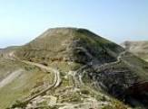

<title>Руслан Хазарзар. Сын Человеческий. Глава двадцать девятая</title>

<h2>29. Иоанн Креститель</h2>

Иоанн (&#7992;&#969;&#940;&#957;&#957;&#951;&#962;), или, точнее,
Йохан&aacute;н (&#1497;&#1493;&#1465;&#1495;&#1464;&#1504;&#1464;&#1503;), евангелистами именуется <i>Окунателем</i><a href="#_ftn1"
name="_ftnref1">[1]</a> (&#8001;&nbsp;&#946;&#945;&#960;&#964;&#953;&#963;&#964;&#942;&#962;).
Основной обряд, давший Иоанну это название, а его школе — ее характер, был
обрядом полного погружения в воду — <i>т’бил&aacute;</i> (&#1496;&#1456;&#1489;&#1460;&#1497;&#1500;&#1464;&#1492;). А потому греческое слово <i>баптист<b>э</b>с</i> является
переводом еврейского слова <i>hамтабб<b>э</b>ль</i> (&#1492;&#1463;&#1502;&#1456;&#1496;&#1463;&#1489;&#1468;&#1461;&#1500;) — производного от <i>т’била</i> (<i>погружение</i>). Следует
помнить, что иудейский обряд омовения-очищения — <i>р&aacute;хац</i> (&#1512;&#1463;&#1495;&#1463;&#1509;), — в
отличие от христианского крещения, был повторным: согласно Торе, нечистый и
согрешивший человек должен был очиститься путем погружения в воду (Лев.5:1-3;
15:1-33; Чис.19:11-22). Ессеи придавали огромное значение омовениям
(<i>Jos.</i>BJ.II.8:5,13). Т’била также сделалась обыкновенным ритуалом при
принятии прозелитом культа Яхве (Мишна. Песахим.8:8; Вав Талм.
Йебамот.46<i>б</i>; Абода Зара.57<i>а</i>). Поэтому признание крещения чисто
христианским обрядом — грубая ошибка. В конце концов, и по крови, и по религии
Йоханан hамтаббэль был и оставался иудеем в самом суровом духе культа Яхве.

Иоанн, вероятно, происходил из священнического рода (Лк.1:5; Evangelium
Ebionitum. — <i>Epiph.</i>Haer.XXX.13). Возможно, он родился в Ютте (&#1497;&#1493;&#1468;&#1496;&#1468;&#1464;&#1492; — <i>Йут-т&aacute;</i>)
(Лк.1:39; ср.&nbsp;Нав.15:55; 21:16), находящейся в двух часах пешего пути к
югу от Хеброна (&#1495;&#1462;&#1489;&#1456;&#1512;&#1493;&#1465;&#1503;), или в самом Хеброне — важнейшем городе на юге Иудеи
в&nbsp;37&nbsp;километрах к юго-западу от Иерусалима.

То, что Иоанн и Иисус были родственниками (Лк.1:36), — чистейший миф,
который, по-видимому, был придуман Терциусом для того, чтобы показать, что
Мария, как и Елисавета (Лк.1:5; Evangelium Ebionitum. —
<i>Epiph.</i>Haer.XXX.13), была «из рода Ааронова», ибо в этом случае Иисус —
потомок Давида и потомок Аарона — являлся истинным царем-первосвященником по
чину Мелхиседека (Пс.109:4; Евр.5:6,10; 6:20; 7:1,10-11,15,17)<a href="#_ftn2"
name="_ftnref2">[2]</a>. Действительно, Квартус утверждает, что Иоанн дважды
сказал, что до крещения Иисуса он не знал своего Крестника (Ин.1:31,33).

Иоанн и Иисус были примерно ровесниками, однако
утверждение Терциуса, что Иоанн был старше Иисуса на полгода (Лк.1:36), не
безусловно, ибо оно, вероятно, служит догматической установке, что Иоанн еще во
чреве матери был в подчиненном положении перед Иисусом, а «взыграть во чреве»
(Лк.1:41) для приветствия Марии Иоанн мог не раньше шестого месяца беременности
Елисаветы.

С самого детства Иоанн был назиром (Лк.1:15), или так называемым
<i>рекабитом</i> (ср.&nbsp;Иер.35:2-19), с ранних лет его привлекала пустыня
(Лк.1:80).

Йоханан hамтаббэль проявлял близкое родство с ессеями и их особенностями;
он, вероятно, воспитывался в этой школе<a href="#_ftn3"
name="_ftnref3">[3]</a>.

Местом своей проповеди Иоанн избрал часть Иудейской пустыни, примыкающую к
Мертвому морю (Мф.3:1; Мк.1:4). Одет он был в звериные шкуры или в одежду из
верблюжьей шерсти и питался саранчой (&#7936;&#954;&#961;&#943;&#948;&#949;&#962;) и диким медом
(Мф.3:4; Мк.1:6; cf.&nbsp;Evangelium Ebionitum. — <i>Epiph.</i>Haer.XXX.13).
Для совершения обряда омовения он переселялся на берега Иордана: или на
восточный берег — в Вифавару (Вифанию), — вероятно, напротив Иерихона, или же в
место, называемое Энон (&#913;&#7984;&#957;&#974;&#957;),
вблизи Салима, где «было много воды» (Ин.3:23). Месторасположение этого Салима
(&#931;&#945;&#955;&#949;&#943;&#956;) точно не
установлено. Возможно, он находился к западу от Иордана, то есть в Иудее, а не
в Перее: или в окрестностях Хеброна, или, как указывает Иероним, гораздо
севернее — около Вифхеана.

К Иоанну приходили значительные толпы, в особенности из колена Иуды, и
крестились (Мк.1:5; <i>Jos.</i>AJ.XVIII.5:2). Доктор философских наук
А.&nbsp;М. Каримский справедливо отмечает: «Слово “крещение”, обозначающее
таинство приобщения к христианству, и “крест” являются однокоренными лишь в
русском и ряде славянских языком. По-гречески “крестить” — “баптизо”, буквально
“окунать”, т.&nbsp;к. крещение осуществлялось погружением в воду. Крест
(который был известен и в дохристианских культах) мог стать символом
христианства лишь в связи с особым смыслом распятия. Именование Предтечи
“Крестителем” — результат калькирования греческого Иоаннес
Баптистес&nbsp;[...].  Он крестил людей, погружая их в воду, не используя
символа и самого понятия креста (изображение креста как аксессуара Предтечи в
известной картине А.&nbsp;А. Иванова «Явление Христа народу» — историческая
неточность)»<a href="#_ftn4" name="_ftnref4">[4]</a>.

Люди считали Иоанна пророком (Мф.14:5; 21:26)<a
href="#_ftn5" name="_ftnref5">[5]</a>, и многие думали, что он — воскресший
пророк Элиййаhу (Мф.11:14; Мк.6:15; Ин.1:21). Вера в эти воскресения была очень
распространена (Мф.14:2; Лк.9:8). Иудеи верили, что перед приходом Мессии
явится Его предтеча: согласно Книге Малахии (Мал.4:5 = Мальаки.3:23), этим
предтечей будет Элиййаhу; иногда предполагали, что им будет пророк Йирм’йаhу
(2&nbsp;Макк.15:13-15), которого Яхве вызовет из могилы.

Для Иоанна омовение было средством приготовления евреев к приходу Мессии.
«Покайтесь! — говорил он, — ибо приблизилось Царство Небесное» (Мф.3:2). Иоанн
говорил о скором приходе Христа, который уничтожит все зло на земле: «Уже и
секира при корне дерев лежит: всякое дерево, не приносящее доброго плода,
срубают и бросают в огонь» (Мф.3:10). Он представлял Мессию с веялкой в руке,
собирающим хорошее зерно и сжигающим солому (Мф.3:12). Покаяние, милостыня,
улучшение нравов (Лк.3:11-14; <i>Jos.</i>AJ.XVIII.5:2) были для Иоанна великими
средствами приготовления людей к наступающим событиям. Согласно Иосифу Флавию,
омовению Крестителя должно было предшествовать очищение внутреннее, ибо Иоанн
учил, что «омовение будет угодно Господу Богу, так как они будут прибегать к
этому средству не для искупления различных грехов, но для освящения своего
тела, тем более что души их заранее уже успеют очиститься»
(<i>Jos.</i>AJ.XVIII.5:2). Такое же восприятие ритуальных омовений было
свойственно и ессеям. И еще один характерный факт, косвенно подтверждающий
связь Иоанна и кумранитов: один и тот же стих из Книги Исаии (Ис.40:3) приведен
в первом Евангелии (Мф.3:3; ср.&nbsp;пунктуацию с Ис.40:3) и в <i>Уставе</i>
кумранской общины: «В пустыне приготовьте путь Яхве, выровняйте в степи дорогу
Ему».

Иоанн выступал против тех представителей
еврейства, против которых выступали ессеи и против которых позже выступал и
Иисус, — против представителей ортодоксального иудаизма, прежде всего фарисеев;
и, так же как и Иисус, он был признан преимущественно низшими классами
(Мф.21:32). Выражения, употребляемые Иоанном против своих оппонентов, были
достаточно резки (Мф.3:7; Лк.3:7). Возможно, он был не чужд и политики: Иосиф
Флавий дает это понять несколькими намеками (<i>Jos.</i>AJ.XVIII.5:2), и это
также явствует из той катастрофы, которая положила конец его деятельности.

Судьба Иоанна была печальна. Он выступил против тетрарха Галилеи и Переи
Ирода Антипы, обвиняя его в незаконном, с точки зрения Торы, браке с
Иродиадой.

Иродиада была дочкой Аристобула — сына Ирода Великого от брака с
Мариамной&nbsp;I<a href="#_ftn6" name="_ftnref6">[6]</a>. Вспыльчивая,
честолюбивая, страстная, эта внучка Ирода&nbsp;I (Иродиада) ненавидела культ
Яхве и презирала его предписания (<i>Jos.</i>AJ.XVIII.5:4). Она была выдана
замуж, вероятно, против своей воли, за своего дядю Ирода, сына
Мариамны&nbsp;II, лишенного Иродом Великим наследства
(<i>Jos.</i>AJ.XVIII.5:4). Примус и Секундус считают, что этим дядей Иродиады
был Филипп (Мф.14:3; Мк.6:17), но это, вероятно, ошибка, ибо женой тетрарха
Филиппа была Саломея, дочь Иродиады (<i>Jos.</i>AJ.XVIII.5:4). Иродиаду смущало
подчиненное положение своего первого мужа относительно других членов семьи
Иродов; она хотела властвовать во что бы то ни стало (<i>Jos.</i>BJ.II.9:6).
Ирод Антипа, сын Ирода Великого от брака с Мальфисой (Мальфакой), был тем
орудием, которое она избрала. Этот слабый человек обещал на ней жениться и
развестись со своей первой женой, дочерью Ареты (Хареты), царя Петры и эмира
соседних с Переей племен. Арабская принцесса, узнав об этом плане, решила
бежать и, скрывая свои намерения, притворилась, что хочет совершить путешествие
в Махер<a href="#_ftn7" name="_ftnref7">[7]</a>, в землю своего отца, куда она
и направилась в сопровождении военачальников Антипы
(<i>Jos.</i>AJ.XVIII.5:1).

<table width="168" align="right" border="0">
<tr><td width="5">&nbsp;</td>
<td>
<table width="163" align="right" border="0">
<tr height="121" valign="middle">
<td></td></tr>
<tr valign="middle">
<td>
Махер
</td></tr></table>
</td></tr></table>

Махер представлял собой крепость, построенную Александром Македонским и
восстановленную Иродом&nbsp;I. Она находилась к востоку от <i>Ям hа-Араб&aacute;</i> (Мертвого моря) и возвышалась над
его уровнем на&nbsp;1120&nbsp;метров (в&nbsp;настоящее время это Мукавер —
в&nbsp;37&nbsp;километрах к юго-востоку от Иерусалима). Махер находился как раз
на рубеже земель Ареты и Антипы, во время бегства арабской принцессы он был во
владении Ареты. И эмир, предуведомленный о плане Антипы, устроил бегство дочери
и препроводил ее в Петру.

Тогда совершился кровосмесительный союз Антипы с Иродиадой. Incestum
порицался Торой (Лев.18:1,6,16), и Иоанн был лишь отголоском всеобщего мнения
набожных евреев (Мф.14:4; Мк.6:18; Лк.3:19). Антипа велел арестовать Крестителя
и заточить его в крепость Махер, которой он, вероятно, завладел после бегства
дочери Ареты (<i>Jos.</i>AJ.XVIII.5:1).

Иосиф Флавий приводит другую мотивировку ареста и казни Иоанна, которая
выглядит более правдоподобно: «Так как многие стекались к проповеднику, учение
которого возвышало их души, Ирод стал опасаться, как бы его огромное влияние на
[вполне подчинившуюся ему] массу не повело к каким-либо осложнениям. Поэтому
тетрарх предпочел предупредить это, схватив Иоанна и казнив его раньше, чем
пришлось бы раскаяться, когда будет уже поздно» (Ibidem).

В Иудее наместник, по-видимому, не тревожил Иоанна, но в Перее, по ту
сторону Иордана, Креститель оказался во владениях Антипы; и этот тиран,
испуганный религиозным энтузиазмом народа, решил погубить проповедника, тем
более что ко всему этому прибавилась и личная обида Антипы на обличения
Иоанна.

Заточение Крестителя было достаточно продолжительным, и он в темнице
сохранял достаточную свободу действий, ибо на Востоке заключенные, с веригами
на ногах, содержались у всех на виду во дворе или в открытых помещениях и могли
разговаривать со всеми прохожими.

Существует легенда, что Антипа долго не решался казнить Иоанна — или из-за
страха перед народом, или из уважения к проповеднику (Мф.14:5; Мк.6:20). И вот
Саломея, дочь Иродиады от первого брака, в день рождения Ирода Антипы танцевала
перед тетрархом, и тот, разомлев от восхищения, пообещал исполнить любое ее
желание. Саломея, по наущению матери, попросила «на блюде голову Иоанна
Крестителя», и Ирод был вынужден казнить проповедника (Мф.14:3-12; Мк.6:14-29).
С исторической точки зрения эта легенда весьма сомнительна.

Ученики Иоанна получили тело учителя и похоронили его. Христианская
мифология утверждает, что они взяли себе на память кисть учителя, хотя,
конечно, этого не могло быть, ибо евреи считали мощи нечистыми (Чис.19:11-21).
Крестоносцы, грабя Константинополь, похитили множество реликвий, в том числе
целых <i>две</i> «головы Иоанна Крестителя», которые теперь хранятся в двух
французских храмах: в Суассоне и в Амьене. Когда потом Константинополь
завоевали турки, султан поместил в свою сокровищницу другие «мощи Иоанна»:
ладонь и осколок черепа.

Народ помнил и почитал Иоанна. Когда в 30-х годах Арета (&#7945;&#961;&#941;&#964;&#945; [hа-р<b>э</b>-та]) напал на
Антипу, чтобы вновь завладеть Махером и отомстить за бесчестие дочери, и
совершенно разбил его, то поражение это было сочтено как наказание за казнь
Иоанна: «Некоторые иудеи [...] видели в уничтожении войска Ирода вполне
справедливое наказание со стороны Господа Бога за убиение Иоанна. Ирод умертвил
этого праведного человека&nbsp;[...]. Иудеи же были убеждены, что войско Ирода
погибло лишь в наказание за эту казнь, так как Предвечный желал проучить Ирода»
(<i>Jos.</i>AJ.XVIII.5:1).

Йоханан hамтаббэль явился своего рода
посредником между кумранским учением и теми проповедями, которые были
адресованы более широким массам. Можно предположить, что Иоанн отказался от
строгой замкнутости кумранской общины и перешел к открытым проповедям, за что и
поплатился жизнью.

Школа Иоанна не умерла со своим основателем, она прошла некоторое время
отдельно от школы Иисуса — и вначале в добром согласии с ней. Несколько лет
спустя после смерти обоих наставников еще очищались омовением Иоанна; иные
принадлежали одновременно к обеим школам — например, Аполлос Александрийский
(Деян.18:24-25; 1&nbsp;Кор.1:12; 3:4-6; 4:6) и многие из христиан Эфеса
(Деян.19:1-5; ср. <i>Epiph.</i>Haer.XXX.16).

Иосиф Флавий около 53 года пошел в школу аскета по имени Баннус
(<i>Jos.</i>Vita.2), представлявшего большое сходство с Иоанном. Есть мнение,
что этот Баннус (&#914;&#8049;&#957;&#957;&#959;&#965;&#962;) тождествен с Бунаем
(&#1489;&#1493;&#1504;&#1497;),
которого Талмуд причисляет к ученикам Иисуса<a href="#_ftn8"
name="_ftnref8">[8]</a>. Этот старец Баннус жил в пустыне, одевался в древесные
листья или кору, питался растениями и дикими плодами, днем и ночью погружался в
холодную воду «освящения ради» (<i>Jos.</i>Vita.2) — эти два слова (&#960;&#961;&#8056;&#962;
&#7937;&#947;&#957;&#949;&#943;&#945;&#957;) у Иосифа те же, которые он
употребляет в адрес Иоанна Крестителя (<i>Jos.</i>AJ.XVIII.5:2).

Яак&oacute;б Ахмар&aacute; (&#1488;&#1458;&#1495;&#1470;&#1502;&#1464;&#1512;&#1464;&#1488;), то есть, в переводе с арамейского,
<i>брат Господень</i>, придерживался подобного же аскетизма (Гегезипп у
Евсевия. — <i>Eus.</i>HE.II.23:3-7).

Позже, к концу I&nbsp;века, баптизм очутился в борьбе с христианством.
Религиозная школа мандеев, последователи которой и ныне существуют в Южном
Ираке, считает себя продолжателем учения Иоанна Крестителя (Yuhana, или Yahya
Yuhana)<a href="#_ftn9" name="_ftnref9">[9]</a>. У них существует свое
Священное писание, в котором Иоанн выставлен истинным пророком, а Иисус —
лжепророком, изменившим своему учителю, Иоанну<a href="#_ftn10"
name="_ftnref10">[10]</a>.

&nbsp;

<a href="#_ftnref1" name="_ftn1">[1]</a> В Синодальном издании
греческое слово <i>баптист<b>э</b>с</i> переведено не как <i>окунатель</i>, а
как <i>креститель</i>.

<a href="#_ftnref2" name="_ftn2">[2]</a> <i>Мелхиседек</i>, или,
точнее, <i>Мальк&uacute;-Ц<b>э</b>дэк</i>
(&#1502;&#1463;&#1500;&#1456;&#1499;&#1468;&#1460;&#1497;&#1470;&#1510;&#1462;&#1491;&#1462;&#1511;), — царь Шал&eacute;ма (&#1513;&#1473;&#1464;&#1500;&#1461;&#1501; — быть может, Иерусалим), священник Яхве (Быт.14:18-20).

<a href="#_ftnref3" name="_ftn3">[3]</a> Если предположение, что
Иоанн получил воспитание у ессеев, весьма вероятно (Еп. <i>Михаил</i>
[<i>Чуб</i>]. Иоанн Креститель и община Кумрана. — <i>Журнал Московской
патриархии</i>, 1958, №&nbsp;8; Dani&eacute;lou&nbsp;J. <i>Jean-Baptiste, t&eacute;moin de l’Agneau</i>. Paris, 1964,
p.&nbsp;42), то утверждение Э.&nbsp;Шюре (<i>Шюре&nbsp;Э.</i> Великие
посвященные. — Калуга,&nbsp;1914) и иже с ним, что Иисус также воспитывался в
секте ессеев, ни на чем не основано и даже в некоторой степени противоречит
направленности общественной деятельности Иисуса.

<a href="#_ftnref4" name="_ftn4">[4]</a>
<i>Штраус&nbsp;Д.&nbsp;Ф.</i> Жизнь Иисуса: Кн.&nbsp;1&nbsp;и&nbsp;2: Пер. с
нем. — М.: Республика, 1992, стр.&nbsp;506.

<a href="#_ftnref5" name="_ftn5">[5]</a> См. также Фом.57 (вариант —
<i>Augustinus</i>. Contra adversarium legis et prophetarum. II.4:14); здесь
евангелист к 23-м пророкам Израиля прибавляет 24-го — Иоанна Крестителя.

<a href="#_ftnref6" name="_ftn6">[6]</a> См. <b><a
href="77.pdf">Приложение 4</a></b>.

<a href="#_ftnref7" name="_ftn7">[7]</a> <i>Махер</i>, или
<i>Махерон</i>, в Библии не упоминается, но о нем говорится в Иерусалимском
Талмуде (Шебиит.9:2) и в Иерусалимском Таргуме псевдо-Ионатана
(Б’мидбар.22:35).

<a href="#_ftnref8" name="_ftn8">[8]</a> «Пять учеников было у Ешу
hан-Ноцри: Матай, Накай, Нэцер, и Бунай, и Тода (&#1502;&#1514;&#1488;&#1497;&nbsp;&#1504;&#1511;&#1488;&#1497;&nbsp;&#1504;&#1510;&#1512;&nbsp;&#1493;&#1489;&#1493;&#1504;&#1497;&nbsp;&#1493;&#1514;&#1493;&#1491;&#1492;)» (Вав Талм.Санhедрин.43<i>а</i>,
барайта).

<a href="#_ftnref9" name="_ftn9">[9]</a> Вероятно, мандеи ведут свое
начало от секты, которую Епифаний называет сампсеями (&#931;&#945;&#956;&#968;&#945;&#8150;&#959;&#953;), или
элкесеями (&#7960;&#955;&#954;&#949;&#963;&#945;&#8055;&#969;&#957;)
(<i>Epiph</i>. Haer. XIX.1; LIII.1; cf.&nbsp;<i>Hippol</i>. Philosoph. IV et
IX; <i>Eus</i>.HE.VI.38). Но если сам Элхасаи (&#7976;&#955;&#967;&#945;&#963;&#945;&#8147;), или Элксаи (&#7976;&#955;&#958;&#945;&#8147;), не выступал против Основателя
и даже апеллировал к некоторым новозаветным книгам, то мандеи к Иисусу уже
открыто недоброжелательны.

<a href="#_ftnref10" name="_ftn10">[10]</a> О религиозной секте мандеев
см.: <i>Болотов&nbsp;В.</i> Лекции по истории древней Церкви: Т.&nbsp;2. —
СПб., 1910. &#151; Стр.&nbsp;230 и&nbsp;сл.; Steinmann&nbsp;J.
<i>St.&nbsp;Jean-Baptiste et la spiritualit&eacute; du d&eacute;sert</i>.&nbsp;//&nbsp;<i>Ma&icirc;tres spirituels</i>&nbsp;III. Paris:
Seuil, 1956. P.&nbsp;125&nbsp;sqq. Особо обращают на себя внимание работы леди
Ethel Stefana Drower: Drower&nbsp;E.&nbsp;S. <i>The Mand&aelig;ans of Iraq and
Iran</i>. Oxford: Clarendon Press, 1937 (repr. Leiden: Brill,&nbsp;1962);
Drower&nbsp;E.&nbsp;S. <i>The Book of the Zodiac (Sfar Malwa&#353;ia)</i>.
(Oriental Translation Fund,&nbsp;36.) London: The Royal Asiatic Society, 1949;
Drower&nbsp;E.&nbsp;S. <i>Diwan Abatur, or Progress Through the
Purgatories</i>. Text with Translation, Notes and Appendices. (Studi e
Testi,&nbsp;151.) Citt&agrave; del Vaticano: Biblioteca Apostolica Vaticana,
1950; Drower&nbsp;E.&nbsp;S.<i> The Haran Gawaita and the Baptism of
Hibil-Ziwa</i>. The Mandaic Text Reproduced Together with Translation, Notes
and Commentary. (Studi e Testi,&nbsp;176.) Citt&agrave; del Vaticano:
Biblioteca Apostolica Vaticana, 1953; Drower&nbsp;E.&nbsp;S. <i>The Thousand
and Twelve Questions</i>. Berlin: Akademie-Verlag, 1960; Drower&nbsp;E.&nbsp;S.
<i>The Secret Adam</i>: A Study of Nasoraean Gnosis. Oxford: Clarendon
Press,&nbsp;1960.

<a href="index">Оглавление</a> <a href="30">Далее</a>

