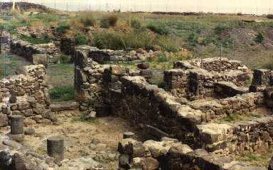
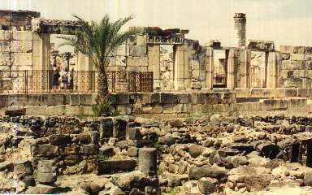
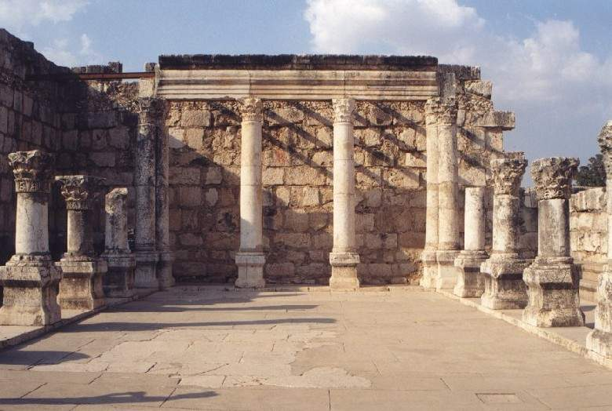

<title>Руслан Хазарзар. Сын Человеческий. Глава сорок вторая</title>

<h2>42. Служение Иисуса в Галилее</h2>

Узнав о том, что Иоанн Креститель отдан под стражу, Иисус покинул
окрестности Мертвого моря и Иордана и вернулся в Галилею (Мф.4:12; Мк.1:14;
Лк.4:14; Ин.4:3). «И пришел в Назарет, где был воспитан, и вошел&nbsp;[...] в
день субботний в синагогу» (Лк.4:16). Мы уже отмечали выше<a href="#_ftn1"
name="_ftnref1">[1]</a>, что синагоги как отдельного здания в Назарете,
вероятно, не было, однако жители города в Шаббат собирались в одном из частных
домов.

Иисус проповедовал своим землякам, «и многие слышавшие с изумлением
говорили: откуда у Него это?&nbsp;[...]. Не плотник ли Он, сын Марии, брат
Иакова, Иосии, Иуды и Симона? не здесь ли между нами Его сестры? И соблазнялись
о Нем. Иисус же сказал им: не бывает пророк без чести, разве только в отечестве
своем и у сродников и в доме своем (ср.&nbsp;Фом.36. — <i>Р.Х.</i>). И не мог
совершить там никакого чуда&nbsp;[...]<a href="#_ftn2" name="_ftnref2">[2]</a>.
И дивился неверию их» (Мк.6:2-6). Назаретянам трудно было считать пророком
того, чью сестру или чьего зятя они видели ежедневно.

Терциус доводит этот эпизод до гротеска:
«Услышав это, все в синагоге исполнились ярости, и вставши выгнали Его вон из
города и повели на вершину горы, на которой город их был построен, чтобы
свергнуть Его» (Лк.4:28-29). Конечно, Лука не знал, что Назарет построен не на
вершине, а по склону горы, и кручи такой, чтобы, сбросив с нее, убить человека,
нет вблизи Назарета, а уводить Иисуса далеко за город (так называемая <i>гора
Свержения</i> находится в часе пешего пути от Назарета) разъяренной толпе не
было смысла, ибо она могла тут же, на месте, побить Его камнями.

После этого Иисус, «оставив Назарет, пришел и поселился в Капернауме
приморском» (Мф.4:13; Лк.4:31), то есть бежал из Назарета и переселился в
Капернаум, обретя там второе отечество.

&nbsp;

<table align="center" width="780" border="0">
<tr>
<td width="390" align="center"></td>
<td width="390" align="center"></td>
</tr>
<tr>
<td>
 Капернаум. Развалины дома
</td>
<td>
 Руины капернаумской синагоги
</td>
</tr>
</table>

&nbsp;

Название Капернаум («селение Наума»), точнее К’пар-Нах&yacute;м (&#1499;&#1468;&#1456;&#1508;&#1463;&#1512;&#1470;&#1504;&#1463;&#1495;&#1493;&#1468;&#1501;), возможно, означало селение в древнем
стиле, в противоположность большим городам, построенным по типу римских
городов, как Тибериада. У Капернаума, как и у Назарета, не было истории; он был
настолько мало известен, что Иосиф Флавий под этим названием имел в виду
источник: «Кроме мягкого климата, богатому плодородию способствует еще
орошение, доставляемое могучим источником, называемым жителями Кафарнаумом.
Иные даже считают его за жилу Нила, так как в нем живут такие же рыбы, какие
найдены в озере возле Александрии» (<i>Jos.</i>BJ.III.10:8). История Капернаума
начинается вместе с христианством; в талмудической литературе он считался
городом <i>минов</i>. Еврейское слово <i>мин</i> (&#1502;&#1460;&#1497;&#1503;) означает
<i>род</i>, <i>сорт</i>, но в Талмуде так названы еретики, вероотступники, а
точнее — христиане (Мидраш Коhэлет.7:26). «Мясо, находившееся в руках гоя,
разрешено к пользованию, в руках мина — запрещено... — учит Талмуд. —
Убоина минов — идоложертвенное, их хлеб — хлеб самаритянина (&#1499;&#1493;&#1514;&#1497;), их вино — вино возлияния, от их урожая не берется десятина, их
книги — колдовские книги, их дети — незаконнорожденные (&#1502;&#1502;&#1494;&#1512;&#1497;&#1503;). Им не продают и у них не берут, не берут
у них (жен?) и не дают им, их детей не обучают ремеслу, у них не лечатся»
(Тосефта. Хуллин.2:20-21).

&nbsp;

 Капернаум. Руины синагоги

&nbsp;

Отождествление Капернаума с современными развалинами Тель-Хума, находящимися
в четырех километрах к юго-западу от того места, где Иордан впадает в
Геннисаретское озеро, хотя и признается большинством исследователей, но все же
не бесспорно, ибо в окрестностях Тель-Хума нельзя найти источник, отвечающий
описанию Иосифа Флавия (<i>Jos.</i>BJ.III.10:8). С другой стороны, нельзя
отождествлять Капернаум с современной Айн-Медаварой, ибо последняя находится не
на побережье, а Капернаум был селением рыбаков, на самом берегу Галилейского
моря (Мф.4:13; Ин.6:17).

Страна Геннисаретская, по утверждению Иосифа Флавия, «изумительной природы и
красоты. Земля по тучности своей восприимчива ко всякого рода растительности, и
жители действительно насадили ее весьма разнообразно; прекрасный климат также
способствует произрастанию самых различных растений. Ореховые деревья,
нуждающиеся больше в прохладе, процветают массами в соседстве с пальмами,
встречающимися только в жарких странах; рядом с ними растут также фиговые и
масличные деревья, требующие более умеренного климата. Здесь природа как будто
задалась целью соединить на одном пункте всякие противоположности; здесь же
происходит чудная борьба времен года, каждое из которых стремится
господствовать в этой местности. Ибо почва производит самые разнообразные,
по-видимому, плоды не только один раз, но и в течение всего года беспрерывно.
Благороднейшие плоды, виноград и фиги она доставляет десять месяцев в году
сряду, в то время, когда остальные плоды по очереди поспевают в продолжение
всего года» (<i>Jos.</i>BJ.III.10:8).

Если придерживаться мнения, что современные
развалины Тель-Хума и есть библейский &#922;&#945;&#966;&#945;&#961;&#957;&#945;&#959;&#973;&#956;, то
это селение было весьма небольшим: оно занимало прямоугольную площадь в 1000
шагов длины и 500 ширины. Однако ввиду того, что Капернаум находился в четырех
километрах от границы областей двух тетрархов — Антипы и Филиппа, — в нем
находилась таможня (telonium), был также военный отряд во главе с римским
кентурионом (Мф.8:5; Лк.7:2). Была в Капернауме и к’ништа, воздвигнутая,
возможно, римским сотником (Лк.7:5), — белое здание, главным входом своим
обращенное к Иерусалиму.

Весной 27 года Иисус, вероятно, ходил в Иерусалим на праздник Пасхи
(Ин.2:13), и, возвращаясь в Галилею, Он не пошел в Назарет, ибо сам
«свидетельствовал, что пророк не имеет чести в своем отечестве. Когда пришел Он
в Галилею, то Галилеяне приняли Его&nbsp;[...]. Итак Иисус опять пришел в Кану
Галилейскую» (Ин.4:44-46). По всей вероятности, пробыв некоторое время в Кане,
Основатель вернулся «в Капернаум, Сам и Матерь Его, и братья Его и ученики Его»
(Ин.2:12).

Иисус проповедовал не только в капернаумской к’ниште (Мк.1:21; Лк.4:31;
Ин.6:59), но и в синагогах других селений, как-то: Магдала<a href="#_ftn3"
name="_ftnref3">[3]</a>, Вифсаида<a href="#_ftn4" name="_ftnref4">[4]</a>,
Хоразин<a href="#_ftn5" name="_ftnref5">[5]</a>, Наин<a href="#_ftn6"
name="_ftnref6">[6]</a> и&nbsp;др. Вероятно, Он никогда не приходил в
Тибериаду, населенную большею частью язычниками (<i>Jos.</i>AJ.XVIII.2:3).
Иногда Иисус покидал Галилею и переправлялся на восточный берег Геннисаретского
озера — например, в Гергесу<a href="#_ftn7" name="_ftnref7">[7]</a>,
находившуюся напротив Магдалы. Однако Он всегда, вплоть до последнего
путешествия в Иерусалим, возвращался в Капернаум (Мф.17:24; Мк.9:33).

<a href="#_ftnref1" name="_ftn1">[1]</a> См. <a
href="27">§ 27</a>.

<a href="#_ftnref2" name="_ftn2">[2]</a> Вторая часть этого стиха
(Мк.6:5<i>б</i>) кажется мне интерполяцией или благочестивым дополнением
автора.

<a href="#_ftnref3" name="_ftn3">[3]</a> Магдала (&#1502;&#1460;&#1490;&#1468;&#1456;&#1491;&#1468;&#1464;&#1500; — Мигд&aacute;ль) — селение
на западном берегу Геннисаретского озера, в пяти километрах к северу от
Тибериады (Иер Талм. Шебиит.9:1; Эрубин.5:7), современный Мигдал, или Медждель.
Часто Магдалу отождествляют с Далмануфой (ср.&nbsp;по Синодальному переводу
Мф.15:39 и Мк.8:10), но, вероятно, это разные селения. Так, у Секундуса в 10-м
стихе 8-й главы Синайского, Александрийского, Ватиканского, Ефремова кодексов
написано: &#916;&#945;&#955;&#956;&#945;&#957;&#959;&#965;&#952;&#940;; но
уже в кодексе Koridethi мы читаем: &#924;&#945;&#947;&#948;&#945;&#955;&#940;. Безусловно, первый
вариант является оригинальным. У Примуса в 39-м стихе 15-й главы кодексов
VIII – IX&nbsp;веков (<b>L</b>,&nbsp;<b>&#916;</b>,&nbsp;<b>&#920;</b>)
написано: &#924;&#945;&#947;&#948;&#945;&#955;&#940;; но
это более позднее исправление первоначального текста — &#924;&#945;&#947;&#945;&#948;&#940;&#957; (Синайский,
Ватиканский кодексы и кодекс Безы). Ренан считает, что слово &#924;&#945;&#947;&#945;&#948;&#940;&#957; является искажением
слова &#916;&#945;&#955;&#956;&#945;&#957;&#959;&#965;&#952;&#940;, а
значит, и Примус, и Секундус говорят о Далмануфе, не упоминая в данном месте о
Магдале. Однако город Далмануфа теперь совершенно неизвестен.

<a href="#_ftnref4" name="_ftn4">[4]</a> Вифсаида (&#914;&#951;&#952;&#963;&#945;&#970;&#948;&#940;), или, в
еврейском написании, &#1489;&#1468;&#1461;&#1497;&#1514;&#1470;&#1510;&#1464;&#1497;&#1456;&#1491;&#1464;&#1492; [Бэйт Ца-й’д&aacute;], — селение на берегу Геннисаретского
озера. Существует гипотеза о двух Вифсаидах: одна — в пределах тетрарха Антипы,
на западном берегу озера, между Капернаумом и Магдалой, примерно там, где
некогда был древний город Киннерет (Втор.3:17; Нав.19:35); другая — в пределах
тетрарха Филиппа, названная Юлиадой (<i>Jos.</i>AJ.XVIII.2:1), на восточном
берегу, в километре от того места, где Иордан впадает в озеро. Однако эта
гипотеза о двух Вифсаидах, находившихся в 8–10 километрах друг от друга,
кажется мне сомнительной. Я думаю, Вифсаида-Юлиада, находившаяся в Гавлонитиде,
и была «Вифсаидой Галилейской», как называет ее Квартус (Ин.12:21), ибо Иуду
Гавлонита тоже называли Галилеянином.

<a href="#_ftnref5" name="_ftn5">[5]</a> Хоразин (&#935;&#959;&#961;&#945;&#950;&#943;&#957;), или, в еврейском
написании, &#1499;&#1468;&#1493;&#1465;&#1512;&#1464;&#1494;&#1460;&#1497;&#1503; [Ко-ра-з<b>и</b>н], — селение в Галилее, в 2,5 километрах к
северу от Капернаума (Мф.11:21; Лк.10:13).

<a href="#_ftnref6" name="_ftn6">[6]</a> На<b>и</b>н (&#925;&#945;&#912;&#957; = &#1504;&#1464;&#1506;&#1460;&#1497;&#1503;)
— селение в Галилее в 10-ти километрах к юго-востоку от Назарета (Лк.7:11),
соврем. Нейн.

<a href="#_ftnref7" name="_ftn7">[7]</a> У евангелистов мы находим
разночтения по поводу названия восточного побережья, куда путешествовал Иисус
(Мф.8:28; Мк.5:1; Лк.8:26,37). «В страну Гергесинскую» — за это чтение у всех
синоптиков единодушно стоят кодекс Bibl. Nat. Gr.&nbsp;62, Армянская версия
Диатессарона и Ориген (<i>Orig.</i>Matth.8:28; Comm. in Joann.6:24; 10:10). «В
страну Герасинскую» — за это чтение у Секундуса и Терциуса стоят Ватиканский
кодекс и кодекс Безы. «В страну Гадаринскую» — за это чтение у всех синоптиков
стоит Сирийская версия Диатессарона; за это же чтение также стоят: у Примуса —
Ватиканский кодекс и кодекс Ефрема; у Секундуса — Александрийский и Ефремов
кодексы; у Терциуса — Александрийский кодекс. Гераса находилась в 60-ти
километрах к югу от Геннисаретского озера, а не напротив Галилеи (Лк.8:26); что
касается Гадары, находившейся в 10-ти километрах от озера и Иордана
(<i>Jos.</i>AJ.V.1:22; BJ.III.7:1), то описание синоптиков к ней не подходят;
поэтому фразы &#949;&#7984;&#962;
&#964;&#8052;&#957; &#967;&#974;&#961;&#945;&#957; &#964;&#8182;&#957;
&#915;&#949;&#961;&#945;&#963;&#951;&#957;&#8182;&#957; и ...&nbsp;&#915;&#945;&#948;&#945;&#961;&#951;&#957;&#8182;&#957;,
если они относятся к оригиналу, могут означать лишь то, что Иисус был в
Десятиградье, а не в Герасе или Гадаре. По всей вероятности, правильное чтение:
&#949;&#7984;&#962;
&#964;&#8052;&#957; &#967;&#974;&#961;&#945;&#957; &#964;&#8182;&#957;
&#915;&#949;&#961;&#947;&#949;&#963;&#951;&#957;&#8182;&#957;; эта
Гергеса, по-видимому, тождественна с ханаанским городом Гиргаш<b>и</b> (&#1490;&#1468;&#1460;&#1512;&#1456;&#1490;&#1468;&#1464;&#1513;&#1473;&#1460;&#1497;) (Быт.10:16; 15:21; Втор.7:1; Нав.24:11).

<a href="index">Оглавление</a> <a href="43">Далее</a>

