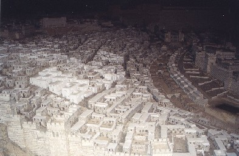
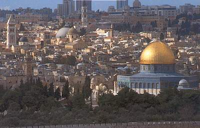
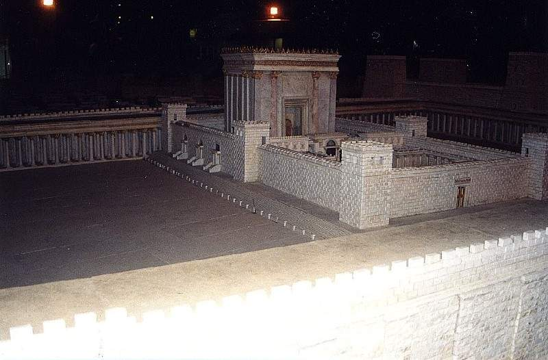
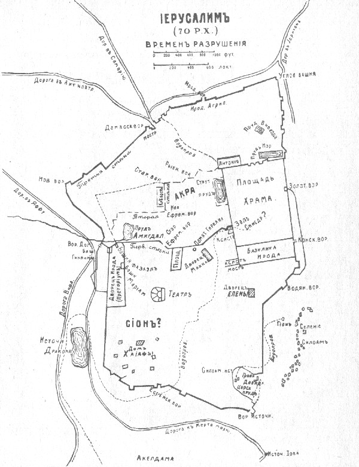
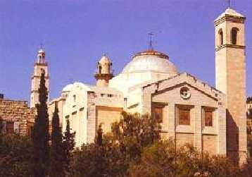

<title>Руслан Хазарзар. Сын Человеческий. Глава сорок шестая</title>

<h2>46. «Еще не долго быть Мне с вами»<a href="#_ftn1"
name="_ftnref1">[1]</a></h2>

Итак, Иисус отправился в Иерусалим — в Святой город (Неем.11:1,18; Мф.4:5),
в город Бога (Пс.45:5), Иуды (2&nbsp;Пар.25:28), Давида (2&nbsp;Цар.5:7;
Ис.22:9), великого Царя (Пс.47:3; Мф.5:35) и праздничных собраний (Ис.33:20), —
в город, который называли «совершенством красоты и радостью земли»
(Плач.2:15).

&nbsp;

<table align="center" width="801" border="0">
<tr>
<td width="397" align="center"></td>
<td width="404" align="center"></td>
</tr>
<tr>
<td>
 Иерусалим, I&nbsp; н.&nbsp;э. (модель)
</td>
<td>
 &#171;Старый&#187; Иерусалим
</td>
</tr>
</table>

&nbsp;

Иерусалим вместе с прилегающими к нему постройками исчислялся периметром в
тридцать три стадии<a href="#_ftn2" name="_ftnref2">[2]</a>. Город имел
множество ворот, например с севера — Ефремовы (&#1488;&#1462;&#1508;&#1456;&#1512;&#1463;&#1497;&#1460;&#1501; [Эп-р&aacute;-йим]), Старые (&#1492;&#1463;&#1497;&#1456;&#1513;&#1473;&#1464;&#1504;&#1464;&#1492; [hай-ша-н&aacute;]) и Рыбные (&#1492;&#1463;&#1491;&#1468;&#1464;&#1490;&#1460;&#1497;&#1501; [hад-да-г<b>и</b>м]) (Неем.3:3; 12:39); с
востока — Конские (&#1492;&#1463;&#1505;&#1468;&#1493;&#1468;&#1505;&#1460;&#1497;&#1501; [hас-су-с<b>и</b>м]) и Водяные (&#1492;&#1463;&#1502;&#1468;&#1463;&#1497;&#1460;&#1501; [hам-м&aacute;-йим]) (Неем.3:26,28); с юга — ворота
Источника (&#1492;&#1464;&#1506;&#1463;&#1497;&#1460;&#1503; [hа-&aacute;-йин]) (Неем.2:14; 3:15; 12:37); а с
запада — ворота Долины (&#1492;&#1463;&#1490;&#1468;&#1463;&#1497;&#1456;&#1488; [hаг-г&aacute;й]) (Неем.2:13; 3:13). Через Сузские
(Конские) ворота можно было сразу войти на площадь Храма, весь периметр которой
заключал в совокупности четыре стадии, причем каждая сторона ее имела одну
стадию в длину (<i>Jos.</i>AJ.XV.11:3). С северной стороны площади Храма была
построена прямоугольная крепость, славившаяся своей неприступностью. Ее
возводили еще предшественники Ирода Великого из рода Хашмонаев и назвали ее
Барисом. Здесь до&nbsp;4&nbsp;г до&nbsp;н.&nbsp;э. хранилось священное
облачение, которое надевал только первосвященник в случае необходимости
принести жертву. Ирод&nbsp;I еще более укрепил эту цитадель и назвал ее
Антонией в честь бывшего римского полководца Антония. Говорят, вместе с тем был
сооружен для царя подземный ход, ведший из башни Антония до самого Храма,
вплоть до восточного входа. Тут Ирод воздвиг для себя еще одну башню, куда он
мог проникнуть подземным ходом, ежели бы пришлось опасаться народных смут
(Ibid.11:4,7).

&nbsp;

&nbsp;

Храм Ирода (модель)

&nbsp;

В Иерусалиме, находясь на улицах города, полагалось никогда не
поворачиваться спиной к Храму. Чтобы не нарушать этого обычая, евреи вынуждены
были постоянно следить за своими движениями, дабы сохранять направление, при
котором хотя бы уголком глаза можно было видеть Святилище. Если же приходилось
идти по направлению от Храма, то евреи постоянно оглядывались или просто
смотрели назад.

&nbsp;

&nbsp;

План Иерусалима

&nbsp;

Кроме Храма, крепости Антония, дворца Ирода (<i>Jos.</i>AJ.XV.8:5) и его
басилики, были и другие внушительные сооружения, например: театр, построенный в
центре Иерусалима в честь императора Августа (Ibid.8:1), и башня Фасаила,
названная в память о брате Ирода Великого (<i>Jos.</i>AJ. XIV.7:3; 9:2) и
построенная царем рядом со своим дворцом (<i>Jos.</i>AJ.XVI.5:2). Бросающаяся в
глаза роскошь этих построек контрастировала с бедностью домиков в низине.

Обстоятельства путешествий Иисуса в Иерусалим, кроме последнего пасхального
посещения, нам мало известны, ибо синоптики о них не упоминают, а сведения
Квартуса весьма сбивчивы.

Во всяком случае, еще до последнего своего пребывания в столице, Иисус в
Иерусалиме пробовал проповедовать, но из этого не возникло ни иерусалимской
экклесии, ни даже группы иерусалимских учеников. Правда, Он, вероятно, уже
тогда познакомился с богатой вдовой Марией, матерью Иоанна-Марка
(Деян.12:12-16). Быть может, уже тогда Иисус сдружился с Иосифом из Аримафеи
(Мф.27:57; Мк.15:43; Лк.23:50-51; Ин.19:38). Однако, хотя многие добрые сердца
столичных горожан, возможно, и были растроганы Его проповедью, они боялись
признаться в этом ортодоксам (Ин.7:13; 12:42-43; 19:38), ибо им, по-видимому,
грозили хэрем и, следовательно, конфискация имущества (1&nbsp;Езд.10:8;
Евр.10:34; Иер Талм. Моэд Катон.3:1).

Вот потому-то Иисус в минуты горечи и восклицал: «Иерусалим, Иерусалим,
избивающий пророков и камнями побивающий посланных к тебе! сколько раз хотел Я
собрать детей твоих, как птица собирает птенцов своих под крылья, и вы не
захотели!» (Мф.23:37; Лк.13:34).

<table width="363" align="right" border="0">
<tr><td width="5">&nbsp;</td>
<td>
<table width="358" align="right" border="0">
<tr valign="middle">
<td></td></tr>
<tr height=110>
<td valign="middle">

 Церковь Лазаря в Вифании,
 построенная по проекту
 архитектора Барлуччи на руинах
 ранее существовавших церквей

</td></tr></table>
</td></tr></table>

Но Иисус находил утешение в селении под названием Вифания (&#914;&#951;&#952;&#945;&#957;&#943;&#945; = &#1489;&#1468;&#1461;&#1497;&#1514;&#1470;&#1506;&#1463;&#1504;&#1456;&#1497;&#1464;&#1492;, соврем. Эль-Азарийэ), расположенном в
трех километрах к востоку от Иерусалима на склоне Элеонской<a href="#_ftn3"
name="_ftnref3">[3]</a> (Масличной) горы (Ин.11:18). В этой деревушке Он
познакомился с одним семейством, состоящим из трех человек — двух сестер и их
брата Симона (Мф.21:17; 26:6; Мк.11:11-12; 14:3; Лк.19:29;
ср.&nbsp;Лк.7:36-50), прозванного <i>прокаженным</i><a href="#_ftn4"
name="_ftnref4">[4]</a>. Одна из двух сестер, Марфа<a href="#_ftn5"
name="_ftnref5">[5]</a>, была девушкой услужливой (Ин.12:2; Лк.10:38-40)<a
href="#_ftn6" name="_ftnref6">[6]</a>; другая же, Мария (Мирйам), наоборот,
была близка Иисусу из-за своей контемплятивности (Ин.11:20). Часто, сидя у Его
ног и слушая Его речи, она забывала о своих обязанностях по дому, и тогда Марфа
жаловалась на это Иисусу. «Марфа! Марфа! — отвечал Он, — ты заботишься и
суетишься о многом, а одно только нужно. Мария же избрала благую часть, которая
не отнимется у нее» (Лк.10:40-42).

Иисус, вероятно, часто сидел на Масличной горе (&#1492;&#1463;&#1512;&nbsp;&#1492;&#1463;&#1494;&#1468;&#1461;&#1514;&#1460;&#1497;&#1501;), напротив горы Морий<b>я</b> (&#1502;&#1512;&#1460;&#1497;&#1468;&#1464;&#1492;) (Мк.13:3; Зах.14:4), и созерцал величие
Храма, вид которого возбуждал у иноземцев восхищение. Иосиф Флавий пишет:
«Внешний вид храма представлял все, что только могло восхищать глаз и душу.
Покрытый со всех сторон тяжелыми золотыми листами, он блистал на утреннем
солнце ярким огненным блеском, ослепительным для глаз, как солнечные лучи.
Чужим, прибывавшим на поклонение в Иерусалим, он издали казался покрытым
снегом, ибо там, где он не был позолочен, он был ослепительно бел. Вершина его
была снабжена золотыми заостренными спицами для того, чтобы птица не могла
садиться на храм и загрязнять его<a href="#_ftn7" name="_ftnref7">[7]</a>»
(<i>Jos.</i>BJ.V.5:6).

С Масличной горы Иисус отправлялся в Иерусалим. Возможно, Храм не нравился
Иисусу, как и всякое великолепие, возомнившее существовать вечно. Однажды,
когда некоторые из учеников Основателя, лучше знавшие Иерусалим, хотели
показать Ему красоты Храма (Мф.24:1; Мк.13:1; Лк.21:5), Иисус не стал ничего
рассматривать, заметив лишь альману<a href="#_ftn8" name="_ftnref8">[8]</a>,
положившую в сокровищницу две лепты, и сказав: «Истинно говорю вам, что эта
бедная вдова положила больше всех, клавших в сокровищницу; ибо все клали от
избытка своего, а она от скудости своей положила все, чт&oacute; имела, все
пропитание свое» (Мк.12:41-44; Лк.21:1-4).

Иисус говорил, что человек познается по своим
делам, как дерево — по плодам (Мф.12:33-37; Лк.6:43-45). Обвиняя лицемеров,
уверенных в своей праведности, Он утверждал, что «если слепой ведет слепого,
оба падают в яму» (Фом.39; ср.&nbsp;Лк.6:36), что «соль — добрая вещь; но если
соль потеряет силу, чем исправить ее? ни в землю, ни в навоз не годится; вон
выбрасывают ее» (Лк.14:34-35). Презирая высокомерие, Основатель говорил, что
«всякий возвышающий сам себя унижен будет, а унижающий себя возвысится»
(Лк.14:11; ср.&nbsp;Мф.23:11-12; Лк.18:14; Evangelium secundum Hebraeos. —
<i>Hier.</i>Comm. in Epist. ad Ephes.5:4; Comm. in Ezech.18; Pel.3:2; Мишна.
Абот.1:12[13]; Вав Талм. Эрубин.13<i>б</i>).

В 29 году Иисус появился перед народом в Иерусалимском храме на
3–4&nbsp;день праздника Суккот (Ин.7:14), но главную речь произнес в последний
день праздника (Ин.7:37). Он призывал недоверчивых иудеев проникнуться Его
учением: «Придите ко Мне, все труждающиеся и обремененные, и Я успокою вас;
возьмите иго (&#964;&#8056;&#957;&nbsp;&#950;&#965;&#947;&#972;&#957;) Мое на
себя и науч<b>и</b>тесь от Меня, ибо Я кроток и смир&eacute;н сердцем, и найдете покой душам вашим;
ибо иго (&#8001;&nbsp;&#950;&#965;&#947;&#972;&#962;)<a
href="#_ftn9" name="_ftnref9">[9]</a> Мое благо, и бремя Мое легко»
(Мф.11:28-30; Фом.94). Основатель называл себя <i>добрым пастырем</i> и
<i>дверью овцам</i> (Ин.10:1-19).

Иисус говорил, что есть только две главные заповеди в Танахе (Мф.22:34-40;
Мк.12:28-31; ср. Лк.10:25-28). Первая: «Возлюби Господа Бога твоего всем
сердцем твоим и всею душею твоею и всем разумением твоим» (Втор.6:5). А вторая:
«Возлюби ближнего твоего, как самого себя» (Лев.19:18).

Иисус обличал лицемеров и однажды, упрекая их, высказал мысль, что судить
другого может лишь безгрешный человек (Ин.8:2-11)<a href="#_ftn10"
name="_ftnref10">[10]</a>, а следовательно, никто из людей не может. Законники,
кичащиеся перед другими своей праведностью, перед самими собою не осмелились
утверждать о своей безгрешности, вероятно, потому, что хорошо знали подноготную
друг друга. Такого сильного удара они вряд ли ожидали от Иисуса и вряд ли
вообще испытывали подобный удар. Ханжа, отличительным качеством которого
является показное благочестие, никогда не прощает тому, кто обнажает его гнилую
сущность — в противном случае, он признаёт химерность своих притязаний на
праведность и перестает быть ханжой, но такое случается крайне редко.
Поэтому-то и не могло быть какого-то компромисса между прекрасной душой Иисуса
и глупостью лицемеров, ибо ханжество, безусловно, является одной из сторон
тупости, а тупость всегда сопрягается со злопамятностью, с неумением понять
самого себя и другого, с неумением прощать слабости и ошибки ближних.

Однако Основатель в Иерусалиме в присутствии педантов был смущен, Он
вынужден был стать спорщиком, законником, толкователем Торы, Его поучения
принимали вид пламенных диспутов (Мф.21:23-27; Мк.11:27-33; Лк.20:1-8). Из
прекрасного моралиста Иисус превращался в экзегета, так сильно напоминающего
нам составителей Талмуда (Мф.22:23-32,41-46; Мк.12:18-27,35-37; Лк.20:27-44). И
хотя евангелисты пытаются доказать нам, что Основатель выходил победителем из
этих мудреных споров, Его аргументация, судя по законам науки Аристотеля, была
слаба<a href="#_ftn11" name="_ftnref11">[11]</a>.

После целого дня словопрений в Храме, вечером Иисус спускался в долину
Кедрон (&#922;&#949;&#948;&#961;&#974;&#957; = &#1511;&#1460;&#1491;&#1456;&#1512;&#1493;&#1465;&#1503; [Кид-р&oacute;н], совр. Вади-эн-Нар), которая
находилась между Иерусалимом и Элеонской горой. В этой долине некогда протекал
уже высохший одноименный поток (2&nbsp;Цар.15:23; 3&nbsp;Цар.15:13;
4&nbsp;Цар.23:4,6,12). После возвращения иудеев из вавилонского плена она стала
именоваться долиной Иосафата (Иоил.3:2). Именно в этом месте предполагался
Страшный суд (Иоил.3:12)<a href="#_ftn12" name="_ftnref12">[12]</a>.

Потом Иисус заходил в Гефсиманский сад (&#1490;&#1468;&#1463;&#1514;&#1470;&#1513;&#1473;&#1456;&#1502;&#1461;&#1504;&#1464;&#1492; [Гат Ш’мэн&aacute;] — <i>масличная давильня</i>) и отдыхал
там (Ин.18:1-2), а на ночь поднимался на Элеонскую гору (Лк.21:37; 22:39;
Ин.18:1).

Мы не знаем, уходил ли Иисус после праздника Кущей из Иерусалима и его
окрестностей — например, в Эпрайим (&#1488;&#1462;&#1508;&#1456;&#1512;&#1464;&#1497;&#1460;&#1501;, Ин.11:54; ср.&nbsp;2&nbsp;Цар.13:23) —
или же оставался в столице вплоть до праздника Ханукка, но нам известно, что в
декабре 29&nbsp;года Основатель был в Иерусалиме (Ин.10:22-23).

Вскоре после праздника Иисус отправился в Перею и на берега Иордана — в те
места, которые Он посещал три года назад, когда следовал за школой Иоанна
Крестителя (Ин.10:40; ср. Мф.19:1; Мк.10:1; Лк.18:35). Здесь, вероятно, Он
встречал благосклонный прием — в особенности, в Иерихоне (Мф.20:29; Мк.10:46;
Лк.19:1).

Иерихон, или, точнее, Й’рих&oacute;<a
href="#_ftn13" name="_ftnref13">[13]</a>, — один из самых древних городов в
котловине Иордана, основанный, быть может, в X – VIII тысячелетии до н. э. Этот
город-оазис, называемый в Библии <i>Ир hатмар&uacute;м</i> (&#1506;&#1460;&#1497;&#1512;&nbsp;&#1492;&#1463;&#1514;&#1468;&#1456;&#1502;&#1464;&#1512;&#1460;&#1497;&#1501; — <i>город пальм</i>, Втор.34:3;
Суд.3:13), располагался в 10 километрах к северу от Мертвого моря<a
href="#_ftn14" name="_ftnref14">[14]</a>.

Иерихон был весьма богат (<i>Strab.</i>XVI.2:41; Вав
Талм.Беракот.43<i>а</i>) и давал, по словам Иосифа Флавия, лучший бальзам
(<i>Jos.</i>AJ.XIV.4:1; XV.4:2). Вероятно, ввиду этого в Иерихоне располагался
телоний (таможня). Говорят, главный сборщик податей очень сердечно принял
Иисуса в своем доме (Лк.19:1-10), а при выходе Основателя из города некоторые
приветствовали Его мессианским титулом — Сын Давидов (Мф.20:30-31; Мк.10:47-48;
Лк.18:38-39).

Иерихонский оазис, вероятно, напомнил Иисусу
родную Галилею. Иосиф Флавий отзывался об этом месте в таких же восторженных
тонах, в каких он говорил и о Галилее, называя Иерихон земным раем
(<i>Jos.</i>BJ. IV.8:3). «Земля иерихонская, — пишет он, — самая плодородная в
Иудее, производящая в огромном изобилии пальмовые деревья и бальзамовые
кустарники. Нижние части стволов этих кустов надрезывают заостренными камнями и
к&aacute;пающие из надрезов слезы собирают
как бальзам» (<i>Jos.</i>BJ.I.6:6).

После этого благоприятного путешествия Иисус
решил снова отправиться в Иерусалим, о чем и возвестил своим ученикам
(Мф.20:17-18; Мк.10:33; Лк.18:31). Но они подумали, что Основатель идет в
столицу с окончательной и долгожданной целью показать себя там Мессией и
установить Царство Небесное. И тогда братья Зеведеевы попросили Иисуса, чтобы
Он дал им в Царстве Мессии самые почетные места. На это Основатель ответил, что
распределять места — не в Его власти, а во власти Бога. После этого случая
остальные из Двенадцати вознегодовали на Иакова и Иоанна (Мк.10:35-41;
ср.&nbsp;Мф.20:20-24).

Через некоторое время Иисус и Его ученики пришли в Вифанию, в дом Симона
Прокаженного (Мф.26:6; Мк.14:3; Ин.12:1). Марфа приготовила галилейским гостям
вечерю (Ин.12:2), а Мария взяла сосуд с миром и возлила это масло на голову
Основателя, и дом наполнился благоуханием (Мф.26:7; Мк.14:3; ср. Лк.7:37-38;
Ин.12:3). Тогда некоторые из учеников вознегодовали на Марию и говорили, что
это миро можно было бы продать за триста динариев и раздать деньги нищим
(Мф.26:8-9; Мк.14:4-5; ср.&nbsp;Ин.12:4-6). Но Иисус заступился за женщину и
спас ее от смущения (Мф.26:10; Мк.14:6; ср.&nbsp;Лк.7:44-48; Ин.8:10-11;
12:7).

&nbsp;

<a href="#_ftnref1" name="_ftn1">[1]</a> Ин.7:33.

<a href="#_ftnref2" name="_ftn2">[2]</a> Греческое &#963;&#964;&#940;&#948;&#953;&#959;&#957; примерно
соответствовало 180 метрам.

<a href="#_ftnref3" name="_ftn3">[3]</a> &#7960;&#955;&#945;&#953;&#8182;&#957;&#959;&#962; [Элай&oacute;нос] (Деян.1:14) = &#1494;&#1461;&#1514;&#1460;&#1497;&#1501; [Зэй-т<b>и</b>м]
(Зах.14:4).

<a href="#_ftnref4" name="_ftn4">[4]</a> Квартус вместо Симона
Прокаженного (&#931;&#943;&#956;&#969;&#957; &#8001;
&#955;&#949;&#960;&#961;&#972;&#962;, С<b>и</b>мон hо-лепр&oacute;с = евр. &#1513;&#1473;&#1460;&#1502;&#1456;&#1506;&#1493;&#1465;&#1503;&nbsp;&#1492;&#1463;&#1502;&#1510;&#1512;&#1464;&#1506;, Шим’&oacute;н hамцор&aacute; = арам. &#1513;&#1474;&#1460;&#1502;&#1456;&#1506;&#1493;&#1465;&#1503;&nbsp;&#1490;&#1468;&#1463;&#1512;&#1456;&#1489;&#1468;&#1464;&#1488;, Шим’&oacute;н Гарб&aacute;), называет Лазаря (Ин.11:1; 12:1), но
здесь, вероятно, сыграла свою роль этимология этого слова, ибо &#923;&#940;&#950;&#945;&#961;&#959;&#962; [Л&aacute;зарос] восходит к имени &#1488;&#1462;&#1500;&#1456;&#1506;&#1464;&#1494;&#1464;&#1512; [Эль-а-з&aacute;р] (Исх.28:1 = &#7960;&#955;&#949;&#940;&#950;&#945;&#961;, Мф.1:15), которое
буквально означает <i>Бог — помощь</i>. Таким образом, четвертый евангелист,
видимо, решил, что человек, которого воскрешает Иисус (Ин.11), должен
именоваться не <i>Слушанием</i> (Симоном), а <i>Тем, которому помогает Бог</i>
(Лазарем).

<a href="#_ftnref5" name="_ftn5">[5]</a> &#924;&#940;&#961;&#952;&#945; [М&aacute;рта] (Лк.10:38; Ин.11:20) = евр. &#1502;&#1464;&#1512;&#1456;&#1514;&#1464;&#1492; [Ма-р’т&aacute;].

<a href="#_ftnref6" name="_ftn6">[6]</a> Терциус не говорит здесь о
Вифании и, кажется, относит место действие куда-то между Галилеей и
Иерусалимом, но топография Евангелия от Луки от стиха&nbsp;51 главы&nbsp;9 до
стиха&nbsp;31 главы&nbsp;18 совершенно расплывчата и более подходит к
Иерусалиму или его окрестностям.

<a href="#_ftnref7" name="_ftn7">[7]</a> Также предполагается, что
шпили служили и громоотводами, ибо храмовое здание находилось на вершине горы и
подвергалось опасностям частых и сильных гроз; за всю свою более чем
тысячелетнюю историю Храм ни разу не пострадал от удара молнии.

<a href="#_ftnref8" name="_ftn8">[8]</a> &#1488;&#1463;&#1500;&#1456;&#1502;&#1464;&#1504;&#1464;&#1492; [альман&aacute;] — <i>вдова</i>.

<a href="#_ftnref9" name="_ftn9">[9]</a> Вообще, слово &#8001;&nbsp;&#950;&#965;&#947;&#972;&#962; означает:
<i>коромысло весов</i>, <i>весы</i> или, во втором значении, <i>ряд</i>,
<i>шеренга</i>; однако из контекста видно, что речь здесь идет о
<i>ярме</i> (&#964;&#8056;&nbsp;&#950;&#965;&#947;&#972;&#957; = лат. jugum =
евр. &#1506;&#1500;);
вполне точно определить разницу между &#950;&#965;&#947;&#972;&#957; и &#950;&#965;&#947;&#972;&#962; почти невозможно, ибо косвенные
падежи сходны, а во множественном числе и от &#950;&#965;&#947;&#972;&#962; более употребительной была форма
&#964;&#8048;&nbsp;&#950;&#965;&#947;&#940;.

<a href="#_ftnref10" name="_ftn10">[10]</a> О <i>перикопе</i>
(Ин.7:53–8:11) см.: <a href="64"><i>Логии Квартуса</i></a> в
<b>Дополнении</b>.

<a href="#_ftnref11" name="_ftn11">[11]</a> См.:
Strau&szlig;&nbsp;D.&nbsp;F. <i>Das Leben Jesu f&uuml;r das deutsche Volk
bearbeitet</i>. 3te&nbsp;Auflage. Leipzig: Brockhaus, 1874.
S.&nbsp;259–260.

<a href="#_ftnref12" name="_ftn12">[12]</a> См. <a
href="08">§ 8</a>.

<a href="#_ftnref13" name="_ftn13">[13]</a> &#1497;&#1456;&#1512;&#1460;&#1497;&#1495;&#1493;&#1465; (Нав.2:1) = &#7992;&#949;&#961;&#953;&#967;&#974; (Лк.19:1; Евр.11:30);
впрочем, чаще встречается чтение &#1497;&#1456;&#1512;&#1461;&#1495;&#1493;&#1465; [Й’рэй-х&oacute;] (Чис.22:1; Втор.34:3; 1&nbsp;Езд.2:34;
Неем.3:2).

<a href="#_ftnref14" name="_ftn14">[14]</a> Древний Иерихон
находился там, где ныне расположен Тель-эль-Сультан, в трех километрах к
северо-западу от современного Иерихона; в эпоху Христа Иерихон находился в
полутора километрах от современного города.

<a href="index">Оглавление</a> <a href="47">Далее</a>

