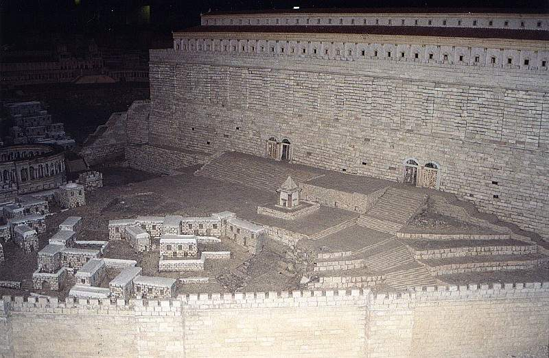

<title>Руслан Хазарзар. Сын Человеческий. Глава сорок седьмая</title>

<h1>VIII. &#928;&#945;&#952;&#942;&#956;&#945;&#964;&#945;
&#964;&#959;&#8166; &#954;&#965;&#961;&#943;&#959;&#965;</h1>

<h2>47. Герой «Страстей»</h2>

«Пророк Моисей [...] был древнее всех писателей, и через него [...] изречено
такое пророчество: “Не оскудеет властитель от Иуды и вождь от чресл его, доколе
не придет Тот, Которому отложено, и Он будет чаянием народов; Он привяжет к
виноградной лозе осленка своего и омоет одежду свою в крови грозди”<a
href="#_ftn1" name="_ftnref1">[1]</a>. Демоны, услышавши эти пророческие слова,
сказали, что Дионис родился сыном Зевса (&#965;&#7985;&#8056;&#957; &#964;&#959;&#8166;
&#916;&#953;&#972;&#962;), и передали, что он был изобретателем
винограда, и осла<a href="#_ftn2" name="_ftnref2">[2]</a> помещают в таинствах
его, и учили, что он был растерзан и взошел на небо», — пишет Юстин
(<i>Just</i>.Apol.I.54; ср.&nbsp;<i>Just.</i>Dial.69; <i>Eus.</i>HE.VIII.2:4);
а Климент Александрийский добавляет: «Точно так же и философия, варварская и
эллинская, содержит части вечной истины, полученные однако не из мифов о
Дионисе, но благодаря богословию вечного Логоса»
(<i>Clem.</i>Strom.I.13&nbsp;[57:6]).

Христианская Церковь называет искупительные страдания Богочеловека тем же
словом, каким в дохристианских мистериях названы страдания языческого бога —
<i>страсти</i> (&#960;&#940;&#952;&#951;). Diapasmos Вакха
и stayrosos Христа этим словом как бы приравниваются, а суть состоит в
многозначности греческого слова &#960;&#940;&#952;&#959;&#962; — <i>страсть</i>,
<i>страдание</i>, <i>возбуждение</i>, <i>воодушевление</i>. И как то ни
странно, Церковь, считая греховной любую страсть, называет свою величайшую
святыню <i>Страстями</i> (<i>Eus.</i>HE.II.17:21).

«Страсти Господни» начинаются вшествием Иисуса в Иерусалим. В талмудической
литературе (Мидраш Коhэлет.73:3) мы находим следующее пророчество: «Каков был
первый спаситель [Моше], таков будет и последний [Машиах]. Что говорит Закон о
первом спасителе? “И взял Моше жену свою и сыновей своих, посадил их на осла”
(Исх.4:20. — <i>Р.Х.</i>). Так же и последний Спаситель: “кроткий и сидящий на
ослице” (Зах.9:9. — <i>Р.Х.</i>)».

Вход Иисуса в Иерусалим с исторической точки зрения остается для нас
загадкой: то ли Иисус, взяв на вооружение пророчество из Книги Захарии,
раздобыл себе осла и въехал на нем в столицу, то ли евангелисты из
догматических соображений приписали Основателю это действие. Во всяком случае,
Иисус не мог, как повествует Примус, ехать одновременно на двух ослах — ослице
и осленке (Мф.21:7), и не мог Он также ехать на необъезженном осле, как то
утверждают Секундус и Терциус (Мк.11:2; Лк.19:30), ибо на таковом без чуда
далеко не уедешь, а, скорее, свалишься с него в самый неподходящий момент на
смех всем.

Таким образом, мы можем предположить, что Иисус около селения Виффагия
(&#914;&#951;&#952;&#966;&#945;&#947;&#942;
[Бэтфаг<b>э</b>] = &#1489;&#1468;&#1461;&#1497;&#1514;&#1470;&#1508;&#1468;&#1463;&#1490;&#1468;&#1461;&#1497; [Бэйт
Паг-г<b>э</b>й]) «нашел молодого осла, сел на него» (Ин.12:14) и
въехал в Иерусалим. Сопровождавшие Его, в основном женщины и дети, памятуя
слова из книг Исаии и Захарии (Ис.62:11; Зах.9:9), восклицали: «hошана!
благословен грядущий во имя Адоная!» (Мк.11:9). Вероятно, к этому шествию
присоединилась некоторая часть жителей Иерусалима (Ин.12:12,18). И тогда
некоторые фарисеи сказали Иисусу, чтобы Он запретил своим поклонникам
восклицать такие приветствия, но Основатель ответил им: «Сказываю вам, что если
они умолкнут, то камни возопиют» (Лк.19:39-40).

Немецкий богослов Г.&nbsp;С. Реймарус (1694–1768) в своей «Апологии, или
Сочинении в защиту разумных почитателей Бога» утверждает, что Иисус замышлял
политический переворот и торжественно въехал в Иерусалим, чтобы при содействии
народа провозгласить себя царем. Однако тот, кто безоружный с толпой таких же
безоружных вступает в город, восседая на животном, олицетворяющем собою мир, —
тот, безусловно, или является уже общепризнанным властителем, или намеревается
стать таковым с помощью средств, исключающих насилие. Кроме того, Реймарус, как
видно, забыл, что в пророчестве из Книги Захарии сказано, что «Царь [...]
грядет [...] кроткий&nbsp;[...]» (Зах.9:9); и если Иисус при вшествии в
Иерусалим руководствовался этим пророчеством, то, конечно же, Он не имел
намерения отступать от «кротости» — в том понятии, который подразумевает
насильственное свержение власти.

Нам неизвестно, какие умонастроения были у
Иисуса при въезде в Иерусалим. Во всяком случае, версия насильственного
переворота в политическом смысле слишком проста для такой сложной и
многогранной личности, как Иисус. В конце концов, если мы чего-то не допонимаем
в тех или иных поступках великих людей, то прежде всего это надо поставить в
укор самому себе, своему неумению понять личность, стоящую на другой ступени
миропонимания. Людям, далеким от гениальности, нельзя давать окончательные
оценки деятельности тех людей, которые оценивают мир по другим, отличным от
общепринятых, критериям. Ведь в результате обычно бывает так, что то, что по
воззрениям большинства считалось ошибкой, оказывалось единственно правильным.
Гений отличается от простых и талантливых людей именно оригинальностью. Гений
обладает способностью угадывать даже то, что ему не вполне известно, и
вследствие такой прозорливостью он встречает непонимание (вплоть до презрения)
со стороны большинства людей, которые, не замечая промежуточных пунктов, видят
лишь противоречия в творчестве и деятельности, не подгоняющейся под
общепризнанный стандарт. И если талант — это человек, покоряющий
труднодоступную высоту, то гений покоряет такие высоты, которые человечество
просто перед собой не ставит, ибо эти высоты находятся за пределами поля
зрения.

&nbsp;

&nbsp;

Храм Ирода (модель)

&nbsp;

Говорят, что по вшествии в Иерусалим Иисус вошел в Храм, который ввиду
действий, связанных с жертвоприношениями, напоминал рынок (Вав Талм.Рош
hашшана.31<i>а</i>; Санhедрин.41<i>а</i>; Шаббат.15<i>а</i>), «и выгнал всех
продающих и покупающих в храме, и опрокинул столы меновщиков и скамьи продающих
голубей» (Мф.21:12; Мк.11:15-16; Лк.19:45).

Этот эпизод очень нравился отрицавшим жертвоприношения христианам-эбионитам,
и они приписали Иисусу следующую фразу: «Я пришел отменить жертвоприношения, и,
если не оставите жертвоприношений, не оставит вас гнев [Божий]» (Evangelium
Ebionitum. — <i>Epiph.</i>Haer.XXX.16).

Вечером Иисус «вышел в Вифанию с двенадцатью. На другой день, когда они
вышли из Вифании, Он взалкал; и, увидев издалека смоковницу, покрытую листьями,
пошел, не найдет ли чего на ней; но, пришед к ней, ничего не нашел, кроме
листьев, ибо еще не время было [собирания] смокв. И сказал ей Иисус: отныне да
не вкушает никто от тебя плода вовек! И слышали то ученики Его. И пришли в
Иерусалим» (Мк.11:11-15).

Этот эпизод показывает нам душевное неравновесие Иисуса накануне своей
смерти. Проклятие ни в чем не повинной смоковницы — деяние, не приличествующее
богопосланной особе, и поэтому евангелисты из апологических соображений
дофантазировали этот эпизод, превратив его в единственное карательное
чудодеяние Иисуса (Мф.21:19; Мк.11:20).

Основатель, конечно, осознавал вероятность своей смерти, и в Нем иногда
просыпалась вполне человеческая печаль или даже сожаление. В такие минуты Он
скорбел душой и просил Бога, чтобы Его миновала сия горькая чаша (Ин.12:27).
Синоптики отнесли эти минуты душевной борьбы Иисуса к моменту, предшествующему
аресту, и украсили этот рассказ особыми деталями (Мф.26:37-46; Мк.14:33-42;
Лк.22:40-46)<a href="#_ftn3" name="_ftnref3">[3]</a>, но то и другое они
сделали для эффекта, ибо Иисус не мог знать точного времени своего ареста.

Иисус еще мог избежать смерти, но не захотел
этого сделать, Он предпочел испить свою чашу до дна. Поборов в себе
человеческую слабость, Он стал непоколебим и таким же остался в памяти людей —
несравненным героем «Страстей».

С тех пор Иисус «учил каждый день в храме» (Лк.19:47). О! Он уже не был тем
кротким пророком, автором Нагорной проповеди, теперь Его обличительные
проповеди более напоминали гнев пророка Илии.

Критика Иисуса прежде всего была направлена на педантов, формализм которых
сопровождался высокомерной черствостью. Основную часть таких ханжей Основатель
находил в среде представителей ортодоксальных течений. В особенности фарисеи
подвергались обличению со стороны Иисуса: «На Моисеевом седалище (&#1506;&#1463;&#1500;&#1470;&#1499;&#1468;&#1493;&#1468;&#1512;&#1456;&#1505;&#1463;&#1497;&#1468;&#1464;&#1488;&nbsp;&#1491;&#1468;&#1456;&#1502;&#1493;&#1465;&#1513;&#1473;&#1462;&#1492;) сели книжники и фарисеи&nbsp;[...],
связывают бремена тяжелые и неудобоносимые и возлагают на плечи людям, а сами
не хотят и перстом двинуть их; все же дела свои делают с тем, чтобы видели их
люди: расширяют хранилища (&#1514;&#1468;&#1456;&#1508;&#1460;&#1500;&#1468;&#1460;&#1497;&#1503;) свои и увеличивают воскрилия (&#1514;&#1468;&#1456;&#1499;&#1462;&#1500;&#1456;&#1514;&#1468;&#1464;&#1488;, или &#1510;&#1460;&#1497;&#1510;&#1460;&#1497;&#1514;) одежд своих; также любят предвозлежания
на пиршествах и председания в синагогах, и приветствия в народных собраниях»
(Мф.23:2,4-7). Основатель не боялся обличать ортодоксов прямо в глаза: «Вожди
слепые, оцеживающие комара, а верблюда поглощающие! Горе вам, книжники и
фарисеи, лицемеры, что очищаете внешность чаши и блюда, между тем как внутри
они полны хищения и неправды. Фарисей слепой (&#1508;&#1468;&#1456;&#1512;&#1460;&#1497;&#1513;&#1473;&#1464;&#1488;&#1470;&#1506;&#1458;&#1493;&#1460;&#1497;&#1512;&#1464;&#1488;)<a href="#_ftn4" name="_ftnref4">[4]</a>!
очисти прежде внутренность чаши и блюда, чтобы чиста была и внешность их. Горе
вам, книжники и фарисеи, лицемеры, что уподобляетесь окрашенным гробам, которые
снаружи кажутся красивыми, а внутри полны костей мертвых и всякой нечистоты;
так и вы по наружности кажетесь людям праведными, а внутри исполнены лицемерия
и беззакония&nbsp;[...]. Горе вам, книжники и фарисеи, лицемеры, что даете
десятину с мяты, аниса и тмина, и оставили важнейшее в законе: суд, милость и
веру» (Мф.23:24-28,23)<a href="#_ftn5" name="_ftnref5">[5]</a>.

По отношению к ортодоксам Иисус вел себя в Храме весьма вызывающе. Говорят,
как-то раз Он дошел даже до такой дерзости, что вошел со своими учениками во
двор для священников (Pap.&nbsp;Ox.840). Однажды, в минуту возбуждения, у
Иисуса вырвалась неосторожная фраза: «Я могу разрушить сей храм рукотворный и
создать новый, нерукотворный»<a href="#_ftn6" name="_ftnref6">[6]</a>.
Неизвестно, какое значение придавал Основатель этим словам, но на них
впоследствии, кажется, было указано как на причину виновности Иисуса и Его
учеников (Мф.26:61; Evangelium Petri.26).

&nbsp;

<a href="#_ftnref1" name="_ftn1">[1]</a> Известно, что Юстин
пользовался греческой версией Ветхого завета, которую отредактировал
христианский переписчик.

<a href="#_ftnref2" name="_ftn2">[2]</a> Вместо &#959;&#7990;&#957;&#959;&#957; (<i>вино</i>), как мы находим в
рукописях, исследователи предпочитают чтение &#8004;&#957;&#959;&#957; (<i>осла</i>), ссылаясь на контекст и
на подобное место в другом произведении Юстина (<i>Just.</i>Dial.69).

<a href="#_ftnref3" name="_ftn3">[3]</a> Стихи Лк.22:43-44
отсутствуют в древнейшем папирусе III&nbsp;века (р75), в Александрийском,
Ватиканском и других кодексах.

<a href="#_ftnref4" name="_ftn4">[4]</a> <i>П’риш&aacute;-авир&aacute;</i> (евр. &#1508;&#1468;&#1464;&#1512;&#1493;&#1468;&#1513;&#1473;&#1470;&#1506;&#1460;&#1493;&#1468;&#1461;&#1512;, <i>пар&yacute;ш-ивв<strong>э</strong>р</i>) — это
выражение, вероятно, уже тогда было фразеологизмом.

<a href="#_ftnref5" name="_ftn5">[5]</a> См. <a
href="67"><i>Некоторые комментарии к синоптическим логиям</i></a> в
<b>Дополнении</b>.

<a href="#_ftnref6" name="_ftn6">[6]</a> Наиболее достоверное
изложение этой фразы, по-видимому, у Секундуса — Мк.14:58; ср.&nbsp;Ин.2:19;
Мф.27:40; Деян.6:14; Фом.75.

<a href="index">Оглавление</a> <a href="48">Далее</a>

