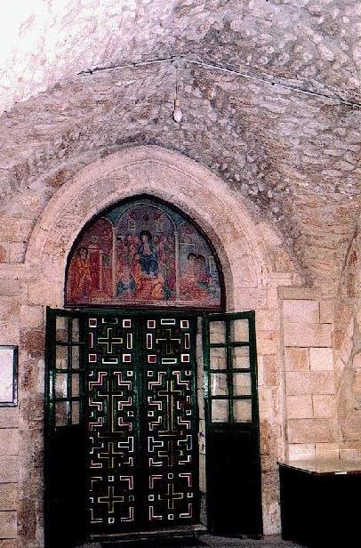
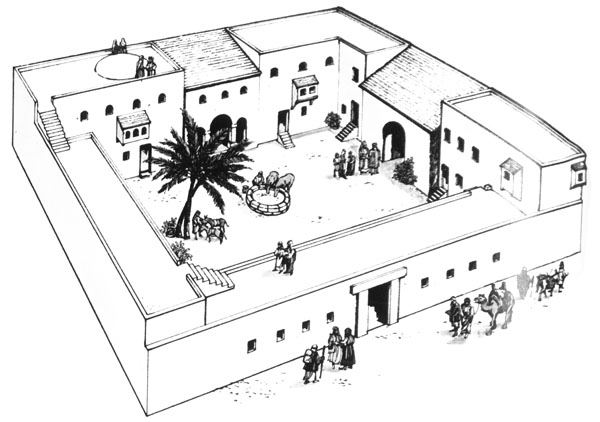

<title>Руслан Хазарзар. Сын Человеческий. Глава сорок девятая</title>

<h2>49. Последняя ночь</h2>

Мы уже доказали, что так называемая тайная вечеря не была пасхальной<a
href="#_ftn1" name="_ftnref1">[1]</a>, а потому рассказ синоптиков о
приготовлении праздничной трапезы-сэдера (&#1505;&#1461;&#1491;&#1462;&#1512;
[с<b>э</b>-дэр] — <i>порядок</i>, <i>пасхальная трапеза</i>) является простым
вымыслом (Мф.26:17-19; Мк.14:12-16; Лк.22:7-13).

Вообще, следует отметить, что тайная вечеря могла состояться и не в четверг,
а в другой день, а евангелисты просто отнесли это торжественное событие на
момент, предшествующий аресту Основателя. Хотя, конечно, нет ничего
сверхъестественного и в том, что Иисус устроил вечерю именно в четверг или
устраивал ее ежедневно.

По всей вероятности, накануне своей казни, в четверг, Иисус, как и всегда,
проповедовал в Храме. Однако вечером Он не отправился сразу же в Вифанию, а
пошел вместе со своими учениками в один из иерусалимских домов на вечерю.

Древнее церковное предание от&nbsp;IV&nbsp;века гласит, что местом последней
вечери был дом в юго-западной части Иерусалима. Есть основания полагать, что
этот дом принадлежал богатой вдове Марии, матери Иоанна-Марка (Деян.12:12),
того самого Марка, которого считают автором второго Евангелия. Действительно,
Иисус и Его ученики во время праздников, когда в столице пребывало множество
паломников, всегда находят приют: накануне Пасхи — в данном случае; накануне и
при наступлении праздника Шабуот (Деян.1:13; 2:1-40) — несколько недель спустя.
То, что это один и тот же дом, — вполне вероятно, ибо в праздничные дни весьма
трудно было найти свободный от паломников дом или свободное помещение. Ответ на
вопрос: кому принадлежит этот дом? — мы находим в двенадцатой главе Деяний
апостолов, которая повествует, что опять же в праздничные дни Пасхи Петр
каким-то чудом выбрался из темницы, куда был заточен Иродом Агриппой&nbsp;I, и
сразу же пришел в дом Марии. Лука не называет мужа Марии, и это является веским
поводом считать ее вдовой. Она содержала дом в столице и имела слуг
(Деян.12:13), а значит, была богата.

&nbsp;

 Иерусалим. Предполагаемый дом Иоанна-Марка

&nbsp;

Почему же, спрашивается, ее сына считают вторым
евангелистом? А потому что только в Евангелии от Марка содержится рассказ о
том, что некий юноша (&#957;&#949;&#945;&#957;&#943;&#963;&#954;&#959;&#962;&nbsp;&#964;&#953;&#962;),
«завернувшись по нагому телу в покрывало», следовал за арестованным Иисусом; а
когда воины схватили его, то «он, оставив покрывало, нагой убежал от них»
(Мк.14:51-52). Иисуса арестовали после вечери, и поэтому Марк, сын Марии,
действительно мог находиться во время ареста рядом с Основателем. А потому было
решено, что если об этом эпизоде знает только второй евангелист, то он и
является тем юношей. Однако историчность данного эпизода подвергается большому
сомнению, ибо весь этот рассказ о юноше мог быть написан из догматических
соображений, чтобы приурочить его к пророчеству Амоса: «И самый отважный из
храбрых убежит нагой в тот день» (Ам.2:16). Поэтому утверждать, что &#957;&#949;&#945;&#957;&#943;&#963;&#954;&#959;&#962;&nbsp;&#964;&#953;&#962;
второго Евангелия и Секундус — одно и то же лицо, мы не имеем полного права.

Квартус рассказывает, что Иисус на тайной вечере
омыл своим ученикам ноги (Ин.13:4-17), но этот рассказ, как показал Д.&nbsp;Ф.
Штраус<a href="#_ftn2" name="_ftnref2">[2]</a>, весьма сомнителен с
исторической точки зрения. Синоптики, наоборот, повествуют, что на этой вечере
Он учредил евхаристию. Однако мы уже доказали, что Иисус не устанавливал обряда
благодарения в качестве некоторого таинства, просто Он, как обычно,
благословлял хлеб и вино, называя их своим телом и своей кровью.

Евангелисты рассказывают, что в эту ночь Иисус предсказал, что ученики
оставят Его, а Петр отречется (Мф.26:31-35; Мк.14:27-31; Лк.22:31-34;
Ин.13:36-38). Вполне возможно, что Основатель пытался сдерживать чрезмерную
самонадеянность, которую Симон Бариона проявлял по различным случаям, но
кажется невероятным, чтобы Иисус дал ему предостережение накануне своей смерти
и притом в вышеозначенной форме. Это тем более невероятно, что в указании на
пение петуха явно сказывается элемент легендарности. Скорее можно предположить,
что малодушие учеников Иисуса впоследствии было истолковано как
предопределенный Богом факт. Также и все речи Иисуса прощального характера и
борение в Гефсиманском саду (Мф.26:29,37-46; Мк.14:25,33-42; Лк.22:15-19,40-46;
Ин.13:20)<a href="#_ftn3" name="_ftnref3">[3]</a> мы не можем считать
историческими событиями накануне смерти Иисуса, ибо Он не мог знать точного
времени своего ареста.

Цельс говорит, что перед своим арестом Иисус
«скрывался тайно в бегах и был взят позорнейшим образом, преданный теми, кого
Он называл учениками. Не полагалось бы, чтобы Бог убегал и чтобы Его
приверженцы, общавшиеся с Ним, следовавшие Ему как учителю, оставили и предали
Того, Кого считали Спасителем, Сыном и Ангелом Величайшего Бога (&#952;&#949;&#959;&#8166; &#964;&#959;&#8166;
&#956;&#949;&#947;&#943;&#963;&#964;&#959;&#965;
&#960;&#945;&#8150;&#948;&#945; &#954;&#945;&#8054;
&#7940;&#947;&#947;&#949;&#955;&#959;&#957;)» (Цельс у Оригена. —
<i>Orig.</i>CC.II.9).

Евангелия рассказывают, что после вечери Иисус со своими учениками пришел в
Гефсиманский сад (&#1490;&#1468;&#1463;&#1514;&#1470;&#1513;&#1473;&#1456;&#1502;&#1461;&#1504;&#1464;&#1492; [Гат Ш’мэн&aacute;]) (Мф.26:36; Мк.14:32; Ин.18:1;
ср.&nbsp;Лк.22:39), и, по единодушному сообщению евангелистов, туда же приходит
отряд с целью арестовать Иисуса (Мф.26:47; Мк.14:43; Лк.22:47; Ин.18:3). При
этом синоптики говорят, что отряд состоял только из слуг иудейской
аристократии, а Квартус утверждает, что вместе с тем пришел отряд римлян (&#7969;&nbsp;&#963;&#960;&#949;&#8150;&#961;&#945;) во главе с
военным трибуном (&#967;&#953;&#955;&#943;&#945;&#961;&#967;&#959;&#962; =
tribunus cohortium), то есть начальником когорты (Ин.18:12). Однако,
спрашивается, кто послал римский гарнизон в Гефсиманию? Пилат? Но нам известно,
что наместник узнаёт об Иисусе лишь поутру. Таким образом, мы можем
утверждать, что римляне непричастны к аресту Иисуса. К тому же непонятно, зачем
понадобился тысячный отряд римских воинов для ареста небольшой группы Иисуса?
Достаточно было стражи Храма, которая состояла из двухсот человек — по двадцать
человек на каждые из десяти ворот Храма (<i>Jos.</i>CA.II.9).

Евангелисты утверждают, что стражу в Гефсиманию привел Иуда Искариот, но
учитывая, что Иуда, вероятно, является мифическим персонажем<a href="#_ftn4"
name="_ftnref4">[4]</a>, мы можем предположить, что стража уже поджидала Иисуса
в засаде: иудейским старейшинам наверняка было известно, что Иисус уходит на
ночлег в Вифанию, и они могли послать свой отряд к подножию Элеонской горы.

По сообщениям Евангелий, один из учеников Иисуса
(Квартус говорит, что это Петр) попытался оказать вооруженное сопротивление и
даже отсек одному из стражников ухо (Мф.26:51-54; Мк.14:47; Лк.22:49-51;
Ин.18:10-11). Однако кажется нелепым, что данный ученик после такого деяния не
был арестован. Вероятно, сопротивления вообще не было оказано. Достоверно
известно, что ученики Основателя, бросив Иисуса, просто-напросто бежали
(Мф.26:56; Мк.14:50; <i>Just.</i>Dial.53,106), а Петр, по-видимому, когда
появилась угроза его ареста, еще и отрекся от своего Учителя (Мф.26:58,69-75;
Мк.14:54,66-72; Лк.22:54-62; Ин.18:15-18,25-27).

После ареста Иисуса отвели в дом Ханана (Ин.18:12-13). О подробностях беседы
вождя священнической партии и Иисуса мы можем лишь догадываться, ибо Квартус
передает явно не исторический и ничего не значащий вариант этого
предварительного допроса (Ин.18:19-23). Вероятно, Ханан спрашивал Иисуса,
запрещал ли Он платить налог Риму, называл ли Он себя царем Израиля,
и&nbsp;т.&nbsp;д. (ср.&nbsp;Лк.23:2).

&nbsp;

&nbsp;

Богатый еврейский дом эпохи Христа

&nbsp;

После этой беседы Иисус провел в заточении под стражей людей первосвященника
остаток ночи (Ин.18:24). Возможно, ночью над Ним издевались (Мф.26:67-68;
Мк.14:65; Лк.22:63-65), хотя эти издевательства могли быть приурочены
евангелистами к словам Второисаии: «Я предал хребет Мой биющим и ланиты Мои
поражающим; лица Моего не закрывал от поруганий и оплевания» (Ис.50:6).

&nbsp;

<a href="#_ftnref1" name="_ftn1">[1]</a> См. <a
href="41">§ 41</a>.

<a href="#_ftnref2" name="_ftn2">[2]</a> Strau&szlig;&nbsp;D.&nbsp;F.
<i>Das Leben Jesu f&uuml;r das deutsche Volk bearbeitet</i>.
3te&nbsp;Auflage. Leipzig: Brockhaus, 1874. S.&nbsp;542–547.

<a href="#_ftnref3" name="_ftn3">[3]</a> Стихи Лк.22:43-44, как мы
уже отмечали, отсутствуют в древнейшем папирусе III&nbsp;века (р75), в Александрийском, Ватиканском и
других кодексах.

<a href="#_ftnref4" name="_ftn4">[4]</a> См. <a
href="44">§ 44</a>.

<a href="index">Оглавление</a> <a href="50">Далее</a>

