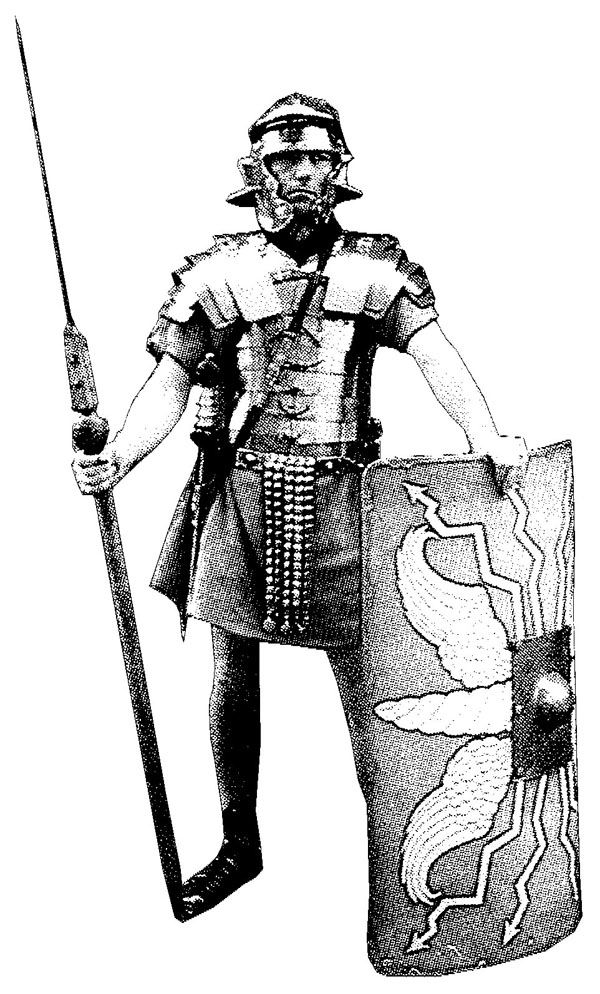
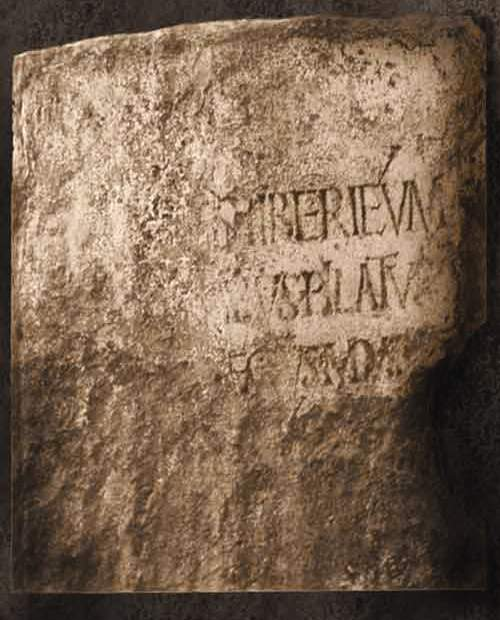
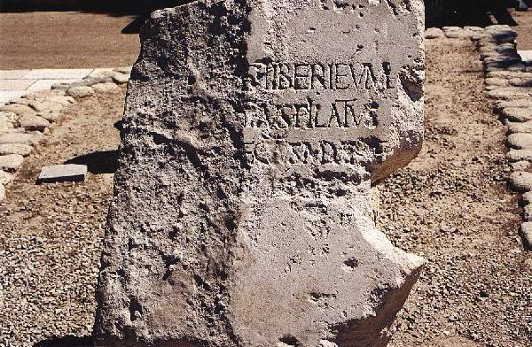
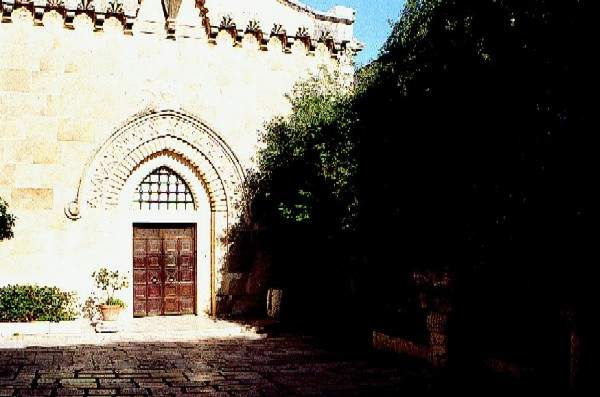
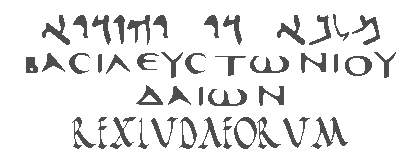

<title>Руслан Хазарзар. Сын Человеческий. Глава пятидесятая</title>

<h2>50. Jus Pilati</h2>

<h3>Понтий Пилат</h3>

Резиденция римских наместников находилась не в иудейской столице, а в
Кесарии Приморской, за сотню километров от Иерусалима. Когда римляне завоевали
Палестину, Кесария еще именовалась Стратоновой башней. Помпей объявил ее
независимым городом и включил в состав римской провинции, однако Юлий Цезарь
отдал ее Ироду Великому (<i>Jos.</i>AJ.XIV.4:4; XV.7:3). Когда Ирод уже был
царем Иудеи, он приступил к перестройке Стратоновой башни и
к&nbsp;10&nbsp;или&nbsp;9&nbsp;г. до&nbsp;н.&nbsp;э. она была заново отстроена.
Теперь кругом всей гавани тянулись дома из белого мрамора. Среди них возвышался
холм, на котором стоял храм в честь Юлия Цезаря. В этом храме находились две
статуи: одна из них олицетворяла Рим, а другая изображала самого Юлия. Ирод
Великий построил также в городе театр, равно как и амфитеатр за городом у южной
оконечности гавани. Вследствие своей красоты и дороговизны материалов,
затраченных на перестройку города, Стратонова башня получила название Кесарии
(<i>Jos.</i>AJ.XV.8:5; 9:6).

Наместник Иудеи, Идумеи и Самарии Понтий (Pontius), прозванный Пилатом
(Pilatus), вероятно, вследствие пожалованного ему или одному из его предков
почетного дротика (pilum), был неплохим администратором, потому и удержал свой
пост целых десять лет (<i>Jos.</i>AJ.XVIII.4:2).

Praefectus provinciae Judaeae мог казнить виновных и даже невиновных в
пределах своих владений, но должность его была не столь уж высока, ибо он
находился под надзором имперского легата Сирии (<i>Jos.</i>AJ.XVIII.1:1; 4:2).
В подчинении наместника находились военные силы, о которых мы скажем несколько
слов.

Римский <i>легион</i> (legio — букв. <i>набор</i>) подразделялся на 10
<i>когорт</i> (cohors). Первая когорта включала в себя 1110 пехотинцев и 132
всадника, остальные девять — по 555 пехотинцев и 66 всадников. Когортой
командовал <i>трибун</i> или старший <i>центурион</i> (<i>кентурион</i>).
Первая когорта имела 10 штатных центурионов (centuriones), остальные девять —
по&nbsp;5. Кроме легионов, римская пехота состояла также из <i>вспомогательных
войск</i> (auxilia), которые посылались племенами, находившимися в союзных или
договорных отношениях с Римом. По своем вооружению, обучению и дисциплине эти
отряды мало чем отличались от легионов. Наряду с ними имелись и так называемые
<i>нумери</i> (numeri) — части, комплектовавшиеся из малороманизированных
племен и народов и сохранявшие свое вооружение, организацию и технику. Однако
нумери широко распространились лишь к&nbsp;III&nbsp;веку н.&nbsp;э.
(<i>Vegetius.</i>Epitoma rei militaris.II.1,2,6,8).

&nbsp;

&nbsp;

Римский воин

&nbsp;

Наместники Иудеи в мирное время имели в своем
подчинение <i>только вспомогательные войска</i><a href="#_ftn1"
name="_ftnref1">[1]</a>, ибо римские легионы находились в Сирии — в подчинении
имперского легата.

Уже в первые годы своего правления Пилат, отправляясь из Кесарии Приморской
в Иерусалим на зимовку, внес во дворец Ирода позолоченные щиты (signa) — символ
Римской империи. Иосиф Флавий утверждает (<i>Jos.</i>AJ.XVIII.3:1), что на них
были изображения императора. Филон Александрийский, напротив, говорит, что «не
было на них никаких изображений, ни чего-либо другого кощунственного, за
исключением краткой надписи: мол, посвятил такой-то в честь такого-то»
(<i>Philo.</i>Leg. ad Gaium.38).

Как бы то ни было, иудеи стали требовать, чтобы Пилат снял римские щиты и не
осквернял заповедей Торы. По версии Филона, иудеями по этому поводу даже было
послано письмо императору Тиберию. Пилат же, однако, приказал бунтовщикам
разойтись по домам, пригрозив, что в противном случае применит оружие. Но тут
случилось непредвиденное: евреи не дали запугать себя и все как один, обнажая
спины, бросились на землю в знак того, что предпочитают погибнуть, нежели
отступить (<i>Jos.</i>BJ.II.9:2-3).

То ли фанатизм евреев (<i>Jos.</i>AJ.XVIII.3:1), то ли приказ Тиберия
(<i>Philo.</i>Leg. ad Gaium.38), — что-то заставило Пилата вернуть
императорские знаки обратно в Кесарию (ср.&nbsp;<i>Jos.</i>BJ.II.9:2-3).

Впоследствии Пилат соорудил в Иерусалиме водопровод. На это он употребил
деньги святилища Храма — так называемый <i>Корб&aacute;н</i> (&#1511;&#1464;&#1512;&#1456;&#1489;&#1468;&#1464;&#1503; — букв. <i>жертва</i>). Водопровод питался ключами местности
Эль-Аррув, находившимися на расстоянии двухсот стадий<a href="#_ftn2"
name="_ftnref2">[2]</a> от города. Однако население воспротивилось этому, и
множество иудеев собралось около рабочих, занятых сооружением водопровода, и
стало требовать, чтобы префект оставил свой план. Пилат же распорядился
переодеть значительное число воинов в еврейскую одежду, дал им дубины и бичи,
которые они должны были спрятать под хитоном, и велел им окружить толпу со всех
сторон. Толпа, в свою очередь, получила приказание разойтись. Но так как она
продолжала поносить Пилата, то он подал воинам условный знак, и солдаты
принялись за дело гораздо более рьяно, чем то было желательно самому Пилату.
Работая дубинами и кнутами, они одинаково поражали как мятежников, так и
совершенно невинных людей. Иудеи, однако, продолжали держаться стойко; но так
как они были безоружны, а противники их вооружены, то многие из них тут же были
убиты, а многие ушли, покрытые ранами. Таким образом было подавлено возмущение
(<i>Jos.</i>AJ.XVIII.3:2; BJ.II.9:4).

Такие кровопролития Пилат производил не единожды. Он был первым из
наместников, который начал посягать на неприкосновенность еврейской религии.
По свидетельству Филона Александрийского (<i>Philo.</i>Leg. ad Gaium.38), Ирод
Агриппа&nbsp;I в письме к императору Калигуле обвинял Пилата в продажности и
хищничестве, в разорении целых фамилий, в казни множества людей, не
подвергнутых даже никакому суду, во всех низостях и ужасах, затейщиком которых
был Пилат и которые превосходили все пределы.

А волнения происходили не только в Иудее, но и в Самарии<a href="#_ftn3"
name="_ftnref3">[3]</a>. Так, некий человек побудил самаритян собраться к нему
на гору Гаризим (&#1490;&#1468;&#1456;&#1512;&#1460;&#1494;&#1460;&#1497;&#1501;) и стал уверять их, что покажет им зарытые здесь священные
сосуды Моисея (ср.&nbsp;2&nbsp;Макк.2:4-8). Самаритяне вооружились, поверив
этой басне, и расположились в деревушке Тиратане (&#932;&#953;&#961;&#945;&#952;&#945;&#957;&#940;). Тут же к ним
примкнули новые пришельцы, чтобы возможно большей толпой подняться на гору.
Однако Пилат предупредил это действие, выслав вперед воинские отряды, которые,
неожиданно напав на собравшихся в деревушке, часть из них перебили, а часть
обратили в бегство. При этом они также захватили многих в плен, и Пилат
распорядился казнить самых влиятельных из них (<i>Jos.</i>AJ.XVIII.4:1).

После этого самаритянские старейшины явились к бывшему консулу Вителлию,
который теперь был имперским легатом Сирии, и стали обвинять Пилата в казни их
единоплеменников, говоря, что последние пошли в Тиратану вовсе не с целью
отделиться от Рима, а для того, чтобы уйти от насилий Пилата. Тогда Вителлий
послал Марцелла (Marcellus), одного из своих приближенных, в Иудею, чтобы
принять там бразды правления, Пилату же велел ехать в Рим для ответа перед
императором в возводимых на него обвинениях. Понтий Пилат отправился в Рим, ибо
не смел ослушаться приказания Вителлия, но прежде, чем низложенный наместник
успел прибыть в столицу Империи, Тиберий умер (<i>Jos.</i>AJ.XVIII.4:2).

По-видимому, после своей отставки Пилат получил от Гая Калигулы новое
назначение. Впрочем, Евсевий, ссылаясь на неких греческих писателей,
утверждает: «Следует обратить внимание, что тот самый Пилат, живший во времена
Спасителя, впал, по преданию, при императоре Гае в такие беды, что вынужден был
покончить с собой и собственной рукой наказать себя: суд Божий, видимо, не
замедлил настигнуть его» (<i>Eus.</i>HE.II.7). С этой легендой в некоторой мере
согласуется апокриф Смерть Пилата (Mors Pilati), согласно которому Пилат
покончил самоубийством, когда узнал, что осужден на казнь по приказу Тиберия.
Однако у нас нет оснований доверять этой христианской легенде. Еще меньше
оснований доверять апокрифу Обращение Пилата (Anaphora Pilati), согласно
которому Пилат не только был осужден по приказу Цезаря, но и обезглавлен.

&nbsp;

 Надпись Пилата
 (Национальный музей Израиля)

&nbsp;

Во времена псевдонаучного атеизма советского периода одно время даже
господствовала идея, якобы не только Иисус, но и Пилат был мифологической
личностью, хотя о Понтии подробно рассказывал Иосиф Флавий и упоминал Тацит.
Наконец, недоразумение было исчерпано, когда в июне 1961 года итальянские
археологи под руководством доктора Антонио Фровы при раскопках амфитеатра
древней Кесарии Приморской обнаружили так называемую <i>надпись Пилата</i>. Эта
монументальная надпись в четыре строки на известняковой плите размером
82&nbsp;x&nbsp;65&nbsp;<i>см</i> является частью большего освящения Тиберия<a
href="#_ftn4" name="_ftnref4">[4]</a>. Предположительное прочтение надписи:
«[Dis augusti]s Tiberieum [...&nbsp;Po]ntius Pilatus [...&nbsp;praef]ectus
Juda[ea]e [...&nbsp;fecit d]e[dicavit]». Показательно, что здесь Пилат
именуется не прокуратором, а префектом<a href="#_ftn5" name="_ftnref5">[5]</a>.
Ныне надпись Пилата хранится в Национальном музеи Израиля (Иерусалим), точная
копия — в Кесарии.

&nbsp;

 Надпись Пилата
 (копия, Кесария)

&nbsp;

&nbsp;

<h3>&#8009; &#946;&#945;&#963;&#953;&#955;&#949;&#8058;&#962;
&#964;&#8182;&#957; &#7992;&#959;&#965;&#948;&#945;&#943;&#969;&#957;</h3>

Наместник, вероятно, периодически прибывал из Кесарии в Иерусалим перед
иудейскими праздниками, чтобы предотвращать мятежи зелотов. Эти волнения
особенно часто вспыхивали во время праздников, когда в столице скапливалось
множество паломников.

Издавна считалось, что в день распятия Христа
был хамсин (&#1495;&#1463;&#1502;&#1456;&#1505;&#1460;&#1497;&#1503;)<a href="#_ftn6" name="_ftnref6">[6]</a> — сухой и жаркий
юго-восточный ветер, несший с собой много песка и пыли. Вероятно, именно
хамсином пытались объяснить «наступление тьмы» (Мф.27:45; Мк.15:33; Лк.23:44;
Evangelium Petri.15), однако оно, по-видимому, приурочено к словам пророка
Амоса: «И будет в тот день, говорит Господь Бог: произведу закат солнца в
полдень и омрачу землю среди светлого дня» (Ам.8:9).

7 апреля 30 года, рано утром, поддерживающая римлян иудейская знать привела
Иисуса в преторий<a href="#_ftn7" name="_ftnref7">[7]</a> — в бывший дворец
Ирода (<i>Philo.</i>Leg. ad Gaium.38; <i>Jos.</i>BJ.II.14:8) — и обвинила
Основателя перед Пилатом в заговоре против римского владычества (Лк.23:1-2).
Хотя Иисус и не называл себя царем Иудеи, но, называя себя Мессией, Он
автоматически присваивал себе титул царя. В Книге пророка Михея прямо сказано:
«И ты, Вифлеем-Ефрафа, мал ли ты между тысячами Иудиными! из тебя произойдет
Мне Тот, Который должен быть Владыкою в Израиле» (Мих.5:2).

Яхве — Бог, созданный израильским народом. И хотя переименовали в
Синодальном переводе Ветхого завета <i>Яхве</i> на <i>Господь</i>, Он не
изменил своей сути. Иисус называл Отцом Небесным не кого-нибудь, а иудейского
Бога Яхве. Поскольку Яхве создали израильтяне, то, разумеется, себя они
поставили «избранным» народом перед тем же Яхве. В Танахе Иегова объявляет
Аврааму: «Я произведу от тебя великий народ, и благословлю тебя, и возвеличу
имя твое» (Быт.12:2). Далее Он говорит Израилю: «Народ святой ты у Яхве, Бога
твоего: тебя избрал Яхве, Бог твой, чтобы ты был Ему народом, избранным (&#1505;&#1456;&#1490;&#1467;&#1500;&#1468;&#1464;&#1492;) из всех народов, которые на лице земли»
(Втор.7:6,&nbsp;<i>РХ</i>). Всюду в Танахе подчеркивается монопольный характер
избранности израильтян: «И истребишь ты все народы, которые Яхве, Бог твой,
дает тебе: да не сжалится глаз твой над ними» (Втор.7:16,&nbsp;<i>РХ</i>). «Ты
распространишься направо и налево, и потомство твое завладеет народами и
населит опустошенные города» (Ис.54:3).

В период постоянного угнетения со стороны иноземцев израильтяне ждали от
своего Бога спасения, и спасения именно для «избранного» народа; поэтому Ветхий
завет, который писался израильтянами, пронизан обещаниями дать «избранному»
народу привилегированное положение и послать ему своего Помазанника, то есть
Мессию. В Танахе нет обещаний благ после смерти в раю (до этого додумались
позже, и прежде всего под влиянием греческой философии), все блага обещались в
миру, в земной жизни. Поэтому Яхве «обещает» послать Помазанника на землю
именно в качестве царя Израиля, при котором «избранный» народ будет процветать
и жить счастливо, как он жил во времена помазанного царя Давида или даже лучше.
Значит, называя себя Мессией, Иисус называл себя царем (Мф.25:34). И несмотря
на то, что Иисус, вероятно, не стремился занять престол (Ин.6:15), иудейская
знать не лжесвидетельствовала, указывая Пилату, что Иисус называет себя царем
Иудеи (ср.&nbsp;Деян.17:7).

Очевидно, что для Пилата дело было вполне ясно. С точки зрения римской
юстиции, здесь налицо было crimen laesas majestatis. Когда префект как
представитель императора казнит Иисуса, он только исполняет свою обязанность.
Масса иудейства, наоборот, не имела никакого основания негодовать на человека,
который восстал против римского владычества и призывал к тому, чтобы не платить
кесарю податей. Если Иисус действительно делал это, то Он поступал в духе
зелотизма, преобладающего тогда в Иерусалиме. Таким образом, если считать
отмеченные в Евангелиях обвинения правильными, то иудеи должны были относиться
к Иисусу с симпатией, а римский наместник, напротив, должен был осудить Его.
Именно такие отношения иудеев и римлян можно проследить к другим людям,
назвавшим себя Мессией или близким к этому титулу, — к Иуде Галилеянину
(<i>Jos.</i>AJ.XVIII.1:1,6; XX.5:2; ср.&nbsp;Деян.5:37), Февде
(<i>Jos.</i>AJ.XX.5:1; ср.&nbsp;Деян.5:36), Бар-Кохебе
(<i>Dio Cass.</i>LXIX.12 и&nbsp;сл.; <i>Eus.</i>HE.IV.6) и&nbsp;др.

Но Пилат не находит никакой вины за Иисусом, хотя Основатель не отрицает ее.
И это уже довольно странно. Но еще более странным является другое
обстоятельство: несмотря на то, что Пилат не признает вины Иисуса, он не
запрещает казни.

Иногда случалось, что наместник находил данное политическое дело весьма
запутанным, чтобы самому принять решение. Но возможно ли, чтобы представитель
Рима, желая выпутаться из затруднительного положения, <i>спрашивал собравшуюся
около дворца толпу</i>, чт&oacute; делать
ему с обвиняемым? Если он не хотел сам осудить к смерти бунтовщика, то должен
был отослать его на суд в Рим. Так поступил, например, прокуратор Антоний
Феликс (52–60&nbsp;гг.) с вождем иерусалимских зелотов Елеазаром
(<i>Jos.</i>AJ.XX.8:5).

Так и Пилат мог отправить Иисуса в Рим. Зато роль, которую заставляет
наместника играть первый евангелист, просто смешна: представитель императора
Тиберия, господин над жизнью и смертью, <i>просит случайно собравшуюся перед
преторием толпу, чтобы она разрешила ему оправдать и освободить
Обвиняемого</i>, и в ответ на отказ заявляет: «Ну, убивайте Его, я не виновен в
этом», — такой наместник действительно вызывает удивление. Кроме того, Пилат
заходит так далеко, что по еврейскому обычаю (Втор.21:1-9; Пс.25:6 =
Т’hиллим.26:6) умывает руки перед народом и говорит: «Невиновен я в крови
Праведника Сего; смотр<b>и</b>те вы» (Мф.27:24). Роль, которую играет Пилат в
первом Евангелии, очень мало подходит историческому Пилату. В письме к
императору Калигуле Ирод Агриппа&nbsp;I, по свидетельству Филона, называет
Пилата человеком «от природы жестоким, самоуверенным и неумолимым» и упрекает
его в «лихоимстве, бесчинствах, злобе, <i>беспрерывных казнях без суда</i>
(выделено мною. — <i>Р.Х.</i>), ужасной и бессмысленной жестокости»
(<i>Philo.</i>Leg. ad Gaium.38).

&nbsp;

<h3>Варавва</h3>

Евангелисты, видимо, чувствовали, что приписывают римскому наместнику
слишком странную роль, и поэтому они искали какой-нибудь предлог, чтобы сделать
ее более достоверной. Так, Примус рассказывает, что, дескать, жена Пилата
«послала ему сказать: не делай ничего Праведнику Тому, потому что я ныне во сне
много пострадала за Него» (Мф.27:19). В апокрифе <i>Acta Pilati</i> она уже
обретает имя — Клавдия Прокула (Claudia Procula); и мы сразу же вспоминаем о
Кальпурнии (Calpurnia), жене Юлия Цезаря, которая, вследствие виденного ею
накануне сна, тоже просила и предостерегала мужа не выходить из дома в тот
день, в который он был убит (<i>Suet.</i>Julius.18).

Терциус предлагает другую легенду: Пилат, якобы
не желая судить Иисуса, отсылает Его к Ироду Антипе, а тетрарх, насмеявшись над
Основателем, не выносит, однако, обвинительного приговора и отсылает Иисуса
назад к Пилату (Лк.23:7-12,15; cf. Evangelium Petri.1-5). Этим рассказом
Терциус защищает и Пилата, и Иисуса, ибо невиновность Основателя в этом случае
удостоверяют два верховных чиновника светской власти, тем самым подтверждая
поговорку: testis unus, testis nullus.

Однако самой известной историей из этой серии является рассказ о разбойнике
Варавве (Мф.27:15-18,20-21,26; Мк.15:6-15; Лк.23:16-19; Ин.18:39-40). В
Евангелиях появляется версия, будто бы иудеи ожидали, что Пилат отпустит в
честь Пасхи одного из осужденных. Но, насколько нам известно, обычая отпускать
преступника в праздники никогда не было. Кроме того, этот обычай находится в
противоречии с римскими учреждениями, которые не давали наместнику права
оправдания человека, безусловно виновного перед Римской империей.

На этом Варавве следует заострить наше внимание. Само прозвище
<i>Варавва</i> является чем-то вроде отчества, а имя этого человека в
большинстве изданий Нового завета вообще не упоминается. Однако из некоторых
рукописей мы с удивлением узнаем, что Варавву звали <i>Иисусом</i>. Так, имя
<i>Иисус</i> применительно к Варавве мы находим в Тбилисском кодексе Koridethi
(IX&nbsp;в.), в Армянской версии<a href="#_ftn8" name="_ftnref8">[8]</a> и в
ряде минускульных рукописей X – XV&nbsp;веков<a href="#_ftn9"
name="_ftnref9">[9]</a>. Хотя это чтение встречается только в Евангелии от
Матфея, нельзя сомневаться, что словосочетание <i>Иисус Варавва</i> восходит
ad traditionem antiquam, потому что еще Ориген восклицал: «Имя Иисус, вероятно,
еретиками прибавлено, ибо оно неприлично злодею» (<i>Orig.</i>In Matth. Comm.
ser.121).

Слово <i>Варавва</i> некогда я возводил к арамейскому &#1489;&#1468;&#1463;&#1512;&#1470;&#1512;&#1463;&#1489;&#1468;&#1464;&#1488; (Бар-Раб­б&aacute; — букв. <i>сын учителя</i>) или даже к
&#1489;&#1468;&#1463;&#1512;&#1470;&#1512;&#1463;&#1489;&#1468;&#1464;&#1503; (Бар-Рабб&aacute;н — букв. <i>сын учителя нашего</i>), как
оно читается в Евангелии Евреев (Evangelium secundum Hebraeos. —
<i>Hier.</i>Matth.27:16), а не к &#1489;&#1468;&#1512;&#1470;&#1488;&#1463;&#1489;&#1468;&#1464;&#1488; (Бар-Абб&aacute; — букв. <i>сын отца</i>), как следует из
канонического греческого написания &#914;&#945;&#961;&#945;&#946;&#946;&#8118;&#962; (Барабб&aacute;с) (Мк.15:7). Однако, спрашивается, может
быть, канон прав: правильное чтение — <i>Бар-Абба</i>, которое следует
перевести не просто как <i>сын отца</i>, а как <i>Сын Отца</i>
(<i>Небесного</i>)?.. Таким образом, Иисус Варавва превращается в Иисуса Сына
Божия, в Иисуса Христа!

Тут, действительно, есть над чем задуматься. Что же получается? Если
Варавву, то есть Иисуса Христа, Пилат освободил (Мф.27:26), то тогда кого же
распяли? Уж не «благоразумного» ли разбойника?.. Прямо целый детектив
получается: кого-то распяли, а думали, что распяли Иисуса; а сам Иисус на
третий день является своим ученикам, живой и невредимый, как будто
воскресший...

Я не буду развивать эту идею, ибо не ставил перед собой задачи написать
бестселлер. Возможно, некоторые «исследователи» ухватятся за эту версию
«Воскресения», им и флаг в руки.

Я же считаю, что в данном случае произошло какое-то раздвоение личности
Основателя. Иисус, вероятно, объяснял Пилату направленность своей деятельности,
при этом называя, как обычно, Бога Отцом. Пилат, ничего не поняв из идеализма
Иисуса, но, однако, отметив, что Тот постоянно говорит о каком-то великом Отце,
иронически окрестил Иисуса <i>сыном отца</i>.

Вполне возможно, что Пилат, усмотрев в Иисусе полного идеалиста-фантазера,
не опасного для римской государственности, действительно предложил иудейским
старейшинам отпустить этого <i>сына отца</i> на все четыре стороны. Однако
враги Иисуса быстро убедили Пилата, что Иисус опасен для общественного
спокойствия, и даже намекнули, что он, Пилат, плохо исполняет обязанности
наместника (Ин.19:12). Иисус был осужден на смерть. А прозвище <i>сын отца</i>
(Варавва) осталось в умах людей и передавалось из уст в уста по правилу
испорченного телефона, приобретая человеческие черты и характерные качества.
Результатом такой вольной устной передачи информации явилось то, что безличное
прозвище обрело себе человека — разбойника Варавву. Короче, как в Библии: и
слово стало плотию. Именно таким образом я разрешаю все трудности, связанные с
этим пресловутым Вараввой.

&nbsp;

<h3>Суд</h3>

Однако вернемся к суду Пилата. Наместник, вместо того, чтобы произнести
приговор, взывает якобы о праве помилования к случайно собравшейся толпе!
Только теологи могут верить в возможность таких юридических отношений. Однако
тут же встает новая несообразность: иудеи, которые якобы имели право
помилования, не довольствуются освобождением Вараввы, они требуют распятия
Иисуса (Мф.27:21-23; Мк.15:8-14; Лк.23:16-23; Ин.18:39-40; 19:15). Евангелисты,
очевидно, думали, что из права помилования кого-либо вытекает право осудить
другого. Но иудейская толпа не имела ни права помилования, ни тем более права
осуждения.

После этого дается такое изображение толпы, которая до такой степени
ненавидит Иисуса, что она охотнее готова помиловать убийцу, нежели кроткого
Мессию (Лк.23:23). Надо вспомнить, что это та самая толпа, которая, согласно
Евангелиям, еще несколько дней назад кричала Ему «hошана!» как царю, которая
устилала путь Его своими одеждами (Мф.21:8-9; Мк.11:8-10; Ин.12:12-13,19).
Именно эта привязанность к Нему народной массы была, как утверждают
евангелисты, главной причиной, почему аристократы искали смерти Иисуса, почему
они боялись схватить Его днем и выбрали для этого ночь (Мф.21:46; Мк.11:18;
12:12; 14:1-2; Лк.19:47-48; 20:19; 22:6).

И вот эта же самая толпа так же единодушно охвачена теперь чувством дикой
ненависти к Иисусу, к Человеку, обвиняемому в преступлении, которое в глазах
всякого иудейского патриота делало Его объектом самого высокого уважения, то
есть в попытке освободить Иудею от иноземного ига. Что же могло вызвать такую
внезапную перемену настроения? Евангелия не сообщают на этот счет ничего, кроме
трех незначительных слов. Терциус и Квартус не дают никакой мотивировки. Примус
и Секундус говорят, что «первосвященники возбудили народ» (Мф.27:20; Мк.15:11).
Эти замечания только показывают, в какой степени раннехристианские писатели
утратили понимание всяческих отношений в народе. Но положение получается еще
более бессмысленным, если принять во внимание политические условия того
времени. В противоположность всем остальным частям Римской империи, Иудея
представляла тогда картину необыкновенно интенсивной политической жизни.
Политико-религиозные партии были хорошо организованы и меньше всего напоминали
плохо связанную массу, которую можно легко увлечь. Низшими слоями Иерусалима
безраздельно владел зелотизм, который находился в резкой оппозиции к саддукеям
и был охвачен фанатической ненавистью к римлянам (<i>Jos.</i>AJ.XVIII.1:1).
Если бы «первосвященникам» даже удалось «возбудить» некоторые элементы из
народа против Иисуса, то они не могли бы добиться такого единодушия и в лучшем
случае вызвали бы ожесточенную уличную борьбу (ср.&nbsp;Ин.7:43).

Однако после того, как евангелисты умудрились представить бесчеловечного
Пилата в образе невинной жертвы, а иудеев — главными виновниками распятия
Иисуса, начинаются новые несообразности: Иисуса подвергают истязаниям и осыпают
насмешками, но это, согласно Евангелиям, делают уже не иудеи, а солдаты того
самого Пилата, который только что объявил Его невиновным. Римский наместник
теперь не только приказывает своим солдатам распять Иисуса, но и разрешает
надругаться над Ним. И тут отчетливо проступает другой — возможно,
первоначальный — характер всей катастрофы. Ожесточенными врагами Иисуса уже
являются солдаты римского наместника, а мотивом их ненависти и насмешек служит
Его попытка восстановить еврейскую монархию и сбросить римское владычество
(Мф.27:27-31; Мк.15:16-20). Создается впечатление, что версию суда Пилата
описал фанатичный антииудей, а версию бичевания — фанатичный иудейский
патриот.

&nbsp;

 Иерусалим. Место бичевания Иисуса

&nbsp;

Итак, противоречий больше чем достаточно. Но из всего вышесказанного ясно,
что евангельскую версию суда Пилата нельзя считать исторической<a href="#_ftn10"
name="_ftnref10">[10]</a>.

&nbsp;

<h3>Via dolorosa</h3>

После того, как воины Пилата надругались над Иисусом, они повели Его к месту
казни. По римскому закону, сам распинаемый должен был нести орудие своего
распятия. Сам крест состоял из кола (palus, simplex), который вкапывали в
землю, и перекладины (иногда ее называли: patibulum), которую укрепляли на нем.
Так как сам кол иногда вкапывали на месте казни еще до прихода туда
распинаемого (<i>Titus Maccius Plautus</i>. Carbonaria, fr.&nbsp;2;
<i>Cicero</i>. In Verrem. II.5:162; <i>Seneca Junior</i>. Ad Marciam de
consolatione.20:3; <i>Jos.</i>BJ.VII.6:4), осужденный в таких случаях должен
был нести только перекладину (cf. <i>Plutarchus</i>. De sera numinis vindicta.
554a; <i>Artemidorus</i>. Onirocriticon. II.56)<a href="#_ftn11"
name="_ftnref11">[11]</a>.

Centurio supplicio praepositus (<i>казнью заведующий сотник</i>) нес впереди
шествия на Голгофу крестную дощечку (titulus crucis) с надписью, означающей
«вину» Иисуса. Надпись была выполнена на трех языках — на арамейском<a
href="#_ftn12" name="_ftnref12">[12]</a>, греческом и латинском (Ин.19:20)<a
href="#_ftn13" name="_ftnref13">[13]</a>. В Евангелиях мы находим разночтения
по поводу самой надписи. Обратимся к самым древним спискам. Примус пишет: &#927;&#8023;&#964;&#972;&#962; &#7952;&#963;&#964;&#953;&#957;
&#7992;&#951;&#963;&#959;&#8166;&#962; &#8001;
&#946;&#945;&#963;&#953;&#955;&#949;&#8166;&#962; &#964;&#8182;&#957;
&#7992;&#959;&#965;&#948;&#945;&#943;&#969;&#957; (Мф.27:37). Секундус
приводит другой вариант: &#8009;
&#946;&#945;&#963;&#953;&#955;&#949;&#8058;&#962; &#964;&#8182;&#957;
&#7992;&#959;&#965;&#948;&#945;&#943;&#969;&#957; (Мк.15:26). Терциус
утверждает другое: &#8009;
&#946;&#945;&#963;&#953;&#955;&#949;&#8058;&#962; &#964;&#8182;&#957;
&#7992;&#959;&#965;&#948;&#945;&#943;&#969;&#957;
&#959;&#8023;&#964;&#959;&#962; (Лк.23:38). А у Квартуса мы находим
следующее: &#7992;&#951;&#963;&#959;&#8166;&#962; &#8001;
&#925;&#945;&#950;&#969;&#961;&#945;&#8150;&#959;&#962; &#8001;
&#946;&#945;&#963;&#953;&#955;&#949;&#8058;&#962; &#964;&#8182;&#957;
&#7992;&#959;&#965;&#948;&#945;&#943;&#969;&#957; (Ин.19:19). Итак,
первый и третий евангелисты приводят слово &#959;&#8023;&#964;&#959;&#962; (<i>этот</i>), однако Терциус
опускает слово <i>Иисус</i>. Неправильное понимание слова <i>Назорей</i> в
качестве уроженца города Назарета ставит под сомнение историчность варианта
Евангелия от Иоанна. Только слова <i>Царь Иудейский</i>, которые мы находим в
Евангелии от Марка, встречаются у всех евангелистов. По-видимому, именно
вариант Секундуса является исторически верным. Правда, мы должны опустить
артикль, ибо он внесен из догматических соображений для указания на Мессию.

В Танахе мы обычно встречаем выражение <i>царь Иудеи</i> (&#1502;&#1462;&#1500;&#1462;&#1498;&#1456;&nbsp;&#1497;&#1456;&#1492;&#1493;&#1468;&#1491;&#1464;&#1492; = арам. &#1502;&#1463;&#1500;&#1456;&#1499;&#1468;&#1464;&#1488;&nbsp;&#1491;&#1468;&#1460;&#1497;&nbsp;&#1497;&#1456;&#1492;&#1493;&#1468;&#1491;), а не <i>царь иудеев</i> &#1502;&#1462;&#1500;&#1462;&#1498;&#1456;&nbsp;&#1497;&#1456;&#1492;&#1493;&#1468;&#1491;&#1460;&#1497;&#1501;) = арам. &#1502;&#1463;&#1500;&#1456;&#1499;&#1468;&#1464;&#1488;&nbsp;&#1491;&#1468;&#1460;&#1497;&nbsp;&#1497;&#1456;&#1492;&#1493;&#1468;&#1491;&#1464;&#1497;&#1461;&#1488;), однако в период, когда Иудея потеряла
политическую самостоятельность, второе выражение, вероятно, стало более
распространенным, как это и следует из греческого текста Евангелий.

Таким образом, крестная надпись имела, по всей вероятности, следующий вид:

&nbsp;

&nbsp;

В Средние века возникла легенда о том, якобы некий еврей на <i>пути
страдания</i> Иисуса не дал Ему отдохнуть (а по многим версиям, даже ударил
Его) и за это был осужден Богом на вечную жизнь. Так появился &#1492;&#1463;&#1497;&#1468;&#1456;&#1492;&#1493;&#1468;&#1491;&#1460;&#1497;&nbsp;&#1492;&#1463;&#1504;&#1468;&#1460;&#1510;&#1456;&#1495;&#1460;&#1497;, Вечный Жид, Ahasverus.

&nbsp;

<a href="#_ftnref1" name="_ftn1">[1]</a> Renan&nbsp;E. <i>Vie de
J&eacute;sus</i>. Paris: Michel L&eacute;vy fr&egrave;res, 1863. P.&nbsp;407.
Даже тысяченачальник (&#967;&#953;&#955;&#943;&#945;&#961;&#967;&#959;&#962;)
римского гарнизона в Иерусалиме не имел римского гражданства по рождению
(Деян.22:28).

<a href="#_ftnref2" name="_ftn2">[2]</a> Так в <i>Иудейских
древностях</i> (<i>Jos.</i>AJ.XVIII.3:2); в <i>Иудейской войне</i>
(<i>Jos.</i>BJ.II.9:4) Иосиф определяет это расстояние
в&nbsp;400&nbsp;стадий.

<a href="#_ftnref3" name="_ftn3">[3]</a> См. <a
href="07#pvr"><i>Под властью Рима</i> в §&nbsp;7</a>.

<a href="#_ftnref4" name="_ftn4">[4]</a> Frova&nbsp;A.
<i>L’iscrizione di Ponzio Pilato a Caesarea</i>.&nbsp;//&nbsp;<i>Rendiconti
dell’Istituto Lombardo</i>. Accademia di Scienze e Lettere, XCV (1961),
p.&nbsp;419–434.

<a href="#_ftnref5" name="_ftn5">[5]</a> Procurator —
<i>попечитель</i>, <i>заведующий</i>, <i>управляющий</i>; прокуратор мог
заведовать доходами императора в провинции, быть управляющим имениями, быть
правителем государства-провинции. Praefectus — <i>начальник</i>,
<i>заведующий</i>, <i>смотритель</i>, <i>блюститель</i>; префект мог быть
военачальником, градоначальником или правителем государства-провинции,
заместителем консула. Надо отметить, что прокуратором именует Пилата только
Тацит (<i>Tac.</i>Ann.XV.44), хотя, по всей вероятности, в тот период наместник
назывался не прокуратором, а префектом (<i>Ельницкий&nbsp;Л.&nbsp;А.</i>
Кесарийская надпись Понтия Пилата и ее историческое
значение.&nbsp;//&nbsp;Вестник древней истории, 1965, №&nbsp;3. &#151;
Стр.&nbsp;144).

<a href="#_ftnref6" name="_ftn6">[6]</a> В переводе с арабского это
слово означает <i>пятьдесят</i>, ибо весной в пустыне хамсин обычно дует около
50-ти суток.

<a href="#_ftnref7" name="_ftn7">[7]</a> В Синодальном переводе это
слово употреблено в женском роде — <i>претория</i> (Ин.18:28); латинское слово
praetorium — среднего рода.

<a href="#_ftnref8" name="_ftn8">[8]</a> См.: <i>Das altarmenische
Evangelium</i>, hrsg. B.&nbsp;O.&nbsp;K&uuml;nzle.&nbsp;//&nbsp;<i>Europ&auml;ische
Hochschulschriften</i>&nbsp;33. Bern: Peter Lang,&nbsp;1984.

<a href="#_ftnref9" name="_ftn9">[9]</a> См.: <i>Codex 1 of the
Gospels and Its Allies</i>, ed. K.&nbsp;Lake.&nbsp;//&nbsp;<i>Texts and
Studies</i>&nbsp;7.3. Cambridge: Cambridge University Press,&nbsp;1902.

<a href="#_ftnref10" name="_ftn10">[10]</a> См.: Kautsky Karl.
<i>Der Ursprung des Christentums: eine historische Untersuchung</i>.
Stuttgart: Dietz, 1908. S.&nbsp;418&#150;432.

<a href="#_ftnref11" name="_ftn11">[11]</a> Свидетели Иеговы,
уцепившись за древние, до-римские, переводы греческих слов &#963;&#964;&#945;&#965;&#961;&#972;&#962; и &#958;&#973;&#955;&#959;&#957; (Деян.5:30; 10:39;
1&nbsp;Петр.2:24), пришли к нелепому выводу, якобы Иисус был распят не на
кресте, а на столбе без перекладины (см.&nbsp;русскоязычное издание журнала
<i>Свидетели Иеговы в двадцатом веке</i>, изд. Общества Watch Tower, 1994,
стр.&nbsp;13); вывод этот противоречит как археологическим, так и письменным
свидетельствам древности (Мф.27:37; Варн.9,12; <i>Ignatius</i>. Ad
Trallianos.11; <i>Just.</i>Apol.I.35; Dial.40,90,91,97;
<i>Iren.</i>Haer.II.36:2[24:4]; <i>Tert.</i> Apol.12:3; 16:7; Ad nationes.
I.12:3-4; Adversus Marcionem. III.22:6).

<a href="#_ftnref12" name="_ftn12">[12]</a> Я думаю, в данном случае
слово &#7961;&#946;&#961;&#945;&#970;&#963;&#964;&#943;
означает не еврейский, а арамейский язык (ср.&nbsp;Папий у Евсевия. —
<i>Eus.</i>HE.III.39:16).

<a href="#_ftnref13" name="_ftn13">[13]</a> В стихе Лк.23:38 слова
«написанная словами Греческими, Римскими и Еврейскими» являются
интерполяцией.

<a href="index">Оглавление</a> <a href="51">Далее</a>

