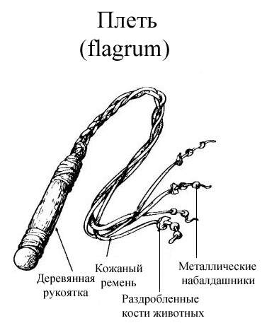
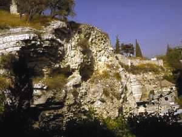

<title>Руслан Хазарзар. Сын Человеческий. Глава пятьдесят третья</title>

<h2>53. Барнаша.2
 (14 нисана)</h2>

В четверг с заходом солнца наступило 14 число месяца нисана. Ешуа после
проповеди в Храме не отправился сразу же в селение Бет-Анйа, а пошел со своими
тальмидами в нижнюю часть Й’рушалайима, к горе Циййон, в дом альманы Мирйам.

Дом Мирйам — такой же, как и большинство богатых домов столицы: наверху
располагалась надстройка-алиййа<a href="#_ftn1" name="_ftnref1">[1]</a> с
отдельным к ней входом-лестницей. Алиййа, устланная коврами и уставленная
ложами-мишкабами<a href="#_ftn2" name="_ftnref2">[2]</a>, служила для приема
почетных гостей; она освещалась не только узкими оконцами в стене, но и большим
прямоугольным окном наверху.

Вечером в алиййе зажгли светильники. Ешуа с тальмидами возлег, и все
приступили к трапезе (Мф.26:20; Мк.14:17-18; Лк.22:14). Мара, по своему
обыкновению, преломил льхэм<a href="#_ftn3" name="_ftnref3">[3]</a>, роздал его
тальмидам и сказал: «Д’на hу биср<b>и</b> (&#1491;&#1468;&#1456;&#1504;&#1464;&#1492;&nbsp;&#1492;&#1493;&#1468;&#1488;&nbsp;&#1489;&#1468;&#1460;&#1513;&#1474;&#1456;&#1512;&#1460;&#1497;)»<a href="#_ftn4" name="_ftnref4">[4]</a>
(Мф.26:26; Мк.14:22; Лк.22:19). Затем благословил чашу с хамрой<a href="#_ftn5"
name="_ftnref5">[5]</a>, отпил из чаши глоток и, пуская ее по кругу, сказал:
«Д’на hу дам<b>и</b> (&#1491;&#1468;&#1456;&#1504;&#1464;&#1492;&nbsp;&#1492;&#1493;&#1468;&#1488;&nbsp;&#1491;&#1468;&#1464;&#1502;&#1460;&#1497;)»<a href="#_ftn6" name="_ftnref6">[6]</a>
(Мф.26:27-28; Мк.14:23-24; Лк.22:20).

Для каждого из своих тальмидов Ешуа нашел в этот вечер доброе слово.

По окончании трапезы Ешуа со своими тальмидами вышел — вероятно, через
ворота hамм&aacute;йим (&#1492;&#1463;&#1502;&#1468;&#1463;&#1497;&#1460;&#1501; — <i>Водяные</i>) — за стены Й’рушалайима.
Была ночь. Полнолуние. Вся группа миновала долину Й’hошапата и достигла сада
Гат-Ш’мена (Мф.26:36; Мк.14:32; Ин.18:1), где Ешуа ожидали вооруженные люди
алабарха (Мф.26:47; Мк.14:43; Лк.22:47): рабы, в серых туниках и с медными
ошейниками, и стража Храма. Тогда все тальмиды бросили своего Учителя
(Мф.26:56; Мк.14:50), а сам Он был арестован и отведен в дом Ханана (Ин.18:13).
Бывший алабарх допросил Арестованного, а потом отправил Его в беткэле<a
href="#_ftn7" name="_ftnref7">[7]</a>, где Ешуа провел остаток ночи
(Ин.18:24).

Поутру коhэны связали Ешуа и отвели Его к бывшему дворцу царя hор’доса.
Сейчас коhэны не были такими нарядными, каковыми они будут через несколько
часов — в Храме, когда будут закладывать агнца<a href="#_ftn8"
name="_ftnref8">[8]</a>. Конечно, исраэлиты не вошли в жилище гоя — нельзя было
оскверниться в день перед Пасхой (Ин.18:28), — они остались на каменном
помосте, своей формой напоминающем <i>габию</i> (&#1490;&#1468;&#1464;&#1489;&#1460;&#1497;&#1506;&#1463; [га-б<b>и</b>а] — <i>чаша</i>). Префектус
сам вышел к ним на Габту<a href="#_ftn9" name="_ftnref9">[9]</a> (Ин.19:13):
средних лет, в белой тунике (tunica), с выбритыми, как у всем романцев,
висками, — Понтиус Пилатус воссел на беме (&#946;&#8134;&#956;&#945; — <i>судейское место</i>). Его руки
были украшены браслетами, а на безымянном пальце правой руки блестел перстень с
большой камеей из красного ясписа. Белая тога-претекста (toga praetexta —
<i>окаймленная тога</i>) пристегивалась на плече наместника золотой брошью, в
которую были вправлены драгоценные камни, искрившиеся на свету.

Пилатус поинтересовался у коhэнов, в чем они обвиняют Арестованного? Они
ответили, что Ешуа развращает народ, запрещает платить трибутум Роме<a
href="#_ftn10" name="_ftnref10">[10]</a> и называет себя царем Й’hуды
(Лк.23:3). Префектус обратился к Арестованному: «Rex Judaeorum es?». Скриба,
стоящий рядом, перевел<a href="#_ftn11" name="_ftnref11">[11]</a>: «Ант’h hу
мальк&aacute; ди Й’hуда&eacute; (&#1488;&#1463;&#1504;&#1456;&#1514;&#1468;&#1456;&#1492;&#1470;&#1492;&#1493;&#1468;&#1488;&nbsp;&#1502;&#1463;&#1500;&#1456;&#1499;&#1468;&#1464;&#1488;&nbsp;&#1491;&#1468;&#1460;&#1497;&nbsp;&#1497;&#1456;&#1492;&#1493;&#1468;&#1491;&#1464;&#1497;&#1461;&#1488;)?» Ешуа ответил: «Ант милл&aacute;льт (&#1488;&#1463;&#1504;&#1456;&#1514;&#1468;&#1456;&nbsp;&#1502;&#1460;&#1500;&#1468;&#1463;&#1500;&#1456;&#1514;&#1468;&#1456;)». — «Dixisti», — передал Пилатусу скриба,
теряя в переводе смысловую тонкость ответа (Мф.27:11; Мк.15:2; Лк.23:3).

Тогда префектус велел Ешуа войти в преторий (Ин.18:33) и, допросив Его там,
вынес приговор: «Damno capitis (<i>приговариваю к смерти</i>)». Затем приказал
трубунусу (tribunus — <i>трибун</i>, то есть командир когорты) вывести Ешуа из
претория и твердо распорядился: «Tribune, tolle in crucem hunc (<i>Трибун,
распни его на кресте</i>)!» (Мф.27:26; Мк.15:15; Ин.19:16).

Трибунус вызвал из крепости Антония отряд во главе с кентурионом
(centurio)<a href="#_ftn12" name="_ftnref12">[12]</a>. И, когда кентурия
пришла, солдаты вспомогательных войск (milites auxiliorum) в насмешку дали Ешуа
«знаки царского достоинства»: одели Его в пурпурную мантию<a href="#_ftn13"
name="_ftnref13">[13]</a> монарха, возложили на голову венец, сплетенный из
терна, и дали в руки трость вместо скипетра. Затем они ввели Ешуа в преторий и
восклицали: «Ave, rex Judaeorum!»<a href="#_ftn14" name="_ftnref14">[14]</a> —
и часть из них, становясь на колени, кланялась Ему, а другие — били Его
тростью по голове (Мф.27:27-30; Мк.15:16-19; Ин.19:2-3; <i>Orig.</i>CC.II.34)<a
href="#_ftn15" name="_ftnref15">[15]</a>.

<table width="375" align="right" border="0">
<tr><td width="5">&nbsp;</td>
<td>
<table width="370" align="right" border="0">
<tr valign="middle">
<td></td></tr>
</table>
</td></tr></table>

Вдоволь насмеявшись над Ешуа, кентурия отвела
Его в крепость Антония. Распятию обычно предшествовало бичевание
(<i>Jos.</i>BJ.II.14:9; V.11:1; VII.6:4; <i>Titus Livius.</i>XXXIII.36), и
поэтому воины раздели Ешуа, привязали Его к столбу и били (Мф.27:26; Мк.15:15;
Ин.19:1), применяя плети с прикрепленными на конце оловянными шариками или
дроблеными костями животных, которые разрывали тело до костей
(<i>Eus.</i>HE.IV.15:4). Чтобы жертва не скончалась раньше времени, число
ударов обычно не превышало сорока (2&nbsp;Кор.11:24; ср.&nbsp;Втор.25:3).

Было около полудня (Ин.19:14), и в гарнизоне пропела труба
(<i>Vegetius.</i>Epitoma rei militaris.II.22). Тогда кентурия вместе с
Осужденным отправилась к месту казни — на курган Гольгольта, до которого от
крепости Антония было около&nbsp;700&nbsp;метров. Отряд шел, растянутый двумя
цепями вдоль дороги, а между этими цепями, неся на себе перекладину креста
(Ин.19:17), шел Ешуа, вновь облаченный в свои одежды. Замыкалась кентурия
воинской цепью, а за нею следовали зеваки из евреев. Плотники же, оснащенные
веревками, лопатами и топорами (Ibid.II.11), уже давно трудились на Гольгольте:
они прибыли туда сразу же, как только узнали о приговоре Пилатуса.

Даже при дымчатом солнце хамсина оружие воинов сверкало. Каждый из них был
одет в алую тунику, поверх которой блестел панцирь-лорика (lorica),
изготовленный из кожи с нашитыми сверху медными пластинами. В правой руке у
воинов находилось копье (hasta), а у бедра висел меч-гладий (gladius). Если бы
это был настоящий военный поход, то в левой руке воины несли бы щит, на котором
был нарисован отличительный знак-дигмат. Кентурион отличался от остальных
воинов тем, что на его шлеме красовался посеребренный гребень
(Ibid.II.14-18).

Ешуа вконец изнемог. Он упал и был не в силах
дальше нести орудие своего умерщвления. Это произошло у стен города. Тогда
кентурия встретила некоего Шим’она и принудила его нести перекладину (Мф.27:32;
Мк.15:21; Лк.23:26).

<table width=305 border=0 align=left>
<tr>
<td>
<table width=300 border=0>
<tr>
<td align=center valign=middle>

<tr height="40">
<td align=center valign=middle>

 Предполагаемая Голгофа

</td>
</tr>
</table>
</td>
<td width=5>&nbsp;
</td>
</tr>
</table>

Наконец, вся процессия пришла к месту казни. По еврейскому обычаю, Ешуа
предложили выпить наркотического напитка, но Он, слегка пригубив, отказался
пить этот дурман, предпочитая расстаться с жизнью в полном сознании
(Мф.27:33-34; Мк.15:22-23). И тогда Ешуа раздели и пригвоздили к кресту, а
воины разделили между собой Его одежду.

По романскому обычаю (<i>Suet.</i>Caligula.32;
<i>Eus.</i>HE.V.1:44), над головою Ешуа прибили титулус с надписью.

Коhэны отправились в Храм, чтобы принести ежедневную, а затем пасхальную
жертву<a href="#_ftn16" name="_ftnref16">[16]</a>. У самого ц’лаба Ешуа сидели
воины и следили за порядком (Мф.27:36), а в некотором отдалении наблюдали за
казнью верные галильские подруги Основателя (Мф.27:55-56; Мк.15:40-41;
Лк.23:49,55; 24:10; Ин.19:25). Кроме этой небольшой группы женщин, Ешуа видел
перед собою лишь проявление человеческой низости. В Его адрес раздавались
оскорбительные насмешки: «Разрушающий Храм и в три дня созидающий, спаси себя
самого!» — говорили одни. «Других спасал, а себя самого спасти не можешь!» —
говорили иные (Мф.27:39-43; Мк.15:29-32).

Перед Ешуа предстала картина людской неблагодарности. В какую-то минуту Он
подумал, что Отец Небесный оставил Его, и Казненного охватило отчаяние. Силы
оставляли Его, и ждать помощи было неоткуда. И тогда Ешуа воскликнул: «Элоhи,
Элоhи! льма ш’бактани (&#1488;&#1457;&#59396;&#1492;&#1460;&#1497;&nbsp;&#1488;&#1457;&#59396;&#1492;&#1460;&#1497;&nbsp;&#1500;&#1456;&#1502;&#1464;&#1492;&nbsp;&#1513;&#1473;&#1456;&#1489;&#1463;&#1511;&#1456;&#1514;&#1468;&#1464;&#1504;&#1460;&#1497;)?» (Мк.15:34; ср.&nbsp;Мф.27:46;
ЕФ.72).

Небо посерело. Хамсин сжигал землю, и все задыхались. Ржавое солнце дрожало,
клонясь к западу. Случалось, в хамсин умирали звери и птицы, а сейчас умирал на
ц’лабе Человек.

«Ц’мэ<b>э</b>т (&#1510;&#1456;&#1502;&#1461;&#1497;&#1488;&#1461;&#1514;)», — сказал Ешуа (Ин.19:28), и один из
воинов намочил губку поской (posca) и, надев ее на трость, поднес к губам
Казненного (Мф.27:48; Мк.15:36; Лк.23:36; Ин.19:29).

Около третьего часа пополудни (Мф.27:45; Мк.15:34; Лк.23:44) Ешуа возопил
громким голосом (Мф.27:50; Мк.15:37), и голова Его поникла на грудь
(Ин.19:30).

Ешуа умер. На Гольгольте закончилась жизнь Человека, и началась легенда о
Богочеловеке.

&nbsp;

<a href="#_ftnref1" name="_ftn1">[1]</a> <i>Алийй&aacute;</i> (&#1506;&#1458;&#1500;&#1460;&#1497;&#1468;&#1464;&#1492;) в переводе с еврейского —
<i>мансарда</i>.

<a href="#_ftnref2" name="_ftn2">[2]</a> <i>Мишк&aacute;б</i> (&#1502;&#1460;&#1513;&#1473;&#1456;&#1499;&#1468;&#1464;&#1489;) в переводе с арамейского —
<i>ложе</i>.

<a href="#_ftnref3" name="_ftn3">[3]</a> <i>Льхэм</i> (&#1500;&#1456;&#1495;&#1461;&#1501; = евр. &#1500;&#1462;&#1495;&#1462;&#1501;) в переводе с арамейского — <i>хлеб</i>,
<i>хлебная лепешка</i>.

<a href="#_ftnref4" name="_ftn4">[4]</a> «Это — тело мое»
(<i>арам.</i>).

<a href="#_ftnref5" name="_ftn5">[5]</a> <i>Хамр&aacute;</i> (&#1495;&#1463;&#1502;&#1456;&#1512;&#1464;&#1488;) в переводе с арамейского —
<i>вино</i>.

<a href="#_ftnref6" name="_ftn6">[6]</a> «Это — кровь моя»
(<i>арам.</i>).

<a href="#_ftnref7" name="_ftn7">[7]</a> <i>Беткэле</i> (&#1489;&#1468;&#1461;&#1497;&#1514;&#1470;&#1499;&#1468;&#1462;&#1500;&#1462;&#1488; [бэйт к<b>э</b>-ле]) в переводе
с еврейского — <i>темница</i>, <i>тюрьма</i> (букв. <i>дом удержания</i>).

<a href="#_ftnref8" name="_ftn8">[8]</a> См. <a
href="79"><b>Приложение&nbsp;6</b></a>.

<a href="#_ftnref9" name="_ftn9">[9]</a> &#1490;&#1468;&#1463;&#1489;&#1468;&#1456;&#1514;&#1464;&#1488; ([Габ-т&aacute;] — вероятно, от &#1490;&#1468;&#1464;&#1489;&#1460;&#1497;&#1506;&#1463;) = &#915;&#945;&#946;&#946;&#945;&#952;&#945;; по-гречески: &#923;&#953;&#952;&#972;&#963;&#964;&#961;&#969;&#964;&#959;&#957;;
этот Лит&oacute;стротон представлял собой
каменный помост, расположенный в колоннаде на открытом воздухе
(<i>Jos.</i>BJ.II.9:3; 14:8; Мк.15:16; Ин.18:33).

<a href="#_ftnref10" name="_ftn10">[10]</a> Tributum —
<i>подать</i>, <i>налог</i>; Roma — <i>Рим</i>.

<a href="#_ftnref11" name="_ftn11">[11]</a> Пилат, безусловно, знал
греческий язык, но вряд ли он хорошо говорил по-арамейски; scriba —
<i>писец</i>, <i>секретарь</i>.

<a href="#_ftnref12" name="_ftn12">[12]</a> Ea tempestate в
латинском языке буква <i>с</i> звучала как [k] во всех положениях, и лишь
в&nbsp;IV–V&nbsp;веках были отмечены случаи перехода [k] в аффрикату [ts] перед
[e] и [i]; отпадающий в Nom.&nbsp;S. носовой <i>n</i> присутствует в
основе.

<a href="#_ftnref13" name="_ftn13">[13]</a> <i>Багряница</i>
по-арамейски — &#1488;&#1463;&#1512;&#1456;&#1490;&#1468;&#1456;&#1493;&#1464;&#1504;&#1464;&#1488; [ар-г’ва-н&aacute;].

<a href="#_ftnref14" name="_ftn14">[14]</a> «Здравствуй, царь
иудеев!» (<i>лат.</i>) — перефразировка: «Ave, Caesar Imperator!»

<a href="#_ftnref15" name="_ftn15">[15]</a> Автор Евангелия от Петра
приводит следующую деталь: «[...]&nbsp;посадили Его на судейское место (&#949;&#960;&#953; &#954;&#945;&#952;&#949;&#948;&#961;&#945;&#957;
&#954;&#961;&#953;&#963;&#949;&#969;&#962;), говоря: суди праведно
(&#948;&#953;&#954;&#945;&#953;&#969;&#962;
&#954;&#961;&#953;&#957;&#949; = jus dice jure), царь Израиля!»
(Evangelium Petri.7).

<a href="#_ftnref16" name="_ftn16">[16]</a> См. <a
href="41">§ 41</a>.

<a href="index">Оглавление</a> <a href="54">Далее</a>

