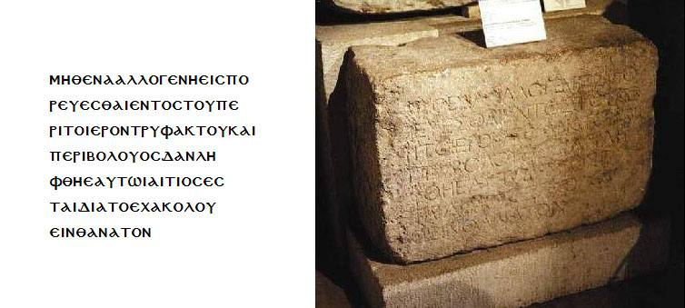

<title>Руслан Хазарзар. Сын Человеческий. Христианство и антисемитизм</title>

<h2>Христианство и антисемитизм</h2>

<table border=0 cellspacing=0 cellpadding=0 style='margin-left:-89.2pt;
 border-collapse:collapse;mso-padding-alt:0cm 3.55pt 0cm 3.55pt'>
 <tr>
  <td width=365 valign=top style='width:273.55pt;padding:0cm 3.55pt 0cm 3.55pt'>
  
В основе антисемитизма лежит бездарность. Есть только один способ
  борьбы против того, что евреи играют большую роль в науке и философии:
  делайте сами великие открытия.

  
<i>Н. А. Бердяев<o:p></o:p></i>

  </td>
 </tr>
</table>

&nbsp;

Шовинистическая и, в том числе, антисемитская литература, распространившаяся
в последние годы на книжных рынках России, стала весьма популярной и затуманила
мозги неподготовленного читателя.

В частности, книга Григория Климова «Протоколы
красных мудрецов» (цитируется по изданию: <i>Климов&nbsp;Г.&nbsp;П.</i>
Протоколы красных мудрецов.&nbsp;//&nbsp;Приложение к журналу «Кубань». —
Краснодар,&nbsp;1992), как и все произведения этого псевдосоциолога, является
рекордсменом по количеству ошибок и невероятных выводов. По Климову, чуть ли не
все население планеты — евреи и гомосексуалисты. Я уже не говорю, что он
считает П.&nbsp;Н. Милюкова масоном (стр.&nbsp;199), хотя лидер кадетов таковым
никогда не являлся, что «число зверя» из библейского Откровения Иоанна
(Отк.13:18), которое в действительности обозначает кесаря Нерона
(см.&nbsp;<a href="05">§&nbsp;5</a>), Климов представляет в виде
процентного выражения гомосексуалистов в среде интеллигенции (стр.&nbsp;77),
что он утверждает, якобы христианские апологеты Юстин и Тертуллиан «записали
известный скандал, что Иисус из Назарета был внебрачным сыном римского солдата
по имени Пантера и еврейской крестьянки по имени Мария, с которой ее
муж-плотник по причине этого прелюбодеяния развелся» (стр.&nbsp;92), хотя об
этом писал лишь Цельс в передаче Оригена и намекал Талмуд (см.&nbsp;<a
href="19">§&nbsp;19</a>). Я уже не говорю о том, что Климов называет жену
императора Сабину Поппею еврейкой (стр.&nbsp;52) и считает, что слово
<i>жид</i> — древнееврейское слово (стр.&nbsp;90), хотя Поппея принадлежала к
известному италийскому роду, а в еврейском языке напрочь отсутствует буква
<i>ж</i>. Впрочем, перечислять все нелепости в произведениях Климова можно
весьма долго. Крайне смешно его утверждение, что «в Старом Завете дьявол нигде
не упоминается. Его там нет. Даже тот змий, который искушал Еву в раю и
которого богословы считают дьяволом, в Старом Завете называется не дьяволом, а
змием. Впервые дьявол как таковой появляется только в Новом Завете»
(стр.&nbsp;6). Греческое слово &#8001;&nbsp;&#948;&#953;&#940;&#946;&#959;&#955;&#959;&#962;
(<i>клеветник</i>) и не могло фигурировать в Ветхом завете, написанном на
еврейском языке; а противника Бога под именем Сатаны (&#1513;&#1474;&#1464;&#1496;&#1464;&#1503;, или &#1492;&#1463;&#1513;&#1468;&#1474;&#1464;&#1496;&#1464;&#1503;) можно часто встретить и в Ветхом завете
(Иййоб.1:6-9,12; 2:1-4,6-7; Т’hиллим.109:6; З’карйа.3:1-2; Дибрей
hаййамим&nbsp;I.21:1; и&nbsp;др. = Иов.1:6-9,12; 2:1-4,6-7; Пс.108:6;
Зах.3:1-2; 1&nbsp;Пар.21:1 и&nbsp;др.; ср.&nbsp;Отк.12:9).

В общем, Климов действует по принципу audacter calumniare, semper aliquid
haeret. Однако непревзойденным клеветником и дилетантом в «еврейском вопросе»
является Дуглас Рид со своим произведением «Спор о Сионе» (цитируется по
изданию: <i>Рид&nbsp;Дуглас.</i> Спор о Сионе.&nbsp;//&nbsp;Приложение к
журналу «Кубань». — Краснодар, 1991, №&nbsp;2). Этот пасквиль, который его
издатели и переводчики называют «выдающимся трудом, не имеющим себе равных в
современной литературе» (стр.&nbsp;6), должен быть оценен однозначно — cacatum
non est pictum. Полностью разбирать «Спор о Сионе», впервые изданный, кстати,
на деньги двух евреев, и выявлять его многочисленные подтасовки и ошибки мы не
будем — для этого пришлось бы писать отдельную книгу. Обратимся лишь к одной из
глав этого пасквиля, которая непосредственно имеет отношение к Иисусу, — к
главе «Галилеянин».

Мы уже показали, что евангельскую версию суда над Иисусом нельзя считать
исторической. Весь этот рассказ имел своей целью очернить иудеев, и он в
течение многих столетий служит одним из самых могучих средств для возбуждения
ненависти и презрения к еврейству, способствуя превращению его в расу, которая
по самой своей сути исполнена сатанизмом. Совершенно ясно одно: считать
фарисеев главными виновниками смерти Иисуса, как это делает Дуглас Рид
(стр.&nbsp;24), неправомерно. Ответственность за распятие Основателя несут
Понтий Пилат<a href="#_ftn1" name="_ftnref1">[1]</a> и саддукеи. Если бы Рид
внимательно читал Библию, ему бы в голову не взбрело, что «первосвященники и
старейшины» — это фарисеи, ибо в Деяниях апостолов прямо сказано, что с
первосвященником были «все, принадлежавшие к ереси саддукейской» (Деян.5:17).
Впрочем, Дуглас Рид текста Библии не знает, и это мы сейчас увидим.

В частности, Рид пишет, что из Нового завета непреложно явствует, что именно
фарисеев Иисус «считал врагами Бога и человечества, а Его бичующий гнев со всей
силой был направлен главным образом против них&nbsp;[...]. Можно ли сказать,
что Христос был “евреем” по религии?&nbsp;[...]. По своей религии Иисус
Христос, вне всяких сомнений, был полной противоположностью и врагом всего
того, что создает ортодоксального еврея сегодня и чем были правоверные фарисеи
Его времени» (стр.&nbsp;17), то есть Основатель не был иудаистом.

Что это, демагогия или тупоумие? Католики и протестанты на протяжении многих
лет выступают друг против друга, но никому не придет в голову мысль, что кто-то
из них — не христианин. Иудейская секта ессеев, в которой, по всей вероятности,
воспитывался Иоанн Креститель, также выступала против фарисеев и саддукеев, но
никто не осмелится сказать, что ессеи не принадлежали к иудейской вере. Рабба
Ешуа (Иисус) называл Отцом Небесным Иегову, а значит, был иудаистом (ведь
христианство тогда еще не возникло), хотя и смелым новатором.

Кроме того, Дуглас Рид пишет: «В отношении места жительства в Евангелии от
Иоанна указывается, что Иисус Христос родился в Вифлееме Иудейском, однако лишь
в силу того, что Мария прибыла туда из Галилеи для переписи, <i>иудаисты</i>
оспаривают и это, считая это вставкой с целью подтверждения пророчества Михея о
том, что Владыка Израиля произойдет из Вифлеема. И, наконец, Еврейская
энциклопедия подчеркивает, что Назарет был родиной Иисуса Христа, и,
следовательно, все источники согласны с тем, что Он был галилеянин, независимо
от случайного места Его рождения. Галилея, где Он провел всю свою жизнь, была
политически совершенно отделена от Иудеи, имея своего собственного римского
тетрарха. Для Иудеи она была “заграницей”. Смешанные браки между жителями этих
двух стран были запрещены, и еще до рождения Христа Симон Тарсис, один из
маккавейских князей, насильно переселил всех проживающих в Галилее иудеев
обратно в Иудею. Другими словами, и по расе (sic! — <i>Р.Х.</i>), и политически
галилеяне и иудеи были различными народами» (стр.&nbsp;16).

Начнем с того, что факты о переписи и рождении Иисуса в Вифлееме указываются
в Евангелии от Луки, а не от Иоанна. Подавляющее большинство нерелигиозных
историков, занимающихся вопросами Древней Палестины, — а не только иудаисты —
сходится в том, что Иисус родился в Назарете, а не в Вифлееме<a href="#_ftn2"
name="_ftnref2">[2]</a>. Утверждение Рида, что «все источники согласны с тем,
что Он (Иисус. — <i>Р.Х.</i>) был галилеянин», в очередной раз показывает, что
автор «Спора о Сионе» совершенно не знает Новый завет, ибо Евангелие от Матфея
говорит, что родители Иисуса всегда жили в Вифлееме Иудейском и лишь после
рождения Основателя перебрались в Назарет. Утверждение, что браки между
жителями Галилеи и Иудеи были запрещены, является вольной фантазией автора
пасквиля (ср.&nbsp;<i>Jos.</i>CA.I.7). А вот поверить в то, что Симон, «один из
маккавейских князей» рода Хашмонаев, «насильно переселил всех проживающих в
Галилее иудеев обратно в Иудею», невозможно при всем желании даже помутившегося
рассудка. В действительности же Симон Хашмонай, иудей и фанатичный приверженец
культа Яхве, сбросивший иго Селевкидов (1&nbsp;Макк.13:41), по просьбе
галилеян-иудаистов изгнал из Галилеи язычников из Птолемаиды, Тира и Сидона и
привел «с великою радостью» в Иудею тех евреев, которые пожелали переселиться
(1&nbsp;Макк.5:14-23).

Утверждение Рида, что галилеяне не были евреями и даже семитами, совершенно
абсурдно. Автор «Спора о Сионе» сам говорит, что все апостолы, кроме Иуды
Искариота, были галилеянами (стр.&nbsp;23), однако, ввиду его незнания текста
Евангелий, Рид умалчивает, что Иисус называл апостола Нафанаила израильтянином:
«Иисус, увидев идущего к Нему Нафанаила, говорит о нем: вот, подлинно
Израильтянин, в котором нет лукавства» (Ин.1:47)<a href="#_ftn3"
name="_ftnref3">[3]</a>.

Утверждение Рида, что Галилея для Иудеи была
«заграницей», — явное преувеличение. И та и другая были данниками Рима, и та и
другая имели одну и ту же культуру, и та и другая относились к храмовой общине
Иерусалима. Ирод Великий управлял и Иудеей, и Идумеей, и Самарией, и Галилеей,
и Переей, и Гавлонитидой, и Батанеей, — короче, всей Палестиной. После его
смерти в&nbsp;4&nbsp;году до&nbsp;н.&nbsp;э. страна была поделена на три
области: 1)&nbsp;Иудея, Самария, Идумея; 2)&nbsp;Гавлонитида и Батанея; и
3)&nbsp;Перея и Галилея. Так что Галилея якобы стала для Иудеи «заграницей»
только потому, что у Ирода было трое наследников, а не один.

Необходимо внести некоторые уточнения в значение слов <i>семит</i>,
<i>еврей</i>, <i>израильтянин</i> и <i>иудей</i> (хотя бы в библейском
понимании этих слов).

Семиты — потомки библейского Сима (Быт.9:18).

Слово <i>еврей</i>, по утверждению Иосифа Флавия (<i>Jos.</i>AJ.I.6:4),
произошло от библейского Евера (Быт.10:24); само имя <i>Евер</i>, или, точнее,
<i><b>Э</b>бэр</i> (&#1506;&#1461;&#1489;&#1462;&#1512;), является по своей этимологии (корень
&#1506;&#1489;&#1512; означает <i>переходить</i>) воплощением жителей за Евфратом.
Слово <i>еврей</i>, или, точнее, <i>ибр&uacute;</i> (&#1506;&#1460;&#1489;&#1456;&#1512;&#1460;&#1497;), впервые встречается в Библии в связи с
Авраамом (Быт.14:13). Евреями считаются потомки Авраама от Сарры.

Израиль, он же Иаков, — внук Авраама (Быт.25:26; 32:38); потомки Иакова
называются израильтянами.

Иуда — один из двенадцати сыновей Иакова (Быт.35:23); его потомки называются
иудеями (иногда в Славянской Библии — жидовинами).

Итак, обратимся к Евангелиям. Когда самаритянка спросила Иисуса: како ты жидовин сый от мене пити просиши? (От Иоанна, Зачало&nbsp;BI = Ин.4:9), — Он не отрицал своей
принадлежности к иудейской нации. Кроме того, Евангелия пытаются доказать
еврейское происхождение Иисуса: согласно родословным, Он был семитом (Лк.3:36),
израильтянином (Мф.1:2; Лк.3:34) и иудеем (Мф.1:2; Лк.3:33).

Мне могут возразить: это — родословия Иосифа, а он не был отцом Иисуса.
Пусть будет так. Однако из Евангелия от Луки, которое Дуглас Рид опять же не
знает, явствует, что и Мария была еврейкой. Согласно Терциусу, мать Иисуса была
родственницей Елисаветы (Лк.1:36), матери Иоанна Крестителя, а Елисавета была
из рода Ааронова (Лк.1:5) — из главного левитского рода. Таким образом, Мария
имела непосредственное отношение не только к колену Левия, но и к роду
священников.

Впрочем, доказать еврейское происхождение Иисуса можно и на основе
исторических фактов. Достоверно известно, что вход в Иерусалимский храм за
ограду балюстрады неевреям был запрещен под страхом смерти
(<i>Jos.</i>AJ.XV.11:5; BJ.V.5:2; VI.2:4; ср.&nbsp;Деян.21:28). Итак, если
Иисус не был евреем, то как же Он мог проповедовать в Храме, на стенах которого
находились надписи(?!.):<a href="#_ftn4" name="_ftnref4">[4]</a>

&nbsp;

Исходя из вышесказанного, можно смело утверждать, что Иисус <i>был</i>
евреем.

Совершенно ясно одно: мотив «“плохие” евреи погубили “хорошего” еврея Иисуса
из Назарета» — не повод к антисемитизму. Действительно, русские чиновники
приговорили русского писателя Достоевского к смертной казни, но психически
здоровому не-русскому, горячо любящему творчество Федора Михайловича, и в
голову не взбредет из-за этого стать антируситом.

Итак, Иисус был евреем, а нынешние молодчики с
гордостью носят христианский крест на груди и свастику<a href="#_ftn5"
name="_ftnref5">[5]</a> на рукаве...

Мы уже говорили о том, что глубоко заблуждается тот, кто считает, что до
Иисуса все евреи отличались узким консерватизмом, холодным бездушием,
ханжеством и высокомерием. В древности некоторые иудейские пророки, в
особенности Исаия, в своей ненависти к лицемерию и к религиозно-обрядовой
мелочности провидели истинное свойство должного почитания Бога человеком
(Ис.1:11-18; ср. Ос.6:6; Мал.1:10-13). Некоторые предшественники Иисуса,
как-то: Симеон I Праведный (Мишна. Абот.1:2), Иисус сын Сирахов (Сир.35:1-3)<a
href="#_ftn6" name="_ftnref6">[6]</a>, Гиллель (Мишна. Абот.1:12-13[12-14];
2:5-8[4-7]; Иер Талм.Песахим.6:1; Вав Талм.Песахим.66<i>а</i>;
Шаббат.31<i>а</i>; Йома.35<i>б</i>), — в разных формах утверждали, что суть
Закона — справедливость. Современник Иисуса, Филон Александрийский пришел к
идеям высокого нравственного совершенства, вследствие чего стал очень мало
придавать значения ритуальным обрядам (<i>Philo.</i>Quod deus imm.1-2; Quis
rer. div. her.13-15,55,58-60; Quod prob. liber (полностью); De vita cont.
(полностью)). Ш’май&aacute; (&#1513;&#1473;&#1456;&#1502;&#1463;&#1506;&#1456;&#1497;&#1464;&#1492;) и Абталь&oacute;н (&#1488;&#1463;&#1489;&#1456;&#1496;&#1463;&#1500;&#1456;&#1497;&#1493;&#1465;&#1503;) также часто оказывались либеральными
казуистами (Мишна. Абот.1:10-11; Вав Талм.Песахим.67<i>б</i>). Вскоре
р.&nbsp;Йоханан поставил дело милосердия даже выше изучения Торы (Иер
Талм.Пеа.1:1).

Прекрасные души Гиллеля и Филона практически подошли к евангельской
нравственности. Гамлиэль&nbsp;I, внук Гиллеля и учитель апостола Павла
(Деян.22:3), обладал свободолюбивым духом, изучал светские науки и был склонен
к терпимости (Мишна. Баба Мециа.5:8). В противоположность суровым законникам,
которые ходили под покрывалами или с закрытыми глазами (см.&nbsp;<a
href="10">§&nbsp;10</a>), он свободно смотрел на женщин, даже на язычниц
(Иер Талм.Беракот.9:2). Правда, ввиду его близости ко двору, впоследствии это
было ему прощено, так же как и знание греческого языка (Вав
Талм.Сота.49<i>б</i>; Баба Камма.83<i>а</i>). Его сын Шим’он бен-Гамлиэль
отличался справедливостью и мудростью (Мишна. Абот.1:16-17[17-18]).

Э.&nbsp;Ж. Ренан отмечает: «Многие, еще до Иисуса или в одно с ним время,
как-то: Иисус сын Сирахов — один из настоящих предшественников Иисуса
Назареянина, — Гамалиэль, Антигон Соко, особенно мягкий и благородный
Гиллель, — преподавали религиозные учения весьма возвышенные и уже почти
евангельские. Но эти добрые семена были погашены. Прекрасные максимы Гиллеля,
объединившие весь Закон в справедливости, правила Иисуса сына Сирахова,
сводившие культ к совершению добрых дел, были забыты или преданы анафеме (Иер
Талм. Санhедрин.11:1; Вав Талм. Санhедрин.100<i>б</i>). Победил Шаммай со своим
узким и ограниченным умом. Огромная масса “преданий” (“traditions”) задушила
Закон под предлогом его защиты и интерпретации. Эти консервативные меры,
безусловно, имели свою полезную сторону: было хорошо, что еврейский народ любил
свой Закон до безумия, ибо эта безмерная любовь, спасая моисеизм при Антиохе
Епифане и при Ироде, сберегла необходимую для возникновения христианства
закваску»<a href="#_ftn7" name="_ftnref7">[7]</a>.

Да, в свое время предписания Шаммая вытеснили идеи Гиллеля, но на
современном этапе иудаизм отдает предпочтение правилам Гиллеля, а не Шаммая.
Да, Баруху Спинозе 27&nbsp;июля 1656&nbsp;года Синагога объявили хэрем, однако
в&nbsp;1927&nbsp;году отлучение было снято. «Сион спасется правосудием», —
предрекал пророк Исаия (Ис.1:27).

Нельзя забывать, что Й’шайаhу, Шим’он hаццаддик, Антиг’нос иш-Сок&oacute; (&#1488;&#1463;&#1504;&#1456;&#1496;&#1460;&#1497;&#1490;&#1456;&#1504;&#1493;&#1465;&#1505;&nbsp;&#1488;&#1460;&#1497;&#1513;&#1473;&#1470;&#1505;&#1493;&#1465;&#1499;&#1493;&#1465;), Гиллель, Филон, Гамлиэль были истинными
предшественниками христианства — во всяком случае, если не по догматике, то по
нравственности. Однако один лишь Ешуа иш-Н’цэрет смог очевидным образом
выразить ту высшую степень истинного почитания Бога, которую не может постичь
даже современный христианин. Только Иисус первым очевидно показал, что истинная
вера заключается не в страхе перед Богом и обрядности, но в любви; Он выразил
эту мысль не только проповедью, но и личным жизненным примером и своей смертью.
Лишь несколько последователей Основателя приблизились к такому великому
пониманию религии (1&nbsp;Ин.3:18; 4:7-8; 1&nbsp;Кор.13:1-13). В большинстве
своем, ученики Иисуса так Его и не поняли. В частности, Яакоб Ахмара в
религиозной щепетильности не уступал фарисеям, а ведь он был первым епископом
христианской экклесии Иерусалима.

И сегодня люди, называющие себя христианами, воспринимают Бога в страхе, но
не в любви. И сегодня они крестятся и молятся кстати и некстати (Мф.6:5). И
сегодня они чересчур часто посещают церковь для молитв (Мф.6:6). И сегодня они
испытывают нетерпимость к инакомыслящим (Мф.6:14). Ханжа — это не
национальность. Тот не христианин, кто испытывает ненависть к кому бы то ни
было. Люди, исповедующие шовинизм, могут быть кем угодно, только не христианами
(Мф.5:44; 6:14). <i>Христианин антисемитом быть не может.</i>

Если Ветхий завет можно считать националистическим, то Новый завет с
некоторыми натяжками, видимо, придется признать космополитическим. В послания
Павла неоднократно утверждается, что «нет ни Еллина, ни Иудея, ни обрезания, ни
необрезания, варвара, Скифа, раба, свободного» (Кол.3:11; Гал.3:28). Правда,
эта сентенция в Новом завете непоследовательна, во многих его текстах еще
достаточно сильно звучит мотив избранности и исключительности Израиля среди
других народов. Тот же апостол язычников (Павел) говорит: «Слава и честь и мир
всякому, делающему доброе, во-первых Иудею, [потом] и Еллину!»; впрочем, Павел
уточняет, что и «скорбь и теснота всякой душе человека, делающего злое,
во-первых Иудея, [потом] и Еллина!» (Рим.2:9-10). Согласно Примусу, Иисус прямо
говорил: «Я послан только к погибшим овцам дома Израилева» (Мф.15:24). А одна
из новозаветных книг — Апокалипсис — по своему содержанию просто является
иудейской: враги Бога именуются там сборищем сатанинским, из тех, «которые
говорят о себе, что они Иудеи, но не суть таковы, а лгут» (Отк.2:9; 3:9). Даже
Павел говорит, что т&oacute;т иудей, «кто
внутренно [таков...]: ему и похвала не от людей, но от Бога» (Рим.2:29).

<i style='mso-bidi-font-style:normal'>Христианство не может пропагандировать
антисемитизм.</i> В противном случае, из церковного словаря придется исключить
имена собственные, возникшие в еврейском языке, как-то: Иван (&#1497;&#1493;&#1465;&#1495;&#1464;&#1504;&#1464;&#1503; — Йоханан), Марья (&#1502;&#1460;&#1512;&#1456;&#1497;&#1464;&#1501; — Мирйам), Анна (&#1495;&#1463;&#1504;&#1468;&#1464;&#1492; — Ханн&aacute;), Михаил (&#1502;&#1460;&#1497;&#1499;&#1464;&#1488;&#1461;&#1500; — Микаэль), Гаврила (&#1490;&#1468;&#1463;&#1489;&#1456;&#1512;&#1460;&#1497;&#1488;&#1461;&#1500; — Габриэль), Данила (&#1491;&#1468;&#1464;&#1504;&#1460;&#1497;&#1468;&#1461;&#1488;&#1500; — Данийель), Илья (&#1488;&#1461;&#1500;&#1460;&#1497;&#1468;&#1464;&#1492;&#1493;&#1468; — Элиййаhу) и&nbsp;др.

<i>Православный антисемитом быть не может</i>. В противном случае, он должен
плюнуть в образы еврея Иисуса и еврейки Богородицы, сжечь Библию, которая,
кроме Евангелия от Луки и Деяний апостолов, полностью написана евреями, и
вернуться к Перуну.

&nbsp;

<a href="#_ftnref1" name="_ftn1">[1]</a> «Christus [...] per
procuratorem Pontium Pilatum supplicio adfectus erat»
(<i>Tac.</i>Ann.XV.44).

<a href="#_ftnref2" name="_ftn2">[2]</a> См. <a
href="21">§ 21</a>.

<a href="#_ftnref3" name="_ftn3">[3]</a> Евсевий прямо и убедительно
говорит, что все апостолы были евреями (<i>Eus.</i>HE.IV.5:2).

<a href="#_ftnref4" name="_ftn4">[4]</a> «&#924;&#951;&#948;&#941;&#957;&#945;
&#7936;&#955;&#955;&#959;&#947;&#949;&#957;&#8134;
&#949;&#7984;&#963;&#960;&#959;&#961;&#949;&#973;&#949;&#963;&#952;&#945;&#953;
&#7952;&#957;&#964;&#8056;&#962; &#960;&#949;&#961;&#8054; &#964;&#8056;
&#7985;&#949;&#961;&#8056;&#957;
&#964;&#961;&#965;&#966;&#940;&#954;&#964;&#959;&#965; (правильное
чтение, вероятно: &#948;&#961;&#965;&#966;&#940;&#954;&#964;&#959;&#965;)
&#954;&#945;&#8054;
&#960;&#949;&#961;&#943;&#946;&#959;&#955;&#959;&#965;. &#8003;&#962;
&#948;&#8048;&#957; &#955;&#942;&#966;&#952;&#951;
&#7952;&#945;&#965;&#964;&#8183; &#945;&#7988;&#964;&#953;&#959;&#962;
&#7956;&#963;&#964;&#945;&#953; &#948;&#953;&#8048; &#964;&#8056;
&#7952;&#958;&#945;&#954;&#959;&#955;&#959;&#965;&#952;&#949;&#8150;&#957;
&#952;&#940;&#957;&#945;&#964;&#959;&#957;». — «Ни один инородец не
смеет войти за решетку и ограду святилища; кто будет схвачен, тот сам станет
виновником собственной смерти».

<a href="#_ftnref5" name="_ftn5">[5]</a> <i>Свастика</i> — слово
санскритское, которое обозначает символический знак, изображающий крюковой
крест; в начале XX&nbsp;века, точнее с&nbsp;1910&nbsp;года, свастика в Германии
применялась в качестве антисемитского знака; парадокс, однако, заключается в
том, что еще в конце 20-х годов нашего века были опубликованы работы английских
и датских археологов, обнаруживших свастику не только на территориях,
населенных семитскими народами (в Месопотамии и Палестине), но и
непосредственно на древнееврейских саркофагах.

<a href="#_ftnref6" name="_ftn6">[6]</a> Примечательно, что изъятие
из иудейского канона книги Премудрости Иисуса сына Сирахова
(Тосефта. Йадаййим.2:13) сопровождалось запрещением ее читать
(Мишна. Санhедрин.10:1).

<a href="#_ftnref7" name="_ftn7">[7]</a> Renan&nbsp;E. <i>Vie de
J&eacute;sus</i>. Paris: Michel L&eacute;vy fr&egrave;res, 1863.
P.&nbsp;329–330.

<a href="index">Оглавление</a> <a href="72">Далее</a>

