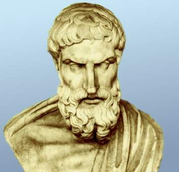
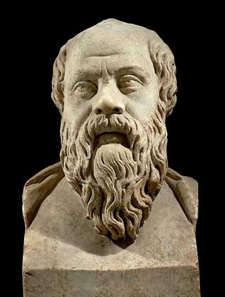

<title>Руслан Хазарзар. Сын Человеческий. Вокруг православия</title>

<h2>Вокруг православия</h2>

После советского атеизма православие в России возрождается, но споры между
верующими и неверующими продолжаются. Атеисты указывают на противоречия в
Библии, например: «Гнев Господень опять возгорелся на Израильтян, и возбудил он
в них Давида сказать: пойди, исчисли Израиля и Иуду» (2&nbsp;Цар.24:1) и «И
восстал сатана на Израиля, и возбудил Давида сделать счисление Израильтян»
(1&nbsp;Пар.21:1); «Я Господь&nbsp;[...], наказывающий детей за вину отцов до
третьего и четвертого рода» (Исх.20:5) и «Сын не несет вины отца» (Иез.18:20);
«Бог искушал Авраама» (Быт.22:1) и «Бог&nbsp;[...] не искушает никого»
(Иак.1:13); «Явилась колесница огненная&nbsp;[...], и понесся Илия в вихре на
небо» (4&nbsp;Цар.2:11) и «Никто не восходил на небо» (Ин.3:13); «Почитай отца
твоего и мать твою» (Исх.20:12) и «Кто приходит ко Мне, и не возненавидит отца
своего, и матери&nbsp;[...], тот не может быть Моим учеником» (Лк.14:26); и
т.&nbsp;д. (ср. также Чис.20:27-28 и Втор.10:6; Чис.4:2-3 и Чис.8:24;
2&nbsp;Цар.6:23 и 2&nbsp;Цар.21:8; et&nbsp;cetera). Люди религиозные отвечают
на эти указания многозначно: крестятся, проклинают, молчат и уходят, бросаются
в казуистику.

Атеисты задаются и другими вопросами. Почему распяли только третью часть
Бога? Можно ли распять Троицу? Как понять то положение, что Бог для того, чтобы
простить грехи человечеству, решил поиздеваться над собственным Сыном,
подвергнув Его распятию? In silvam non ligna feras insanius!
(<i>Horatius Flaccus</i>. Sermones.I.10:34)... Что делал Бог до сотворения
мира? Почему такие противоречия в последовательности сотворения мира в первой и
второй главах Книги Бытия? Неужели человечеству не более шести — восьми тысяч
лет? Почему Адам жил почти тысячелетие (930&nbsp;лет)? Почему небо является
<i>твердью</i> (Быт.1:8) и неужели оно поддерживается столбами (Иов.9:6)? Разве
солнце имеет жилище (Пс.18:5-6)? Откуда взялись люди в стране Нод, если Адам,
Ева, Каин и Авель были тогда единственными людьми (Быт.4:16-17)? Верующие в
ответ приводят частый довод, что библейские тексты надо воспринимать в
переносном смысле. Оппоненты возражают: если их истолковывать аллегорически, то
фраза может иметь какой угодно смысл; а если отсутствует определенный смысл, то
возникает бессмыслица. И приводят в пример слова христианина Ф.&nbsp;М.
Достоевского, который заметил: «Принесите мне что хотите&nbsp;[...]. «Записки
сумасшедшего», оду «Бог», «Юрия Милославского», стихи Фета, что хотите — и я
берусь вывести из первых же десяти строк, вами указанных, что тут именно
аллегория о франко-прусской войне». Христиане отвечают: без Духа Святого не
дано понимание Священного Писания.

Атеисты доказывают<a href="#_ftn1" name="_ftnref1">[1]</a>, что основные
деяния Бога, как их описывает Библия, выглядят с точки зрения нравственных
требований просто необъяснимыми. Почему-то из всех народов земли Он выбрал в
качестве своего любимчика потомство праотца Авраама. Невозможно понять, чем Его
прельстил именно этот народ и почему Он вступил в союз (завет) с ним, поставив
остальные народы мира в положение пасынков. Если бы даже «избранный» народ и
отличался от других какими-нибудь особыми качествами, создание для него
привилегированного положения все равно было бы несправедливым: если всерьез
принимать учение о всемогуществе Бога, то ведь именно от Него зависит наделить
любыми качествами любой народ или любого его представителя. Деяния Яхве в
Ветхом завете, продолжают атеисты, выглядят как систематическое коварное
подталкивание людей на непослушание. Начинается это вскоре после сотворения
мира, когда жертвами провокации становятся наши прародители, соблазненные
змием, присутствие которого в райском саду и неизбежные последствия этого
присутствия должны были быть, конечно, заранее известны всеведущему Богу. В
дальнейшем, когда люди, созданные Богом несовершенными, плохо себя ведут, Он их
свирепо наказывает, истребляя различными способами. Все человечество, за
исключением семьи Ноя, уничтожается при помощи потопа. Население Содома и
Гоморры обрекаются на смерть от потоков огня и серы. Народ Египта подвергается
страшным карам — <i>египетским казням</i> (Исх.7:17-25; 8:2-32; 9:1-34;
10:3-29) — за упрямство одного лишь фараона, не желающего отпускать израильтян,
хотя его упрямство вызвано внушением самого Бога: «Господь ожесточил сердце
фараона» (Исх.9:12; 10:27; 11:10). За то, что царь Давид произвел перепись
населения в своем государстве, «послал Господь Бог язву на
израильтян&nbsp;[...], и умерло из народа [...] семьдесят тысяч человек»
(2&nbsp;Цар.24:15). Если даже и согрешил Давид переписью, то за что было
убивать 70&nbsp;000&nbsp;евреев?.. Библия совершенно не подтверждает всеведения
Бога; наоборот, много раз она сообщает о таких ситуациях, в которых Владыка
мира что-то узнает, проверяет, испытывает. По поводу чуть ли не каждого дня
творения Ветхий завет говорит: «И увидел Бог, что это хорошо». Предвидеть, как
у Него получиться, Всеведущий не мог. Каким-то образом узнал Яхве, что жители
Содома и Гоморры ведут себя непотребно. «И сказал Господь: [...] сойду и
посмотрю, точно ли они поступают так» (Быт.18:21). С небес, оказывается, Ему
было не видно. По разным поводам Он испытывает людей, чтобы узнать, как они
поступят в том или ином случае. Понадобилось, например, Всеведущему узнать, до
конца ли Ему предан Авраам, и Он придумал для него испытание: приказал принести
в жертву сына Исаака (Быт.22); и любвеобильный отец без каких бы то ни было
возражений согласился на убийство ближайшего родственника, подавая тем самым
пример советскому мальчику Павлику Морозову. Мотив испытания людей при помощи
искушения и других средств проходит красной нитью через всю Библию. Разумеется,
испытание лишь тогда имеет смысл, когда его возможные результаты заранее
неизвестны. Именно из-за того, что Бог не в состоянии предвидеть результаты
своих действий, Он часто совершает ошибки, в которых потом Ему приходится
каяться. О самом главном поводе к раскаянию говорится прямо: «И раскаялся
Господь, что создал человека» (Быт.6:6). Вот так вот, ошибку совершил
Всеведущий, создав человечество!.. Если Бог всемогущ и вездесущ<a href="#_ftn2"
name="_ftnref2">[2]</a>, то почему одних людей Он создает святыми, а других
грешниками? Почему Он не может внушить веру всем людям? И, наконец, почему
искренне не верующий человек считается грешником? Если Бог дал ему разум, и
этот разум не дает человеку верить в Бога, то в чем же его грех?.. Утверждение,
что человеческий разум просто не достиг таких высот, чтобы понять и объяснить
божественную сущность (Иов.37:23), приводит к следующему выводу: так как
«священные» Писания испокон веков пытаются объяснить сущность Бога — значит,
Библия является еретической и богохульной книгой, как и все «богодухновенные»
книги христианства и других религий... Dictum sapienti sat est.

Христиане возражают: Бог в великой Своей милости дал созданиям Своим
свободную волю. А религия несет с собой созидательные тенденции. Десять
библейских заповедей (Исх.20:3-17; Втор.5:7-21) и Нагорная проповедь Христа
(Мф.5–7) являются основным кодексом нравственности. Где <i>вера</i>, там
правильно, там <i>верно</i>. Но атеисты твердят свое: вместе с тем религия
порождает национализм и фанатическую ненависть к <i>неверному</i>. Люди склонны
к максимализму и постоянно бросаются в крайности. Поэтому они оставляют
заповеди «не суди», «не убей» и осуждают того, кто не разделяет их веру, и
убивают того, кто признает другого Бога или исполняет другие ритуалы. Если
внимательно посмотреть на войны, которые происходили со времен возникновения
религий и происходят в наши дни, то легко убедиться, что чуть ли не главным
условием, послужившим для начала войны, являются религиозные противоречия; во
всяком случае, темные дела власть придержащих мира сего прикрываются религией.
Избиение пророков, Крестовые походы, инквизиция, еврейские погромы, разрушение
церквей в советской России, — все это лишь различные стороны одной и той же
монеты.

Если бы Россия не отошла от Бога, свидетельствуют православные, то избежала
бы всех революций и процветала бы и по сей день. Атеисты прекословят: если бы
не было служителя культа — попа Гапона, — то не было бы и революции
1905&nbsp;года; если бы Россия не заступилась за православных «братьев сербов»,
то не вступила бы в первую мировую войну; а если бы не эта война, то не было бы
ни Февраля, ни Октября...

Господи! — восклицают христиане. — Нельзя судить о религии, основываясь лишь
доводами разума. На это атеисты приводят слова Л.&nbsp;Н. Толстого из
<i>Дневника</i> (1891, 18&nbsp;апреля): «Разговаривал с Цуриковым о вере. Он
повторяет ужасную фразу о том, что разуму нельзя доверять. Не верить разуму —
все равно, что не верить обонянию и вкусу для пищи. Тот, кто, преподавая
учение, говорит: принимайте его, не доверяя разуму, — делает то же, что говорит
баба, подавая гнилой квас, говоря: не раскушивайте, т.&nbsp;е. не внюхивайтесь,
не поверяйте вкусом. Разум, нужный на все, на проверку всех житейских дел, и
который мы старательно употребляем для проверки качества, количества
покупаемого, продаваемого, самых неважных вещей, вдруг оставить, когда дело
идет о всей жизни — по их понятиям даже и вечной жизни! Требование не доверять
разуму может быть заявлено только теми, которые предлагают что-либо дурное,
долженствующее быть отвергнуто разумом; так же как только квас гнилой баба
советует не раскушивать. Разум церковниками употребляется не на то, чтобы
познавать истину, а чтобы то, что хочется считать истиной, выдать за таковую»<a
href="#_ftn3" name="_ftnref3">[3]</a>.

Православные возглашают: ваша беда в том, что вы
не верите в Бога. «Верую, Господи! помоги моему неверию», — цитируют атеисты
Евангелие (Мк.9:24) и смеются.

Вот такие вот споры идут и, думаю, будут идти между верующими и неверующими.
Но еще более ожесточенные споры возникают между двумя ветвями верующих. Так,
Л.&nbsp;Н. Толстой был отлучен от Церкви не потому, что отрицал существование
Бога, а потому, уверен, что проповедовал свое, отличное от традиционного,
вероучение. В частности, в своей статье «Ответ на определение синода от 20 –
22&nbsp;февраля и на полученные мною по этому случаю письма», написанной в
начале апреля 1901&nbsp;года<a href="#_ftn4" name="_ftnref4">[4]</a>,
Л.&nbsp;Н. Толстой свидетельствует: «То, что я отрекся от церкви, называющей
себя православной, это совершенно справедливо. Но отрекся я от нее не потому,
что я восстал на господа, а напротив, только потому, что всеми силами души
желал служить ему&nbsp;[...]. Я убедился, что учение церкви есть теоретически
коварная и вредная ложь, практически же собрание самых грубых суеверий и
колдовства, скрывающее совершенно весь смысл христианского учения<a
href="#_ftn5" name="_ftnref5">[5]</a>&nbsp;[...]. То, что я отвергаю непонятную
троицу и не имеющую никакого смысла в наше время басню о падении первого
человека, кощунственную историю о боге, родившемся от девы, искупляющем род
человеческий, то это совершенно справедливо. Бога же — духа, бога — любовь,
единого бога&nbsp;—&nbsp;начало всего не только не отвергаю, но ничего не
признаю действительно существующим, кроме бога, и весь смысл жизни вижу только
в исполнении воли бога, выраженной в христианском учении&nbsp;[...]. Сказано
также, что я отвергаю все таинства. Это совершенно справедливо. Все таинства я
считаю низменным, грубым, несоответствующим понятию о боге и христианскому
учению колдовством и, кроме того, нарушением самых прямых указаний Евангелия. В
крещении младенцев вижу явное извращение всего того смысла, который могло иметь
крещение для взрослых, сознательно принимающих христианство; в совершении
таинства брака над людьми, заведомо соединявшимися прежде, и в допущении
разводов и в освящении браков разведенных вижу прямое нарушение и смысла и
буквы евангельского учения. В периодическом прощении грехов на исповеди вижу
вредный обман, только поощряющий безнравственность и уничтожающий опасение
перед согрешением. В елеосвящении так же, как и миропомазании, вижу приемы
грубого колдовства, как и в почитании икон и мощей, как и во всех тех обрядах,
молитвах, заклинаниях, которыми наполнен требник. В причащении вижу
обоготворение плоти и извращение христианского учения. В священстве, кроме
явного приготовления к обману, вижу прямое нарушение слов Христа, — прямо
запрещающего кого бы то ни было называть учителями, отцами, наставниками
(Мф.&nbsp;XXIII,&nbsp;8-10)<a href="#_ftn6" name="_ftnref6">[6]</a>&nbsp;[...].
Если когда какой человек попытается напомнить людям, что не в этих волхованиях,
не в молебнах, свечах, иконах — учение Христа, а в том, чтобы люди любили друг
друга, не платили злом за зло, не судили, не убивали друг друга, то поднимается
стон негодования тех, которым выгодны эти обманы, и люди эти во всеуслышание, с
непостижимой дерзостью говорят в церквах, печатают в книгах, газетах,
катехизисах, что Христос никогда не запрещал клятву (присягу), никогда не
запрещал убийство (казни, войны), что учение о непротивлении злу с сатанинской
хитростью выдумано врагами Христа». В конце данной статьи Л.&nbsp;Н. Толстой
приводит слова английского поэта С.&nbsp;Т. Кольриджа (Coleridge), которые взял
также эпиграфом к «Ответу...»: «Тот, кто начнет с того, что полюбит
христианство более истины, очень скоро полюбит свою церковь или секту более,
чем христианство, и кончит тем, что будет любить себя больше всего на свете»<a
href="#_ftn7" name="_ftnref7">[7]</a>.

Высказывается Толстой по поводу религии и в своих <i>Дневниках</i>.
Например, <i>Дневник. 1890, 3&nbsp;августа</i>: «Как грубо я ошибаюсь, вступая
в разговор о христианстве с православием, или говорю о христианстве по случаю
деятельности священников, монахов, синода и т.&nbsp;п. Православие и
христианство имеют общего только название. Если церковники — христиане, то я не
христианин, и наоборот»<a href="#_ftn8" name="_ftnref8">[8]</a>. <i>Дневник.
1893, 23&nbsp;мая</i>: «Я живу только для исполнения воли бога, установления
его царства; для установления его царства нужно гонение невинных. Чем больше
гонения, тем очевиднее его истина. И поэтому все, что вы мне сделаете дурного —
до пыток и казни, полезно для дела божьего и радостно для меня»<a href="#_ftn9"
name="_ftnref9">[9]</a>.

Конечно, Л.&nbsp;Н. Толстой прав, что православие отошло от Библии, опираясь
более на Предание, хотя апостол Павел заповедовал «не мудрствовать сверх того,
что написано» (1&nbsp;Кор.4:6; ср.&nbsp;Кол.2:8), — сверх того, что уже было
написано во времена Павла. Да, слова Иисуса можно отнести к современным
христианам: «Вы устранили заповедь Божию преданием вашим» (Мф.15:6).

Однако Л.&nbsp;Н. Толстой не учитывал того факта, что если бы христианство
не приспосабливалось к язычеству, то оно, по всей вероятности, оказалось бы
нежизнеспособным и затихло бы, как иудео-христианство; и тогда сам Толстой вряд
ли бы узнал об Иисусе и Его учении. Вероятно, в этом мире выживает только то,
что умеет приспосабливаться; и это относится как к живому существу, так и к
религии, учению в целом. Учение Платона отчасти сохранилось в неоплатонизме,
учение христианства — в <i>неохристианстве</i>. И, быть может, Богу угодно
именно это приспособленчество (Деян.5:38-39)...

Кроме того, Л.&nbsp;Н. Толстой, по-видимому, не
учитывал и того немаловажного факта, что критика Церкви не всегда приводит к
созидательным результатам, ибо если Иисус в какой-то мере понятен избранному
меньшинству, то Церковь понятна подавляющему большинству, которое, отрицая
Церковь, сразу же начинает отрицать и учение Иисуса.

Философия — удел меньшинства. А если эта философия еще и правдива сама перед
собой, то ее удел — частичное, а то и полное забвение. Человечеству нужна вера
— в светлое будущее, в хорошего царя, в благополучие; ему не нужно объяснение,
почему все эти блага недосягаемы, почему человеческая психика не сможет ничем
насытиться (ср. 1&nbsp;Кор.1:21-22). И религия дает эту веру — веру в вечную
блаженную жизнь при выполнении известных условий, и человечество не доходит в
своей беспомощности до сумасшествия и самоистребления. Но тем не менее
греческая философия и христианство во многом взаимосвязанны.

<table width="357" align="right" border="0">
<tr><td width="5">&nbsp;</td>
<td>
<table width="170" align="right" border="0">
<tr valign="middle">
<td></td></tr>
<tr valign="middle">
<td>
 Эпикур
</td></tr></table>
</td></tr></table>

Эпикур (&#7960;&#960;&#943;&#954;&#959;&#965;&#961;&#959;&#962;)<a
href="#_ftn10" name="_ftnref10">[10]</a> — один из немногих философов, который
не обещал сверхъестественного, хотя, впрочем, не отрицал существования богов.
Он учил, что счастье можно найти только в себе самом и в своем самоограничении.
Нравственные заповеди Евангелий сходны с теорией эпикуреизма
(ср.&nbsp;Деян.17:18)<a href="#_ftn11" name="_ftnref11">[11]</a>. Однако учение
Эпикура не могло стать религией, не могло оно также завоевать такого количества
человеческих душ, какое завоевало христианство. В конце жизни Эпикур сам
признался: «Мир должен быть обманут». Человечество не нуждается в горькой
правде, оно жаждет сладкого обмана. Самовнушение спасает, трезвый взгляд на
жизнь может привести к сумасшествию или к потере всего нравственного, что
заложено в человеке, а ведь это — тоже вид сумасшествия, правда, не записанный
в учебниках по психиатрии.

Учения Эпикура, А.&nbsp;Шопенгауэра и других «пессимистических» (это
определение здесь весьма условно) философов не могли и не смогут удовлетворить
душу человеческую. Такое мировосприятие лишает людей удовлетворенности,
насыщения, оно отрицает чудо<a href="#_ftn12" name="_ftnref12">[12]</a> и
погружает в мировую суету, в мир стрессов и цинизма. Схимник, закованный в
вериги и самобичующий свою плоть, но обрящий душевное успокоение в ответах на
все вопросы, намного счастливее любого миллиардера или монарха. Счастлив тот
человек, разум которого не достиг таких высот, чтобы опровергать Бога.
«Блаженны нищие духом» (Мф.5:3). Счастлив тот человек, разум которого достиг
таких высот, чтобы принять Бога. Счастлив тот, кто нашел в себе гармонию, кто
преодолел шизофренический разрыв между разумом и эмоциями.

<table width=322 border=0 align=left>
<tr>
<td>
<table width=318 border=0>
<tr>
<td align=center valign=middle>

<tr>
<td align=center valign=middle>

 Сократ

</td>
</tr>
</table>
</td>
<td width=5>&nbsp;
</td>
</tr>
</table>

Есть и другие связи между греческой философией и
христианством. В частности, трудно найти в истории античности человека, судьба
которого была так же сходна с судьбой Иисуса, как Сократ.

Сын Софроникса и повитухи Фенареты, афинянин Сократ (&#931;&#969;&#954;&#961;&#940;&#964;&#951;&#962;, ок.&nbsp;470 –
399&nbsp;гг. до&nbsp;н.&nbsp;э.), как и Иисус, сам ничего не писал, и поэтому
судить о нем и его учении можно лишь по свидетельствам современников — главным
образом, его учеников: философа Платона и историка Ксенофонта. Сократ был
известен как человек образованный, равнодушный к вещам и деньгам. Еще в
молодости, когда он посетил храм Аполлона в Дельфах, он вдруг словно заново
увидел знакомое всем с ученических лет изречение, начертанное на храме: &#915;&#957;&#8182;&#952;&#953;
&#963;&#949;&#945;&#965;&#964;&#972;&#957;, — и удивился тому, как
открыто и просто указуется каждому его главная цель. В свои 40&nbsp;лет Сократ
вдруг явил себя еще в новом качестве — своего рода обвинителем сограждан,
призывавшим их, целиком озабоченных делами войны, политики и
предпринимательства, остановиться и навести порядок в своем внутреннем мире.
Сократ утверждал, что некий &#948;&#945;&#953;&#956;&#972;&#957;&#953;&#959;&#957;
подсказывает ему истинную цену вещей, отклоняет его от ненужных действий — в
частности, от занятий политикой (<i>Plato.</i> Apologia Socratis.31c-32a;
Phaedrus.242b; и&nbsp;др.), и именно эта &#948;&#945;&#953;&#956;&#972;&#957;&#953;&#945; стала одним из
главных поводов к обвинению Сократа в неблагочестии. Бедно одетый, босой,
иногда даже в подпитии, Сократ стал завсегдатаем афинских улиц, рынков и
всяческих собраний. И, наконец, в дело вмешалась зависть. Сократ был обвинен в
«поклонении новым богам» и «развращении молодежи» и по приговору суда принял яд
цикуты. И, что существенно, он не оправдывался перед судом.

&nbsp;

<a href="#_ftnref1" name="_ftn1">[1]</a>
<i>Крывелев&nbsp;И.&nbsp;А.</i> Библия: историко-критический анализ. — М.,
1982, стр.&nbsp;75–126.

<a href="#_ftnref2" name="_ftn2">[2]</a> Nusquam est qui ubique est
(<i>Seneca Junior</i>. Epistulae in Lucilium.II.2).

<a href="#_ftnref3" name="_ftn3">[3]</a>
<i>Толстой&nbsp;Л.&nbsp;Н.</i> Собрание сочинений. В 22-х т.: Т.&nbsp;21:
Дневники. 1847–1894. — М.: Худож. лит.,&nbsp;1985, стр.&nbsp;459–460.

<a href="#_ftnref4" name="_ftn4">[4]</a> «Церковные ведомости»
24&nbsp;февраля 1901&nbsp;года опубликовали «Определение Святейшего Синода» об
отлучении Л.&nbsp;Н. Толстого от православной Церкви; решение это было принято
по настоянию обер-прокурора Синода К.&nbsp;П. Победоносцева с согласия
Николая&nbsp;II.

<a href="#_ftnref5" name="_ftn5">[5]</a> В примечании к этому месту
Толстой пишет: «Стоит только почитать требник и проследить за теми обрядами,
которые не переставая совершаются православным духовенством и считаются
христианским богослужением, чтобы увидать, что все эти обряды не что иное, как
различные приемы колдовства, приспособленные ко всем возможным случаям
жизни».

<a href="#_ftnref6" name="_ftn6">[6]</a> В другом месте Л.&nbsp;Н.
Толстой пишет: «Одно из самых дерзких неповиновений Христу это богослужение,
общая молитва в храмах и название отцами духовенство» (<i>Дневник. 1890,
10&nbsp;апреля.&nbsp;</i>//&nbsp;<i>Толстой&nbsp;Л.&nbsp;Н.</i> Собрание
сочинений. В 22-х т.: Т.&nbsp;21: Дневники. 1847–1894. — М.: Худож. лит., 1985,
стр.&nbsp;423).

<a href="#_ftnref7" name="_ftn7">[7]</a>
<i>Толстой&nbsp;Л.&nbsp;Н.</i> Не могу молчать. — М.: Сов. Россия, 1985,
стр.&nbsp;435–440.

<a href="#_ftnref8" name="_ftn8">[8]</a>
<i>Толстой&nbsp;Л.&nbsp;Н.</i> Собрание сочинений. В 22-х т.: Т.&nbsp;21:
Дневники. 1847–1894. — М.: Худож. лит., 1985, стр.&nbsp;435.

<a href="#_ftnref9" name="_ftn9">[9]</a> Там же, стр.&nbsp;487; см.
также статьи Л.&nbsp;Н. Толстого: «В чем моя вера?»; «Исследование (Критика)
догматического богословия»; «Соединение, перевод и исследование четырех
Евангелий».

<a href="#_ftnref10" name="_ftn10">[10]</a> Эпикур (341 –
270&nbsp;гг. до&nbsp;н.&nbsp;э.) — греческий философ; философию делил на физику
(учение о природе), канонику (учение о познании) и этику; в физике следовал
атомистике Демокрита; признавал существование блаженно-безразличных богов в
пространствах между бесчисленными мирами, но отрицал их вмешательство в жизнь
космоса и людей; считал, что цель жизни — отсутствие страданий, здоровье тела и
состояние безмятежности духа; познание природы освобождает от страха смерти и
суеверий.

<a href="#_ftnref11" name="_ftn11">[11]</a> Обыденное языческое
мышление ставило эпикурейцев и христиан в один ряд (<i>Lucianus</i>.
Alexander.25 et seq.), тогда как христиан и стоиков, гораздо более похожих
между собой, чем христиане и эпикурейцы, никогда не сравнивали и не смешивали,
ибо стоики не выставляли напоказ презрение к общественным традициям.

<a href="#_ftnref12" name="_ftn12">[12]</a> Оставим в стороне
вариант «Царства Небесного» — коммунизм (см.: <i>Аксючиц&nbsp;В.&nbsp;В.</i>
Мироправители тьмы века сего. — М.: «Выбор», 1994, стр.&nbsp;33–98).

<a href="index">Оглавление</a> <a href="73">Далее</a>

