<title>Руслан Хазарзар. Сын Человеческий. Приложение 2</title>

<h1>Приложение 2</h1>

<h2>Краткая источниковедческая справка</h2>

<h3>Библия</h3>

<h4>Заветы</h4>

Слово <i>Библия</i> произошло от греческого слова <i>библ&uacute;а</i> (&#946;&#953;&#946;&#955;&#943;&#945;), буквально означающего
<i>книги.</i> В свою очередь слово &#946;&#953;&#946;&#955;&#943;&#945; ведет свое начало от
финикийского города Библ (ныне Джебель, город севернее Бейрута), в котором
изготавливали и продавали папирус для письма, называемый по-гречески
<i>б&uacute;блос</i> (&#946;&#943;&#946;&#955;&#959;&#962;) или <i>библ&uacute;он</i> (&#946;&#953;&#946;&#955;&#943;&#959;&#957;). Это название потом
было перенесено на свитки рукописей, а затем и на книги (кодексы).

Библия подразделяется на <i>Ветхий</i> и <i>Новый</i> заветы. Ветхий завет
считается священным сборником книг как в иудаизме, так и в христианстве; Новый
завет — только в христианстве.

Слово <i>завет</i> означает: <i>договор</i>, <i>заключенный союз</i>.
Еврейское слово <i>б’рит</i> (&#1489;&#1468;&#1456;&#1512;&#1460;&#1497;&#1514;) было переведено греческим словом
<i>диатэ&#769;кэ</i> (&#948;&#953;&#945;&#952;&#942;&#954;&#951;), что означает как
<i>завещание</i>, так и <i>договор</i>; на латинский язык это слово было
переведено как testamentum.

&nbsp;

<h4>Язык и переводы</h4>

Первоначально тексты Ветхого завета почти полностью были написаны на
еврейском языке. Лишь немногие фрагменты — на так называемом
<i>арамейском</i> языке: Книга Даниила (2:4<i>б</i> — 7:28), Первая книга Ездры
(4:8 — 6:18; 7:12-26), Книга Товита, Книга Иудифи и книга Премудрости Иисуса
сына Сирахова (последние три книги дошли до нас только в греческом переводе).
Книги Маккавейские, книга Премудрости Соломона и Вторая книга Ездры написаны на
греческом языке. Третья книга Ездры дошла до нас только в латинском переводе,
хотя была написана на семитском языке.

Что касается письменности, то первоначально библейские книги писались
<i>палеоеврейским</i> письмом, созданным на основе протоханаанского письма
в&nbsp;X&nbsp;или&nbsp;IX&nbsp;веке до н.&nbsp;э. В Талмуде этому письму дано
название <i>роэц</i> (&#1512;&#1506;&#1509;), т.&nbsp;е. <i>ломаный</i> или
<i>грубый</i> — в связи с негативным отношением к нему иудаистских
законодателей (Вавилонский Талмуд. Санhедрин.22<i>а</i>). Вероятно, что такое
негативное отношение возникло из-за того, что одну из форм палеоеврейского
письма использовали самаритяне. В период Второго храма произошел постепенный
переход от еврейского к арамейскому письму, на основе которого возник особый
тип письма, обычно называемый <i>квадратным</i> письмом (в связи с характерной
формой букв). Однако во многих древних текстах квадратное письмо называется
<i>ассирийским</i> письмом, ибо арамейское письмо использовалось в Ассирийской
империи. Согласно общей традиции, это письмо было введено Ездрой, хотя в
некоторых местах Талмуда более осторожно сказано, что переход от еврейского к
арамейскому письму произошел «в дни Ездры» (&#1489;&#1497;&#1502;&#1497;&nbsp;&#1506;&#1494;&#1512;&#1488;): «Первоначально Тора была дана Израилю
еврейским письмом и на священном (т.&nbsp;е. еврейском. — <i>Р.Х.</i>) языке
(&#1489;&#1499;&#1514;&#1489;&nbsp;&#1506;&#1489;&#1512;&#1497;&nbsp;&#1493;&#1500;&#1513;&#1493;&#1503;&nbsp;&#1492;&#1511;&#1493;&#1491;&#1513;). Позднее, в дни Ездры, [Тора] была дана
ассирийским письмом и на арамейском языке (&#1489;&#1499;&#1514;&#1489;&nbsp;&#1488;&#1513;&#1493;&#1512;&#1497;&#1514;&nbsp;&#1493;&#1500;&#1513;&#1493;&#1503;&nbsp;&#1488;&#1512;&#1502;&#1497;). [Наконец,] Израиль выбрал ассирийское
письмо и священный язык (&#1499;&#1514;&#1489;&nbsp;&#1488;&#1513;&#1493;&#1512;&#1497;&#1514;&nbsp;&#1493;&#1500;&#1513;&#1493;&#1503;&nbsp;&#1492;&#1511;&#1493;&#1491;&#1513;), а еврейское письмо и арамейский язык
оставил для простолюдинов (&#1492;&#1491;&#1497;&#1493;&#1496;&#1493;&#1514;)» (Вавилонский Талмуд.
Санhедрин.21<i>б</i>).

В начале второго века нашей эры Акиб&aacute; бен-Йосэ&#769;п (&#1506;&#1458;&#1511;&#1460;&#1489;&#1464;&#1488;&nbsp;&#1489;&#1468;&#1462;&#1503;&#1470;&#1497;&#1493;&#1465;&#1505;&#1461;&#1507;) (ок.&nbsp;50 – 132 или 135) и
Гамлиэ&#769;ль (&#1490;&#1468;&#1463;&#1502;&#1456;&#1500;&#1460;&#1488;&#1461;&#1500;)) Младший (? – 117) составили
<i>масоретскую</i> (от еврейского слова &#1502;&#1464;&#1505;&#1512;&#1462;&#1514; [мас&oacute;рэт] — <i>традиция</i>) Библию.
Впоследствии текст этой Библии назовут масоретским текстом; в науке textus
masoreticus обозначается готической буквой&nbsp;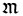. Акибой и Гамлиэлем, а также
последующими религиозными авторитетами иудаизма был установлен список
из&nbsp;24&nbsp;книг (по числу букв еврейского алфавита):

1) <i>Б’ре-ш&uacute;т</i> (&#1489;&#1468;&#1456;&#1512;&#1461;&#1488;&#1513;&#1473;&#1460;&#1497;&#1514; — «В начале») = Бытие;

2) <i>Ш’мот</i> (&#1513;&#1473;&#1456;&#1502;&#1493;&#1465;&#1514; — «Имена») = Исход;

3) <i>Вай-йикр&aacute;</i> (&#1493;&#1463;&#1497;&#1468;&#1460;&#1511;&#1456;&#1512;&#1464;&#1488; — «И воззвал») = Левит;

4) <i>Б’мид-б&aacute;р</i> (&#1489;&#1468;&#1456;&#1502;&#1460;&#1491;&#1456;&#1489;&#1468;&#1463;&#1512; — «В пустыне») = Числа;

5) <i>Д’ба-р&uacute;м</i> (&#1491;&#1468;&#1456;&#1489;&#1464;&#1512;&#1460;&#1497;&#1501; — «Слова») = Второзаконие;

6) <i>Й’hо-ш&yacute;а</i> (&#1497;&#1456;&#1492;&#1493;&#1465;&#1513;&#1473;&#1467;&#1506;&#1463; — «Иисус») = Книга Иисуса Навина;

7) <i>Шо-п’т&uacute;м</i> (&#1513;&#1473;&#1508;&#1456;&#1496;&#1460;&#1497;&#1501; — «Судьи») = Книга Судей Израилевых;

8) <i>Ш’му-э&#769;ль</i> (&#1513;&#1473;&#1456;&#1502;&#1493;&#1468;&#1488;&#1461;&#1500; — «Самуил») = Первая и Вторая книги Царств;

9) <i>М’ла-к&uacute;м</i> (&#1502;&#1456;&#1500;&#1464;&#1499;&#1460;&#1497;&#1501; — «Цари») = Третья и Четвертая книги Царств;

10) <i>Й’ша-й&aacute;hу</i> (&#1497;&#1456;&#1513;&#1473;&#1463;&#1506;&#1456;&#1497;&#1464;&#1492;&#1493;&#1468; — «Исаия») = Книга пророка Исаии;

11) <i>Йир-м’й&aacute;hу</i> (&#1497;&#1460;&#1512;&#1456;&#1502;&#1456;&#1497;&#1464;&#1492;&#1493;&#1468; — «Иеремия») = Книга пророка Иеремии;

12) <i>Й’хез-кэ&#769;ль</i> (&#1497;&#1456;&#1495;&#1462;&#1494;&#1456;&#1511;&#1461;&#1488;&#1500; — «Иезекииль») = Книга пророка Иезекииля;

13) <i>Ш’нэм А-с&aacute;р</i> (&#1513;&#1473;&#1456;&#1504;&#1461;&#1497;&#1501;&#1470;&#1506;&#1464;&#1513;&#1474;&#1464;&#1512; — «Двенадцать») — двенадцать книг так
называемых <i>Малых</i> пророков: <i>hо-ш&eacute;а</i> (&#1492;&#1493;&#1465;&#1513;&#1473;&#1461;&#1506;&#1463; — «Осия»); <i>Йо-э&#769;ль</i> (&#1497;&#1493;&#1465;&#1488;&#1461;&#1500; — «Иоиль»); <i>А-м&oacute;с</i> (&#1506;&#1464;&#1502;&#1493;&#1465;&#1505; — «Амос»); <i>О-бад-й&aacute;</i> (&#1506;&#1489;&#1463;&#1491;&#1456;&#1497;&#1464;&#1492; — «Авдий»); <i>Йо-н&aacute;</i> (&#1497;&#1493;&#1465;&#1504;&#1464;&#1492;
— «Иона»); <i>Ми-к&aacute;</i> (&#1502;&#1460;&#1497;&#1499;&#1464;&#1492;
— «Михей»); <i>На-х&yacute;м</i>
(<i>Нах-в&yacute;м</i>) (&#1504;&#1463;&#1495;&#1493;&#1468;&#1501; — «Наум»); <i>Хабак-к&yacute;к</i> (&#1495;&#1458;&#1489;&#1463;&#1511;&#1468;&#1493;&#1468;&#1511; — «Аввакум»); <i>Ц’пан-й&aacute;</i> (&#1510;&#1456;&#1508;&#1463;&#1504;&#1456;&#1497;&#1464;&#1492; — «Софония»); <i>Хаг-г&aacute;й</i> (&#1495;&#1463;&#1490;&#1468;&#1463;&#1497;
— «Аггей»); <i>З’кар-й&aacute;</i> (&#1494;&#1456;&#1499;&#1463;&#1512;&#1456;&#1497;&#1464;&#1492; — «Захария»); <i>Маль-а-к&uacute;</i> (&#1502;&#1463;&#1500;&#1456;&#1488;&#1464;&#1499;&#1460;&#1497; — «Малахия») = книги пророков Осии, Иоиля, Амоса, Авдия, Ионы,
Михея, Наума, Аввакума, Софонии, Аггея, Захарии и Малахии;

14) <i>Т’hил-л&uacute;м</i> (&#1514;&#1468;&#1456;&#1492;&#1460;&#1500;&#1468;&#1460;&#1497;&#1501; — «Хваления») = Псалтирь;

15) <i>Ий-й&oacute;б</i> (&#1488;&#1460;&#1497;&#1468;&#1493;&#1465;&#1489; — «Иов») = Книга Иова;

16) <i>Миш-л&eacute;й</i> (&#1502;&#1460;&#1513;&#1473;&#1456;&#1500;&#1461;&#1497; — «Притчи») = Книга Притчей Соломоновых;

17) <i>Рут</i> (&#1512;&#1493;&#1468;&#1514; — «Руфь») = Книга Руфи;

18) <i>Шир hаш-ши-р&uacute;м</i>
(&#1513;&#1473;&#1460;&#1497;&#1512;&nbsp;&#1492;&#1463;&#1513;&#1468;&#1473;&#1460;&#1497;&#1512;&#1460;&#1497;&#1501; — «Песнь Песней») = Книга Песни Песней
Соломона;

19) <i>Ко-hэ&#769;-лет</i> (&#1511;&#1492;&#1462;&#1500;&#1462;&#1514;
— «Проповедник») = Книга Екклесиаста;

20) <i>Эй-к&aacute;</i> (&#1488;&#1461;&#1497;&#1499;&#1464;&#1492; — «Как!») = Книга Плача Иеремии;

21) <i>Эс-тэ&#769;р</i> (&#1488;&#1462;&#1505;&#1456;&#1514;&#1468;&#1461;&#1512; — «Есфирь») = Книга Есфири;

22) <i>Да-ний-&eacute;ль</i> (&#1491;&#1468;&#1464;&#1504;&#1460;&#1497;&#1468;&#1461;&#1488;&#1500; — «Даниил») = Книга Даниила;

23) <i>Эз-р&aacute;</i> (&#1506;&#1462;&#1494;&#1456;&#1512;&#1464;&#1488; — «Ездра») + <i>Н’хем-й&aacute;</i> (&#1504;&#1456;&#1495;&#1462;&#1502;&#1456;&#1497;&#1464;&#1492; — «Неемия») = книги Ездры и Неемии;

24) <i>Диб-р&eacute;й hай-йа-м&uacute;м</i> (&#1491;&#1468;&#1489;&#1456;&#1512;&#1461;&#1497;&nbsp;&#1492;&#1463;&#1497;&#1468;&#1464;&#1502;&#1460;&#1497;&#1501; — «Слова дней») = Первая и Вторая книги
Паралипоменон.

Правда, имелись возражения против включения в канон книг Шир hашширим
(Мишна. Йадаййим.3:5), Й’хезкэль (Вавилонский Талмуд. Хагига.13<i>a</i>;
Шаббат.13<i>б</i>; Менахот.45<i>a</i>), Эстэр (Вавилонский Талмуд.
Мегилла.7<i>a</i>; Санhедрин.100<i>a</i>) и Коhэлет (Вавилонский Талмуд.
Шаббат.30<i>б</i>)<a href="#_ftn1" name="_ftnref1">[1]</a>. О последней книге
прямо говорится, что она выражает еретические воззрения
(Ваййикра Рабба.28<i>a</i>).

Именно масоретская Библия считается священной у ортодоксальных иудаистов.
Поскольку они не признают Новый завет, то и первую часть христианской Библии
иудаисты, разумеется, не могут называть Ветхим заветом. Масоретскую Библию они
именуют словом <i>Та-н&aacute;к</i>
(<i>Та-н&aacute;х</i>) (&#1514;&#1504;&#1498;) — три согласные в этом слове означают: <i>То-р&aacute;</i> (&#1514;&#1468;&#1493;&#1465;&#1512;&#1464;&#1492; — «Закон») — книги 1–5 из
вышеперечисленного списка; <i>Н’би-&uacute;м</i> (&#1504;&#1456;&#1489;&#1460;&#1497;&#1488;&#1460;&#1497;&#1501; — «Пророки») — книги 6–13; <i>К’ту-б&uacute;м</i> (&#1499;&#1468;&#1456;&#1514;&#1468;&#1493;&#1468;&#1489;&#1460;&#1497;&#1501; — «Писания») — книги 14–24. Раздел Н’биим
делится на два подраздела: <i>Первые пророки</i> и <i>Поздние пророки</i>. К
первому подразделу относятся книги 6–9, ко второму — книги 10–13.

Порядок книг, приведенный выше, соответствует современным печатным изданиям.
Он приближается, хотя и не точно ему соответствует, к расположению книг,
имеющемуся в большинстве дошедших до нас рукописей, и отличается, особенно в
разделе К’тубим, от порядка, указанного талмудистской традицией. Последняя
(Вавилонский Талмуд. Баба Батра.14<i>б</i>) предписывает следующий порядок книг
в разделе Н’биим: Й’hошуа, Шоп’тим, Ш’муэль, М’лаким, Йирм’йаhу, Й’хезкэль,
Й’шайаhу и Ш’нэм Асар. Книги К’тубим, согласно тому же источнику, должны были
размещаться в такой последовательности: Рут, Т’hиллим, Иййоб, Мишлей, Коhэлет,
Шир hашширим, Эйка, Данийель, Эстэр, Эзра, Дибрей hаййамим. Обращает на себя
внимание отсутствие в этом перечне книги Н’хемйа.

Наиболее авторитетным изданием Ветхого завета является <i><a
href="../biblia/thanakh/bhs.zip" title="Biblia Hebtaica">Biblia
Hebraica</a></i> (Еврейская Библия), представляющая собой научное издание
масоретского текста Танаха. Организатором и первым редактором этого издания был
немецкий семитолог-библеист Р.&nbsp;Киттель (R.&nbsp;Kittel); активным
участником в работе над текстом был П.&nbsp;Кале (P.&nbsp;Kahle). Впервые
Biblia Hebraica увидела свет в&nbsp;1906&nbsp;году. Киттель основывался на так
называемой <a href="../biblia/thanakh/thnkhbch.zip"
title="Thanakh. Editio Iacobi ben Chajjim">editio Bombergiana</a> — издании
масоретского текста, которое было подготовлено на базе поздних рукописей Якобом
бен-Хаййимом и напечатано в&nbsp;1525&nbsp;году у Даниеля Бомберга в Венеции
(вторая раввинская Библия). В переработанном виде Biblia Hebraica была
опубликована третьим изданием в&nbsp;1929&nbsp;году. В его основу был положен
Codex Leningradensis. В издании 1937&nbsp;года, осуществившемся под
руководством А.&nbsp;Альта (A.&nbsp;Alt) и О.&nbsp;Эйссфельдта
(O.&nbsp;Ei&szlig;feldt), была учтена
выполненная Л.&nbsp;Липшютцем публикация сочинения Мишаэля бен-Узиэля
(сер.&nbsp;X&nbsp;в.) о различиях между масоретскими школами Бен-Ашера и
Бен-Нафтали. В седьмом издании 1951&nbsp;года были частично учтены тексты
кумранских рукописей — книг Исаии и Аввакума. Еврейский текст Танаха в Biblia
Hebraica сопровождается критическим аппаратом, где отмечены варианты текста и
разночтения<a href="#_ftn2" name="_ftnref2">[2]</a>. Переработанная версия
<i>Еврейской Библии</i> именуется <i>Biblia Hebraica Stuttgartensia</i>.

Масоретский текст, иногда называемый textus receptus, является, строго
говоря, средневековым представителем одной из групп древних текстов Ветхого
завета, уже на раннем этапе признанным одним из основных течений в иудаизме в
качестве единственного текста. То есть понятие <i>масоретский текст</i>
относится <i>к группе</i> тесно связанных между собой рукописей. В результате
признания этой текстуальной традиции слегка различные формы этого текста
переписывались и распространялись в намного большем количестве, чем остальные
тексты. Окончательная редакция этого текста была определена в Средние века.
Именно она и называется обычно масоретским текстом, тогда как более ранние
формы (обнаруженные, например, в Кумране), которые лишены более поздней
огласовки и акцентных знаков, именуются протомасоретскими. Тем не менее не
следует забывать, что (прото)масоретский текст отражает только одну
текстуальную традицию из многих, существовавших в период Первого и Второго
храмов.

(Прото)масоретский текст характеризуется огромным количеством источников —
известно более 6000 рукописей, восходящих к этой традиции. Однако трудно
установить, существовал ли когда-либо единый <i>архетип</i> (<i>протограф</i>)
масоретского текста. Если нечто подобное и существовало, такой архетип нельзя
ни идентифицировать, ни реконструировать.

Еще более интересен вопрос, существовала ли
форма ветхозаветного текста в период времени, предшествующий появлению древних
источников, и существовал ли когда-либо единственный экземпляр текста, от
которого произошли все остальные тексты? На этот вопрос с достаточной
уверенностью можно ответить: нет, такого оригинального текста, называемого в
библеистике немецким словом Urtext («первоначальный текст»), не существовало.
Действительно, существование Urtext’а с необходимостью предполагает, что его
составитель имел в своем распоряжении оригинальные тексты каждой из книг,
которые были написаны в совершенно разные периоды времени. Причем разные книги
Библии, надо полагать, развивались по-разному, а значит, вопрос об оригинальном
тексте может решаться по-разному — в зависимости от конкретной книги, но отнюдь
не всего Танаха. Нельзя забывать, что даже после открытия текстов Кумранской
общины у нас нет копий библейских книг, относящихся к первому этапу
текстуальной передачи. Кроме того, большинство библейских книг не были написаны
ни каким-то одним автором, ни в какое-то конкретное время: они содержат
композиционные слои, которые создавались в течение многих поколений.

Ветхий завет был переведен на греческий язык довольно рано. Этот перевод
именуется переводом Семидесяти (LXX), или <i><a
href="../biblia/lxx/u/index" target="_blank"
title=Septuaginta>Септуагинтой</a></i> (<i>Septuaginta</i>), что по-латински
означает <i>семьдесят</i>. Основание для такого наименования заключается в
легенде о происхождении этого перевода. Мол, египетский фараон Птолемей&nbsp;II
Филадельф (285&nbsp;или&nbsp;282 – 246&nbsp;гг. до&nbsp;н.&nbsp;э.), узнав от
Деметрия из Фалерона, заведовавшего царским книгохранилищем, о существовании в
Иудее Писания Моисеева, решил организовать перевод Закона на греческий язык и
доставку книг в Александрийскую библиотеку. С этой целью Птолемей послал
иерусалимскому первосвященнику Элеазару письмо: «Желая сделать приятное всем
живущим на земле иудеям, я решил приступить к переводу вашего Закона и,
переведя его с еврейского языка на греческий, поместить эту книгу в число
сочинений моей библиотеки. Поэтому ты поступишь хорошо, если выберешь по шести
престарелых мужей из каждого колена, которые вследствие продолжительности
занятий своих законами многоопытны в них и смогли бы в точности перевести его.
Я полагаю стяжать себе этим делом величайшую славу. Поэтому посылаю тебе для
переговоров относительно этого [...] Андрея и Аристея, которые оба пользуются в
моих глазах величайшим почетом». И тогда 72&nbsp;человека (или&nbsp;70)
поселились на острове Фарос (&#934;&#940;&#961;&#959;&#962;), где каждый в течение
72&nbsp;дней перевел в одиночку весь текст Пятикнижия; и, хотя переводчики были
изолированы друг от друга, все 72&nbsp;текста (или&nbsp;70) оказались дословно
совпадающими (<i>Филон</i>. Жизнь Моисея.2; <i>Иосиф Флавий</i>. Иудейские
древности.XII.2; <i>Юстин&nbsp;</i>(?). Увещание к эллинам.13; <i>Климент
Александрийский</i>. Строматы.I–II).

Весь этот рассказ основывается на произведении, известном в литературе под
именем <a href="../biblia/lxx/aristeag" target="_blank"
title="The Letter of Aristeas - Greek"><i>Письмо Аристея Филократу</i></a>,
подложность которого в настоящее время не вызывает сомнений. (Оно было
составлено не раньше середины II&nbsp;века до&nbsp;н.&nbsp;э.)

На самом деле история возникновения Септуагинты иная. В последние столетия
до нашей эры в Александрии существовала колония евреев. Они забыли родной язык,
и их языком стал греческий, так что оригинальный текст Танаха стал для них
недоступен, и возникла потребность в его греческом переводе. Поэтому постепенно
появились переводы различных ветхозаветных книг, составившие в результате
Септуагинту. Вероятно, полностью перевод был осуществлен лишь в&nbsp;I&nbsp;в.
до н.&nbsp;э. С учетом же так называемых второканонических книг, некоторые из
которых даже не являются переводами, но изначально написаны на греческом языке
(напр., книга Премудрости Соломона), Септуагинта сформировалась не ранее
I&nbsp;века н.&nbsp;э. В науке Септуагинта обозначается готической
буквой&nbsp;.

Около 129 года н.&nbsp;э. иудейский прозелит Аквила (&#7944;&#954;&#973;&#955;&#945;&#962;, Aquila), родом из Понта,
и в первой половине II&nbsp;века н.&nbsp;э. самаритянин Симмах (&#931;&#973;&#956;&#956;&#945;&#967;&#959;&#962;, Symmachus),
принадлежавший к христианскому течению эбионитов (<i>Евсевий.</i> Церковная
история.VI.17), перевели Танах в его протомасоретской редакции на греческий
язык<a href="#_ftn3" name="_ftnref3">[3]</a>. Около 181 года н.&nbsp;э. Танах
на греческий язык перевел также и эбионит (впоследствии перешел в иудаизм)
Феодотион (&#920;&#949;&#959;&#948;&#959;&#964;&#943;&#969;&#957;,
Theodotion), родившийся в Ефесе (Эфесе)<a href="#_ftn4"
name="_ftnref4">[4]</a>.

В III веке Ориген (&#8040;&#961;&#953;&#947;&#941;&#957;&#951;&#962;) предпринял
попытку создать критический текст Септуагинты. Ему принадлежит
<i>Гексапла</i> (&#7961;&#958;&#945;&#960;&#955;&#8118;) — издание Ветхого
завета, в котором в шести колонках параллельно были размещены:
1)&nbsp;масоретская Библия еврейским письмом&nbsp;(&#959;&nbsp;&#949;&#946;&#961;’); 2)&nbsp;масоретская Библия на
еврейском языке, но греческим письмом; 3)&nbsp;перевод Аквилы&nbsp;(&#945;’); 4)&nbsp;перевод Симмаха&nbsp;(&#963;’); 5)&nbsp;Септуагинта; 6)&nbsp;перевод
Феодотиона&nbsp;(&#952;’)<a href="#_ftn5"
name="_ftnref5">[5]</a> (<i>Евсевий.</i> Церковная история.VI.16:1-4). Этот
грандиозный труд в 50-ти томах почти не сохранился.

В середине второго века нашей эры Ветхий завет
был переведен на сирийский язык — это так называемая <i>Пешитта</i> (), или <i>Пешитто</i> (<i>Peshitto</i>), т.&nbsp;е.
<i>простая</i>. Самая древняя, известная ныне, рукопись Пешитты относится к
началу V&nbsp;века. В наше время Пешитта имеет две традиции — западную и
восточную.

На основе Септуагинты был сделал и самый ранний
(I – II вв. н.&nbsp;э.) перевод Ветхого завета на латинский язык — <i>Vetus
Latina</i> (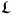). В 386–405 годах его пересмотр
предпринял Иероним Блаженный, создав так называемую <i>Вульг&aacute;ту</i> (<i>Vulgata</i>, т.&nbsp;е.
<i>народная</i>). Вульгата (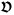) включает в себя не
только Ветхий, но и Новый завет. Ветхий завет прорабатывался на основе
масоретского текста, а Новый — по греческим манускриптам. В VIII веке текст
Вульгаты критически пересматривался Алкуином (ок.&nbsp;735–804), советником
Карла Великого. В&nbsp;1546&nbsp;году Тридентский собор объявил Вульгату
аутентичным текстом Библии. В&nbsp;1589&nbsp;году, при папе Сиксте&nbsp;V, а
затем в&nbsp;1592&nbsp;году, при папе Клементе&nbsp;VIII, был издан
окончательный вариант Вульгаты, принятый католической Церковью в качестве
официального текста Библии.

Были предприняты переводы Ветхого завета и на
арамейский язык — так называемые <i>Таргум&uacute;м</i> (&#1514;&#1468;&#1512;&#1456;&#1490;&#1468;&#1493;&#1468;&#1502;&#1460;&#1497;&#1501; — <i>переводы</i>). Наиболее авторитетными
из них признаются: <a href="../biblia/tharg_on/index" target="_blank"
title="Таргум Онкелоса">Таргум Онкелоса</a><a href="#_ftn6"
name="_ftnref6">[6]</a> (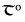) (перевод Торы) и Таргум
Ионатана (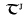) (перевод Н’биим, приписываемый Ионатану
бен-Узиэлю).

На Русь Библия пришла вместе с христианством. Ее перевод на старославянский
язык был выполнен с греческого языка по изводу Септуагинты (Лукиановская
рецензия, ок.&nbsp;280&nbsp;г. н.&nbsp;э.) Кириллом и Мефодием (IX&nbsp;в.);
полностью он не сохранился. Уже в 1056–1057&nbsp;гг. было списано с
восточно-болгарского оригинала так называемое Остромирово Евангелие
(«Евангелие-апракос»). Затем появились Архангельское (1092&nbsp;г.),
Мстиславово (1117&nbsp;г.), Юрьевское (1120&nbsp;г.), Галицкое (1144&nbsp;г.) и
Добрилово (1164&nbsp;г.) Евангелия.

&nbsp;

<table width="100%" border=0 cellspacing=0 cellpadding=0 align=center>
<tr>
<td width="50%" valign=middle>

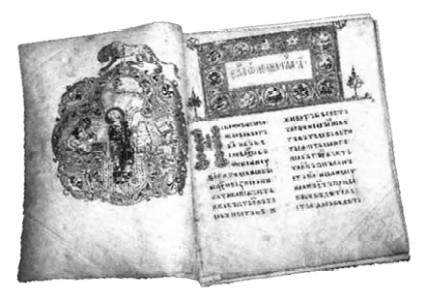

</td>
<td width="50%" valign=middle>

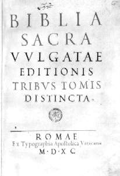

</td>
</tr>
<tr>
<td valign=middle>

&nbsp;

Остромирово Евангелие (1056–1057)

</td>
<td valign=middle>

&nbsp;

Вульгата (1590)

</td>
</tr>
</table>

&nbsp;

Во второй половине XV века еврей-выкрест Феодор перевел с еврейского языка
Псалтирь и Книгу Есфири; ему же, вероятно, принадлежит редакция старославянских
переводов Пятикнижия и Пророков.

В конце XV века новгородский архиепископ
Геннадий предпринял «собирание» полного текста Библии, причем некоторые книги
были переведены с Вульгаты (Первая и Вторая книги Паралипоменон, Первая и
Третья книги Ездры, книги Неемии, Товита, Иудифи, Есфири, Премудрости Соломона,
книги Маккавейские и частично книга Иисуса сына Сирахова). Этой традиции
следовало Острожское издании Библии (1581&nbsp;г.), однако при его подготовке
ряд книг был заново переведен с греческого. В 1663 году Острожское издание с
некоторыми редакционными поправками было перепечатано в Москве — Московская
Библия. Впоследствии с некоторыми исправлениями была издана <a
href="../biblia/sb/index" target="_blank"
title="Елисаветинская Библия">Елисаветинская Библия</a> (1751&nbsp;г.,
1759&nbsp;г.... 1872&nbsp;г.... 1913&nbsp;г.).

В 1680 году в Москве была издана «Псалтирь рифмованная» Симеона Полоцкого
(1629–1680); в 1683 году переводчик Посольского приказа Авраам Фирсов также
перевел Псалтирь на русский язык, но этот перевод тут же был запрещен
патриархом Иоакимом.

К 1698 году пастор И.&nbsp;Э. Глюк подготовил полный перевод Библии на
русский язык, но во время Северной войны при взятии русскими войсками
в&nbsp;1703&nbsp;году Мариенбурга, где жил Глюк, эта работа погибла.

В 1812 году в России было организовано Российское библейское общество,
публиковавшее в 20-х годах XIX века переводы на русский язык некоторых книг
Библии (Псалтирь, частично Пятикнижие). В ноябре 1825 года Александр&nbsp;I
запретил выпуск в свет данных переводов, и в 1826 году деятельность Российского
библейского общества прекратилась.

Новая попытка осуществить перевод Библии на русский язык была предпринята
законоучителем Александра&nbsp;II, доктором богословия, профессором еврейского
языка, протоиереем Г.&nbsp;П. Павским (1787–1863); положив в основу масоретский
текст, он перевел практически все книги Ветхого завета. Синод осудил этот
перевод. Герасима Петровича Павского считал своим учителем архимандрит Макарий
(М.&nbsp;Я. Глухарев, 1792–1847). Начиная с 1834 года и в течение десяти лет,
Макарий осуществлял перевод Танаха на русский язык. В 1839 году он представил
Синоду переводы книг Иова и Исаии, но получил категоричный отказ в их издании.
Позднее, после неоднократных и безуспешных попыток опубликовать свои переводы,
архимандрит был наказан церковной властью. Уже после смерти Макария его работы
стали публиковаться в журнале «Православное обозрение» за
1860–1867&nbsp;гг.

Синод отвергал все переводы Библии на русский язык, и только в 1856 году в
нем был поставлен вопрос о необходимости перевода. Данная работа началась в
1860 году, и в 1867 году конференция Киевской, Московской и Казанской духовных
академий произвела просмотр и сверку всего материала. Результатом проведенной
работы была публикация в 1868–1872 годах <i>Синодального</i> перевода
Библии.

В 1956–1968 годах Московская Патриархия с некоторыми исправлениями, прежде
всего орфографическими, переиздала <a href="../biblia/sinod/sinod.zip"
title="Библия. Синодальный перевод">Синодальный перевод Библии</a>.

&nbsp;

<h4>Нумерация глав и стихов</h4>

Книги Библии делятся на главы, а главы на стихи. Принятое ныне деление глав
было введено кентерберийским епископом Стефаном Лангтоном
(ум.&nbsp;1228&nbsp;г.). В&nbsp;1214&nbsp;году он разделил на главы текст
Вульгаты, это деление было перенесено в еврейский и греческий тексты.

Стихи были пронумерованы вначале Сантесом Панино (ум.&nbsp;1541&nbsp;г.), а
затем, в&nbsp;1551&nbsp;году, — Робером Стефаном Этьенном (1503–1559). Это
усовершенствование структуры Библии было в ее ветхозаветной части воспринято с
некоторыми изменениями и иудаизмом (количество стихов по пометам масоретов
относительно Септуагинты меньше).

&nbsp;

<h4>Состав Библии</h4>

Состав и текст Ветхого завета не полностью совпадают в иудаизме и христианстве.
Состав Танаха уже был нами рассмотрен выше<a href="#_ftn7"
name="_ftnref7">[7]</a>. Некоторые книги, входящие в православный Ветхий завет,
в Еврейской Библии отсутствуют, как-то: Вторая и Третья книги Ездры, три книги
Маккавейские, книги Товита, Иудифи и Варуха, Послание Иеремии, книги
Премудрости Соломона и Иисуса сына Сирахова. Эти книги в католической традиции
называются второканоническими, в православной — неканоническими, в
иудаистской — посторонними, внешними (&#1495;&#1460;&#1497;&#1510;&#1493;&#1465;&#1504;&#1460;&#1497;&#1501;).

Помимо этого существуют <i>ап&oacute;крифы</i> (от греческого слова &#7936;&#960;&#972;&#954;&#961;&#965;&#966;&#959;&#962; —
<i>тайный</i>), которые в Библию не включены. Появилось это название в период
борьбы основных христианских течений с распространенной во втором веке сектой
христиан-гностиков. Гностики сами называли свои писания секретными, тайными.
Именно эта «секретность» и дала основание христианскому писателю Иринею назвать
сочинения гностиков апокрифами (тайными); а так как он полемизировал с
гностиками, то их сочинения были для него не только тайными, но и подложными.
После установления состава книг христианской Библии ко всем не включенным в нее
сочинениям религиозного содержания стало применяться слово <i>апокрифы</i>,
хотя многие из них вовсе не были тайными<a href="#_ftn8"
name="_ftnref8">[8]</a>. К ветхозаветным апокрифам относятся: Успение
Моисея, Книга Еноха, Завещание двенадцати патриархов и&nbsp;др. К
новозаветным — Евангелие Евреев, Дидахэ, Деяния Петра, Евангелие от Фомы
и&nbsp;др.

Состав и последовательность книг православной Библии Ветхого завета
следующий:

<b>Пятикнижие Моисеево</b> — так христиане называют пять первых книг Библии,
составляющих одно целое, которое по-еврейски обычно называется <i>Тор&aacute;</i> (&#1514;&#1468;&#1493;&#1465;&#1512;&#1464;&#1492;), что может быть переведено как
<i>Закон</i>. Первое свидетельство об употреблении этого слова в указанном
смысле встречается в предисловии книги Премудрости Иисуса сына Сирахова
(132&nbsp;г. до н.&nbsp;э.). Эти книги именуются следующим образом:
<b>Бытие</b> (Быт), <b>Исход</b> (Исх), <b>Левит</b> (Лев), <b>Числа</b> (Чис)
и <b>Второзаконие</b> (Втор)<a href="#_ftn9" name="_ftnref9">[9]</a>. Традиция
(Вавилонский Талмуд. Баба Батра.14<i>б</i>) полагает, что Тору написал Моисей
(&#1502;&#1513;&#1473;&#1462;&#1492; — Мош&eacute;); однако Пятикнижие, как показали
исследования<a href="#_ftn10" name="_ftnref10">[10]</a>, это компиляция,
основанная на разных источниках; его не мог написать один человек, в том числе
и Моше. Время создания самых древних фрагментов Торы, возможно, следует отнести
ко второму тысячелетию до нашей эры. Второзаконие, вероятно, было написано
около 870&nbsp;года до н.&nbsp;э.<a href="#_ftn11" name="_ftnref11">[11]</a>,
во времена царствования иудейского царя Иосафата (&#1497;&#1456;&#1492;&#1493;&#1465;&#1513;&#1473;&#1464;&#1508;&#1464;&#1496; — Й’hошап&aacute;т) (ср.&nbsp;2&nbsp;Паралипоменон.19:4-11
и Второзаконие.16:18-20; 17:8-12; 2&nbsp;Паралипоменон.17:7-9 и
Второзаконие.17:18-20). Окончательную редакцию Пятикнижие получило в жреческих
кругах Иерусалимского храма, очевидно, под руководством Хелкии (&#1495;&#1460;&#1500;&#1456;&#1511;&#1460;&#1497;&#1468;&#1464;&#1492;&#1493;&#1468; — Хилькийй&aacute;hу), и было опубликовано
в&nbsp;622&nbsp;или&nbsp;621&nbsp;г. до&nbsp;н.&nbsp;э.
(4&nbsp;Царств.22:8).

Отметим, что К.&nbsp;Граф (1815–1869) и Ю.&nbsp;Вельхаузен (1844–1918),
опираясь на теорию Г.&nbsp;Рейсса (1804–1891), окончательную редакцию и
публикацию Торы относят к&nbsp;444&nbsp;г. до&nbsp;н.&nbsp;э. Однако, принимая
теорию Графа – Вельхаузена, как отметил И.&nbsp;Ш. Шифман, трудно объяснить,
каким образом Пятикнижие проникло к самаритянам: ведь реформы Ездры были
направлены на отделение иудеев Иерусалимской храмовой общины от остального
населения Палестины и прежде всего от самаритян. В условиях ожесточенной вражды
иудеев с самаритянами, которая заполняет собой всю вторую половину первого
тысячелетия до нашей эры, трудно представить, чтобы самаритяне именно тогда
могли воспринять Тору в качестве богодухновенной книги. Очевидно, к тому
времени, когда иудеи начали возвращаться из плена и стала складываться ситуация
иудейско-самаритянского конфликта, Пятикнижие уже было в руках самаритян и уже
играло роль Священного Писания. Получить ее они могли только до вавилонского
пленения иудеев, то есть до&nbsp;587&nbsp;года до нашей эры.

Следует также отметить, что в иудаистском понимании Тора гораздо шире
Пятикнижия Моисеева. Каждую из пяти первых книг Библии иудаисты иногда называют
словом <i>Хум-м&aacute;ш</i> (&#1495;&#1467;&#1502;&#1468;&#1464;&#1513;&#1473; — <i>пятая часть</i>). При этом они относят к Торе Танах,
<i>Мишну</i>, <i>Талмуд</i> и многочисленные комментарии к ним. Каббалисты,
кроме того, включают в Тору ее тайную часть, которую называют словом
<i>Каб-ба-л&aacute;</i><a href="#_ftn12"
name="_ftnref12">[12]</a> (&#1511;&#1463;&#1489;&#1468;&#1464;&#1500;&#1464;&#1492; — <i>предание</i>). Каббала — это мистическое учение, возникшее
c&nbsp;V&nbsp;по&nbsp;IX&nbsp;вв. н.&nbsp;э. и развившееся
в&nbsp;XIII&nbsp;веке в Андалусии (Andaluc&iacute;a)<a href="#_ftn13"
name="_ftnref13">[13]</a>. Примечательной книгой Каббалы является книга <i><a
href="http://www.kabbalah.info/PDF/idx_zohar" target="_blank"
title="Зогар">Зо-h&aacute;р</a></i> (&#1494;&#1492;&#1463;&#1512; —
<i>сияние</i>), авторство которой традиция приписывает законоучителю второго
века нашей эры Шим’ону бар-Йохаи (&#1513;&#1473;&#1460;&#1502;&#1456;&#1506;&#1493;&#1465;&#1503;&nbsp;&#1489;&#1468;&#1512;&#1470;&#1497;&#1493;&#1465;&#1495;&#1464;&#1488;&#1460;&#1497;), хотя, по всей вероятности, автором
Зоhара был каббалист Моше де-Лион, живший в&nbsp;XIII&nbsp;веке в Кастилии
(Castilla)<a href="#_ftn14" name="_ftnref14">[14]</a>. Слово, давшее название
этой книги, взято из книги Данийель (Даниил.12:3,&nbsp;<i>PX</i>): &#1493;&#1456;&#1492;&#1463;&#1502;&#1468;&#1463;&#1513;&#1474;&#1456;&#1499;&#1468;&#1460;&#1500;&#1460;&#1497;&#1501;&nbsp;&#1497;&#1463;&#1494;&#1456;&#1492;&#1460;&#1512;&#1493;&#1468;&nbsp;&#1499;&#1468;&#1456;&#1494;&#1492;&#1463;&#1512;&nbsp;&#1492;&#1464;&#1512;&#1464;&#1511;&#1460;&#1497;&#1506;&#1463; — «И разумеющие воссияют, как
<i>сияние</i> на тверди [неба]».

Иудаисты утверждают, что вся Тора, записанная в
период от Синайского откровения и вплоть до составления Талмуда и комментариев,
была дана Богом непосредственно Моисею: «Моше получил Тору с Синая и передал ее
Й’hошуа, Й’hошуа — старейшинам, старейшины — пророкам, а пророки передали ее
<i>Мужам Великой Синагоги</i>» (Мишна. Абот.1:1). Великая Синагога (&#1499;&#1468;&#1456;&#1504;&#1462;&#1505;&#1462;&#1514;&nbsp;&#1492;&#1463;&#1490;&#1456;&#1491;&#1493;&#1465;&#1500;&#1464;&#1492; — К’нэ&#769;сет hагдол&aacute;) — это совет из&nbsp;120&nbsp;старейшин,
функционировавший после возвращения иудеев из вавилонского плена
до&nbsp;291&nbsp;года до&nbsp;н.&nbsp;э. Таким образом, согласно иудаистской
традиции, Великая Синагога была связующим звеном между пророками, завершившими
Танах, и мудрецами (&#1514;&#1468;&#1463;&#1504;&#1468;&#1464;&#1488;&#1460;&#1497;&#1501; [таннаи&#769;м] — <i>излагатели</i>) Мишны, которые
унаследовали Тору и передали ее последующим законоучителям иудаизма.

За Пятикнижием Моисеевом в православном Ветхом завете следуют книги, которые
обычно называют <i>историческими</i>. К ним относятся:

<b>Книга Иисуса Навина</b> (Нав)<a href="#_ftn15" name="_ftnref15">[15]</a>.
Иисус Навин (&#1497;&#1456;&#1492;&#1493;&#1465;&#1513;&#1473;&#1467;&#1506;&#1463;&nbsp;&#1489;&#1468;&#1462;&#1503;&nbsp;&#1504;&#1493;&#1468;&#1503; — Й’hош&yacute;а бен-Нун) не является автором данной
книги, составленной после 931&nbsp;г. до&nbsp;н.&nbsp;э. и отредактированной в
середине VI&nbsp;века до&nbsp;н.&nbsp;э., хотя традиция (Вавилонский Талмуд.
Баба Батра.14<i>б</i>) утверждает: «Й’hошуа написал книгу свою и восемь
[последних] стихов Торы».

<b>Книга Судей Израилевых</b> (Суд)<a href="#_ftn16"
name="_ftnref16">[16]</a> является компиляцией, хотя традиция (Вавилонский
Талмуд. Баба Батра.14<i>б</i>) приписывает ее авторство пророку Самуилу. Самые
древние фрагменты относятся к&nbsp;XIII&nbsp;веку до&nbsp;н.&nbsp;э.
Окончательную редакцию книга получила после 538&nbsp;года
до&nbsp;н.&nbsp;э.

Далее следует <b>Книга Руфи</b> (Руф)<a href="#_ftn17"
name="_ftnref17">[17]</a>, написанная в&nbsp;IV&nbsp;веке до&nbsp;н.&nbsp;э.
Традиция (Вавилонский Талмуд. Баба Батра.14<i>б</i>) приписывает ее авторство
пророку Самуилу. Моавитянка Руфь (Рут) — мифологическая праматерь царя
Давида.

<b>Первая</b> и <b>Вторая книги Царств</b> (1&nbsp;Цар и 2&nbsp;Цар) в
древнееврейских сборниках составляли одну Книгу Самуила, которого, по традиции,
считают их автором: «Ш’муэ&#769;ль написал книгу свою, и Шоп’ти&#769;м, и
Рут» (Вавилонский Талмуд. Баба Батра.15<i>б</i>). Разделение на две книги
восходит к Септуагинте, в которой эти книги названы Первой и Второй книгами
Царств. В Вульгате первые две книги сохранили название книг Самуила
(Samuel&nbsp;I и Samuel&nbsp;II). В&nbsp;XVI&nbsp;веке деление Вульгаты было
заимствовано и масоретской Библией. <b>Третья</b> и <b>Четвертая книги
Царств</b> (3&nbsp;Цар и 4&nbsp;Цар)<a href="#_ftn18" name="_ftnref18">[18]</a>
в древнееврейских сборниках составляли одну книгу Царей (М’лаки&#769;м),
которую, согласно традиции (Вавилонский Талмуд. Баба Батра.15<i>a</i>), написал
пророк Иеремия: «Йирм’йа написал книгу свою, и книгу М’лаким, и Кинот (&#1511;&#1460;&#1497;&#1504;&#1493;&#1465;&#1514;, т.&nbsp;е. <i>Плач</i>. — <i>Р.Х.</i>)».
Разделение на две книги восходит к Септуагинте, в которой эти книги названы
Третьей и Четвертой книгами Царств. В Вульгате они сохранили название книг
Царей (Regum&nbsp;I и Regum&nbsp;II). В&nbsp;XVI&nbsp;веке деление Вульгаты
было заимствовано и масоретской Библией. Книги Царств возникли, вероятно, в
царствование Иосии (&#1497;&#1513;&#1473;&#1460;&#1497;&#1468;&#1464;&#1492;&#1493;&#1468; — Йошийй&aacute;hу), то
есть в последние десятилетия VII&nbsp;века до&nbsp;н.&nbsp;э. Впоследствии они
были дополнены рассказом о гибели Иудейского царства, который был заимствован у
пророка Иеремии (ср.&nbsp;4&nbsp;Царств.25 и Иеремия.52). Произошло это
дополнение, по-видимому, в середине VI&nbsp;века до&nbsp;н.&nbsp;э.

<b>Первая</b> и <b>Вторая книги Паралипом&eacute;нон</b> (1&nbsp;Пар и 2&nbsp;Пар)<a
href="#_ftn19" name="_ftnref19">[19]</a> дополняют книги Царств (&#960;&#945;&#961;&#945;&#955;&#949;&#953;&#960;&#972;&#956;&#949;&#957;&#959;&#957;
— <i>пропущенное</i>). В Септуагинте содержатся две книги Паралипоменон, но в
древнееврейских сборниках они составляли одну книгу под названием Дибрей
hаййамим. Составитель данных книг — некий иерусалимский левит, живший во второй
половине IV&nbsp;или в начале III&nbsp;века до&nbsp;н.&nbsp;э.

<b>Первая книга Ездры</b> (1&nbsp;Езд), или просто <b>Книга Ездры</b> (Езд),
и <b>Книга Неемии</b> (Неем)<a href="#_ftn20" name="_ftnref20">[20]</a>
продолжают историю книг Паралипоменон, но написаны были раньше — в середине или
во второй половине IV&nbsp;века до&nbsp;н.&nbsp;э. Согласно традиции
(Вавилонский Талмуд. Баба Батра.15<i>а</i>), «Эзра написал книгу свою и
родословия в Дибрей hаййамим до времени своего». Некоторые исследователи
считают, что автором книг Ездры и Неемии, которые до христианской эпохи
составляли одну книгу (в изданиях Септуагинты она обычно названа Второй книгой
Ездры), был Неемия (ср.&nbsp;2&nbsp;Маккавейская.2:13). Из трех книг Ездры
канонической считается только Первая. <b>Вторая книга Ездры</b> (2&nbsp;Езд),
дошедшая до нас на греческом языке (в изданиях Септуагинты она обычно именуется
просто Книгой Ездры<a href="#_ftn21" name="_ftnref21">[21]</a>), написана, по
всей вероятности, в&nbsp;I&nbsp;веке нашей эры. Соглашаясь с точкой зрения
Иеронима, Тридентский собор не включил ее в канон, и в официальных изданиях
Вульгаты ее или нет совсем, или она помещена в виде приложения. Основная часть
(гл.&nbsp;3–14) <b>Третьей книги Ездры</b> (3&nbsp;Езд) написана
в&nbsp;97&nbsp;году нашей эры палестинским евреем, знакомым с зарождавшимся
христианством (главы&nbsp;1,&nbsp;2,&nbsp;15,&nbsp;16 — христианское сочинение
приблизительно III&nbsp;века н.&nbsp;э.). Этой книгой, этим, по сути своей,
апокалипсисом, завершается Ветхий завет православной Библии. В Вульгате Третья
книга Ездры нумеруется либо Второй, либо Четвертой.

<b>Книга Товита</b> (Тов)<a href="#_ftn22" name="_ftnref22">[22]</a>
написана на семитском языке. Датировка весьма проблематична.

<b>Книга Иудифи</b> (Иф)<a href="#_ftn23" name="_ftnref23">[23]</a>,
созданная в Палестине не ранее середины второго века до&nbsp;н.&nbsp;э., но не
позднее I&nbsp;в. н.&nbsp;э., написана на семитском языке, но сохранилась в
нескольких греческих и латинских вариантах.

<b>Книга Есфири</b> (Есф)<a href="#_ftn24" name="_ftnref24">[24]</a> дошла
до нас в кратком еврейском и более пространном греческом вариантах. Есфирь
(Эстэр) не автор, а героиня книги. Еврейский вариант книги написан в
послепленный период, но не позднее II&nbsp;века до&nbsp;н.&nbsp;э. (по всей
вероятности, еще до похода Александра Македонского, то есть в&nbsp;V –
IV&nbsp;вв. до&nbsp;н.&nbsp;э.), евреями, жившими в Месопотамии. Греческий
вариант книги составлен не позднее I&nbsp;века до&nbsp;н.&nbsp;э.

Книги Маккавейские не вошли в Танах<a
href="#_ftn25" name="_ftnref25">[25]</a>, а в православной Библии они
предшествуют Третьей книге Ездры. <b>Первая книга Маккавейская</b>
(1&nbsp;Макк) написана в период с&nbsp;134&nbsp;по&nbsp;63&nbsp;гг.
до&nbsp;н.&nbsp;э. палестинским евреем. <b>Вторая книга Маккавейская</b>
(2&nbsp;Макк), составленная около 124&nbsp;г. до&nbsp;н.&nbsp;э., представляет
собой сокращенное произведение некоего Иасона Киринейского. <b>Третья книга
Маккавейская</b> (3&nbsp;Макк) написана никак не ранее второй половины второго
века до нашей эры — вероятно, в конце 30-х&nbsp;гг. I&nbsp;века нашей эры.

К следующему разделу православного Ветхого завета относятся так называемые
<i>учительные</i> книги:

<b>Книга Иова</b> (Иов)<a href="#_ftn26" name="_ftnref26">[26]</a> написана
неизвестным евреем в период с&nbsp;538&nbsp;по&nbsp;200&nbsp;гг.
до&nbsp;н.&nbsp;э., вероятно, в&nbsp;V&nbsp;в. до&nbsp;н.&nbsp;э. Традиция
(Вавилонский Талмуд. Баба Батра.14<i>б</i>) приписывает авторство этой книги
Моисею: «Моше написал книгу свою&nbsp;[Тора], главу о Биль’&aacute;ме [&#1489;&#1468;&#1460;&#1500;&#1456;&#1506;&#1464;&#1501;, то есть о Валааме] и Иййоб».

<b>Псалтирь</b> (Пс)<a href="#_ftn27" name="_ftnref27">[27]</a>
формировалась постепенно, включая в себя различные собрания псалмов, и приняла
современную форму в середине второго века до нашей эры. Согласно традиции
(Вавилонский Талмуд. Баба Батра.14<i>а</i>-15<i>a</i>), «Давид написал книгу
Т’hиллим при содействии десяти старейшин».

<b>Книга Притчей Соломоновых</b> (Прит)<a href="#_ftn28"
name="_ftnref28">[28]</a> создавалась в течение многих веков и приобрела
известный вид приблизительно в III веке до нашей эры. Традиция (Вавилонский
Талмуд. Баба Батра.15<i>a</i>) приписывает авторство этой книги царю Хизкийе и
«собратьям его».

<b>Книга Екклеси&aacute;ста </b>(Екк)<a
href="#_ftn29" name="_ftnref29">[29]</a> написана в&nbsp;III&nbsp;веке
до&nbsp;н.&nbsp;э. или в первой половине II&nbsp;века до&nbsp;н.&nbsp;э.
палестинским евреем. Традиция же гласит: «Хизкийя&#769; и собратья его написали
Й’шайа, Мишлей, Шир hашширим и Коhэлет» (Вавилонский Талмуд. Баба
Батра.15<i>а</i>).

<b>Книга Песни Песней Соломона</b> (Песн)<a href="#_ftn30"
name="_ftnref30">[30]</a> представляет собой собрание любовно-эротических песен
и свадебных гимнов и приобрела современный вид, вероятно, в середине
V&nbsp;века до&nbsp;н.&nbsp;э.

<b>Книга Премудрости Соломона</b> (Прем)<a href="#_ftn31"
name="_ftnref31">[31]</a> написана в Александрии в&nbsp;I&nbsp;веке н.&nbsp;э.
неизвестным автором.

<b>Книга Премудрости Иисуса сына Сирахова</b>
(Сир)<a href="#_ftn32" name="_ftnref32">[32]</a> была написана около
180&nbsp;года до&nbsp;н.&nbsp;э.; предисловие — в&nbsp;132&nbsp;году
до&nbsp;н.&nbsp;э. Автором книги является иерусалимский еврей по имени Иисус,
сын или внук Сираха — Бен-Сира (&#1489;&#1468;&#1462;&#1503;&#1470;&#1505;&#1460;&#1497;&#1512;&#1464;&#1488;). Изъятие этой книги из иудейского канона
(Тосефта. Йадаййим.2:13) сопровождалось запрещением ее читать (Мишна.
Санhедрин.10:1).

К следующему разделу православного Ветхого завета относятся
<i>пророческие</i> книги:

<b>Книга пророка Ис&aacute;ии</b> (Ис)<a
href="#_ftn33" name="_ftnref33">[33]</a> окончательно сформировалась не ранее
конца V&nbsp;века до&nbsp;н.&nbsp;э., но не позднее II&nbsp;века
до&nbsp;н.&nbsp;э. Исаия сын Амоса (&#1497;&#1456;&#1513;&#1473;&#1463;&#1506;&#1456;&#1497;&#1464;&#1492;&#1493;&#1468;&nbsp;&#1489;&#1468;&#1462;&#1503;&#1470;&#1488;&#1464;&#1502;&#1493;&#1465;&#1509; — Й’шай&aacute;hу бен-Ам&oacute;ц) является автором только первых 12-ти
глав. Главы&nbsp;13–39 принадлежат его ученикам, хотя, возможно,
главы&nbsp;15–23 и 28–32 тоже написаны Исаией. Этот пророк родился
в&nbsp;765&nbsp;году до&nbsp;н.&nbsp;э., пророческую деятельность начал
в&nbsp;740&nbsp;году, жил в Иерусалиме, имел жену-пророчицу и двух сыновей. О
деятельности Исаии после 700&nbsp;года ничего неизвестно; в апокрифической
книге <i>Мученичество и вознесение Исаии</i>, возникшей уже в христианскую
эпоху, сказано, что пророка распилили деревянной пилой на куски по приказу царя
Манассии (&#1502;&#1456;&#1504;&#1463;&#1513;&#1468;&#1473;&#1462;&#1492; — М’нашш&eacute;)
(ср.&nbsp;<i>Юстин</i>. Разговор с Трифоном иудеем.120). Вторая часть книги
(главы&nbsp;40–55) написана последователем Исаии VI&nbsp;века
до&nbsp;н.&nbsp;э., уведенным в вавилонский плен. Его условно называют
Второисаией, или Девтероисаией. Состав последней части книги (главы&nbsp;56–66)
довольно разнообразен и представляет собой произведение школы Исаии,
продолжавшей дело пророка после плена.

<b>Книга пророка Иеремии</b> (Иер)<a href="#_ftn34"
name="_ftnref34">[34]</a> получила окончательную редакцию в&nbsp;III&nbsp;веке
до&nbsp;н.&nbsp;э. Пророк Иеремия (&#1497;&#1460;&#1512;&#1456;&#1502;&#1456;&#1497;&#1464;&#1492;&#1493;&#1468;&nbsp;&#1489;&#1468;&#1462;&#1503;&#1470;&#1495;&#1460;&#1500;&#1456;&#1511;&#1460;&#1497;&#1468;&#1464;&#1492;&#1493;&#1468; — Йирм’й&aacute;hу бен-Хилькийй&aacute;hу) жил спустя столетие после Исаии. Его
деятельность продолжалась с&nbsp;626&nbsp;по&nbsp;587&nbsp;гг.
до&nbsp;н.&nbsp;э. Родом он был из селения Анат&oacute;т (&#1506;&#1458;&#1504;&#1464;&#1514;&#1493;&#1465;&#1514;) и происходил из священнического сословия (Иер.1:1).
В&nbsp;605&nbsp;году Иеремия свел все свои до того прочитанные проповеди в
книгу, которую он продиктовал Варуху (Иер.36:1-4). Когда же Варух предпринял
попытку читать эту книгу в Храме, она была отобрана по приказу царя Иоакима
(&#1497;&#1456;&#1492;&#1493;&#1465;&#1497;&#1464;&#1511;&#1460;&#1497;&#1501; — Й’hояки&#769;м), и тот ее собственноручно уничтожил
(Иер.36:21-23). Иеремия заново продиктовал Варуху свою книгу, значительно
расширив ее. После падения Иерусалима в&nbsp;587&nbsp;году Иеремия по
приказанию царя Навуходоносора&nbsp;II был освобожден из вавилонского плена.
Впоследствии Иеремия ушел вместе со множеством переселенцев из Иудеи в Египет и
там же умер.

<b>Плач Иеремии</b> (Плач)<a href="#_ftn35" name="_ftnref35">[35]</a> самому
Иеремии, по всей вероятности, не принадлежит. Ее авторы неизвестны.
Окончательную редакцию книга получила около 515&nbsp;года
до&nbsp;н.&nbsp;э.

<b>Послание Иеремии</b> (Пос.&nbsp;Иер)<a href="#_ftn36"
name="_ftnref36">[36]</a> написано неизвестным автором во&nbsp;II&nbsp;веке
до&nbsp;н.&nbsp;э.

<b>Книга пророка Варуха</b> (Вар)<a href="#_ftn37" name="_ftnref37">[37]</a>
написана, вероятно, во&nbsp;II&nbsp;веке до&nbsp;н.&nbsp;э. Варух (&#1489;&#1464;&#1512;&#1493;&#1468;&#59394; — Бар&yacute;к), сын Нирии (&#1489;&#1468;&#1462;&#1503;&#1470;&#1504;&#1461;&#1512;&#1460;&#1497;&#1468;&#1464;&#1492; — бен-Нерийй&aacute;) и сподвижник Иеремии, не является
автором этой книги.

<b>Книга пророка Иезекииля</b> (Иез)<a href="#_ftn38"
name="_ftnref38">[38]</a>. Пророк Иезекииль (&#1497;&#1456;&#1495;&#1462;&#1494;&#1456;&#1511;&#1461;&#1488;&#1500;&nbsp;&#1489;&#1468;&#1462;&#1503;&#1470;&#1489;&#1468;&#1493;&#1468;&#1494;&#1460;&#1497; — Й’хезкэ&#769;ль бен-Бузи&#769;)
происходил из священнического рода, был депортирован в Вавилонию
в&nbsp;597&nbsp;году до&nbsp;н.&nbsp;э. Его пророческая деятельность приходится
на период с&nbsp;593&nbsp;по&nbsp;571&nbsp;гг. Не исключено, что в книге
скомпоновано не только учение Иезекииля, но и других проповедников, ибо
традиция гласит: «Мужи Великой Синагоги написали [книги] Й’хезкэль, Ш’нэм Асар,
Данийель и Эстэр» (Вавилонский Талмуд. Баба Батра.15<i>a</i>).

<b>Книга пророка Даниила</b> (Дан)<a href="#_ftn39"
name="_ftnref39">[39]</a> написана в&nbsp;164&nbsp;году до&nbsp;н.&nbsp;э.
неизвестным автором. Пророк Даниил — мифологический персонаж; легенда о нем
сложилась еще в&nbsp;VII&nbsp;веке до&nbsp;н.&nbsp;э. (Иез.14:14,20; 28:3);
впоследствии, однако, предположили, что он жил во времена вавилонского плена. В
Танахе книга Данийель отнесена не к разделу Пророки (Н’биим), а к разделу
Писания (К’тубим).

<b>Книга пророка Осии</b> (Ос)<a href="#_ftn40" name="_ftnref40">[40]</a>
открывает список Малых пророков. Oсия — последний пророк Израильского царства.
Его деятельность началась около 750&nbsp;года до&nbsp;н.&nbsp;э. Он был женат
(на блуднице) и имел троих детей. Возможно, он пережил разорение Израиля
в&nbsp;721&nbsp;году. Записи пророка были собраны в Иудейском царстве вскоре
после смерти Осии.

<b>Книга пророка Иоиля</b> (Иоил)<a href="#_ftn41" name="_ftnref41">[41]</a>
была создана в период с&nbsp;V&nbsp;по&nbsp;III&nbsp;вв. до&nbsp;н.&nbsp;э. О
пророке по имени Иоиль (Йоэль) ничего неизвестно.

<b>Книга пророка Ам&oacute;са</b> (Ам)<a
href="#_ftn42" name="_ftnref42">[42]</a> написана (возможно, кроме эпилога)
самим пророком. Амос, чья пророческая деятельность протекала в Израиле в период
с&nbsp;783&nbsp;по&nbsp;743&nbsp;гг. до&nbsp;н.&nbsp;э., родился в Иудее, в
селении Т’к&oacute;а (&#1514;&#1468;&#1456;&#1511;&#1493;&#1465;&#1506;&#1463;), и был пастухом.

<b>Книга пророка &Aacute;вдия</b>
(Авд)<a href="#_ftn43" name="_ftnref43">[43]</a> создана в&nbsp;VI&nbsp;веке
до&nbsp;н.&nbsp;э., возможно, все же после 587&nbsp;года. О пророке по имени
Авдий (Обадй&aacute;) ничего
неизвестно.

<b>Книга пророка И&oacute;ны</b> (Ион)<a
href="#_ftn44" name="_ftnref44">[44]</a> написана в период между
400&nbsp;и&nbsp;200&nbsp;гг. до&nbsp;н.&nbsp;э. Пророк Иона (Йон&aacute;) (4&nbsp;Цар.14:25), который был
современником Амоса и Осии, не является автором данной книги.

<b>Книга пророка Мих&eacute;я</b>
(Мих)<a href="#_ftn45" name="_ftnref45">[45]</a> написана в период между
VII&nbsp;и&nbsp;VI&nbsp;вв. до&nbsp;н.&nbsp;э., так как авторство эпилога
(7:8-20) принадлежит писателю, жившему позднее Михея. Пророк Михей Морасфитин
(&#1502;&#1460;&#1499;&#1464;&#1492;&nbsp;&#1492;&#1463;&#1502;&#1468;&#1512;&#1463;&#1513;&#1473;&#1456;&#1514;&#1468;&#1497; — Мик&aacute; hамморашти&#769;) жил во второй
половине VIII&nbsp;века до&nbsp;н.&nbsp;э.

<b>Книга пророка На&yacute;ма</b>
(Наум)<a href="#_ftn46" name="_ftnref46">[46]</a> составлена в конце
VII&nbsp;века до&nbsp;н.&nbsp;э., вероятно, в Иерусалиме. Пророк Наум
пророчествовал в годы ослабления Ассирии, падения ее столицы Ниневии
(612&nbsp;г. до&nbsp;н.&nbsp;э.).

<b>Книга пророка Аввак&yacute;ма</b>
(Авв)<a href="#_ftn47" name="_ftnref47">[47]</a> была, вероятно, составлена в
период между 609&nbsp;и&nbsp;597&nbsp;гг. до&nbsp;н.&nbsp;э., хотя некоторые
исследователи относят время ее создания к более позднему периоду — ко времени
правления Селевкидов. О пророке по имени Аввакум (Хабакк&yacute;к) ничего неизвестно.

<b>Книга пророка Соф&oacute;нии</b>
(Соф)<a href="#_ftn48" name="_ftnref48">[48]</a>. Пророк Софония (Ц’панй&aacute;) пророчествовал в Иудее
с&nbsp;640&nbsp;по&nbsp;625&nbsp;гг. до&nbsp;н.&nbsp;э., но его книга была
дополнена после 538&nbsp;года до&nbsp;н.&nbsp;э.

<b>Книга пророка Агг&eacute;я</b>
(Агг)<a href="#_ftn49" name="_ftnref49">[49]</a> датируется периодом с августа
по сентябрь 520&nbsp;года до&nbsp;н.&nbsp;э. Пророк Аггей (Хагг&aacute;й) — первый из ряда пророков,
деятельность которых приходилась на послепленный период.

<b>Книга пророка Зах&aacute;рии</b>
(Зах)<a href="#_ftn50" name="_ftnref50">[50]</a>. Пророк Захария (З’карй&aacute;), начало общественного служения которого
относится к&nbsp;520&nbsp;году до&nbsp;н.&nbsp;э., был сподвижником пророка
Аггея. Первая часть книги (главы&nbsp;1–8) написана самим пророком Захарией,
вторая (главы&nbsp;9–14), вероятно, другим проповедником. Окончательную
редакцию книга получила в&nbsp;III&nbsp;веке до&nbsp;н.&nbsp;э.

<b>Книга пророка Мал&aacute;хии</b> (Мал)<a href="#_ftn51"
name="_ftnref51">[51]</a> замыкает список Малых пророков. Имя «Малахия»
(Мальаки) в переводе с еврейского языка означает «Ангел Мой», или «Посланник
Мой»; и многие толкователи полагают, что это — псевдоним. О жизни и
деятельности автора ничего неизвестно. Иероним считал, что автором книги был
сам Ездра. Книга была создана около 450&nbsp;года до&nbsp;н.&nbsp;э.

Состав и последовательность книг Нового завета православной Библии
следующий:

<b>Евангелие от Матфея</b> (Мф) — &#922;&#945;&#964;&#8048;
&#924;&#945;&#952;&#952;&#945;&#8150;&#959;&#957;.

<b>Евангелие от Марка</b> (Мк) — &#922;&#945;&#964;&#8048;
&#924;&#8118;&#961;&#954;&#959;&#957;.

<b>Евангелие от Луки</b> (Лк) — &#922;&#945;&#964;&#8048;
&#923;&#959;&#965;&#954;&#8118;&#957;.

<b>Евангелие от Иоанна</b> (Ин) — &#922;&#945;&#964;&#8048;
&#7992;&#969;&#940;&#957;&#957;&#951;&#957;<a href="#_ftn52"
name="_ftnref52">[52]</a>.

<b>Деяния апостолов</b> (Деян) — &#928;&#961;&#940;&#958;&#949;&#953;&#962;
&#7944;&#960;&#959;&#963;&#964;&#972;&#955;&#969;&#957; — написаны в
90-х&nbsp;годах I&nbsp;века.

<b>Послание Иакова</b> (Иак) — &#7992;&#945;&#954;&#974;&#946;&#959;&#965; — написано неким
иудеохристианином. Точно датировать это произведение проблематично. Возможно,
оно было написано в 60&#8209;х&nbsp;гг. или, быть может, в конце I&nbsp;века.
Ни один из троих апостолов Иаковов (Зеведеев, Алфеев и брат Господень) не мог
быть автором данного произведения (<i>Евсевий</i>. Церковная история.II.23:25).
Мартин Лютер (1483–1546) при переводе Библии на немецкий язык не включил
Послание Иакова в свою работу, назвав его <i>соломенным</i>.

<b>Первое послание Петра</b> (1&nbsp;Петр) — &#928;&#941;&#964;&#961;&#959;&#965;&nbsp;&#945;&#884; —
написано после Послания Иакова, вероятно, в Риме; его аутентичность весьма
сомнительна. <b>Второе послание Петра</b> (2&nbsp;Петр) — &#928;&#941;&#964;&#961;&#959;&#965;&nbsp;&#946;&#884; —
написано в начале II&nbsp;века и, по-видимому, является самым поздним
произведением Библии (ср.&nbsp;<i>Евсевий</i>. Церковная история.III.3:4)<a
href="#_ftn53" name="_ftnref53">[53]</a>.

<b>Первое послание Иоанна</b> (1&nbsp;Ин) — &#7992;&#969;&#940;&#957;&#957;&#959;&#965;&nbsp;&#945;&#884; —
написано автором Евангелия от Иоанна, вероятно, в 90&#8209;х годах. <b>Второе</b> и
<b>Третье послания Иоанна</b> (2&nbsp;Ин и 3&nbsp;Ин) — &#7992;&#969;&#940;&#957;&#957;&#959;&#965;&nbsp;&#945;&#884; и
&#7992;&#969;&#940;&#957;&#957;&#959;&#965;&nbsp;&#945;&#884;
— написаны неизвестным автором, возможно, в конце 60-х годов (<i>Евсевий</i>.
Церковная история.III.24:18).

<b>Послание Иуды</b> (Иуд) — &#7992;&#959;&#973;&#948;&#945; — написано, вероятно, до
Послания Иакова. Авторство Иуды брата Господня весьма сомнительно
(<i>Евсевий</i>. Церковная история.II.23:25).

Послания Иакова, Петра, Иоанна и Иуды в церковной традиции именуются
<i>соборными</i> («Сorpus Catholicum»), так как они обращены не к отдельному
лицу или к одному поместному христианскому собранию, а к более широким кругам
верующих, отвечая на запросы общецерковного характера<a href="#_ftn54"
name="_ftnref54">[54]</a>. В западных изданиях Библии соборные послания обычно
даются <i>после</i> посланий, авторство которых традиционно признаётся за
апостолом Павлом.

<b>Послание к римлянам</b> (Рим) — &#928;&#961;&#8056;&#962;
&#929;&#969;&#956;&#945;&#943;&#959;&#965;&#962; — открывает цикл из
четырнадцати посланий, автором которых назван Павел («Corpus Paulinum»). В наши
дни аутентичность Послания к римлянам обычно сомнению не подвергается, однако,
возможно, во&nbsp;II&nbsp;веке оно было дополнено. Павел написал его около
58&nbsp;года.

<b>Первое</b> и <b>Второе послания к коринфянам</b> (1&nbsp;Кор и
2&nbsp;Кор) — &#928;&#961;&#8056;&#962;
&#922;&#959;&#961;&#953;&#957;&#952;&#943;&#959;&#965;&#962;&nbsp;&#945;&#884;,
&#946;&#884; — написаны апостолом Павлом около
57&nbsp;года.

<b>Послание к галатам</b> (Гал) — &#928;&#961;&#8056;&#962;
&#915;&#945;&#955;&#940;&#964;&#945;&#962; — Павел написал около
58&nbsp;года. Впрочем, некоторые исследователи относят дату создания этого
послания к&nbsp;52&nbsp;году.

<b>Послание к еф&eacute;сянам</b> (Еф) —
&#928;&#961;&#8056;&#962;
&#7960;&#966;&#949;&#963;&#943;&#959;&#965;&#962; — написано,
по-видимому, учениками Павла уже после смерти апостола.

<b>Послание к филиппийцам</b> (Флп) — &#928;&#961;&#8056;&#962;
&#934;&#953;&#955;&#953;&#960;&#960;&#951;&#963;&#943;&#959;&#965;&#962;
— написано, пожалуй, самим Павлом в период между 56&nbsp;и&nbsp;63&nbsp;годами.

<b>Послание к кол&oacute;ссянам</b>
(Кол) — &#928;&#961;&#8056;&#962;
&#922;&#959;&#955;&#959;&#963;&#963;&#945;&#949;&#8150;&#962; —
написано, возможно, в&nbsp;63&nbsp;году. Авторство Павла не бесспорно.

<b>Первое послание к фессалоникийцам</b> (1&nbsp;Фес) — &#928;&#961;&#8056;&#962;
&#920;&#949;&#963;&#963;&#945;&#955;&#959;&#957;&#953;&#954;&#949;&#8150;&#962;&nbsp;&#945;&#884; —
является, по всей вероятности, самым ранним документом Нового завета,
написанным Павлом около 52&nbsp;года. <b>Второе послание к фессалоникийцам</b>
(2&nbsp;Фес) — &#928;&#961;&#8056;&#962;
&#920;&#949;&#963;&#963;&#945;&#955;&#959;&#957;&#953;&#954;&#949;&#8150;&#962;&nbsp;&#946;&#884; —
написано Павлом в&nbsp;53&nbsp;году, однако, возможно, оно было дополнено на
рубеже I&nbsp;и&nbsp;II&nbsp;веков.

<b>Первое</b> и <b>Второе послания к Тимофею</b> (1&nbsp;Тим и 2&nbsp;Тим) —
&#928;&#961;&#8056;&#962;
&#932;&#953;&#956;&#972;&#952;&#949;&#959;&#957;&nbsp;&#945;&#884;,
&#946;&#884;. Возможно, Павел написал некоторые части этих
посланий около 65&nbsp;года, однако аутентичность данных произведений весьма
сомнительна, и дату их написания следует отнести к концу I&nbsp;века. Отметим,
что лжепавловые послания возникали еще при жизни апостола Павла
(2&nbsp;Фес.2:2). Кроме того, под именем Павла ходили послания
<i>к&nbsp;лаодикийцам</i> и <i>к&nbsp;александрийцам</i>. <i>Canon Muratori</i>
(Fragmentum Muratorianum, 63-67) приписывает эти и «многие другие» подложные
послания Павла ереси Маркиона: «Fertur etiam ad Laudecenses (<i>i.&nbsp;e.</i>
Laodicenses), alia ad Alexandrinos, Pauli nomine finct[a]e ad h[a]eresem
Marcionis, et alia plura quae in catholicam ec[c]lesiam recipi non potest».

<b>Послание к Титу</b> (Тит) — &#928;&#961;&#8056;&#962;
&#932;&#943;&#964;&#959;&#957; — написано, по-видимому, в конце
I&nbsp;века, то есть после смерти Павла.

<b>Послание к Филимону</b> (Фил) — &#928;&#961;&#8056;&#962;
&#934;&#953;&#955;&#942;&#956;&#959;&#957;&#945; — написано, вероятно,
самим апостолом Павлом в&nbsp;63&nbsp;году.

Еще Ориген подвергал сомнению аутентичность <b>Послания к евреям</b> (Евр):
«Кто был настоящий его автор, ведомо только Богу», — говорит он
(<i>Евсевий</i>. Церковная история.VI.25:14; ср.&nbsp;III.3:5). Тертуллиан,
например, цитирует это произведение как послание Варнавы
(О&nbsp;стыдливости.20). Климент Александрийский, однако, считал, что Павел
написал это послание по-еврейски, а Лука перевел на греческий язык
(<i>Евсевий</i>. Церковная история.VI.14:2). Евсевий, в свою очередь, полагал,
что «Павел писал евреям на родном языке, и [...] Климент [Римский] перевел его
на греческий» (<i>Евсевий</i>. Церковная история.III.38:2-3). Неизвестный автор
написал Послание к евреям (&#928;&#961;&#8056;&#962;
&#7961;&#946;&#961;&#945;&#943;&#959;&#965;&#962;)
в&nbsp;90-х&nbsp;годах I&nbsp;века, хотя можно предположить, что это послание
было создано в период между 65&nbsp;и&nbsp;70&nbsp;годами<a href="#_ftn55"
name="_ftnref55">[55]</a>. По всей вероятности, его автором был александрийский
еврей<a href="#_ftn56" name="_ftnref56">[56]</a>, «последователь Филона,
обращенный в христианство»<a href="#_ftn57" name="_ftnref57">[57]</a>.

<b>Откровение Иоанна Богослова</b> (Отк) — &#7944;&#960;&#959;&#954;&#940;&#955;&#965;&#968;&#953;&#962;
&#7992;&#969;&#940;&#957;&#957;&#959;&#965; — было написано
в&nbsp;68&nbsp;или&nbsp;69&nbsp;году<a href="#_ftn58" name="_ftnref58">[58]</a>.
Вероятно, оно было отредактировано и дополнено в середине 90-х&nbsp;годов
I&nbsp;века (<i>Евсевий</i>. Церковная история.III.18:3), а потом в первой
половине II&nbsp;века<a href="#_ftn59" name="_ftnref59">[59]</a>. Нет
достаточных причин утверждать, что автором основной части Апокалипсиса является
не апостол Иоанн Зеведеев.

&nbsp;

<h4>Канонизация</h4>

Список христианских канонических книг Ветхого завета был заимствован
Иеронимом от канона иудаистского, который, как мы отметили выше, был составлен
в начале II&nbsp;века н.&nbsp;э. при Акибе бен-Йосэпе. Впрочем, первый раздел
Танаха — Тора — был окончательно отредактирован и установлен еще при Эзре около
444&nbsp;года до&nbsp;н.&nbsp;э. (Неем.8:1-12; 2&nbsp;Езд.9:37-48;
ср.&nbsp;Вавилонский Талмуд. Санhедрин.21<i>б</i>). По-видимому, вскоре после
этого был канонизирован и раздел Н’биим; во всяком случае, уже
в&nbsp;132&nbsp;году до нашей эры Священное Писание подразделялось на три
раздела: Закон (&#8001;&nbsp;&#957;&#972;&#956;&#959;&#962;),
Пророки (&#959;&#7985;&nbsp;&#960;&#961;&#959;&#966;&#8134;&#964;&#945;&#953;)
и «остальные» книги (Сирах, предисловие). Первые два раздела часто упоминаются
и в Евангелиях (Мф.5:17; 7:12; Лк.24:27 и&nbsp;др.), а в одном месте назван и
третий раздел — «Псалмы»: &#948;&#949;&#8150;
&#960;&#955;&#951;&#961;&#969;&#952;&#8134;&#957;&#945;&#953;
&#960;&#940;&#957;&#964;&#945; &#964;&#8048;
&#947;&#949;&#947;&#961;&#945;&#956;&#956;&#941;&#957;&#945; &#7952;&#957;
&#964;&#8183; &#957;&#972;&#956;&#8179; &#924;&#969;&#8161;&#963;&#941;&#969;&#962;
&#954;&#945;&#8054; &#964;&#959;&#8150;&#962;
&#960;&#961;&#959;&#966;&#942;&#964;&#945;&#953;&#962; &#954;&#945;&#8054;
&#968;&#945;&#955;&#956;&#959;&#8150;&#962; &#960;&#949;&#961;&#8054;
&#7952;&#956;&#959;&#8166; (Лк.24:44).

Процесс отбора христианских книг, которые должны были составить <i>новый</i>
(в противоположность еврейским книгам — &#7969;&nbsp;&#960;&#945;&#955;&#945;&#953;&#8048;
&#948;&#953;&#945;&#952;&#942;&#954;&#951;) завет, был сложным
процессом. Название <i>Новый завет</i> по отношению к собранию канонических
книг стало применяться со второй половины II&nbsp;века, хотя само понятие
Нового завета, или Нового союза (с&nbsp;Богом), восходит к Книге пророка
Иеремии: «Вот, дни пришли, — говорит Яхве, — и заключил Я с домом Исраэля и с
домом Й’hуды завет новый [&#1489;&#1468;&#1456;&#1512;&#1460;&#1497;&#1514;&nbsp;&#1495;&#1458;&#1491;&#1464;&#1513;&#1473;&#1464;&#1492; — <i>б’рит хадаш&aacute;</i>]» (Иер.31:31,&nbsp;<i>РХ</i>). В
собственно христианских книгах понятие <i>Новый завет</i> (&#7969;&nbsp;&#954;&#945;&#953;&#957;&#8052;
&#948;&#953;&#945;&#952;&#942;&#954;&#951;) впервые встречается у
апостола Павла в словах Иисуса: &#932;&#959;&#8166;&#964;&#959;
&#964;&#8056; &#960;&#959;&#964;&#942;&#961;&#953;&#959;&#957; &#7969;
&#954;&#945;&#953;&#957;&#8052; &#948;&#953;&#945;&#952;&#942;&#954;&#951;
&#7952;&#963;&#964;&#8054;&#957; &#7952;&#957; &#964;&#8183; &#7952;&#956;&#8183;
&#945;&#7989;&#956;&#945;&#964;&#953; (1&nbsp;Кор.11:25;
cp.&nbsp;Лк.22:17-20).

Самым первым известным списком почитаемых книг считается Canon Muratori,
cоставленный, по мнению многих исследователей, в Риме около 200 года. В нем
отсутствуют оба послания Петра, Послание Иакова, Третье послание Иоанна,
Послание к евреям, но присутствует апокриф Апокалипсис Петра (&#7944;&#960;&#959;&#954;&#940;&#955;&#965;&#968;&#953;&#962;
&#928;&#941;&#964;&#961;&#959;&#965;)<a href="#_ftn60"
name="_ftnref60">[60]</a>.

В IV или V веке был составлен Александрийский кодекс, который включает в
себя, кроме основных книг Нового завета, следующие книги: Дидахэ, «Пастырь»
Гермы, Апокалипсис Петра, послания Варнавы и Климента Римского.

&nbsp;

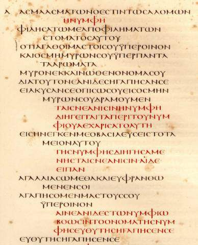

&nbsp;

Синайский кодекс

&nbsp;

Синайский (Sinaiticus) и Ватиканский (Vaticanus) кодексы, составленные
в&nbsp;IV&nbsp;веке, являются сводами книг Ветхого и Нового заветов. Синайский
кодекс, обозначающийся в науке буквой <b>&Agrave;</b>,
— это единственная известная нам унциальная рукопись, содержащая текст Нового
завета полностью (часть Ветхого завета утеряна). Данный кодекс долгое время
хранился в Ленинграде, но в&nbsp;1934&nbsp;году, в числе многих других
культурных ценностей, был продан советским правительством Великобритании и с
тех пор хранится в Британском музее (Лондон). Ватиканский кодекс,
обозначающийся в науке буквой <b>B</b>, хранится в библиотеке Ватикана, куда
попал не позднее XV&nbsp;века: первый раз кодекс упоминается в каталоге
1415&nbsp;года. По непонятным причинам руководство библиотеки
в&nbsp;XIX&nbsp;веке постоянно препятствовало исследователям в изучении
рукописи, и впервые она была опубликована лишь в&nbsp;1905&nbsp;году. Синайский
кодекс, кроме основных книг Нового завета, включает в себя сочинение Гермы
«Пастырь» и Послание Варнавы. В Ватиканском кодексе отсутствуют послания к
Тимофею, Титу и Филимону, а также Откровение Иоанна.

&nbsp;

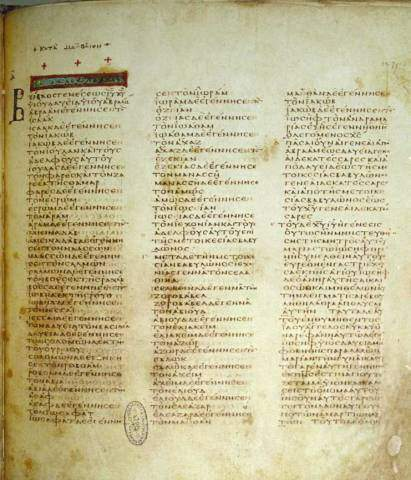

&nbsp;

Ватиканский кодекс

&nbsp;

В первой четверти IV&nbsp;века Церковь не признавала богодухновенности
большинства так называемых <i>соборных</i> посланий и Послания к евреям
(<i>Евсевий</i>. Церковная история.VI.13:6).

Согласно Лаодикейскому собору 363&nbsp;года, в состав Нового завета вошли
26&nbsp;книг (кроме Откровения Иоанна). После этого вопрос о новозаветном
каноне подвергался обсуждению еще на двух соборах — Гиппонском (393&nbsp;г.) и
Карфагенском (419&nbsp;г.), — пока, наконец, не был окончательно решен
в&nbsp;692&nbsp;году на Трулльском соборе.

&nbsp;

<h3>Внебиблейские источники</h3>

<h4>Талмуд</h4>

Талмуд (&#1514;&#1468;&#1463;&#1500;&#1456;&#1502;&#1493;&#1468;&#1491; [тальм&yacute;д] —
<i>учение</i>) является сводом иудаистского так называемого <i>устного
учения</i>, созданного во второй половине I&nbsp;тысячелетия до&nbsp;н.&nbsp;э.
и в первой половине I&nbsp;тысячелетия н.&nbsp;э. иудейскими законоучителями,
принадлежавшими к секте фарисеев, и их предшественниками, стремившимися
приспособить Тору к потребностям современной им эпохи. Наиболее ранней частью
Талмуда является <b><a href="http://barnascha.narod.ru/thalmud/_m/index"
target="_blank" title="Мишна">Мишн&aacute;</a></b> (&#1502;&#1460;&#1513;&#1473;&#1456;&#1504;&#1464;&#1492; — <i>изложение</i>, <i>изучение</i>), которую около
210&nbsp;года н.&nbsp;э. составил и отредактировал Й’hуд&aacute; hаннаши&#769; (&#1497;&#1456;&#1492;&#1493;&#1468;&#1491;&#1464;&#1492;&nbsp;&#1492;&#1463;&#1504;&#1468;&#1464;&#1513;&#1473;&#1460;&#1497;&#1488;) (135–219). Мишна состоит из шести
разделов, в которые включены 63&nbsp;трактата. Раздел Зераим (&#1494;&#1456;&#1512;&#1464;&#1506;&#1460;&#1497;&#1501;) включает в себя трактаты: Беракот (&#1489;&#1468;&#1456;&#1512;&#1464;&#1499;&#1493;&#1465;&#1514;), Пеа (&#1508;&#1468;&#1461;&#1497;&#1488;&#1464;&#1492;), Демай (&#1491;&#1468;&#1456;&#1502;&#1463;&#1488;&#1497;), Киль&aacute;йим (&#1499;&#1468;&#1460;&#1500;&#1456;&#1488;&#1463;&#1497;&#1460;&#1501;), Шебиит (&#1513;&#1473;&#1456;&#1489;&#1460;&#1497;&#1506;&#1460;&#1497;&#1514;), Терумот (&#1514;&#1468;&#1456;&#1512;&#1493;&#1468;&#1502;&#1493;&#1465;&#1514;), Маасрот (&#1502;&#1463;&#1506;&#1463;&#1513;&#1474;&#1456;&#1512;&#1493;&#1465;&#1514;), Маасэр Шени (&#1502;&#1463;&#1506;&#1458;&#1513;&#1474;&#1461;&#1512;&nbsp;&#1513;&#1473;&#1461;&#1504;&#1460;&#1497;), Халла (&#1495;&#1463;&#1500;&#1468;&#1464;&#1492;), Орла (&#1506;&#1464;&#1512;&#1456;&#1500;&#1464;&#1492;) и Биккурим (&#1489;&#1468;&#1460;&#1499;&#1468;&#1493;&#1468;&#1512;&#1460;&#1497;&#1501;). Раздел Моэд (&#1502;&#1493;&#1465;&#1506;&#1461;&#1491;) включает в себя трактаты: Шаббат (&#1513;&#1473;&#1463;&#1489;&#1468;&#1464;&#1514;), Эрубин (&#1506;&#1461;&#1497;&#1512;&#1493;&#1468;&#1489;&#1460;&#1497;&#1503;), Песахим (&#1508;&#1468;&#1456;&#1505;&#1464;&#1495;&#1460;&#1497;&#1501;), Шекалим (&#1513;&#1473;&#1456;&#1511;&#1464;&#1500;&#1460;&#1497;&#1501;), Йома (&#1497;&#1493;&#1465;&#1502;&#1464;&#1488;), Сукка (&#1505;&#1467;&#1499;&#1468;&#1464;&#1492;), Бейца (&#1489;&#1468;&#1461;&#1497;&#1510;&#1464;&#1492;), Рош hашшана (&#1512;&#1488;&#1513;&#1473;&nbsp;&#1492;&#1463;&#1513;&#1468;&#1473;&#1464;&#1504;&#1464;&#1492;), Таанит (&#1514;&#1468;&#1463;&#1506;&#1463;&#1504;&#1460;&#1497;&#1514;), Мегилла (&#1502;&#1456;&#1490;&#1460;&#1500;&#1468;&#1464;&#1492;), Моэд Катон (&#1502;&#1493;&#1465;&#1506;&#1461;&#1491;&nbsp;&#1511;&#1464;&#1496;&#1503;) и Хагига (&#1495;&#1458;&#1490;&#1460;&#1497;&#1490;&#1464;&#1492;). Раздел Нашим (&#1504;&#1464;&#1513;&#1460;&#1497;&#1501;) включает в себя трактаты: Йебамот (&#1497;&#1456;&#1489;&#1464;&#1502;&#1493;&#1465;&#1514;), Кетубот (&#1499;&#1468;&#1456;&#1514;&#1493;&#1468;&#1489;&#1493;&#1465;&#1514;), Недарим (&#1504;&#1456;&#1491;&#1464;&#1512;&#1460;&#1497;&#1501;), Назир (&#1504;&#1464;&#1494;&#1460;&#1497;&#1512;), Сота (&#1505;&#1493;&#1465;&#1496;&#1464;&#1492;), Гиттин (&#1490;&#1468;&#1460;&#1496;&#1468;&#1460;&#1497;&#1503;) и Киддушин (&#1511;&#1460;&#1491;&#1468;&#1493;&#1468;&#1513;&#1473;&#1460;&#1497;&#1503;). Раздел Незикин (&#1504;&#1456;&#1494;&#1460;&#1497;&#1511;&#1460;&#1497;&#1503;) включает в себя трактаты: Баба Камма (&#1489;&#1468;&#1464;&#1489;&#1464;&#1488;&nbsp;&#1511;&#1463;&#1502;&#1468;&#1464;&#1488;), Баба Мециа (&#1489;&#1468;&#1464;&#1489;&#1464;&#1488;&nbsp;&#1502;&#1456;&#1510;&#1460;&#1497;&#1506;&#1464;&#1488;), Баба Батра (&#1489;&#1468;&#1464;&#1489;&#1464;&#1488;&nbsp;&#1489;&#1468;&#1463;&#1514;&#1456;&#1512;&#1464;&#1488;), Санhедрин (&#1505;&#1463;&#1504;&#1456;&#1492;&#1462;&#1491;&#1456;&#1512;&#1460;&#1497;&#1503;), Маккот (&#1502;&#1463;&#1499;&#1468;&#1493;&#1465;&#1514;), Шебуот (&#1513;&#1473;&#1456;&#1489;&#1493;&#1468;&#1506;&#1493;&#1465;&#1514;), Эдуйот (&#1506;&#1461;&#1491;&#1493;&#1468;&#1497;&#1493;&#1465;&#1514;), Абода Зара (&#1506;&#1458;&#1489;&#1493;&#1465;&#1491;&#1464;&#1492;&nbsp;&#1494;&#1464;&#1512;&#1464;&#1492;), Абот (&#1488;&#1458;&#1489;&#1493;&#1465;&#1514;) и hораот (&#1492;&#1493;&#1465;&#1512;&#1464;&#1497;&#1493;&#1465;&#1514;). Раздел Кодашим (&#1511;&#1493;&#1465;&#1491;&#1464;&#1513;&#1473;&#1460;&#1497;&#1501;) включает в себя трактаты: Зебахим (&#1494;&#1456;&#1489;&#1464;&#1495;&#1460;&#1497;&#1501;), Менахот (&#1502;&#1456;&#1504;&#1464;&#1495;&#1493;&#1465;&#1514;), Хуллин (&#1495;&#1493;&#1468;&#1500;&#1468;&#1460;&#1497;&#1503;), Бекорот (&#1489;&#1468;&#1456;&#1499;&#1493;&#1465;&#1512;&#1493;&#1465;&#1514;), Аракин (&#1506;&#1458;&#1512;&#1464;&#1499;&#1460;&#1497;&#1503;), Темура (&#1514;&#1468;&#1456;&#1502;&#1493;&#1468;&#1512;&#1464;&#1492;), Керитот (&#1499;&#1468;&#1456;&#1512;&#1460;&#1497;&#1514;&#1493;&#1465;&#1514;), Меила (&#1502;&#1456;&#1506;&#1460;&#1497;&#1500;&#1464;&#1492;), Тамид (&#1514;&#1468;&#1464;&#1502;&#1460;&#1497;&#1491;), Миддот (&#1502;&#1460;&#1491;&#1468;&#1493;&#1465;&#1514;) и Кинним (&#1511;&#1460;&#1504;&#1468;&#1460;&#1497;&#1501;). И наконец, раздел Тоhорот (&#1496;&#1464;&#1492;&#1459;&#1512;&#1493;&#1465;&#1514;) включает в себя трактаты: Келим (&#1499;&#1468;&#1461;&#1500;&#1460;&#1497;&#1501;), Оhолот (&#1488;&#1493;&#1465;&#1492;&#1459;&#1500;&#1493;&#1465;&#1514;), Негаим (&#1504;&#1456;&#1490;&#1464;&#1506;&#1460;&#1497;&#1501;), Пара (&#1508;&#1468;&#1464;&#1512;&#1464;&#1492;), Тоhорот (&#1496;&#1464;&#1492;&#1459;&#1512;&#1493;&#1465;&#1514;), Микваот (&#1502;&#1460;&#1511;&#1456;&#1493;&#1464;&#1493;&#1465;&#1514;), Нидда (&#1504;&#1460;&#1491;&#1468;&#1464;&#1492;), Макширин (&#1502;&#1463;&#1499;&#1456;&#1513;&#1473;&#1460;&#1497;&#1512;&#1460;&#1497;&#1503;), Забим (&#1494;&#1464;&#1489;&#1460;&#1497;&#1501;), Тебуль Йом (&#1496;&#1461;&#1489;&#1493;&#1468;&#1500;&nbsp;&#1497;&#1493;&#1465;&#1501;), Йад&aacute;ййим (&#1497;&#1464;&#1491;&#1463;&#1497;&#1497;&#1460;&#1501;) и Укцим (&#1506;&#1493;&#1468;&#1511;&#1456;&#1510;&#1460;&#1497;&#1501;).

&nbsp;

<table width="100%" border=0 cellspacing=0 cellpadding=0>
<tr>
<td width="34%" valign=middle>

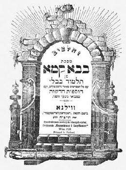

</td>
<td width="32%" valign=middle>

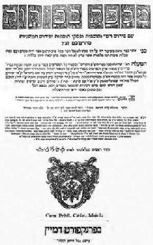

</td>
<td width="34%" valign=middle>

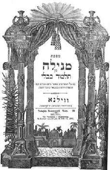

</td>
</tr>
<tr>
<td valign=middle>

&nbsp;

Вавилонский Талмуд,
 трактат Баба Камма.
 Франкфурт-на-Майне, 1702,
 печатник Иоанн Кельнер

</td>
<td valign=middle>

&nbsp;

Вавилонский Талмуд,
 трактат Бекорот.
 Франкфурт-на-Майне, 1702,
 печатник Иоанн Кельнер

</td>
<td valign=middle>

&nbsp;

Вавилонский Талмуд,
 трактат Мегилла.
 Типография
 «Розенкранц и Шрифтзецер»

</td>
</tr>
</table>

&nbsp;

С течением времени Танах и Мишна стали объектом дальнейшего комментирования
новыми поколениями законоучителей. Результатом этого комментирования стала
<b>Гемар&aacute;</b> (&#1490;&#1468;&#1456;&#1502;&#1464;&#1512;&#1464;&#1492;, &#1490;&#1468;&#1456;&#1502;&#1464;&#1512;&#1464;&#1488; [г’мар&aacute;] — <i>окончание</i>), которая была
присоединена к Мишне. Таким образом в&nbsp;V&nbsp;веке был составлен
<b><a href="http://barnascha.narod.ru/thalmud/_tj/index" target="_blank"
title="Иерусалимский Талмуд">Иерусалимский Талмуд</a></b> (Иер&nbsp;Талм), а
в&nbsp;VI&nbsp;веке — <b><a
href="http://barnascha.narod.ru/thalmud/_tb/index" target="_blank"
title="Вавилонский Талмуд">Вавилонский Талмуд</a></b> (Вав&nbsp;Талм). К этим
Талмудам непосредственно примыкает <b><a
href="http://barnascha.narod.ru/thalmud/_t/index" target="_blank"
title="Тосефта">Тосефта</a></b>, то есть <i>дополнение</i>. В Гемаре
встречаются ссылки на древние, не вошедшие в Мишну, законоположения —
&#1489;&#1468;&#1464;&#1512;&#1463;&#1497;&#1456;&#1514;&#1468;&#1464;&#1488; [барайт&aacute;].

Особую отрасль побиблейской литературы образуют <b><a
href="../books/jud/midrashi" target="_blank" title="Мидрашим">Мидрашим</a></b>
(&#1502;&#1460;&#1491;&#1456;&#1512;&#1464;&#1513;&#1473;&#1460;&#1497;&#1501; — <i>истолкования</i>) — комментарии к
отдельным книгам Танаха<a href="#_ftn61" name="_ftnref61">[61]</a>.

&nbsp;

<h4>Ветхозаветные апокрифы</h4>

<b><a href="../books/hanokh.zip" title="Книга Еноха">Книга Еноха</a></b>
(Liber Enoch) чрезвычайно многообразна по своему содержанию. Мы находим в ней и
развитую ангелологию, и попытку систематизировать календарно-астрономические
наблюдения, и изложение всей истории иудеев от сотворения Адама, и развернутое
учение о Мессии, и эсхатологию. Написана она во&nbsp;II&nbsp;веке
до&nbsp;н.&nbsp;э. В данной работе мы ссылаемся на Книгу Еноха (&nbsp;&nbsp;,&nbsp;&#1505;&#1462;&#1508;&#1462;&#1512;&nbsp;&#1495;&#1458;&#1504;&#1493;&#1465;&#59394; — <i>Сэ-пер Ханок</i>),
согласуясь с пометами Dillmann’а.

В сочинении <b><a href="../books/anal_mos" target="_blank"
title="Успение Моисея">Успение Моисея</a></b> (Assumptio Mosis)
ретроспективно пересматривается вся история иудеев до середины I&nbsp;века
н.&nbsp;э.

<b><a href="../books/test_12" target="_blank"
title="Завещание двенадцати патриархов">Завещание двенадцати патриархов</a></b>
(Testamenta xii patriarcharum) было создано в период между I&nbsp;веком
до&nbsp;н.&nbsp;э. и I&nbsp;веком н.&nbsp;э.

<b><a href="../books/ps_solom" target="_blank"
title="Псалмы Соломона">Псалмы Соломона</a></b> (Psalmi Salomonis) —
восемнадцать псалмов, написанных представителями фарисейской школы
в&nbsp;I&nbsp;веке до&nbsp;н.&nbsp;э., после взятия Иерусалима Помпеем.

<b>Сивиллины книги</b> (Oracula Sibyllina) являются сборником пророчеств,
приписываемых легендарным и отчасти реальным прорицательницам — Сивиллам. Всего
известно 14&nbsp;книг, которые появились в период между II&nbsp;веком
до&nbsp;н.&nbsp;э. и III&nbsp;веком н.&nbsp;э.

&nbsp;

<h4>Новозаветные апокрифы</h4>

<b><a href="../books/jud_ch_e" target="_blank"
title="Иудео-христианские евангелия">Евангелие Евреев</a></b> (Evangelium
secundum Hebraeos) — &#922;&#945;&#952;&#8125;
&#7961;&#946;&#961;&#945;&#943;&#959;&#965;&#962; — является
иудео-христианским произведением, созданным в конце I&nbsp;века. Об этом
Евангелии упоминает Евсевий (Церковная история.IV.22:8), в его времена оно
признавалось некоторыми христианами как имеющее апостольский авторитет
(<i>Евсевий</i>. Церковная история.III.25:5). Кроме того, на Евангелие Евреев
ссылались Ориген и Климент Александрийский. Другое иудео-христианское Евангелие
— <b><a href="../books/jud_ch_e" target="_blabk"
title="Иудео-христианские евангелия">Евангелие Эбионитов</a></b> (Evangelium
Ebionitum) — также создано в конце I&nbsp;века. Христианская община эбионитов —
одна из самых древних христианских экклесий. Само название этой общины ведет
свое начало от еврейского слова &#1488;&#1462;&#1489;&#1456;&#1497;&#1493;&#1465;&#1503; [эб-й&oacute;н] —
<i>нищий</i>. На Евангелие Эбионитов ссылались Ириней, Тертуллиан и Евсевий.
Возможно, одно из этих двух Евангелий (Евреев или Эбионитов) является тем
произведением, которое Папий<a href="#_ftn62" name="_ftnref62">[62]</a> называл
Евангелием от Матфея «на еврейском диалекте» (<i>Евсевий</i>. Церковная
история.III.39:16). По авторитету эти Евангелия мало уступают каноническим.

Рукописный фрагмент на пергаменте <b><a href="../books/kat_petr"
target="_blank" title="Евангелие от Петра">Евангелия от Петра</a></b>
(Evangelium Petri) — &#922;&#945;&#964;&#8048;
&#928;&#941;&#964;&#961;&#959;&#957;, — обнаруженный в Египте
в&nbsp;1886&nbsp;году в могиле средневекового монаха вместе с Апокалипсисом
Петра и Книгой Еноха, относится к VIII – IX&nbsp;вв., но текст был создан в
первой половине второго века; кроме того, автор этого произведения пользовался,
по всей вероятности, источниками, относящимися к первому веку. Евангелие от
Петра упоминают Ориген (Комментарии к Матфею.10:17) и Евсевий (Церковная
история.III.3:2; VI.12:2-6). По-видимому, это Евангелие знал и почитал Юстин
(ср.&nbsp;<i>Юстин</i>. Апология I.35 и Evangelium Petri.7).

Во второй половине второго века появились апокрифы, пытающиеся заполнить
пробелы в повествовании о жизни Иисуса и Его матери. К таким апокрифам
относятся <b><a href="../books/eyanpaid" target="_blank"
title="Евангелие Детства">Евангелие Детства</a></b> от Фомы (De pueritia Iesu
secundum Thomam) и <b><a href="../books/protoeya" target="_blank"
title="Протоевангелие Иакова">Протоевангелие Иакова</a></b> (Protevangelium
Jacobi). Эти Евангелия не имеют исторической ценности, так как представляют
собой не что иное, как сказочные рассказы. Протоевангелие Иакова — это
подробное повествование о детстве и замужестве Марии. Оно также иногда
называется <i>Историей Иакова о рождении Марии</i> и <i>Книгой Иакова</i>, как
назвал это сочинение Ориген (Комментарии к Матфею.10:17). Протоевангелие Иакова
было создано во второй половине – конце второго века, вероятно, в Египте<a
href="#_ftn63" name="_ftnref63">[63]</a>.

«<a href="../books/pastor.pdf" target="_blank"
title="'Пастырь' Гермы"><b>Пастырь» Гермы</a></b> написан в жанре апокалипсиса.
Герма (Hermas) жил в период правления Антониев, а не в первом веке, как
полагали некоторые толкователи, отождествляя Герму, автора «Пастыря» (&#928;&#959;&#953;&#956;&#942;&#957;), с Гермой, упомянутым
апостолом Павлом: &#7936;&#963;&#960;&#940;&#963;&#945;&#963;&#952;&#949;
[...] &#7961;&#961;&#956;&#8118;&#957; &#954;&#945;&#8054;
&#964;&#959;&#8058;&#962; &#963;&#8058;&#957;
&#945;&#8016;&#964;&#959;&#8150;&#962;
&#7936;&#948;&#949;&#955;&#966;&#959;&#973;&#962; (Рим.16:14). При
определении даты написания «Пастыря» следует обратиться к Канону Муратори, в
котором говорится: «Pastorem vero nuperrime temporibus nostris in urbe Roma
Hermas conscripsit sedente in cathedra urbis Romae ecclesiae Pio episcopo
fratre eius, et ideo legi eum quidem oportet, sed publicare vero in ecclesia
populo neque inter prophetas completo numero neque inter apostolos in finem
temporum potest<a href="#_ftn64" name="_ftnref64">[64]</a>». Таким образом,
следует предположить, что «Пастырь» был написан Гермой в 40-х&nbsp;гг.
II&nbsp;века. Это произведение состоит из трех частей: Visiones<a
href="#_ftn65" name="_ftnref65">[65]</a> (Видения), Mandata<a href="#_ftn66"
name="_ftnref66">[66]</a> (Заповеди) и Similitudines<a href="#_ftn67"
name="_ftnref67">[67]</a> (Притчи). Церковные деятели конца II – начала
III&nbsp;веков отзываются о «Пастыре» с большим почтением. Ириней цитирует его
как &#947;&#961;&#945;&#966;&#942; (писание). Климент
Александрийский называет его богодухновенным: &#952;&#949;&#943;&#969;&#962; &#7969;
&#948;&#973;&#957;&#945;&#956;&#953;&#962; &#7969; &#964;&#8183;
&#7961;&#961;&#956;&#8119; &#954;&#945;&#964;&#8048;
&#7936;&#960;&#959;&#954;&#940;&#955;&#965;&#968;&#953;&#957;
&#955;&#945;&#955;&#959;&#8166;&#963;&#945;<a href="#_ftn68"
name="_ftnref68">[68]</a>. «Пастырь» дошел до нас в двух латинских и одной
эфиопской переводах; греческий оригинал дошел в разных версиях не целиком. В
Мичиганском папирусе III&nbsp;века, содержащем около четверти греческого текста
«Пастыря», началом всего произведения было <i>пятое видение</i>, называемое в
наших изданиях в соответствии с латинским переводом Mandata. Поэтому есть
основания сомневаться в единстве этого произведения; возможно, Visiones.1-4
составляли самостоятельное произведение.

Анонимное произведение <b><a href="../books/didache" target="_blank"
title="Дидахе">Дидахэ</a></b> (<i>Учение</i>) иногда именуется <i>Учением
двенадцати апостолов</i> (&#916;&#953;&#948;&#945;&#967;&#8052;
&#964;&#8182;&#957; &#948;&#974;&#948;&#949;&#954;&#945;
&#7936;&#960;&#959;&#963;&#964;&#972;&#955;&#969;&#957;). Этот первый
свод христианского учения создавался постепенно, на протяжении I&nbsp;века, и к
концу его был завершен. Автор Дидахэ пользовался древними, не дошедшими до нас,
записями речений (logia) на темы морали и религии, но, вероятно, совершенно не
был знаком с посланиями Павла. В 20-х годах II&nbsp;века Дидахэ было дополнено
фрагментами, почерпнутыми из Послания Варнавы. Дидахэ подразделяется
на&nbsp;16&nbsp;глав<a href="#_ftn69" name="_ftnref69">[69]</a>.

Так называемое <b><a href="../books/barnabba" target="_blank"
title="Послание Варнавы">Послание Варнавы</a></b> (Варн) на самом деле не
принадлежит Варнаве — сподвижнику апостола Павла. Неизвестный автор, который ни
разу себя не называет, написал в начале правления Адриана не послание, а
богословский трактат. По всей вероятности, Послание Варнавы возникло в
Александрии<a href="#_ftn70" name="_ftnref70">[70]</a>.

В 1945 году в Наг-Хаммади (Египет) была обнаружена так называемая <a
href="../books/nhc" target="_blank">гностическая библиотека</a>. Найденная
в ней литература (рукописи из Хенобоскиона) написана на коптском языке. Но это
не оригиналы, а переводы более ранних греческих текстов. Оригиналы <b><a
href="../books/kat_phil" target="_blank"
title="Евангелие от Филиппа">Евангелия от Филиппа</a></b>, Nag Hammadi Codex
II,&nbsp;p.&nbsp;51-86 (ЕФ) —  — и <b><a href="../books/kat_thom" target="_blank"
title="Евангелие от Фомы">Евангелия от Фомы</a></b>, Nag Hammadi Codex
II,&nbsp;p.&nbsp;32-51 (Фом) —  — были созданы во втором веке. В данной работе мы ссылаемся на
Евангелие от Фомы, согласуясь с пометами Ж.&nbsp;Доресса, который
в 1959 году первым предложил деление памятника
на 118 изречений<a href="#_ftn71" name="_ftnref71">[71]</a>.

&nbsp;

<h4>Аграфа</h4>

Речения, отсутствующие в каноническом тексте четырех Евангелий, источники
которых установить не удалось, и речения, сохранившиеся в рукописных вариантов
новозаветных Евангелий, но не вошедшие в признанный Церковью текст, принято
называть словом <i>аграфа</i> (от греческого слова &#7936;&#947;&#961;&#8118;&#966;&#959;&#962; — <i>неписаный</i>,
<i>не записанный</i>). <a href="../books/agrapha" target="_blank"
title="Аграфа и фрагменты неизвестных евангелий">Аграфа</a> также встречается в
посланиях Павла, в сочинениях Юстина, Оригена, Тертуллиана и Климента
Александрийского<a href="#_ftn72" name="_ftnref72">[72]</a>.

Вероятно, многие древние кодексы, подобно Синайскому, хранились в
монастырских книгохранилищах до конца IV&nbsp;века, но затем были уничтожены,
так как вместе с канонизацией списка Нового завета появился страх незаписанного
в Евангелиях.

&nbsp;

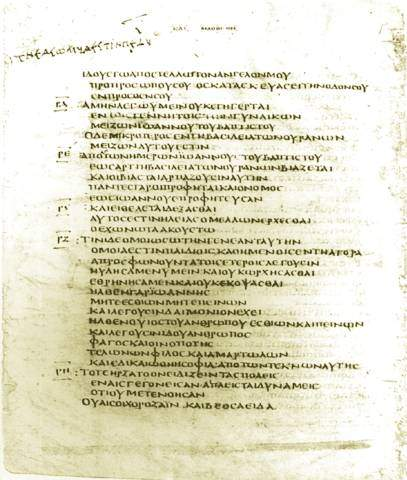

&nbsp;

Кодекс Безы

&nbsp;

Примечателен в этом плане <i>Кембриджский</i> кодекс
(Cantabrigiensis&nbsp;<b style='mso-bidi-font-weight:normal'>D</b>), или
кодекс <i>Безы</i> (Bezae). Эта рукопись — билингва: на левой странице —
греческий текст, на правой — латинский. Кодекс датируется V&nbsp;веком и
содержит лишь часть Нового завета. Этот кодекс содержит некоторые разночтения,
не встречающиеся ни в какой другой древней рукописи. Теодор Беза, преемник
Кальвина на посту Женевской Церкви, обнаружив в Лионском монастыре
св.&nbsp;Иринея эту рукопись со многими аграфонами, так напугался, что
в&nbsp;1581&nbsp;году отослал ее в Кембриджский университет с надписью: «Лучше
скрыть, чем обнародовать». Там этот кодекс и скрывался от людских глаз почти
два столетия.

&nbsp;

<h4>Еврейские и светские источники</h4>

<i>Филон Александрийский</i> (Philo Alexandrinus, ок.&nbsp;25&nbsp;г.
до&nbsp;н.&nbsp;э. – ок.&nbsp;50&nbsp;г. н.&nbsp;э.) — еврейский теолог и
философ, живший в Александрии; пытался соединить иудейский монотеизм с
греческой философией. Филон был одним из умнейших представителей еврейского
народа своего времени. Он отлично знал греческий язык<a href="#_ftn73"
name="_ftnref73">[73]</a>, тогда как произведения Иосифа Флавия редактировали
его грекоязычные товарищи. Филон (&#934;&#953;&#955;&#969;&#957;) оказал огромное влияние на
раннехристианскую патристику. Его основные <a
href="../books/philo.zip" title="The Works of Philo">работы</a>: <b>De
cherubim</b> (<i>Рhilo</i>.De chtrub) — О херувимах; <b>Quod deus sit
immutabilis</b> (<i>Philo</i>.Quod deus imm) — О том, что Бог является
неизменным; <b>De migratione Abrahami</b> (<i>Philo</i>.De migr. Abr) — О
странствованиях Авраама; <b>Quis rerum divinarum heres sit</b>
(<i>Philo</i>.Quis rer. div. her) — О том, кто будет участником в божественных
делах; <b>De fuga et inventione</b> (<i>Philo</i>.De fuga et inv) — О бегстве и
нахождении; <b>De mutatione nominum</b> (<i>Philo</i>.De mut. nom) — Об
изменении имен; <b>De somniis</b> (<i>Philo</i>.De somn) — О сновидениях; <b>De
vita Mosis</b> — О жизни Моисея;<b> Quod omnis probus liber sit</b>
(<i>Philo</i>.Quod prob. liber); <b>De vita contemplativa</b> (<i>Philo</i>.De
vita cont) — О созерцательной жизни<a href="#_ftn74" name="_ftnref74">[74]</a>;
<b>In Flaccum</b> (<i>Philo</i>.In Flacc) — Против Флакка; <b>De legatione ad
Gaium</b> (<i>Philo</i>.Leg. ad Gaium) — О посольстве к Гаю<a href="#_ftn75"
name="_ftnref75">[75]</a>.

&nbsp;

<table width="100%" border=0 cellspacing=0 cellpadding=0>
<tr>
<td width="50%" valign=middle>

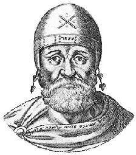

</td>
<td width="50%" valign=middle>

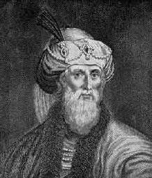

</td>
</tr>
<tr>
<td valign=middle>

&nbsp;

Филон Александрийский

</td>
<td valign=middle>

&nbsp;

Иосиф Флавий

</td>
</tr>
</table>

&nbsp;

<i>Иосиф Флавий</i> (Josephus Flavius, 37 – после&nbsp;100) — еврейский
историк. Он происходил из священнического рода. Участвовал в антиримском
восстании в Иудее и сдался римлянам в плен. Отпущенный на свободу императором
Титом, Иосиф (&#1497;&#1493;&#1465;&#1505;&#1461;&#1507;&nbsp;&#1489;&#1468;&#1463;&#1512;&#1470;&#1502;&#1463;&#1514;&#1468;&#1460;&#1514;&#1456;&#1497;&#1464;&#1492;&#1493;&#1468; — Йосэ&#769;п бар-Маттитй&aacute;hу) принял его родовое имя — Флавий.
Получив римское гражданство и переехав в столицу Империи, он написал ряд
исторических произведений: около&nbsp;78&nbsp;года — <b><a
href="../books/flavius/bj/index.html" target="_blank"
title="Иосиф Флавий. Иудейская война">Bellum Judaeorum</a></b> (<i>Jos</i>.BJ) —
Иудейская война; около&nbsp;93&nbsp;года — <b><a
href="../books/flavius/aj/index.html" target="_blank"
title="Иосиф Флавий. Иудейские древности">Antiquitas Judaeorum</a></b>, или
<b>Аntiquitates Judaicae</b> (<i>Jos</i>.AJ), — Иудейские древности;
около&nbsp;95&nbsp;года — <b><a href="../books/flavius/index.html"
target="_blank" title="Иосиф Флавий. Против Апиона">Сontra Apionem</a></b>
(<i>Jos</i>.CA) — Против Апиона; в период между 95&nbsp;и&nbsp;101&nbsp;гг. —
<b><a href="../books/flavius/vita_gr" target="_blank"
title="Josephus Flavius. Vita - Greek">Vita</a></b> — Жизнь<a href="#_ftn76"
name="_ftnref76">[76]</a>.

<i>Страбон</i> (Strabo, 64&nbsp;или&nbsp;63&nbsp;г. до&nbsp;н.&nbsp;э. –
23&nbsp;или&nbsp;24&nbsp;г. н.&nbsp;э.) — греческий географ и историк, автор
<i>Географии</i> (<i>Geographicorum</i>) в 17-ти книгах и не дошедших до нас
<i>Исторических записок</i>. <b>Geographicorum</b> (<i>Strab</i>. ...) — это
итог географических знаний античности.

<i>Пл&uacute;ний Старший</i> (Plinius,
23 или 24 – 79) — римский писатель, ученый, политический деятель. Его главное
сочинение: <b>Naturalis historia</b> (<i>Plin</i>.NH) — Естественная
история — в 37-ми книгах.

<i>Т&aacute;цит</i> (Tacitus) Корнелий
(ок.&nbsp;58 – ок.&nbsp;117) — римский историк. Один из его главных трудов —
<b><a href="../books/tac_ann.zip" title="Tacitus. Annales">Annales</a></b>
(<i>Tac</i>.Ann) — Анналы. Он посвящен истории Рима и Римской империи
14–68&nbsp;годов. Другой труд Тацита — <b><a
href="../books/tac_hisl" target="_blank"
title="Tacitus. Historia">Historia</a></b> (<i>Tac</i>.H) — История.

<i>Свет&oacute;ний</i> (Suetonius) Гай
Транквилл (ок.&nbsp;70 – ок.&nbsp;140) — римский историк и писатель. Его
основное сочинение: <b><a href="../books/vita_12r.zip"
title="Светоний. Жизнь двенадцати цезарей">Vitae XII Caesarum</a></b>
(<i>Suet.&nbsp;...</i>) — Жизнь двенадцати цезарей — в восьми книгах.

<i>Дион Кассий</i> (Dio Cassius, 155/164 – 229/235) — греческий историк,
римский политичесчкий деятель, автор сочинения <b>Historia Romana</b>
(<i>Dio&nbsp;Cass.&nbsp;...</i>) — Римская история — в&nbsp;80-ти книгах.

&nbsp;

<h4>Произведения раннехристианских писателей</h4>

<i>Климент Римский</i> (&#922;&#955;&#942;&#956;&#951;&#962;, Clemens Romanus, ? – 101) —
так называемый <i>Муж Апостольский</i> (Patres Apostolici)<a href="#_ftn77"
name="_ftnref77">[77]</a>, епископ Рима (92–101) (<i>Евсевий</i>. Церковная
история.III.15:24)<a href="#_ftn78" name="_ftnref78">[78]</a>. Ему принадлежит
написанное в период с&nbsp;92&nbsp;по&nbsp;96&nbsp;гг. <b><a
href="../books/clem_rom/clem_r_1" target="_blank"
title="Первое послание Климента Римского к коринфянам">Первое послание Климента
Римского к коринфянам</a></b> (<i>Clem</i>.Ad Corinthios&nbsp;I), которое имело
огромный авторитет<a href="#_ftn79" name="_ftnref79">[79]</a>. Христианским
кругам было известно и так называемое <b><a
href="../books/clem_rom/clem_r_2" target="_blank"
title="Второе послание Климента Римского к коринфянам">Второе послание Климента
Римского к коринфянам</a></b> (<i>Ps.-Clem</i>.Ad Corinthios&nbsp;II), которое
Клименту не принадлежит<a href="#_ftn80" name="_ftnref80">[80]</a>. Это —
составленная в 50-х – 70-х гг. II&nbsp;века первая известная нам проповедь,
произнесенная за богослужением и направленная против гностиков. Кроме того, в
конце второго века были созданы <a href="../books/clem_rom/homil/gr/index"
target="_blank"><b>Псевдоклементийские Гомилии</b></a>
(<i>Ps.-Clem</i>.Homil) — произведение, авторство которого христиане
приписывали Клименту Римскому. Псевдоклементийские Гомилии дошли до нас в
редакции IV&nbsp;века<a href="#_ftn81" name="_ftnref81">[81]</a>.
(PG&nbsp;Migne, 1–2&nbsp;vols.)

<i>Поликарп</i> (&#928;&#959;&#955;&#973;&#954;&#945;&#961;&#960;&#959;&#962;,
Polycarpus) — ученик апостола Иоанна, епископ Смирны<a href="#_ftn82"
name="_ftnref82">[82]</a>. Евсевий называет Поликарпа «собеседником апостолов»
(Церковная история.III.36:1). Согласно сочинению <i><a
href="../books/martyr" target="_blank"
title="Мученичество смирнского епископа Поликарпа">Мученичество смирнского
епископа Поликарпа</a></i>&nbsp;(9:3), он в возрасте восьмидесяти шести лет
умер мученической смертью в Риме. По мнению современных исследователей,
Поликарп пострадал 23&nbsp;февраля 155 или 22&nbsp;февраля 156&nbsp;года.
Однако эти даты не согласуются с указанием Евсевия (Церковная история.IV.15),
датирующего мученичество Поликарпа седьмым годом правления Марка Аврелия
(161–180), что послужило основанием для других исследователей датировать смерть
Поликарпа 23&nbsp;февраля 167&nbsp;года. Некоторые исследователи переносят эту
дату на 26&nbsp;марта 166&nbsp;года. Сохранилось <b><a
href="../books/polykarp" target="_blank"
title="Послание Поликарпа к филиппийцам">Послание Поликарпа к
филиппийцам</a></b> (<i>Polyc.</i>Ad&nbsp;Philippenses) (<i>Евсевий</i>.
Церковная история.IV.14:8-9). В современной науке утвердилось мнение, что
рукописная традиция слила воедино два послания Поликарпа к филиппийцам: I-е
написано около 110&nbsp;года, II-е — двумя десятилетиями позже. (PG&nbsp;Migne,
5&nbsp;vol.)

<i>Юст&uacute;н</i> (&#7992;&#959;&#965;&#963;&#964;&#8150;&#957;&#959;&#962;,
Justinus, нач.&nbsp;II&nbsp;века – 166&nbsp;г.) — раннехристианский апологет и
писатель, странствующий проповедник. Родился в Сихеме, древнем городе Самарии,
который после восстановления его императором Флавием Веспасианом (69–79) стал
называться «новым городом Флавиевым» — Флавия Неаполь (Flavia Neapolis). Юстин
по происхождению был греком и получил полное по тогдашнему времени образование.
Переходя от одной философской системы к другой, Юстин наконец обратился в
христианство. Его крещение относится или к&nbsp;133, или к&nbsp;137&nbsp;году,
хотя некоторые исследователи датируют это событие 40-ми годами II&nbsp;века. В
период гонений на христиан Юстин был обезглавлен в Риме<a href="#_ftn83"
name="_ftnref83">[83]</a>. Некоторые сочинения Юстина до нас не дошли —
например, <i>О&nbsp;душе</i> и <i>Певец</i>. Другие ложно ему приписываются,
как-то: <i>Письмо к Зене и Серену</i>, <i>Вопросы с ответами эллинам</i>,
<i>Ответы православным</i>, <i>Опровержение Аристотелевых мнений</i> и
<i>Изложение веры</i> (все они были созданы не ранее IV&nbsp;века). Другие
произведения, восходя ко времени Юстина или еще древнее, по своему слогу,
содержанию или другим признакам представляют основания сомневаться в их
происхождении от Юстина; к ним относятся: <i><a
href="../books/justinus/diognet" target="_blank"
title="Послание к Диогнету">Послание к Диогнету</a></i>, <i>Речь к эллинам</i>
(&#923;&#972;&#947;&#959;&#962; &#960;&#961;&#8056;&#962;
&#7961;&#955;&#955;&#8134;&#957;&#945;&#962;), <i>Увещание</i> (&#923;&#972;&#947;&#959;&#962;
&#960;&#945;&#961;&#945;&#953;&#957;&#941;&#964;&#953;&#954;&#959;&#962;)
<i>к эллинам</i>, <i>О&nbsp;единовластительстве</i> (&#928;&#949;&#961;&#8054;
&#956;&#959;&#957;&#945;&#961;&#967;&#943;&#945;&#962;) и отрывок
<i>О&nbsp;воскресении</i> (&#928;&#949;&#961;&#8054;
&#7936;&#957;&#945;&#963;&#964;&#940;&#963;&#949;&#969;&#962;)
(ср.&nbsp;<i>Евсевий</i>. Церковная история.IV.18:1-7). Не подлежит сомнению
аутентичность трех сочинений Юстина: <b><a
href="../books/justinus/apolog_1" target="_blank"
title="Юстин. Первая Апология">Apologia&nbsp;I</a></b> (Первая Апология),
<b><a href="../books/justinus/apolog_2" target="_blank"
title="Юстин. Вторая Апология">Apologia&nbsp;II</a></b> (Вторая Апология) и
<b><a href="../books/justinus/tryphon" target="_blank"
title="Юстин. Разговор с Трифоном-иудеем">Dialogus cum Tryphono Judaeo</a></b>
(Разговор с Трифоном-иудеем). Первая Апология (<i>Just</i>.Apol.I)<a
href="#_ftn84" name="_ftnref84">[84]</a> была написана при императоре Антонине
Пии (138–161) — вероятно, в&nbsp;139&nbsp;или&nbsp;150&nbsp;году. Вторая
Апология (<i>Just.</i>Apol.II) была написана вскоре после Первой<a
href="#_ftn85" name="_ftnref85">[85]</a>. Разговор с Трифоном иудеем
(<i>Just.</i>Dial) был написан уже после Апологий и посвящен некоему Марку
Помпею. (PG&nbsp;Migne, 6&nbsp;vol.)

<i>Ириней</i> (&#917;&#7984;&#961;&#951;&#957;&#945;&#8150;&#959;&#962;,
Irenaeus, ок.&nbsp;140 – 202) — раннехристианский писатель и апологет, по
происхождению грек, родом из Малой Азии. Около&nbsp;160&nbsp;года был послан
своим учителем Поликарпом Смирнским в Галлию для проповеди христианства. Ириней
был пресвитером в Лугудуне (совр.&nbsp;Лион), а с&nbsp;178&nbsp;года, после
казни епископа Фотина римлянами, принял кафедру (<i>Евсевий</i>. Церковная
история.V.5:8). Вероятно, погиб во время массовых гонений на христиан при
императоре Септилии Севере (193–211). Главное сочинение Иринея — <i>Обличение и
опровержение лжеименного знания, или Пять книг против ересей</i> (это сочинение
было впервые издано Эразмом Роттердамским в&nbsp;1526&nbsp;году) — посвящено
полемике с гностиками и монтанистами. В науке это произведение носит более
краткое название: <b><a href="../books/irenaeus/ah/index.html" target="_blank"
title="Ириней. Против ересей">Adversum haereses</a></b> (<i>Iren.</i>Haer) —
Против ересей<a href="#_ftn86" name="_ftnref86">[86]</a>. (PG&nbsp;Migne,
7&nbsp;vol.)

<i>Климент Александрийский</i> (&#922;&#955;&#942;&#956;&#951;&#962;
&#7944;&#955;&#949;&#958;&#945;&#957;&#948;&#961;&#949;&#943;&#945;&#962;,
Clemens Alexandrinus, ок.&nbsp;150 – ок.&nbsp;217) — христианский писатель и
апологет. Язычник по воспитанию, он после долгих странствований по Империи и
общения с различными учителями философии, обратившись в христианство,
около&nbsp;175&nbsp;года обосновался в Александрии. Около&nbsp;190&nbsp;года он
был избран главой Александрийского Огласительного собрания. Во время гонений
при императоре Септимии Севере, начавшихся в&nbsp;201&nbsp;году, переселился в
Каппадокию. Климент Александрийский, которого Иероним назвал omnium
eruditissimus, в числе других произведений написал сочинение <b><a
href="../books/clem_al/stromata/index" target="_blank"
title="Климент Александрийский. Строматы">Stromata</a></b> (<i>Сlem.</i>Strom) —
Строматы (<i>Евсевий</i>. Церковная история.V.11:1-2; VI.13:1-3).
(PG&nbsp;Migne, 8–9&nbsp;vols.)

<i>Тертуллиан</i> (Tertullianus) Квинт Септилий Флоренс (ок.&nbsp;160 –
после&nbsp;220) — сын римского кентуриона, пресвитер в Карфагене, крупнейший
христианский апологет. Его фанатизм ярко выразился в провозглашенном им
лозунге: credo quia absurdum (верю, потому что нелепо). Вот как это положение
сформулировано Тертуллианом: «Распят Сын Божий — не стыдно, ибо это постыдно. И
умер Сын Божий — это вполне достоверно, ибо нелепо. А погребенный, Он воскрес —
это верно, ибо невозможно<a href="#_ftn87" name="_ftnref87">[87]</a>»
(De&nbsp;carne Christi (О&nbsp;теле Христовом).5). В&nbsp;207&nbsp;году
Тертуллиан порвал отношения с главной Церковью, обвиняя ее в отступничестве, и
примкнул к монтанистам. Он развивал учение «нового пророчества» монтанистской
ереси в ряде своих произведений, особенно в сочинениях: <b><a
href="../books/tertull/de_corol" target="_blank"
title="Tertullian. De corona">De&nbsp;corona</a></b> (О&nbsp;венце), <b><a
href="../books/tertull/praxean" target="_blank"
title="Тертуллиан. Против Праксея">Adversus Praxean</a></b> (Против Праксея),
<b><a href="../books/tertull/pudicitl" target="_blank"
title="Tertullian. De pudicitia">De&nbsp;pudicitia</a></b>
(О&nbsp;стыдливости), <b><a href="../books/tertull/de_ieiul"
target="_blank" title="Tertullian. De ieiunio adversus psychicos">De&nbsp;ieiunio
adversus psychicos</a></b> (О&nbsp;воздержании против душевных), <b><a
href="../books/tertull/castitat" target="_blank"
title="Тертуллиан. О поощрении целомудрия">De&nbsp;exhortatione
castitatis</a></b> (О&nbsp;поощрении целомудрии), <b><a
href="../books/tertull/res_carn" target="_blank"
title="Тертуллиан. О воскресении плоти">De&nbsp;resurectione carnis</a></b>
(О&nbsp;воскресении плоти), <b><a href="../books/tertull/de_fugal"
target="_blank" title="Tertullian. De fuga in persecutione">De&nbsp;fuga
in persecutione</a></b> (О&nbsp;бегстве во время гонений), <b><a
href="../books/tertull/monogaml" target="_blank"
title="Tertullian. De monogamia">De&nbsp;monogamia</a></b>
(О&nbsp;единобрачии), <b><a href="../books/tertull/virginil"
target="_blank" title="Tertullian. De virginibus velandis">De&nbsp;virginibus
velandis</a></b> (Об&nbsp;укрывании дев), <b><a
href="../books/tertull/marcionl" target="_blank"
title="Tertullian. Adversus Marcionem">Adversus Marcionem</a></b> (Против
Маркиона). К апологическим сочинениям Тертуллиана относятся:
1)&nbsp;<b><a href="../books/tertull/apologet" target="_blank"
title="Тертуллиан. Апологетик">Apologeticus</a></b> (<i>Tert.</i>Apol) —
Апологетик (197&nbsp;г.); 2)&nbsp;<b><a
href="../books/tertull/ad_natio" target="_blank"
title="Тертулиан. К язычникам">Ad nationes</a></b> — К&nbsp;язычникам
(197&nbsp;г.); 3)&nbsp;<b><a href="../books/tertull/scapula"
target="_blank" title="Тертуллиан. К Скапуле">Ad&nbsp;Scapulam</a></b> —
К&nbsp;Ск&aacute;пуле (212&nbsp;г.). Другая
группа — против еретиков: 1)&nbsp;<b><a href="../books/tertull/hermogen"
target="_blank" title="Тертуллиан. Против Гермогена">Adversus
Hermogenem</a></b> — Против Гермогена (200–206&nbsp;гг.);
2)&nbsp;<b><a href="../books/tertull/iudaeosl" target="_blank"
title="Tertullian. Adversus Iudaeos">Adversus Iudaeos</a></b> — Против иудеев
(200–206&nbsp;гг.); 3)&nbsp;<b><a href="../books/tertull/de_praes"
target="_blank" title="Тертуллиан. О предписании еретикам">De&nbsp;praescriptione
haereticorum</a></b> (<i>Tert.</i>Praescr. haer) — О&nbsp;предписании еретикам
(200&nbsp;г.); 4)&nbsp;<b><a href="../books/tertull/marcionl"
target="_blank" title="Tertullian. Adversus Marcionem">Adversus
Marcionem</a></b> в пяти книгах (207–208&nbsp;гг.); 5)&nbsp;<b><a
href="../books/tertull/valentil" target="_blank"
title="Tertullian. Adversus Valentinianos">Adversus Valentinianos</a></b> —
Против валентиан (208–211&nbsp;гг.); 6)&nbsp;<b><a
href="../books/tertull/praxeanl" target="_blank"
title="Tertullianus. Adversus Praxean">Adversus Praxean</a></b> (213&nbsp;г.);
7)&nbsp;<b><a href="../books/tertull/scorpial" target="_blank"
title="Tertullian. Scorpiace">Scorpiace</a></b> (220&nbsp;г.). Отметим также
следующие работы Тертуллиана: <b><a href="../books/tertull/poeniten"
target="_blank" title="Тертуллиан. О покаянии">De&nbsp;poenitentia</a></b> —
О&nbsp;покаянии; <b><a href="../books/tertull/martyres" target="_blank"
title="Тертуллиан. К мученикам">Ad&nbsp;martyres</a></b> — К&nbsp;мученикам;
<b><a href="../books/tertull/de_orati" target="_blank"
title="Тертуллиан. О молитве">De&nbsp;oratione</a></b> — О&nbsp;молитве; <b><a
href="../books/tertull/animal" target="_blank"
title="Tertullian. De anima">De&nbsp;anima</a></b> — О&nbsp;душе; <b><a
href="../books/tertull/de_bapt" target="_blank"
title="Тертуллиан. О крещении">De&nbsp;baptismo</a></b> (<i>Tert.</i>Bapt) —
О&nbsp;крещении. (PL&nbsp;Migne, 1–2&nbsp;vols.)

<i>Ориген</i> (&#8040;&#961;&#953;&#947;&#941;&#957;&#951;&#962;, Origenes,
ок.&nbsp;185 – 253&nbsp;или&nbsp;254) — христианский апологет и писатель. Сын
александрийского христианина Леонида (<i>Евсевий</i>. Церковная история.VI.1;
ср. там же, VI.19:7), он с детских лет изучал Писание и греческие науки и к
семнадцати годам — когда отец претерпел мученичество (гонения при Септимии
Севере, 202&nbsp;г.), а семья, лишившись имущества, осталась без средств к
существованию — настолько преуспел в этом, что сам мог преподавать
(там&nbsp;же, VI.2:15–3:3). В это же время Ориген по просьбе язычников,
желавших обратиться в христианство, стал главой Огласительного собрания, ибо
«угроза гонения разогнала всех [христиан из Александрии]» (там&nbsp;же,
VI.3:1). Ориген соблюдал строгий пост, мало спал и, наконец, чтобы избежать
брака, оскопил себя (там&nbsp;же, VI.8:1-2)<a href="#_ftn88"
name="_ftnref88">[88]</a>. В&nbsp;231&nbsp;году из-за критики со стороны
александрийской и других экклесий Ориген переселился в Кесарию Палестинскую,
где провел последние годы жизни, основал там школу по типу александрийской и,
вероятно, только там, то есть уже на склоне лет, был удостоен священнического
сана (ср.&nbsp;там&nbsp;же, VI.8:4; 23:4; 26:1). Во время гонений на христиан
Ориген был заключен в тюрьму в городе Тире и подвергся пыткам (там&nbsp;же,
VI.39:5), от которых впоследствии умер. Соединяя платонизм с христианством, он
отклонялся от ортодоксального учения Церкви, которой и был осужден как еретик
на&nbsp;V&nbsp;(553&nbsp;г.), а потом и на&nbsp;VI&nbsp;(680&nbsp;г.)
Вселенских соборах. Письменное наследие Оригена, дошедшее, правда, далеко не
полностью, до сих пор вызывает изумление как по объему<a href="#_ftn89"
name="_ftnref89">[89]</a>, так и по широте поставленных им вопросов<a
href="#_ftn90" name="_ftnref90">[90]</a>. Он изучал еврейский язык, чтобы
заняться критическим изданием Писания (<i>Евсевий</i>. Церковная
история.VI.16:1), и в результате была составлена Гексапла в 50-ти томах. Даже
по словам своих противников, Ориген прекрасно знал греческую философию и
«постоянно обращался к Платону», к сочинениям Нумения, Крония, многих
знаменитых пифагорейцев и стоиков (там&nbsp;же, VI.19:8). Одна из значительных
работ Оригена: <b><a href="../books/origenus/cc/gr/index" target="_blank"
title="Origenes. Contra Celsum - Greek">Contra Celsum</a></b>
(<i>Orig</i>.CC) — Против Цельса — апологический труд в восьми книгах,
написанный в годы правления императора Филиппа Араба (там&nbsp;же, VI.36:2),
по-видимому, в&nbsp;248&nbsp;году. В данном произведении Ориген перефразирует и
цитирует почти всю книгу <i>Цельса</i> <b><a href="../books/celsus"
target="_blank" title="Цельс. Правдивое слово">Аlethes logos</a></b> (Правдивое
слово), направленную против христиан и написанную неким философом по имени
Цельс (Celsus) в&nbsp;177–178&nbsp;гг. Кроме того, руке Оригена принадлежат
следующие произведения: <b>Commentarii in Mattheum</b> (<i>Orig.</i>Matth) —
Комментарии к Матфею; <b>Adversum haereses</b> (<i>Orig</i>.Haer) — Против
ересей. (PG&nbsp;Migne, 11–17&nbsp;vols.)

<b>Philosophoumena Origenis</b> (Философские вопросы Оригена) —
безосновательно приписывавшаяся некоторыми исследователями Оригену работа
неизвестного компилятора, обнаруженная в середине XIX&nbsp;века и
опубликованная в&nbsp;1851&nbsp;году. Она включает в себя сочинение
христианского писателя конца II – первой половины III&nbsp;веков Ипполита
(&#7993;&#960;&#960;&#972;&#955;&#965;&#964;&#959;&#962;,
Hippolytus), — по-видимому, ученика Иринея, — <i>Опровержение всех ересей</i>
(Refutatio omnium haeresium), содержащее важную информацию о гностиках, и в
современной литературе обычно фигурирует под названием <b>Philosophoumena
Hippolytis</b> (<i>Hippol.</i>Philosoph)<a href="#_ftn91"
name="_ftnref91">[91]</a>.

<i>Евсевий</i> (&#917;&#8016;&#963;&#8051;&#946;&#953;&#959;&#962;, Eusebius)
Кесарийский (Евсевий Памфил) (260/265 – 338 или 339) — римский церковный
писатель, епископ Кесарии с&nbsp;311&nbsp;года. Одна из его работ:
<b>In&nbsp;Mattheum</b> (<i>Eus</i>.Matth) — К&nbsp;Матфею. Основным сочинением
Евсевия является произведение <b><a href="../books/eusebius/he/index.html"
target="_blank" title="Евсевий Кесарийский. Церковная история">Нistoria
ecclesiastica</a></b> (<i>Eus</i>.HE) — Церковная история (&#7952;&#954;&#954;&#955;&#951;&#963;&#953;&#945;&#963;&#964;&#953;&#954;&#8052;
&#7985;&#963;&#964;&#959;&#961;&#943;&#945;), — в котором отражена
история христианства до&nbsp;324&nbsp;года. В данном труде Евсевий опирался на
такие авторитеты, как Поликарп, Папий, Гегезипп<a href="#_ftn92"
name="_ftnref92">[92]</a>, Юлий Африканский<a href="#_ftn93"
name="_ftnref93">[93]</a> и&nbsp;др.<a href="#_ftn94"
name="_ftnref94">[94]</a> (PG&nbsp;Migne, 19–24&nbsp;vols.)

<i>Епифаний</i> (&#7960;&#960;&#953;&#966;&#940;&#957;&#953;&#959;&#962;,
Epiphanius) Кипрский (307–403) — епископ Саламинский. Его основное сочинение:
<b><a href="../books/panariog" target="_blank"
title="Epiphanius. Panarion - Greek">Epiphanii librorum adversus haereses
proemium</a></b> (<i>Epiph.</i>Haer) — Панарион, или Против ересей<a
href="#_ftn95" name="_ftnref95">[95]</a>. (PG&nbsp;Migne, 41–43&nbsp;vols.)

<i>Иероним</i> (&#7993;&#949;&#961;&#8061;&#957;&#965;&#956;&#959;&#962;,
Hieronymus) Евсевий Софроний, прозванный Блаженным (347 – 419), — отец Церкви,
переводчик Библии на латинский язык (Vulgata). Он родился в Далмации, изучал в
Риме риторику и философию. Около&nbsp;374&nbsp;года отправился на Восток, где в
Сирии и Палестине изучал богословие и еврейский язык. В&nbsp;382 –
385&nbsp;годах Иероним пребывал в Риме, где по поручению Дамаса начал
исправление имеющихся тогда латинских переводов новозаветных произведений.
В&nbsp;385&nbsp;году Иероним возвратился в Палестину и в&nbsp;389&nbsp;году
основал монастырь в Вифлееме. К&nbsp;XIII&nbsp;веку сложилась легенда, согласно
которой Дамас сделал Иеронима кардиналом. Среди работ Иеронима отметим
следующие: <b><a href="../books/hieronym/"
title="Иероним. Комментарии к Матфею">Commentarii in Mattheum</a></b>
(<i>Hier.</i>Matth), <b>Adversus Pelagium</b> (<i>Hier.</i>Pel) и <b><a
href="../books/hieronym/" target="_blank"
title="Иероним. О знаменитых мужах">De&nbsp;viris illustribus</a></b>
(<i>Hier</i>.De&nbsp;vir.&nbsp;ill) — О знаменитых мужах. (PL&nbsp;Migne,
22–30&nbsp;vols.)

&nbsp;

<a href="#_ftnref1" name="_ftn1">[1]</a> &#1513;&#1497;&#1512; &#1492;&#1513;&#1497;&#1512;&#1497;&#1501;
&#1493;&#1511;&#1493;&#1492;&#1500;&#1514;
&#1502;&#1496;&#1502;&#1488;&#1497;&#1503; &#1488;&#1514;
&#1492;&#1497;&#1491;&#1497;&#1497;&#1501; — «Шир hашширим и Коhэлет оскверняют руки» (Мишна.
Йадаййим.3:5).

<a href="#_ftnref2" name="_ftn2">[2]</a> См.:
<i>Шифман&nbsp;И.&nbsp;Ш. </i>Ветхий завет и его мир. — M.: Политиздат, 1987,
стр.&nbsp;16, 17, 223, 224.

<a href="#_ftnref3" name="_ftn3">[3]</a> По утверждению Епифания,
Аквила сделал свой перевод с особой ненавистью к христианам; Иероним, напротив,
считал, что «Аквила не в духе прения, как думают некоторые, а тщательно
переводит из слова в слово».

<a href="#_ftnref4" name="_ftn4">[4]</a>
<i>Iren.</i>Haer.III.23:1[21:1]; <i>Eus.</i>HE.III.8; <i>Epiphanius.</i>De
Mensuris.14:17.

<a href="#_ftnref5" name="_ftn5">[5]</a> Однако в шестом столбце в
Малых пророках приводится перевод из неясного источника, а в некоторых частях
книг Царств он содержит текст, практически совпадающий с Лукиановской
рецензией&nbsp;().

<a href="#_ftnref6" name="_ftn6">[6]</a> Некоторые исследователи
отождествляют Онкелоса (&#1488;&#1493;&#1504;&#1511;&#1500;&#1493;&#1505;) с Аквилой (&#1506;&#1511;&#1497;&#1500;&#1505;), переводчиком Танаха на греческий язык. См., напр.:
Silverstone&nbsp;A.&nbsp;E. <i>Aquila and Onkelos</i>.
Manchester,&nbsp;1931.

<a href="#_ftnref7" name="_ftn7">[7]</a> Ср. также Вавилонский
Талмуд. Баба Батра.14<i>б</i>-15<i>а</i> и <i>Иосиф Флавий</i>. Против
Апиона.I.8. Подробнее см.: H&ouml;lscher&nbsp;G. <i>Kanonisch und Apokcryph.
Ein Kapitel aus der Geschichte des alttestamentlichen Kanons</i>. Leipz., 1905,
s.&nbsp;2–6, 36–38.

<a href="#_ftnref8" name="_ftn8">[8]</a> Подробнее см. у И.&nbsp;С.
Свенцицкой: <i>Апокрифы</i> древних христиан. — M.: Мысль, 1989,
стр.&nbsp;6–32.

<a href="#_ftnref9" name="_ftn9">[9]</a> В Септуагинте:
&#915;&#949;&#957;&#949;&#963;&#953;&#962;,
&#917;&#958;&#959;&#948;&#959;&#962;,
&#923;&#949;&#965;&#953;&#964;&#953;&#954;&#959;&#957;,
&#913;&#961;&#953;&#952;&#956;&#959;&#953;,
&#916;&#949;&#965;&#964;&#949;&#961;&#959;&#957;&#959;&#956;&#953;&#959;&#957;.

<a href="#_ftnref10" name="_ftn10">[10]</a> <i>Спиноза Б.</i>
Богословско-политический трактат. — М., 1935; <i>Kрывелев&nbsp;И.&nbsp;А.</i>
Библия: историко-критический анализ. — М.: Политиздат, 1982, стр.&nbsp;19 –
34.

<a href="#_ftnref11" name="_ftn11">[11]</a> Здесь и далее датировка
библейских книг весьма условна, ибо весьма условен так называемый Urtext
(см.&nbsp;выше).

<a href="#_ftnref12" name="_ftn12">[12]</a> В русскоязычной традиции
обычно практикуется ударение на предпоследнем слоге — <i>Кабб&aacute;ла</i>.

<a href="#_ftnref13" name="_ftn13">[13]</a> <i>Лайтман&nbsp;М.</i>
Каббала. Тайное еврейское учение: Часть&nbsp;1–3. — Новосибирск,&nbsp;1993.

<a href="#_ftnref14" name="_ftn14">[14]</a> «<i>Раби
Шимон</i>». Фрагменты из трактата «<i>Зогар</i>»: Пер. с арамейск.
М.&nbsp;А.&nbsp;Кравцова. — M.: Гнозис,&nbsp;1994.

<a href="#_ftnref15" name="_ftn15">[15]</a> В Септуагинте:
&#921;&#951;&#963;&#959;&#965;&#962; &#925;&#945;&#965;&#951;.

<a href="#_ftnref16" name="_ftn16">[16]</a> В Септуагинте:
&#922;&#961;&#953;&#964;&#945;&#953;.

<a href="#_ftnref17" name="_ftn17">[17]</a> В Септуагинте:
&#929;&#959;&#965;&#952;.

<a href="#_ftnref18" name="_ftn18">[18]</a> В Септуагинте книги
Царств именуются следующим образом:
&#914;&#945;&#963;&#953;&#955;&#949;&#953;&#969;&#957;&nbsp;&#945;&acute;,
&#914;&#945;&#963;&#953;&#955;&#949;&#953;&#969;&#957;&nbsp;&#946;&acute;,
&#914;&#945;&#963;&#953;&#955;&#949;&#953;&#969;&#957;&nbsp;&#947;&acute;,
&#914;&#945;&#963;&#953;&#955;&#949;&#953;&#969;&#957;&nbsp;&#948;&acute;.

<a href="#_ftnref19" name="_ftn19">[19]</a> В Септуагинте:
&#928;&#945;&#961;&#945;&#955;&#949;&#953;&#960;&#959;&#956;&#949;&#957;&#969;&#957;&nbsp;&#945;&acute;,
&#928;&#945;&#961;&#945;&#955;&#949;&#953;&#960;&#959;&#956;&#949;&#957;&#969;&#957;&nbsp;&#946;&acute;.

<a href="#_ftnref20" name="_ftn20">[20]</a> В Септуагинте:
&#925;&#949;&#949;&#956;&#953;&#945;&#962;.

<a href="#_ftnref21" name="_ftn21">[21]</a> В Септуагинте:
&#917;&#963;&#948;&#961;&#945;&#962;.

<a href="#_ftnref22" name="_ftn22">[22]</a> В Септуагинте:
&#932;&#969;&#946;&#953;&#964;.

<a href="#_ftnref23" name="_ftn23">[23]</a> В Септуагинте:
&#921;&#959;&#965;&#948;&#953;&#952;.

<a href="#_ftnref24" name="_ftn24">[24]</a> В Септуагинте:
&#917;&#963;&#952;&#951;&#961;.

<a href="#_ftnref25" name="_ftn25">[25]</a> Ориген полагал, что
книги Маккавейские входили в иудаистский канон под именем
&#963;&#945;&#961;&#946;&#951;&#952;
&#963;&#945;&#946;&#945;&#957;&#945;&#953;&#949;&#955; (<i>Eus.</i>HE.VI.25:2).
В Септуагинте эти книги именуются следующим образом:
&#924;&#945;&#954;&#954;&#945;&#946;&#945;&#953;&#969;&#957;&nbsp;&#945;&acute;,
&#924;&#945;&#954;&#954;&#945;&#946;&#945;&#953;&#969;&#957;&nbsp;&#946;&acute;,
&#924;&#945;&#954;&#954;&#945;&#946;&#945;&#953;&#969;&#957;&nbsp;&#947;&acute;,
&#924;&#945;&#954;&#954;&#945;&#946;&#945;&#953;&#969;&#957;&nbsp;&#948;&acute;.

<a href="#_ftnref26" name="_ftn26">[26]</a> В Септуагинте:
&#921;&#969;&#946;.

<a href="#_ftnref27" name="_ftn27">[27]</a> В Септуагинте:
&#936;&#945;&#955;&#956;&#959;&#953;.

<a href="#_ftnref28" name="_ftn28">[28]</a> В Септуагинте:
&#928;&#945;&#961;&#959;&#953;&#956;&#953;&#945;&#953;.

<a href="#_ftnref29" name="_ftn29">[29]</a> В Септуагинте:
&#917;&#954;&#954;&#955;&#951;&#963;&#953;&#945;&#963;&#964;&#951;&#962;.

<a href="#_ftnref30" name="_ftn30">[30]</a> В Септуагинте:
&#913;&#963;&#956;&#945;.

<a href="#_ftnref31" name="_ftn31">[31]</a> В Септуагинте:
&#931;&#959;&#966;&#953;&#945; &#931;&#945;&#955;&#969;&#956;&#969;&#957;.

<a href="#_ftnref32" name="_ftn32">[32]</a> В Септуагинте:
&#931;&#959;&#966;&#953;&#945; &#931;&#949;&#953;&#961;&#945;&#967;.

<a href="#_ftnref33" name="_ftn33">[33]</a> В Септуагинте:
&#919;&#963;&#945;&#953;&#945;&#962;.

<a href="#_ftnref34" name="_ftn34">[34]</a> В Септуагинте:
&#921;&#949;&#961;&#949;&#956;&#953;&#945;&#962;.

<a href="#_ftnref35" name="_ftn35">[35]</a> В Септуагинте:
&#920;&#961;&#951;&#957;&#959;&#953;.

<a href="#_ftnref36" name="_ftn36">[36]</a> В Септуагинте:
&#917;&#960;&#953;&#963;&#964;&#959;&#955;&#951;
&#921;&#949;&#961;&#949;&#956;&#953;&#959;&#965;.

<a href="#_ftnref37" name="_ftn37">[37]</a> В Септуагинте:
&#914;&#945;&#961;&#959;&#965;&#967;.

<a href="#_ftnref38" name="_ftn38">[38]</a> В Септуагинте:
&#921;&#949;&#963;&#949;&#954;&#953;&#951;&#955;.

<a href="#_ftnref39" name="_ftn39">[39]</a> В Септуагинте:
&#916;&#945;&#957;&#953;&#951;&#955;.

<a href="#_ftnref40" name="_ftn40">[40]</a> В Септуагинте:
&#937;&#963;&#951;&#949;.

<a href="#_ftnref41" name="_ftn41">[41]</a> В Септуагинте:
&#921;&#969;&#951;&#955;.

<a href="#_ftnref42" name="_ftn42">[42]</a> В Септуагинте:
&#913;&#956;&#969;&#962;.

<a href="#_ftnref43" name="_ftn43">[43]</a> В Септуагинте:
&#927;&#946;&#948;&#953;&#959;&#965;.

<a href="#_ftnref44" name="_ftn44">[44]</a> В Септуагинте:
&#921;&#969;&#957;&#945;&#962;.

<a href="#_ftnref45" name="_ftn45">[45]</a> В Септуагинте:
&#924;&#953;&#967;&#945;&#953;&#945;&#962;.

<a href="#_ftnref46" name="_ftn46">[46]</a> В Септуагинте:
&#925;&#945;&#959;&#965;&#956;.

<a href="#_ftnref47" name="_ftn47">[47]</a> В Септуагинте:
&#913;&#956;&#946;&#945;&#954;&#959;&#965;&#956;.

<a href="#_ftnref48" name="_ftn48">[48]</a> В Септуагинте:
&#931;&#959;&#966;&#959;&#957;&#953;&#945;&#962;.

<a href="#_ftnref49" name="_ftn49">[49]</a> В Септуагинте:
&#913;&#947;&#947;&#945;&#953;&#959;&#962;.

<a href="#_ftnref50" name="_ftn50">[50]</a> В Септуагинте:
&#918;&#945;&#967;&#945;&#961;&#953;&#945;&#962;.

<a href="#_ftnref51" name="_ftn51">[51]</a> В Септуагинте:
&#924;&#945;&#955;&#945;&#967;&#953;&#945;&#962;.

<a href="#_ftnref52" name="_ftn52">[52]</a> См. §§ <a
href="02">2–5</a>.

<a href="#_ftnref53" name="_ftn53">[53]</a> «Так называемое Второе
[послание Петра] не числится, как мы слышали, среди книг Нового завета, но
многие считают его полезным и прилежно читают вместе с другими писаниями»
(<i>Eus.</i>HE.III.3:1).

<a href="#_ftnref54" name="_ftn54">[54]</a> О проблемах датировки
<i>соборных</i> посланий см.: Vielhauer&nbsp;Ph. <i>Geschichte der
urchristlichen Literatur</i>. B.&#150;N.-Y.: W. de Gruyter, 1975,
pp.&nbsp;460–484, 567–598.

<a href="#_ftnref55" name="_ftn55">[55]</a> Renan&nbsp;E.
<i>Histoire des Origines du Christianisme</i>. Livre troisi&egrave;me: <i>Saint
Paul</i>. Paris: Michel L&eacute;vy fr&egrave;res, 1869. P.&nbsp;LX–LXI.

<a href="#_ftnref56" name="_ftn56">[56]</a> Vielhauer Ph.
<i>Geschichte der urchristlichen Literatur</i>. B.&#150;N.-Y.: W. de Gruyter,
1975, pp.&nbsp;250–251.

<a href="#_ftnref57" name="_ftn57">[57]</a> Simon&nbsp;M. <i>Les
sectes juives au temps de J&eacute;sus</i>.
P.: Presses Universitaires de France, 1960, p.&nbsp;123.

<a href="#_ftnref58" name="_ftn58">[58]</a> <i>Маркс&nbsp;К.</i>,
<i>Энгельс&nbsp;Ф.</i> Соч.: T.&nbsp;22, стр.&nbsp;465–492.

<a href="#_ftnref59" name="_ftn59">[59]</a> См.<a
href="05">§ 5</a>.

<a href="#_ftnref60" name="_ftn60">[60]</a> Впрочем, общепринятая
точка зрения, что утерянный греческий оригинал латинского перевода Канона
Муратори возник в Риме около 200 года, оспаривалась Альбертом Сандбергом в
пользу более позднего его происхождения (IV&nbsp;в.) и другой родины
(Восток); см.:&nbsp;Sundberg A.&nbsp;C.,&nbsp;Jr. <i>Canon Muratori:
a Fourth Century List</i>. // Harvard Theological Review, vol.&nbsp;66.1, 1973.
P.&nbsp;1–41. Однако это радикальное мнение было блестяще отвергнуто
Эвереттом Фергюсоном; см.:&nbsp;Ferguson&nbsp;E. <i>Canon Muratori:
Date and Provenance</i>. // Studia Patristica, vol.&nbsp;17.2, 1982.
P.&nbsp;677–683. Таким образом, Canon Muratori следует датировать концом второго века.

<a href="#_ftnref61" name="_ftn61">[61]</a>
<i>Шифман&nbsp;И.&nbsp;Ш.</i> Ветхий завет и его мир. — М.: Политиздат, 1987,
стр.&nbsp;220–222; <i>Беленький&nbsp;М.</i> Что такое Талмуд. —
М.,&nbsp;1970; <i>Рав Адин Штейнзальц</i>. Введение в Талмуд. Ред. и пер. Зеева
Мешкова. &#151; Jerusalem: Israel Institute for Talmudic Publications &#150;
Москва: Институт изучения иудаизма в России, 1993.

<a href="#_ftnref62" name="_ftn62">[62]</a> Папий (? – ок.&nbsp;165)
— христианский писатель, епископ Гиераполя во Фригии.

<a href="#_ftnref63" name="_ftn63">[63]</a> <i>Апокрифы</i> древних
христиан. — M.: Мысль, 1989, стр.&nbsp;50–129.

<a href="#_ftnref64" name="_ftn64">[64]</a> «Пастыря» совсем
недавно, уже в наши времена, написал Герма в городе Риме, когда кафедрой
римской экклесии заведовал его брат епископ Пий; поэтому читать его можно, но
нельзя оглашать его в экклесии народу ни среди полного списка пророков, ни
среди апостолов до конца времен&nbsp;(<i>лат.</i>).

<a href="#_ftnref65" name="_ftn65">[65]</a> В данной работе
обозначается: <i>Herm.</i>Vis.

<a href="#_ftnref66" name="_ftn66">[66]</a> В данной работе
обозначается: <i>Herm</i>.Mand.

<a href="#_ftnref67" name="_ftn67">[67]</a> В данной работе
обозначается: <i>Herm</i>.Sim.

<a href="#_ftnref68" name="_ftn68">[68]</a> Божественная сила
говорила Герме по откровению&nbsp;(<i>греч.</i>).

<a href="#_ftnref69" name="_ftn69">[69]</a> Большинство новозаветных
апокрифов называет Евсевий (Церковная история.III.25:4-7).

<a href="#_ftnref70" name="_ftn70">[70]</a> См.:
Barnard&nbsp;L.&nbsp;W. <i>The Date of the Epistle of Barnabas — a Document
of Early Egyptian Christianity</i>.&nbsp;//&nbsp;<i>The Journal of Egyptian
Archaeology</i>, vol.&nbsp;44, 1958, pp.&nbsp;101–107; однако ср.:
Vielhauer&nbsp;Ph. <i>Geschichte der urchristlichen Literatur</i>.
B.&#150;N.-Y.: W. de Gruyter, 1975, pp.&nbsp;610–612.

<a href="#_ftnref71" name="_ftn71">[71]</a> Doresse&nbsp;J.
<i>L’Evangile selon Thomas ou les paroles secr&eacute;ues de Jesus</i>.
Paris,&nbsp;1959.

<a href="#_ftnref72" name="_ftn72">[72]</a> См.:
<i>Лопухин&nbsp;А.&nbsp;П.</i> Незаписанные в Евангелии изречения Христа
Спасителя и новооткрытые изречения Его &#923;&#972;&#947;&#953;&#945;
&#7992;&#951;&#963;&#959;&#8166; — СПб.,&nbsp;1898;
<i>Пивоваров&nbsp;Б.</i> Аграфы. — Журнал Московской патриархии, 1974,
№&nbsp;8.

<a href="#_ftnref73" name="_ftn73">[73]</a> Филон называет греческий
язык «нашим» (<i>Philo</i>. De confusione linguarum.129).

<a href="#_ftnref74" name="_ftn74">[74]</a> См.: <i>Филон
Иудеянин.</i> О жизни созерцательной.&nbsp;//&nbsp;<i>Смирнов&nbsp;Н.&nbsp;П.</i>
Терапевты и сочинение Филона «О&nbsp;жизни созерцательной». —
Киев,&nbsp;1909; <i>Филон Александрийский</i>. О жизни
созерцательной.&nbsp;//&nbsp;<i>Амусин&nbsp;И.&nbsp;Д.</i> Тексты Кумрана. &#151;
М.: Наука, 1971, стр.&nbsp;376&#150;391.

<a href="#_ftnref75" name="_ftn75">[75]</a> О Филоне и его
произведениях см.: <i>Евсевий</i>. Церковная история.II.18:1-8.

<a href="#_ftnref76" name="_ftn76">[76]</a> Подробнее см.:
<i>Рабжак&nbsp;Т.</i> Иосиф Флавий. Историк и общество. — Москва –
Иерусалим,&nbsp;1993.

<a href="#_ftnref77" name="_ftn77">[77]</a> К Мужам Апостольским (то
есть ученикам апостолов) традиционно причисляют автора Дидахэ, Климента
Римского, Игнатия, Поликарпа, автора Послания Варнавы и Герму; современная
патрология включает в число Мужей Апостольских также Папия Гиерапольского.

<a href="#_ftnref78" name="_ftn78">[78]</a> Ориген (Comment. in
Loah. tom.IX) и Евсевий (<i>Eus.</i>HE.III.4:9) признают Климента сотрудником
апостола Павла. Ириней говорит о Клименте, что он видел «блаженных апостолов»
(то есть Петра и Павла) и общался с ними (<i>Iren.</i>Haer.III.3).
Псевдоклементийские Гомилии (Беседы) представляют Климента непосредственным
преемником апостола Петра. Другой раннехристианский писатель
(<i>Tert</i>.Praescr. haer.32) указывает на Климента как на епископа,
поставленного Петром: «Clementem a Petro ordinatum». По свидетельству Иеронима
(<i>Hier.</i>De viris ill.15), многие из латинян почитали Климента вторым
епископом Рима после Петра. По словам Августина, Клименту предшествовал епископ
Лин, а Ириней (<i>Iren</i>.Haer.III.3:2[3:3]), согласно с которым говорят
Евсевий и Иероним (<i>Hier.</i>De viris ill.15; впрочем, в других своих
произведениях Иероним называет Климента преемником Петра; см.: Adv.
Jovinian.I:7; Comm. in Is.), свидетельствует, что после Лина был еще епископ
Анаклет, или Клет. По всей вероятности, прав Ириней, а вслед за ним — и
Евсевий, опиравшийся на Гегезиппа: Климент не был непосредственным преемником
Петра, то есть за Петром следовали епископы Лин, Анаклет (Клет), и лишь потом
кафедру принял Климент.

<a href="#_ftnref79" name="_ftn79">[79]</a> Климент Александрийский,
называя Климента Римского <i>апостолом</i> (<i>Сlem</i>.Strom.IV.17), приводит
из его Первого послания к коринфянам отрывки из 18-ти глав. Ориген также
неоднократно упоминает о Клименте Римском и его послании. Евсевий, называя
послание «большим и удивительным», свидетельствует, что оно было общепризнанным
творением Климента (<i>Eus.</i>HE.III.16; см.&nbsp;также:
<i>Eus.</i>HE.IV.23:11). Епифаний Кипрский (Саламинский) различает подлинное и
«во святых экклесиях читаемое послание Климента» от неподлинных, выдававшихся
под его именем «путешествий» Петра (<i>Epiph</i>.Haer.XXX.15). Наконец, Иероним
говорит о Клименте, что он от лица римской экклесии написал к экклесии
коринфской весьма полезное послание (<i>Hier.</i>De viris ill.15)».

<a href="#_ftnref80" name="_ftn80">[80]</a> В Александрийском
кодексе наряду с Первым посланием Климента Римского к коринфянам сохранился
отрывок и так называемого Второго послания Климента Римского к коринфянам.
Заглавие его утратилось в самом послании, но сохранилось в оглавлении, стоящем
в начале всей означенной рукописи: «[...]&#917;&#925;&#932;&#927;&#931;
&#917;[...]&#923;&#919;&nbsp;&#914;», что означает: «&#922;&#955;&#942;&#956;&#949;&#957;&#964;&#959;&#962;
&#7952;&#960;&#953;&#963;&#964;&#959;&#955;&#8052;&nbsp;&#946;&#8189;».
Евсевий, у которого первого встречается свидетельство о Втором послании
Климента Римского к коринфянам, говорит о нем в следующих нерешительных
выражениях: «Необходимо знать, что и другое послание приписывается Клименту, но
мы верно знаем, что оно не так известно, как первое, ибо и в древности его не
знали» (<i>Eus</i>.HE.III.38:4). Иероним (<i>Hier.</i>De viris ill.15) говорит,
что известно под именем Климента и Второе послание, но отвергается древними:
«a veteribus reprobatur».

<a href="#_ftnref81" name="_ftn81">[81]</a> Так называемые
<a href="../books/clem_rom/pseudocg" target="_blank"><i>Клементины</i></a>
приводятся по изданию: <i>Patrologiae cursus completus. Series graeca</i>,
ed. J.-P.Migne, vol.&nbsp;1. Paris, 1857, pp.&nbsp;1157–1474.

<a href="#_ftnref82" name="_ftn82">[82]</a> Согласно древней
традиции (<i>Tert.</i>Praescr. haer.32), Иоанн Зеведеев сам поставил Поликарпа
епископом смирнской экклесии. Иероним (<i>Hier.</i>De viris ill.17)
подтверждает: «Polycarpus, Johannis discipulus et aq eo Smyrnae episcopus,
ordinatus».

<a href="#_ftnref83" name="_ftn83">[83]</a> То, что Юстин
засвидетельствовал свою веру мученической смертью, удостоверяют показания
раннехристианских писателей и само имя Мученика, данное ему христианской
древностью (<i>Eus.</i>HE.IV.16; <i>Epiph.</i>Haer.XLVI.1;
<i>Hier.</i>De viris ill.9). Тертуллиан (Adversus Valentinianos.5) прямо
называет Юстина «философом и мучеником».

<a href="#_ftnref84" name="_ftn84">[84]</a> Евсевий называет
пространную Апологию <i>второй</i>, а из краткой Апологии приводит слова как из
<i>первой</i> (<i>Eus.</i>HE.IV.8-17).

<a href="#_ftnref85" name="_ftn85">[85]</a> Впрочем, Евсевий относит
время ее написания к&nbsp;161&nbsp;году (<i>Eus</i>.HE.IV.16,18).

<a href="#_ftnref86" name="_ftn86">[86]</a> Об Иринее как противнике
ересей см.: <i>Иванцов-Платонов&nbsp;А.&nbsp;М.</i> Ереси трех первых веков
христианства. — М.,&nbsp;1885.

<a href="#_ftnref87" name="_ftn87">[87]</a> «[...] Et mortuus est
dei filius; prorsus credibile est, quia ineptum est. Et sepultus resurrexit;
certum est, quia impossibile est».

<a href="#_ftnref88" name="_ftn88">[88]</a> Впоследствии Ориген
возражал тем, кто буквально толковал текст Писания, подвигший его в свое время
на оскопление (<i>Orig.</i>Matth.15:3).

<a href="#_ftnref89" name="_ftn89">[89]</a> Епифаний
допускает, что Ориген был автором шести тысяч (!&nbsp;и&nbsp;?) книг
(<i>Epiph.</i>Haer.LXIV.63).

<a href="#_ftnref90" name="_ftn90">[90]</a> См.: <i>Patrologiae
cursus completus. Series graeca</i>, ed. J.-P. Migne. Paris, 1857 – 1866,
vol.&nbsp;XI – XVII.

<a href="#_ftnref91" name="_ftn91">[91]</a> См.: <i>Patrologiae
cursus completus. Series graeca</i>, ed. J.-P. Migne. Paris, 1857–1866,
vol.&nbsp;XVI.

<a href="#_ftnref92" name="_ftn92">[92]</a> Гегезипп (II&nbsp;в.) —
христианский историк из евреев, автор <i>Дневника</i>.

<a href="#_ftnref93" name="_ftn93">[93]</a> Юлий Африканский (? –
237) — христианский историк, в своей работе <i>Хронология</i> отразил историю
христианства от <i>сотворения Адама</i>
до&nbsp;221&nbsp;года&nbsp;н.&nbsp;э.

<a href="#_ftnref94" name="_ftn94">[94]</a> О жизни Евсевия и его
трудах см. подробнее: <i>Лебедев&nbsp;А.&nbsp;П.</i> Церковная историография в
главных ее представителях с&nbsp;IV&nbsp;в. до&nbsp;XX: Изд.&nbsp;2-е. — СПб.,
1903, стр.&nbsp;11–110.

<a href="#_ftnref95" name="_ftn95">[95]</a> См.: <i>Творения Святаго
Епифания Кипрскаго</i>. В&nbsp;6&nbsp;т.&nbsp;//&nbsp;<i>Творения святых
отцев</i>, в русском переводе, издаваемые при Московской Духовной Академии.
Тт.&nbsp;42, 44, 46, 48, 50, 52. &#151; М.: Готье / Лавров / Волчанинов,
1863&#150;1884.

<a href="index">Оглавление</a> <a href="76">Далее</a>

