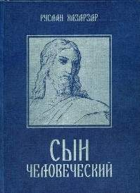

 

**Автор:** Руслан Хазарзар

**Издательство:** ПринТерра-Дизайн

**Год издания:** 2004

**ISBN:** 5-98424-005-X

**Категория:** научное издание

**Тип переплета:** твердый № 7

**Количество страниц:** 528 + 32 (иллюстр.)

**Бумага:** офсетная + мелованная (иллюстр.)

**Объем (печ. л.):** 33,0 + 2,0 (иллюстр.)

**Вес:** 700 _г_

**Формат:** 60x84 1/16

**Условия покупки: предоплата почтовым переводом — **500** руб./книга.**

**Несколько причин купить книгу Руслана Хазарзара «Сын Человеческий»**.

Вряд ли вы найдете в русскоязычной литературе подобное историческое исследование, посвященное жизнеописанию Основателя христианства. Возможно, вскоре, после тяжелого наследия псевдонаучного атеизма советского периода, появятся (впрочем, уже появляются) серьезные труды по данной теме, но, учитывая брезгливость издательств и типографий к греческим и еврейским шрифтам, вам еще долго придется ждать. А потому вы, как и прежде, будете читать поверхностные рассказы о жизни Иисуса, авторы которых не сочтут нужным не только проверить данные древних памятников, но даже поставить точную ссылку на источник. И вы, как и прежде, будете читать популярные или откровенно скандальные своими фантастическими предположениями книжонки, оставаясь, по сути, в полном неведении насчет подлинной жизни Основателя христианства. Имея в своей библиотеке либо откровенно идеологизированные труды советских атеистов (в которых Иисус – не более чем миф, в которых нет более или менее приемлемого хронологического построения, в которых умалчивается о последних археологических находках и обо всем, что не согласуется с мифичностью Иисуса), либо откровенно церковно-назидательные и всего лишь пересказы Евангелий, не имеющие отношения к исторической науке, вы так и не сможете насытить свой ум серьезными знаниями по данной теме.

Однако, купив книгу Руслана Хазарзара «Сын Человеческий», вы имеете возможность исправить положение. Только в этой книге чуть ли не каждое утверждение подкреплено ссылкой на древний источник. При этом автор счел необходимым исследовать древние документы не в переводах, а на языках оригинала, отстаивая право уточнять изложение оригинальными чтениями.

Учитывая вышесказанное, не будем забывать, что «Сын Человеческий» – не ширпотребный бестселлер и, имея специфическое назначение, не вызывает бриллиантового блеска в глазах литагентов, а потому до вашего ближайшего книжного магазина он вряд ли дойдет. То есть, как и девять лет назад (рукопись книги была закончена в 1996 году), труд Руслана остается раритетом. Но если раньше, чтобы прочесть книгу, приходилось ждать своей очереди, то теперь вы имеете возможность приобрести собственный экземпляр. И не просто экземпляр, а книгу отличного качества издания, которую не стыдно не только поставит на свою полку, но и подарить знакомому. И при таких – по сути, монопольных – преимуществах цена в 420 рублей выглядит смехотворной. Так что торопитесь, ибо, учитывая ежедневные продажи, тираж скоро иссякнет. И раритет останется раритетом.

В конце концов, качество труда Руслана Хазарзара может быть оценено и по фактам плагиата. Известно, что плохое не воруют.

## Аннотация

Фундаментальный труд Руслана Хазарзара «Сын Человеческий» продолжает традиции Д. Ф. Штрауса и Э. Ж. Ренана и посвящен исследованию причин зарождения христианства. В отличие от большинства постсоветских изданий, посвященных данной тематике, автор «Сына Человеческого» основывается не на современных русскоязычных изданиях, а на древних (до VI века) источниках (Библия, Кумранские рукописи, апокрифы, древнехристианские писатели, Талмуд и др.), представленных на языках оригинала (еврейский, арамейский, греческий и латинский).

Исследовав древние рукописи и установив разночтения и интерполяции, Руслан Хазарзар воспроизводит религиозные воззрения евреев на рубеже летосчислений и выявляет те причины, которые стали основными в установлении новой религии.

Можно утверждать, что в русскоязычной не-религиозной литературе более тщательного христологического анализа не проводилось.

Руслан Хазарзар известен не только как знаток древних языков и (пост)библейских текстов, но и как критик псевдонаучных работ по древнему христианству — как со стороны христианских и теософских, так и со стороны атеистически настроенных авторов.

Центр исследований Российского гуманистического общества  
при МГУ им. М. В. Ломоносова

[Читать отрывки из книги Руслана Хазарзара «Сын Человеческий»](../bn/index.htm "Руслан Хазарзар. Сын Человеческий")

# Компактные диски

**«Всё для библеиста»** (три DVD).
1000 руб. / 3 DVD
[Скачать базу](db_bible.doc)

**«Семитология»** (один DVD).
500 руб. / 1 DVD
[Скачать базу](db_semit.doc)

**«Талмуд»** (полное издание классической виленской редакции, формат GIF, один DVD). 
1000 руб. / 1 DVD
[Скачать несколько страниц](db_thalm.zip)

**«Зоhар»** (формат PDF, один DVD).
300 руб. / 1 DVD
[Скачать несколько страниц](db_zohar.zip)

**«Философия»** (один DVD).
500 руб. / 1 DVD
[Скачать базу](db_phil.doc)

## Cкачать 

“Сын Человеческий” — полный вариант [Одним файлом](/arc/barnasch.doc) (Zip-архив, 3,5 Мбайт)

[“Сын Человеческий”](/arc/bar_n_k.zip), краткий вариант (Zip-архив, 473 Kb)

[Шрифт Greek Regular.TTF](/arc/greek.zip "greek.zip")(Zip-архив, 28 421 байт)

[Шрифт CyrillicSerif.TTF](/arc/cyrillic.zip "cyrillic.zip")(Zip-архив 121 447 байт)

**“С**ын Человеческий” — это исторический (именно исторический, а не теологический) анализ жизненного пути основателя христианства — Иисуса Hазареянина. Вы можете скачать себе полный или краткий варианты этой книги.

**В** отличие от полного варианта произведения, представленного в формате \*.doc (Microsoft Word for Windows — Office 97), краткий вариант не включает в себя основных графических элементов, написания еврейским и греческим шрифтами, а также в него не включено много из того материала, который содержится в полном варианте и который, как мне кажется, будет интересен любому, кто интересуется историей христианства. Откровенно говоря, все до единой главы краткого варианта произведения “Сын Человеческий” в той или иной мере сокращены и не включают в себя полноты той информации, которая содержится в полном варианте данного произведения.

## Что такое UPGW3?

Поддержка UPGW3 (Unicode Polytonic Greek for the World Wide Web) — это
поддержка политонических греческих символов Unicode, т. е. поддержка
кодов 1F00—1FFF по спецификации Unicode (т. н. “Греческий
расширенный”). Политонические греческие символы Unicode не
имеют соответствий в стандартных кодовых страницах семейств
windows-125\* и ISO-8859 и потому могут использоваться только в
приложениях, поддерживающих Unicode. Однако количество и
популярность таких приложений в настоящее время стремительно
возрастают. В частности, к этой категории относятся: Microsoft Word
97/2000/XP и другие приложения, входящие в комплект Microsoft Office.

Следует учесть, что с четвертой версии Internet Explorer поддерживает
стандарт Unicode, т. е. международный стандарт представления
многоязычного текста, требующий, чтобы каждый символ
кодировался двумя байтами. Таким образом, для поддержки кодов
0370—03FF (т. н. “Греческий основной”) достаточно IE4 и выше и
юникодового шрифта с поддержкой основных символов — напр.,
“Arial”, “Courier New”, “Times New Roman”. Однако для поддержки
политонических греческих символов этого недостаточно, поскольку
далеко не все шрифты поддерживают коды 1F00—1FFF. А потому, если у Вас
уже установлен IE4 и выше, Вам достаточно установить в Вашу систему
юникодовый шрифт, поддерживающий коды 1F00—1FFF. К таковым, напр.,
относятся шрифты “Palatino Linotype” (входит в комплект Microsoft
Office 2000 Professional), “Arial Unicode MS” (входит в комплект
Microsoft Office 2000), “Code2000”, “TITUS Cyberbit Basic”, “Athena”
и др. Как правило, для установки поддержки UPGW3 достаточно
установить компонент из Microsoft Office 2000 (и выше)
“Многоязыковая поддержка” и, в частности, “Универсальный
шрифт” (“Arial Unicode MS”).

 

### Шрифты Unicode Polytonic Greek

#### Arial Unicode MS

#### 

Шрифт Arial Unicode MS входит в состав Microsoft Office 2000 под
наименованием *Универсальный шрифт*. Включает все символы,
определенные в Unicode, включая символы Восточной Азии. Поэтому
размер файла arialuni.ttf достигает 24 Mb (\!), хотя не имеет
собственных полужирных и курсивных начертаний.

 

#### Palatino Linotype

#### 

Шрифт Palatino Linotype входит в состав Microsoft Office 2000
Professional (файлы: pala.ttf – 506836 b; palab.ttf – 451232 b;
palabi.ttf – 362168 b и palai.ttf – 448112 b). Имеет собственные
полужирные и курсивные начертания. В русской версии Microsoft
Office включает в себя кириллические символы. Пожалуй, единственный
недостаток этого шрифта заключается в отсутствии в нем символов
иврита, так необходимых для библеиста.

 

#### Code2000

#### 

Шрифт Code2000 можно скачать с сайта
<http://www.code2000.net/code2000_page.htm>. Включает в себя все
символы, определенные в Unicode, за исключением символов
Восточной Азии. Размер файла code2000.ttf достигает 3 Mb.
Оптимизация экранного изображения практически отсутствует, однако
на печати это не отображается. Начертания символов каждого алфавита,
включенного в Code2000, основаны на оригинальных образцах.

 

#### Vusillus Old Face

#### 

Курсивный шрифт Vusillus Old Face Ральфа Хэнкока входит в состав утилиты
Antioch, которую можно скачать на сайте
<http://www.users.dircon.co.uk/~hancock/antioch.htm>. Саму программу,
при отсутствии к ней профессионального интереса, можно не
устанавливать; рекомендуется с помощью какого-нибудь
архиватора (напр., WinRar или WinZip) извлечь из файла
antioch.exe (cab-архив) файл самого шрифта (vusilli.ttf) или, наконец,
скачать шрифт [здесь](books/fonts/vusilli.zip). Преимущества этого
шрифта заключаются в его минимальном, учитывая юникодовость и
политонию, размере (161792 b) и в том, что он включает в себя
символы не только греческой, но и еврейской политонии (впрочем, не
совсем пригодной для использования), что, разумеется, весьма полезно
для библеиста. Недостатки — в отсутствии кириллических символов и
только в одном, курсивном, начертании.

 

 

[Протестируйте свой браузер на Unicode
Polytonic](books/fonts/test_up.htm)

 

 

Подробности см. на сайте [Unicode Consortium](http://www.unicode.org/),
на странице [Патрика Рурке](http://www.stoa.org/unicode/), содержащей
ссылки почти на все доступные в настоящее время юникодовые греческие
шрифты, и на страничке помощи
[TLG](http://www.tlg.uci.edu/help/Help.fonts.html).

 

 Руслан Хазарзар
